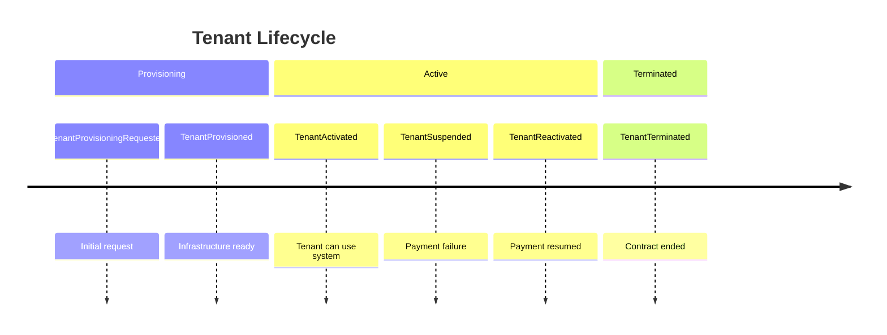

# GitHub Copilot Instructions: Phase 1.1 - Event Storming Session
## Role: Architect

---

## 🎯 Your Role in This Ceremony

As **Architect**, you lead the **Event Storming Session**, facilitating domain discovery by mapping the temporal flow of business events. You guide the team through identifying domain events, commands, aggregates, and bounded context candidates—the foundation for all subsequent domain modeling.

---

## 📋 Ceremony Overview

**Phase**: Phase 1 - Discovery (DDD-Led)  
**Ceremony**: 1.1 - Event Storming Session  
**Led by**: Architect  
**Supported by**: Product Owner (domain expertise), Bench Developer (feasibility), Program Manager (dependencies)  
**When**: Once per bounded context (initial), quarterly (refinement)  
**Duration**: 4-8 hours (full day workshop)  
**Cadence**: Initial discovery + quarterly refinement

---

## 🎯 Ceremony Goals

1. Map the domain's temporal flow of events
2. Identify domain events ("things that happened")
3. Discover commands ("intentions that trigger events")
4. Identify aggregate candidates (entities handling commands)
5. Surface hotspots and unknowns for deeper exploration
6. Identify candidate bounded contexts (linguistic boundaries)
7. Create shared mental model across all roles

---

## 📥 Inputs Required

- **Project Charter** (from Phase 0): Problem statement, solution overview
- **Domain experts**: Product Owner + subject matter experts
- **Blank timeline**: Virtual or physical wall space
- **Color-coded sticky notes** (or digital equivalent):
  - Orange: Domain Events
  - Blue: Commands
  - Yellow: Aggregates
  - Pink: Questions/Hotspots
  - Purple: External Systems
  - Green: Read Models/Views

---

## ✅ Prerequisites Validation

**BEFORE** starting Event Storming, verify Phase 0 (Program Initiation) was completed:

### Step 1: Check for Charter Existence

```bash
find . -name "CHARTER*.md" -not -path "*/templates/*"
```

**Expected Result:** Charter found at repository root or `doc/exhibits/`

### Step 2: If Charter Not Found

❌ **STOP** - Do not proceed with Event Storming

Ask the user:
```
Phase 0 (Program Initiation) creates the charter document, which Event Storming 
requires as input for problem context.

Charter provides essential input:
- Problem statement → Domain problem space
- Success criteria → Key domain events to discover
- Stakeholders → Event Storming participants

Was Phase 0 completed?
```

**Options:**
1. ✅ **Create CHARTER.md now** (10-15 minutes using template)
   - Use [doc/reference/templates/SERVICE-CHARTER-TEMPLATE.md](../doc/reference/templates/SERVICE-CHARTER-TEMPLATE.md)
   - Populate: Problem Statement, Solution Overview, Success Criteria, Stakeholders, Constraints
   - Commit to repository root or `doc/exhibits/`
   
2. 📄 **Use existing charter from another location**
   - Ask user to provide path/URL
   - Copy or link charter into repository
   
3. ⏭️ **Infer charter from code context** (NOT RECOMMENDED)
   - Only if charter truly doesn't exist and cannot be created
   - Extract problem statement from README.md, build.sc comments, etc.
   - Document assumptions in Event Storming output

### Step 3: Proceed Only After Charter Available

Once charter is present, continue with Event Storming ceremony below.

**Why This Matters:**
- Event Storming without charter lacks focus → Team explores wrong domain areas
- Charter problem statement guides which events are "in scope"
- Charter success criteria highlights which events are "critical path"
- 10-minute charter creation prevents 1-2 hour Event Storming rework

---

## 📤 Outputs You'll Create

| Artifact | Template | Location | Purpose |
|----------|----------|----------|---------|
| Event storming documentation | `EVENT-STORMING-TEMPLATE.md` | `doc/domain-models/event-storming/[context]-events.md` | Capture session output |
| Mermaid timeline diagram | N/A (in template) | In event storming doc | Visualize event flow |
| Aggregate candidates list | N/A (in template) | In event storming doc | Input for domain modeling |
| Bounded context candidates | N/A (in template) | In event storming doc | Input for context mapping |
| Hotspots and questions | N/A (in template) | In event storming doc | Follow-up actions |

---

## 🔨 How to Execute This Ceremony

### Step 1: Prepare the Session (30 minutes before)

**Actions**:
1. Review project charter for domain context
2. Prepare virtual workspace (Miro alternative: Markdown + Mermaid)
3. Invite all 4 roles + domain experts
4. Brief participants on event storming rules
5. Set up color-coding legend

**Copilot Prompt Examples**:
```
"Create an event storming session agenda for a 4-hour workshop on tenant management"

"Generate event storming rules and color-coding guide for participants"

"Write a pre-workshop email explaining event storming to domain experts"
```

**Key Principle**: **No external tools**. Use Git-tracked Markdown + Mermaid for everything.

---

### Step 2: Identify Domain Events (90 minutes)

**Actions**:
1. Ask: "What are all the things that HAPPEN in this domain?"
2. Write domain events in past tense: "TenantProvisioned", "OrderPlaced", "PaymentProcessed"
3. Place events on timeline (left to right = time flow)
4. Don't organize yet—brainstorm freely
5. Focus on **business events**, not technical events (no "DatabaseUpdated")

**Event Naming Conventions**:
- Past tense: "TenantActivated" (not "ActivateTenant")
- Business language: "OrderPlaced" (not "OrderCreated")
- Specific: "PaymentAuthorized" (not "PaymentProcessed")

**Copilot Prompt Examples**:
```
"Generate domain events for a multi-tenant SaaS provisioning workflow"

"Create a list of domain events for order processing in an e-commerce system"

"Identify domain events for tenant lifecycle: provisioning, activation, suspension, termination"
```

**What Good Looks Like**:
```
TenantProvisioningRequested
TenantProvisioned
TenantActivated
TenantSuspended
TenantReactivated
TenantTerminated
```

**Common Pitfalls**:
- Technical events: "DatabaseUpdated", "EmailSent" (these are side effects, not domain events)
- Present tense: "ProvisionTenant" (that's a command, not an event)
- Vague events: "TenantChanged" (what changed? Be specific)

---

### Step 3: Group Events into Flows (60 minutes)

**Actions**:
1. Identify temporal relationships: "This happens before that"
2. Group related events into business processes
3. Identify parallel flows vs sequential flows
4. Mark decision points and branching logic
5. Surface implicit events (missing links in the chain)

**Copilot Prompt Examples**:
```
"Organize these domain events into a tenant provisioning flow: TenantProvisioningRequested, TenantProvisioned, TenantActivated"

"Create a Mermaid timeline diagram showing tenant lifecycle events"

"Identify parallel vs sequential event flows for order processing"
```

**Mermaid Timeline Example**:


---

### Step 4: Discover Commands (45 minutes)

**Actions**:
1. For each event, ask: "What caused this to happen?"
2. Identify commands (intentions): "ProvisionTenant", "PlaceOrder"
3. Commands are present tense, imperative: "ActivateTenant"
4. Link commands to events: Command → Event
5. Identify who/what issues the command (user, system, timer)

**Command Naming Conventions**:
- Present tense, imperative: "ProvisionTenant" (not "TenantProvisioned")
- Clear actor: "Customer.PlaceOrder" vs "Admin.CancelOrder"
- Business intent: "SuspendTenant" (not "UpdateTenantStatus")

**Copilot Prompt Examples**:
```
"Generate commands for these domain events: TenantProvisioned, TenantActivated, TenantSuspended"

"Create a command-to-event mapping table for tenant management"

"Identify who issues these commands: ProvisionTenant (Admin), ActivateTenant (System)"
```

**Command → Event Mapping**:
```
ProvisionTenant → TenantProvisioned
ActivateTenant → TenantActivated
SuspendTenant → TenantSuspended
ReactivateTenant → TenantReactivated
TerminateTenant → TenantTerminated
```

---

### Step 5: Identify Aggregates (60 minutes)

**Actions**:
1. Ask: "What entity handles this command and ensures consistency?"
2. Group commands by the entity responsible
3. Identify aggregate roots (top-level entities)
4. Define aggregate boundaries (what's inside, what's outside)
5. Name aggregates using domain language (from ubiquitous language)

**Aggregate Identification Rules**:
- One aggregate per consistency boundary
- Aggregates enforce business invariants
- Commands go to aggregates, not individual entities
- Aggregates emit events after successful command processing

**Copilot Prompt Examples**:
```
"Identify aggregates for these commands: ProvisionTenant, ActivateTenant, SuspendTenant"

"Create an aggregate candidates table showing aggregate name, commands handled, and events emitted"

"Determine if Tenant, TenantConfiguration, and TenantSubscription should be separate aggregates or one"
```

**Aggregate Candidates Table**:
| Aggregate | Commands Handled | Events Emitted | Invariants |
|-----------|-----------------|----------------|------------|
| Tenant | ProvisionTenant, ActivateTenant, SuspendTenant | TenantProvisioned, TenantActivated, TenantSuspended | Tenant name must be unique, Active tenant must have valid subscription |

---

### Step 6: Surface Hotspots and Questions (45 minutes)

**Actions**:
1. Mark areas of uncertainty with pink notes
2. Identify conflicting models (same term, different meanings)
3. Surface missing domain knowledge
4. Flag complex business rules needing clarification
5. Identify external system dependencies

**Types of Hotspots**:
- **Conflict**: "Order" means different things in sales vs fulfillment
- **Unknown**: "What happens if payment fails during provisioning?"
- **Complexity**: "Tenant suspension has 7 different rules"
- **External**: "Payment processing via third-party gateway"

**Copilot Prompt Examples**:
```
"Generate questions to ask Product Owner about tenant suspension rules"

"Identify potential conflicts when 'Account' is used in billing vs tenant management contexts"

"Create a hotspots list for follow-up after event storming session"
```

**Hotspots Example**:
```markdown
## Hotspots and Questions

### Conflict: "Account" Term
- Billing team uses "Account" for payment method
- Tenant team uses "Account" for tenant entity
- **Resolution needed**: Rename to "TenantAccount" vs "BillingAccount"

### Unknown: Suspension Grace Period
- Question: How long before suspended tenant is terminated?
- Question: Can tenant self-reactivate or admin-only?
- **Action**: Schedule follow-up with Product Owner

### Complexity: Multi-Tenant Data Isolation
- Complex rules for schema-per-tenant vs table-per-tenant
- Performance implications unclear
- **Action**: Technical spike in Phase 3
```

---

### Step 7: Identify Bounded Context Candidates (60 minutes)

**Actions**:
1. Look for linguistic boundaries (same term, different meaning = different context)
2. Group aggregates by cohesion (what changes together)
3. Identify upstream/downstream relationships
4. Define clear ownership per context
5. Name contexts using business language

**Bounded Context Signals**:
- Different teams own different areas
- Same term means different things
- Separate databases or schemas
- Different lifecycles (tenant provisioned ≠ order placed)

**Copilot Prompt Examples**:
```
"Identify bounded contexts from these aggregates: Tenant, Order, Payment, Product"

"Create a context map showing Tenant Management, Order Processing, and Billing contexts"

"Determine if User Authentication should be a separate bounded context or part of Tenant Management"
```

**Bounded Context Example**:
```
Tenant Management Context:
- Aggregates: Tenant, TenantConfiguration
- Events: TenantProvisioned, TenantActivated, TenantSuspended
- Responsibilities: Tenant lifecycle, multi-tenancy

Order Processing Context:
- Aggregates: Order, OrderLine
- Events: OrderPlaced, OrderFulfilled, OrderCancelled
- Responsibilities: Order lifecycle, inventory

Billing Context:
- Aggregates: Invoice, Payment
- Events: InvoiceGenerated, PaymentProcessed
- Responsibilities: Billing, payments, subscriptions
```

---

### Step 8: Document the Session (90 minutes after workshop)

**Actions**:
1. Use `doc/reference/templates/EVENT-STORMING-TEMPLATE.md`
2. Document all events, commands, aggregates
3. Create Mermaid timeline diagram
4. List hotspots and follow-up actions
5. Identify bounded context candidates
6. Commit to Git with clear message

**Copilot Prompt Examples**:
```
"Fill in EVENT-STORMING-TEMPLATE.md with these events, commands, and aggregates"

"Create a Mermaid diagram showing event flow for tenant provisioning"

"Generate a bounded contexts summary table from event storming output"
```

**Template Sections to Complete**:
- Event Storming Overview
- Domain Events (chronological list)
- Commands (per aggregate)
- Aggregates (candidates list)
- Hotspots and Questions
- Bounded Context Candidates
- Mermaid Timeline Diagram
- Next Steps

---

## ✅ Definition of Done

This ceremony is complete when:

- [ ] All domain events identified and documented
- [ ] Commands mapped to events
- [ ] Aggregate candidates identified (3-7 per context typical)
- [ ] Hotspots and questions documented
- [ ] Bounded context candidates identified (2-5 typical)
- [ ] Mermaid timeline diagram created
- [ ] Event storming document committed to Git
- [ ] Follow-up actions assigned (Ubiquitous Language Workshop next)
- [ ] Product Owner validates business accuracy
- [ ] Bench Developer validates technical feasibility

---

## 🚨 Common Pitfalls to Avoid

### Pitfall 1: Modeling Current System, Not Domain
**Problem**: Team describes "how it works now" instead of "what the business does"  
**Solution**: Focus on business events, not technical implementation. Ask "What happens?" not "How does the system do it?"

### Pitfall 2: Skipping Domain Experts
**Problem**: Architect and developers guess at business rules  
**Solution**: Product Owner and domain experts MUST participate. No event storming without them.

### Pitfall 3: Technical Events Creep
**Problem**: Events like "DatabaseUpdated", "MessageSent", "CacheInvalidated"  
**Solution**: These are side effects, not domain events. Focus on business-meaningful events.

### Pitfall 4: Too Abstract
**Problem**: Events like "EntityChanged", "ProcessCompleted"  
**Solution**: Be specific: "TenantActivated", "OrderShipped", "PaymentAuthorized"

### Pitfall 5: Jumping to Solutions
**Problem**: Team debates "should we use Kafka or RabbitMQ?"  
**Solution**: Event storming is discovery, not design. Technical decisions come later (ADRs).

### Pitfall 6: External Tools
**Problem**: Using Miro, Mural, Lucidchart for diagrams  
**Solution**: Everything in Git. Use Mermaid for diagrams. Markdown for documentation.

---

## 🔄 Ceremony Relationships

### Upstream (Inputs to This Ceremony)
- **Phase 0 - Program Initiation**: Project charter provides domain context and scope

### Downstream (This Ceremony Feeds Into)
- **Phase 1.2 - Ubiquitous Language Workshop**: Events and commands become glossary terms
- **Phase 1.3 - Domain Modeling Workshop**: Aggregate candidates become formal aggregates
- **Phase 1.4 - Context Mapping**: Bounded context candidates become formal contexts
- **Phase 2.1 - Three Amigos**: Events become acceptance criteria in scenarios

---

## 📊 Success Metrics

Track these to measure ceremony effectiveness:

| Metric | Target | How to Measure |
|--------|--------|----------------|
| Domain events identified | 20-50 per context | Count in output doc |
| Hotspots surfaced | 5-15 per session | Count pink notes/questions |
| Aggregate candidates | 3-7 per context | Count in output doc |
| Bounded contexts identified | 2-5 per system | Count in output doc |
| Product Owner satisfaction | "High confidence" | Post-session survey |
| Time to next ceremony | <1 week | Days between Event Storming and UL Workshop |

---

## 🛠️ Tools & Templates

### Required Templates
- `doc/reference/templates/EVENT-STORMING-TEMPLATE.md`

### Recommended Mermaid Diagrams
- **Timeline**: Show event chronology
- **Sequence**: Show command → aggregate → event flow
- **Class**: Show aggregate candidates (high-level)

### Example Copilot Workflows

**During Session**:
1. Capture events in real-time: "TenantProvisioned, TenantActivated, TenantSuspended"
2. Ask Copilot: "Organize these events chronologically and identify missing events"
3. Ask Copilot: "Generate commands for these events"
4. Iterate

**After Session**:
1. Open `EVENT-STORMING-TEMPLATE.md`
2. Ask Copilot: "Populate this template with events: [list], commands: [list], aggregates: [list]"
3. Ask Copilot: "Create Mermaid timeline diagram for these events"
4. Review and commit

---

## 📚 Related Documentation

- **HOW-WE-WORK.md**: Phase 1.1 section
- **doc/reference/SBPF/Event-Storming.md**: Detailed event storming guide
- **doc/reference/SBPF/Domain-Events.md**: What makes a good domain event
- **doc/reference/templates/EVENT-STORMING-TEMPLATE.md**: Output template
- **.github/copilot-instructions.md**: Global project context

---

## 🎓 Learning Resources

### Internal References
- Example event storming: `doc/exhibits/tenant-management-event-storming.md`
- Bounded context guide: `doc/reference/SBPF/Bounded-Contexts.md`
- Aggregate design guide: `doc/reference/SBPF/Aggregate-Design.md`

### Key Principles
1. **Events are facts**: Past tense, business-meaningful, immutable
2. **Commands are intent**: Present tense, imperative, can fail
3. **Aggregates enforce rules**: Consistency boundaries, invariants
4. **Hotspots are gold**: Unknowns surfaced early prevent late surprises
5. **Linguistic boundaries = bounded contexts**: Same term, different meaning = different context

---

**Remember**: As Architect, you facilitate but don't dictate. The domain experts (Product Owner, SMEs) provide the business knowledge. Your job is to structure that knowledge into events, commands, and aggregates.

---

**Next Ceremony**: Phase 1.2 - Ubiquitous Language Workshop (Led by Architect + Product Owner)  
**Handoff**: Event storming output becomes input for ubiquitous language glossary
