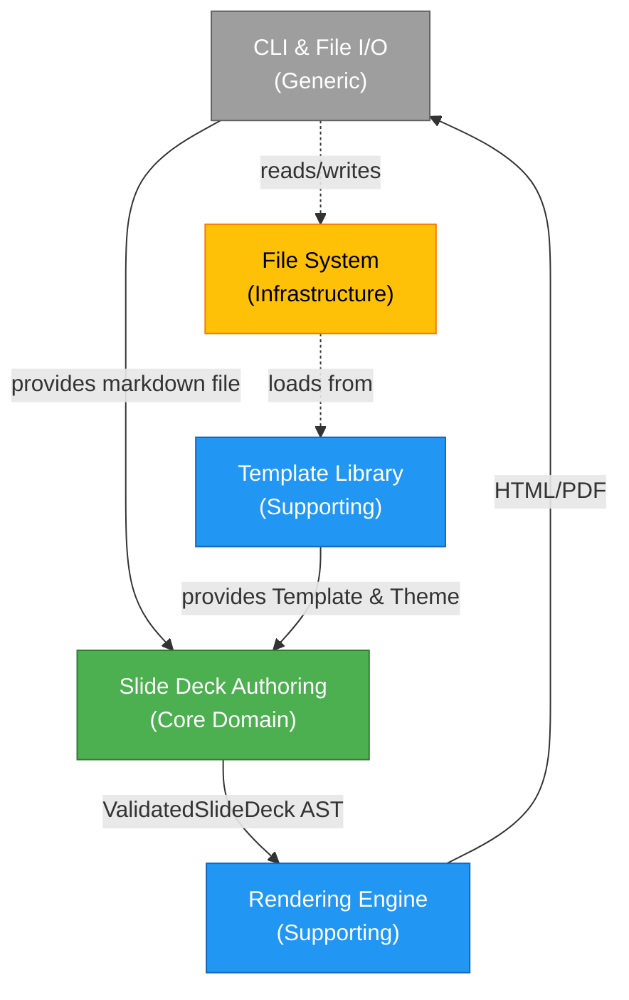

# Context Map

## MDSlides Bounded Contexts

This is a **standalone CLI application** with internal bounded contexts (not microservices).

### 1. Slide Deck Authoring (Core Domain)

**Type**: Core Domain
**Description**: DSL parsing, template/slot binding, slide structure modeling, multi-stage validation

**Aggregates**:
- `SlideDeck`: Root aggregate containing slides, metadata, theme
- `Slide`: Entity within SlideDeck, binds to Template, contains SlotContent
- `Template`: Separate root aggregate defining slide structure with Slots
- `Slot`: Value object within Template (content area with constraints)
- `Theme`: Value object for visual styling (colors, fonts, spacing)
- `ValidationResult`: Value object representing validation outcome

**Relationships**:
- Upstream to Rendering Context (provides validated SlideDeck AST)
- Consumes Template Library (loads templates from templates/ directory)

---

### 2. Template Library (Supporting)

**Type**: Supporting Subdomain
**Description**: Template and theme management, loaded from file system

**Aggregates**:
- `Template`: Defines slide structure with named Slots and constraints
- `Theme`: Defines visual styling (colors, fonts, spacing)

**Storage**:
- Templates: YAML/JSON files in `templates/` directory
- Themes: JSON files in `themes/` directory
- Versioned via file system (no database)

**Relationships**:
- Downstream from Slide Deck Authoring (provides templates/themes on demand)
- No upstream dependencies (static files loaded at startup)

---

### 3. Rendering Engine (Supporting)

**Type**: Supporting Subdomain
**Description**: Transforms slide AST to HTML/PDF output

**Aggregates**:
- `RenderPipeline`: Orchestrates rendering stages
- `HTMLRenderer`: Generates HTML via Scalatags
- `PDFRenderer`: Converts HTML to PDF

**Relationships**:
- Downstream from Slide Deck Authoring (consumes validated AST)
- Anticorruption Layer pattern (isolates rendering libraries)

---

### 4. CLI & File I/O (Generic)

**Type**: Generic Subdomain
**Description**: Command-line interface, file reading/writing

**Components**:
- CLI argument parsing (Decline)
- File I/O effects (Cats Effect IO + os-lib)
- Error reporting

**Relationships**:
- Upstream to all contexts (entry point)

---

### Infrastructure

**No External Services** (standalone architecture):
- File system (input .md, output .html/.pdf, templates/, themes/)
- No database (stateless processing)
- No message queues
- No HTTP servers

---

## Context Relationships Diagram

**Key Patterns**:
- **Anticorruption Layer**: Slide Deck Authoring wraps Flexmark (Markdown parser) to protect domain from external library changes
- **Published Language**: SlideDeck AST is the contract between Authoring and Rendering contexts
- **Shared Kernel**: Template and Theme value objects are shared between Template Library and Slide Deck Authoring (immutable, safe to share)

**Integration Points**:
1. **CLI → Authoring**: Raw markdown string + theme name
2. **Template Library → Authoring**: Template and Theme objects (loaded once at startup)
3. **Authoring → Rendering**: Validated SlideDeck (pure ADT)
4. **Rendering → CLI**: HTML string or PDF bytes

