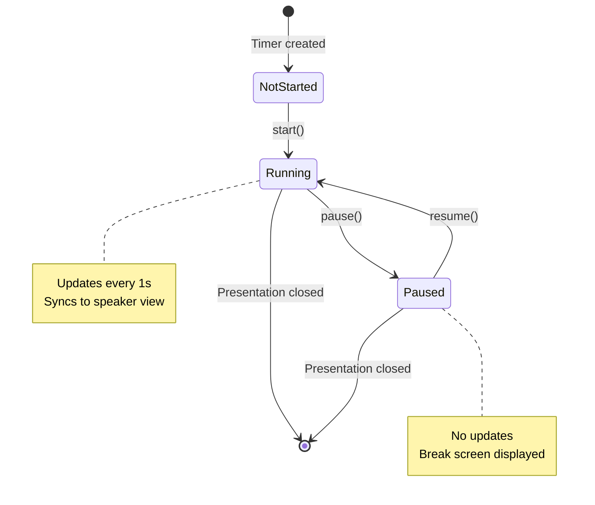

# Aggregate: PresentationTimer

**Bounded Context**: Presentation Runtime
**Version**: 1.0.0
**Created**: 2025-12-29
**Author**: Architect (following Domain Modeling Workshop)

---

## Overview

The **PresentationTimer** aggregate tracks elapsed time during a live presentation session with pause/resume capability for breaks. It is the core aggregate of the Presentation Runtime bounded context.

**Responsibility**: Manage presentation session timing with accurate elapsed time calculation, pause/resume state transitions, and cross-window synchronization.

---

## Aggregate Root

### PresentationTimer

**Identity**: Single instance per presentation window (no explicit ID needed - singleton per session)

**Lifecycle**: Created when presentation loads → Updated every second while running → Destroyed when presentation closes

---

## State

###Properties

```scala
case class PresentationTimer(
  state: TimerState,                    // Current timer state
  startTimestamp: Long,                  // Epoch milliseconds when timer started (0 if not started)
  totalPausedDuration: Long,             // Cumulative milliseconds spent paused
  lastPauseTimestamp: Option[Long]       // Epoch milliseconds of most recent pause (None if not paused)
)
```

### State Machine



---

## Invariants

Business rules that MUST always hold true:

1. **State Exclusivity**: Timer can only be in exactly one state at any time (NotStarted, Running, or Paused)

2. **Monotonic Time**: Elapsed time is always monotonically increasing (never decreases)
   ```scala
   val currentElapsed = timer.elapsedSeconds()
   val laterElapsed = timer.elapsedSeconds()  // after some time
   assert(laterElapsed >= currentElapsed)
   ```

3. **Pause Precondition**: Cannot pause timer unless currently running
   ```scala
   def pause(): Either[TimerError, PresentationTimer] =
     if state != Running then Left(CannotPauseWhenNotRunning)
     else Right(/* paused timer */)
   ```

4. **Resume Precondition**: Cannot resume timer unless currently paused
   ```scala
   def resume(): Either[TimerError, PresentationTimer] =
     if state != Paused then Left(CannotResumeWhenNotPaused)
     else Right(/* resumed timer */)
   ```

5. **Paused Duration Bound**: Total paused duration cannot exceed total runtime
   ```scala
   assert(totalPausedDuration <= (System.currentTimeMillis() - startTimestamp))
   ```

6. **Start Once**: Timer can only be started once per session (no reset capability)

---

## Operations

### Commands (Write Operations)

#### start(): PresentationTimer

**Purpose**: Initialize and start the timer

**Preconditions**:
- `state == NotStarted`

**Postconditions**:
- `state == Running`
- `startTimestamp` set to current time
- `totalPausedDuration == 0`
- `lastPauseTimestamp == None`

**Events Emitted**:
- `TimerStarted(startTimestamp)`

**Implementation**:
```scala
def start(): Either[TimerError, PresentationTimer] =
  if state != NotStarted then
    Left(TimerAlreadyStarted)
  else
    val now = System.currentTimeMillis()
    Right(PresentationTimer(
      state = Running,
      startTimestamp = now,
      totalPausedDuration = 0,
      lastPauseTimestamp = None
    ))
```

---

#### pause(): PresentationTimer

**Purpose**: Pause timer during a break

**Preconditions**:
- `state == Running`

**Postconditions**:
- `state == Paused`
- `lastPauseTimestamp` set to current time
- `totalPausedDuration` unchanged (will be updated on resume)

**Events Emitted**:
- `TimerPaused(pauseTimestamp, elapsedSeconds)`

**Implementation**:
```scala
def pause(): Either[TimerError, PresentationTimer] =
  if state != Running then
    Left(CannotPauseWhenNotRunning(state))
  else
    val now = System.currentTimeMillis()
    Right(copy(
      state = Paused,
      lastPauseTimestamp = Some(now)
    ))
```

---

#### resume(): PresentationTimer

**Purpose**: Resume timer after a break

**Preconditions**:
- `state == Paused`
- `lastPauseTimestamp.isDefined`

**Postconditions**:
- `state == Running`
- `totalPausedDuration` updated to include latest pause
- `lastPauseTimestamp == None`

**Events Emitted**:
- `TimerResumed(resumeTimestamp, totalPausedSeconds)`

**Implementation**:
```scala
def resume(): Either[TimerError, PresentationTimer] =
  if state != Paused then
    Left(CannotResumeWhenNotPaused(state))
  else
    lastPauseTimestamp match
      case None => Left(InvalidState("Paused but no pause timestamp"))
      case Some(pauseTime) =>
        val now = System.currentTimeMillis()
        val pauseDuration = now - pauseTime
        Right(copy(
          state = Running,
          totalPausedDuration = totalPausedDuration + pauseDuration,
          lastPauseTimestamp = None
        ))
```

---

### Queries (Read Operations)

#### elapsedSeconds(): Long

**Purpose**: Calculate elapsed time in seconds (excluding paused time)

**Returns**: Seconds elapsed since start (0 if not started)

**Formula**:
```
elapsed = (currentTime - startTime - totalPausedDuration) / 1000

If paused:
  tempPausedDuration = currentTime - lastPauseTimestamp
  elapsed = (currentTime - startTime - totalPausedDuration - tempPausedDuration) / 1000
```

**Implementation**:
```scala
def elapsedSeconds(): Long =
  if startTimestamp == 0 then 0
  else
    val now = System.currentTimeMillis()
    val totalRuntime = now - startTimestamp

    // If currently paused, include current pause duration
    val effectivePausedDuration = state match
      case Paused =>
        lastPauseTimestamp match
          case Some(pauseTime) =>
            totalPausedDuration + (now - pauseTime)
          case None =>
            totalPausedDuration  // Should not happen (invariant violation)
      case _ =>
        totalPausedDuration

    val effectiveRuntime = totalRuntime - effectivePausedDuration
    effectiveRuntime / 1000
```

---

#### formattedTime(): String

**Purpose**: Get human-readable time in hh:mm:ss format

**Returns**: Formatted time string (e.g., "00:15:30")

**Implementation**:
```scala
def formattedTime(): String =
  val seconds = elapsedSeconds()
  val hours = seconds / 3600
  val minutes = (seconds % 3600) / 60
  val secs = seconds % 60
  f"$hours%02d:$minutes%02d:$secs%02d"
```

---

#### currentState(): TimerState

**Purpose**: Get current timer state

**Returns**: NotStarted, Running, or Paused

**Implementation**:
```scala
def currentState(): TimerState = state
```

---

## Value Objects

### TimerState

```scala
enum TimerState:
  case NotStarted  // Initial state, timer not yet started
  case Running     // Timer actively counting
  case Paused      // Timer temporarily stopped (break mode)
```

**State Transitions**:
- `NotStarted → Running`: Via `start()`
- `Running → Paused`: Via `pause()`
- `Paused → Running`: Via `resume()`
- `Running → [End]`: Presentation closed
- `Paused → [End]`: Presentation closed

---

### TimerError

```scala
enum TimerError:
  case TimerAlreadyStarted
  case CannotPauseWhenNotRunning(currentState: TimerState)
  case CannotResumeWhenNotPaused(currentState: TimerState)
  case InvalidState(message: String)
```

---

## Events

All events follow past-tense naming (things that have happened).

### TimerStarted

**When**: Timer transitions from NotStarted to Running
**Data**:
```scala
case class TimerStarted(startTimestamp: Long)
```

---

### TimerPaused

**When**: Timer transitions from Running to Paused
**Data**:
```scala
case class TimerPaused(
  pauseTimestamp: Long,
  elapsedSeconds: Long  // Elapsed time at moment of pause
)
```

---

### TimerResumed

**When**: Timer transitions from Paused to Running
**Data**:
```scala
case class TimerResumed(
  resumeTimestamp: Long,
  totalPausedSeconds: Long  // Cumulative paused time
)
```

---

### TimerUpdated

**When**: Every 1 second while Running
**Data**:
```scala
case class TimerUpdated(
  currentTimestamp: Long,
  elapsedSeconds: Long,
  formattedTime: String  // "hh:mm:ss"
)
```

---

## Integration Points

### Upstream Dependencies

**None** - PresentationTimer is self-contained and depends only on system time.

---

### Downstream Consumers

1. **Footer Display** (UI Layer)
   - Subscribes to `TimerUpdated` events
   - Displays `formattedTime` in bottom-left corner

2. **Break Mode Controller** (UI Layer)
   - Sends `pause()` command when B key pressed
   - Sends `resume()` command when B key pressed again

3. **Speaker View Sync** (Infrastructure Layer)
   - Subscribes to all timer events
   - Syncs state via BroadcastChannel

4. **History Logger** (Future - v3.0.0)
   - Subscribes to `TimerPaused`, `TimerResumed`, `TimerUpdated`
   - Records timing data for session log

---

## Example Scenarios

### Scenario 1: Normal Presentation Flow

```scala
// 1. Presentation starts
val timer0 = PresentationTimer(NotStarted, 0, 0, None)

// 2. Timer starts automatically
val timer1 = timer0.start().getOrElse(???)
// State: Running, startTimestamp = 1735488000000

// 3. Wait 300 seconds (5 minutes)
// Timer updates every second via setInterval
timer1.formattedTime()  // "00:05:00"

// 4. Presenter takes break (B key)
val timer2 = timer1.pause().getOrElse(???)
// State: Paused, lastPauseTimestamp = 1735488300000

// 5. Wait 120 seconds during break (timer doesn't count)
timer2.formattedTime()  // Still "00:05:00" (paused time excluded)

// 6. Resume presentation (B key again)
val timer3 = timer2.resume().getOrElse(???)
// State: Running, totalPausedDuration = 120000ms

// 7. Continue presentation for 600 seconds (10 minutes)
timer3.formattedTime()  // "00:15:00" (5min before + 10min after, 2min break excluded)
```

---

### Scenario 2: Multiple Pauses

```scala
val timer0 = PresentationTimer(NotStarted, 0, 0, None).start().getOrElse(???)

// Run for 300s → Pause 60s → Resume
val timer1 = timer0.pause().getOrElse(???).resume().getOrElse(???)
// totalPausedDuration = 60000ms

// Run for 300s more → Pause 120s → Resume
val timer2 = timer1.pause().getOrElse(???).resume().getOrElse(???)
// totalPausedDuration = 60000ms + 120000ms = 180000ms

timer2.formattedTime()  // "00:10:00" (600s runtime, 180s paused = 600s elapsed)
```

---

### Scenario 3: Invariant Violations

```scala
val timer = PresentationTimer(NotStarted, 0, 0, None)

// Cannot pause when not running
timer.pause()  // Left(CannotPauseWhenNotRunning(NotStarted))

// Cannot resume when not paused
timer.start().getOrElse(???).resume()  // Left(CannotResumeWhenNotPaused(Running))

// Cannot start twice
timer.start().getOrElse(???).start()  // Left(TimerAlreadyStarted)
```

---

## Testing Strategy

### Unit Tests (Property-Based)

1. **Monotonic Time Property**:
   ```scala
   property("elapsed time never decreases"):
     forAll(timerOperations) { ops =>
       val times = ops.scanLeft(timer)(apply)
       times.zip(times.tail).forall { case (t1, t2) =>
         t2.elapsedSeconds() >= t1.elapsedSeconds()
       }
     }
   ```

2. **Paused Time Exclusion Property**:
   ```scala
   property("paused duration excluded from elapsed time"):
     forAll(runDuration, pauseDuration) { (run, pause) =>
       val timer = createTimer()
         .start()
         .runFor(run)
         .pause()
         .wait(pause)
         .resume()

       timer.elapsedSeconds() == run  // pause duration not counted
     }
   ```

### Integration Tests

1. **Cross-Window Sync Test**:
   - Start timer in main window
   - Open speaker view
   - Verify both windows show identical time
   - Pause in main window
   - Verify speaker view also pauses

2. **State Transition Test**:
   - Verify all valid state transitions work
   - Verify all invalid state transitions are rejected

---

## Accessibility Considerations

- **Screen Readers**: Timer display must have `aria-live="off"` to prevent announcing every second update
- **Keyboard Control**: B key for pause/resume must be documented
- **Visual Feedback**: Clear visual indication when timer is paused vs. running

---

## Performance Considerations

- **Update Frequency**: 1 second interval is acceptable (not too aggressive)
- **BroadcastChannel**: Minimal overhead for cross-window sync
- **Memory**: Single aggregate instance per window (no accumulation)

---

## Security Considerations

- **No sensitive data**: Timer contains no PII or sensitive information
- **No external input**: Timer state controlled by keyboard events only
- **No persistence**: Timer state not saved to disk (v3.0.0)

---

## Future Enhancements

1. **LocalStorage Persistence** (v3.1.0): Survive page refresh
2. **Timer Reset Command** (TBD): If requested by users
3. **Countdown Timer** (TBD): Alert when presentation time limit approaching
4. **Lap Times** (TBD): Record time spent on each slide

---

## Related Artifacts

- **Event Storming**: [presentation-timer-events.md](../event-storming/presentation-timer-events.md)
- **Ubiquitous Language**: [ubiquitous-language.md](../ubiquitous-language.md#presentationtimer)
- **BDD Scenarios**: (To be created in Phase 2: Three Amigos)
- **Implementation**: (To be created in Phase 3: TDD)

---

**Last Updated**: 2025-12-29
**Review Cadence**: After each implementation sprint
