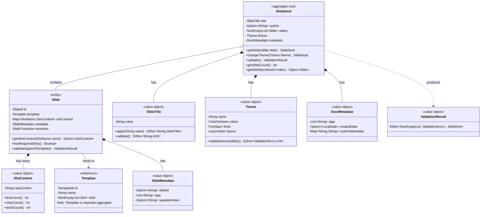
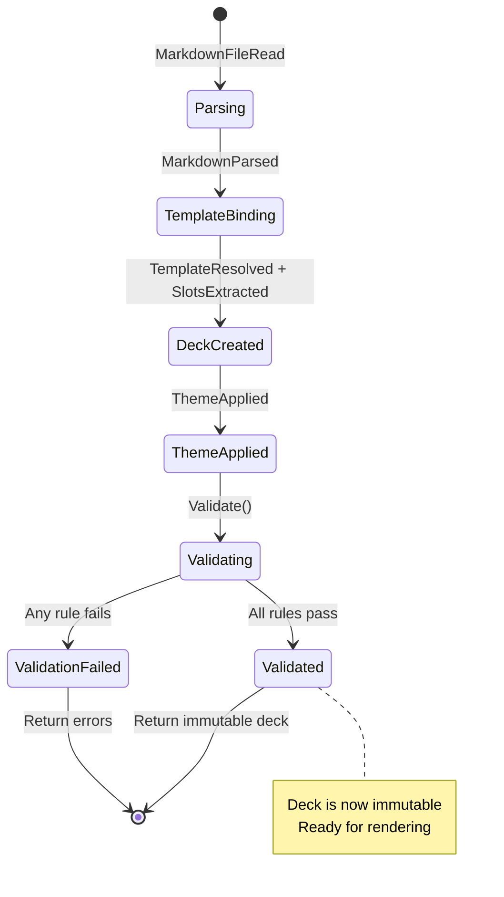

# Aggregate: SlideDeck
## Domain Model & Invariants

---

```yaml
# MACHINE-READABLE METADATA
aggregate:
  name: SlideDeck
  bounded_context: SlideDeckAuthoring
  aggregate_root: SlideDeck
  version: 1.0.0
  created_date: 2024-12-19
  last_updated: 2024-12-19

ownership:
  architect: Tony Moores, Founder, TJM Solutions (https://www.tjm.solutions/)
```

---

## 🎯 Purpose & Scope

**Purpose**: Encapsulates the complete structure and validation of a slide presentation, from initial parsing through multi-stage validation to producing an immutable, render-ready AST.

**Bounded Context**: Slide Deck Authoring (Core Domain)

**Business Capability**: Authoring slide decks with template-driven structure, enforcing "fits on slide" heuristics, and ensuring accessibility compliance.

---

## 🏗️ Aggregate Structure

### Mermaid Class Diagram



---

## 📦 Components

### Aggregate Root

| Component | Type | Description | Responsibilities |
|-----------|------|-------------|------------------|
| **SlideDeck** | Entity (Aggregate Root) | Complete slide presentation | Enforce slide count limits, manage slides, apply theme, coordinate validation |

### Entities (within aggregate)

| Entity | Identity | Lifecycle | Why Inside Aggregate? |
|--------|----------|-----------|----------------------|
| **Slide** | SlideId | Managed by SlideDeck | Slide validity depends on deck context (position, theme, template availability) |

### Value Objects

| Value Object | Properties | Validation Rules | Immutable? |
|--------------|------------|------------------|------------|
| **SlideTitle** | String value | 1-100 chars, non-empty | ✅ Yes |
| **Theme** | ColorScheme, FontSpec, LayoutSpec | Valid hex colors, contrast >= 4.5:1, positive font sizes | ✅ Yes |
| **SlotContent** | String rawContent | Length validated by slot constraints | ✅ Yes |
| **DeckMetadata** | tags, createdDate, customMetadata | None (all optional) | ✅ Yes |
| **SlideMetadata** | slideId, tags, speakerNotes | slideId unique within deck (if provided) | ✅ Yes |
| **ValidationResult** | Either[Errors, SlideDeck] | N/A | ✅ Yes |

### Referenced Aggregates (Outside This Aggregate)

| Aggregate | Relationship | Accessed Via |
|-----------|--------------|--------------|
| **Template** | Each Slide binds to one Template | Template reference (loaded from Template Library context) |

---

## 🔒 Business Invariants

### Core Invariants

| Invariant | Enforcement Point | Examples | Exceptions |
|-----------|-------------------|----------|------------|
| **Deck must have at least 1 slide** | SlideDeck constructor | Empty deck is invalid | None |
| **Deck must have max 200 slides** | addSlide() | Performance constraint | None |
| **Deck title is required** | SlideDeck constructor | First # header becomes title | None |
| **Title max 100 characters** | SlideTitle constructor | "This is a very long title..." | None |
| **All slides must bind to a template** | Slide constructor | Every slide has template reference | None |
| **Required slots must have content** | Slide.validateAgainstTemplate() | Template's required slots filled | None |
| **Slide content max 5000 chars per slide** | Slide validation | Sum of all slot content | None |
| **No empty slides** | Slide validation | At least one slot with content | None |
| **Theme colors have valid contrast** | Theme.validateAccessibility() | Foreground/background >= 4.5:1 (WCAG AA) | None |
| **Once validated, deck is immutable** | After validate() succeeds | No modifications allowed | Create new deck |

### State Transition Rules



| Transition | Allowed From | Triggered By | Preconditions | Side Effects |
|------------|--------------|--------------|---------------|--------------|
| **Parsing** | Start | MarkdownFileRead | Valid markdown file | MarkdownParsed event |
| **TemplateBinding** | Parsing | ExtractFrontMatter | Front matter extracted | TemplateResolved, SlotsExtracted |
| **DeckCreated** | TemplateBinding | CreateSlideDeck | Title extracted, >=1 slide | SlideDeckCreated event |
| **ThemeApplied** | DeckCreated | ApplyTheme | Theme selected | ThemeApplied event |
| **Validating** | ThemeApplied | validate() | Deck structure complete | N/A |
| **Validated** | Validating | All rules pass | Structure + density + content + accessibility OK | ValidationSucceeded event |
| **ValidationFailed** | Validating | Any rule fails | At least one validation error | ValidationFailed event |

---

## 🎬 Commands & Events

### Commands (Write Operations)

| Command | Input | Output | Pre-conditions | Post-conditions |
|---------|-------|--------|----------------|-----------------|
| **CreateSlideDeck(title, author, slides, theme)** | SlideTitle, Option[String], NonEmptyList[Slide], Theme | SlideDeck | >=1 slide, valid title | Deck created with PENDING validation |
| **addSlide(slide)** | Slide | SlideDeck | Current count < 200 | New deck with slide added |
| **changeTheme(theme)** | Theme | SlideDeck | Theme is valid | New deck with theme applied |
| **validate()** | None | ValidationResult | Deck structure complete | Either errors or validated deck |

**Note**: All commands return **new instances** (immutable). No in-place modification.

### Domain Events (Published)

| Event | Trigger | Payload | Consumers |
|-------|---------|---------|-----------|
| **SlideDeckCreated** | CreateSlideDeck() | title, author, slideCount, timestamp | Rendering context, analytics |
| **SlideAdded** | addSlide() | slideId, templateId, slotCount | Analytics |
| **ThemeApplied** | changeTheme() | themeName, colors, fonts | Rendering context |
| **ValidationSucceeded** | validate() success | validatedDeck | Rendering context |
| **ValidationFailed** | validate() failure | errors (NonEmptyList[ValidationError]) | CLI (error reporting) |

---

## 📖 Queries (Read Operations)

| Query | Input | Output | Use Case |
|-------|-------|--------|----------|
| **getSlideCount()** | None | Int | Validation (min/max slides) |
| **getSlideByIndex(index)** | Int | Option[Slide] | Rendering, validation |
| **getAllSlides()** | None | NonEmptyList[Slide] | Rendering |
| **getTitle()** | None | SlideTitle | Rendering, metadata |
| **getTheme()** | None | Theme | Rendering |
| **getAuthor()** | None | Option[String] | Metadata, rendering |

---

## 🧪 Validation Stages

### Stage 1: Structure Validation

**Purpose**: Validate deck-level structure

**Rules**:
- Deck has at least 1 slide
- Deck has at most 200 slides
- Title is present and valid (1-100 chars)
- All slides have unique IDs (if IDs provided)

**Example Error**:
```scala
StructureError("Deck has 0 slides, minimum 1 required")
StructureError("Deck has 250 slides, maximum 200 allowed")
```

---

### Stage 2: Density Validation

**Purpose**: Enforce "fits on slide" heuristics

**Rules** (per slide):
- Max 150 words per slide (sum of all slots)
- Max 12 lines per body slot
- Max 50 words per bullet list
- Max 10 bullet points per slide

**Example Error**:
```scala
DensityError(slideId = "intro", "Slide has 230 words, recommended <= 150")
DensityError(slideId = "details", "Body slot has 18 lines, max 12 allowed")
```

---

### Stage 3: Content Validation

**Purpose**: Validate slot content against template constraints

**Rules** (per slot):
- Required slots have content
- Slot content <= max chars (template constraint)
- Slot content <= max lines (template constraint)
- No empty slides (at least 1 slot with content)

**Example Error**:
```scala
ContentError(slideId = "title", slotName = "title", "Required slot 'title' is empty")
ContentError(slideId = "content", slotName = "body", "Body content 5500 chars exceeds max 5000")
```

---

### Stage 4: Accessibility Validation

**Purpose**: Ensure WCAG AA compliance

**Rules**:
- Foreground/background contrast >= 4.5:1
- Images have alt text (if provided)
- Heading hierarchy (H1 → H2 → H3, no skips)
- Code blocks have language specified (for syntax highlighting)

**Example Error**:
```scala
AccessibilityError("Theme 'dark' has contrast ratio 3.2:1, minimum 4.5:1 required (WCAG AA)")
AccessibilityError("Slide 'diagram' has image without alt text")
```

---

## 🧪 Example Scenarios (BDD)

### Scenario 1: Successful Deck Creation

```gherkin
Feature: Slide Deck Creation

  Scenario: Create deck from markdown with multiple slides
    Given a markdown file with:
      """
      # My Presentation
      Author: John Doe

      ---
      ## Slide 1
      Content for slide 1

      ---
      ## Slide 2
      Content for slide 2
      """
    And the "default" theme
    When I parse the markdown into a SlideDeck
    Then the SlideDeck has title "My Presentation"
    And the SlideDeck has author "John Doe"
    And the SlideDeck has 2 slides
    And the SlideDeck uses the "default" theme
```

### Scenario 2: Validation Failure - Too Many Slides

```gherkin
  Scenario: Reject deck with too many slides
    Given a markdown file with 250 slides
    When I create a SlideDeck
    Then validation fails with StructureError "Deck has 250 slides, maximum 200 allowed"
```

### Scenario 3: Validation Failure - Density

```gherkin
  Scenario: Warn about slide density
    Given a slide with 230 words of content
    When I validate the SlideDeck
    Then validation fails with DensityError "Slide has 230 words, recommended <= 150"
```

### Scenario 4: Template Binding

```gherkin
  Scenario: Slide binds to title template
    Given a slide with front matter:
      """
      ---
      template: title
      ---
      # Main Title
      ## Subtitle
      Author Name
      """
    When I parse the slide
    Then the Slide binds to the "title" template
    And the "title" slot contains "Main Title"
    And the "subtitle" slot contains "Subtitle"
    And the "author" slot contains "Author Name"
```

### Scenario 5: Theme Application

```gherkin
  Scenario: Apply theme to deck
    Given a SlideDeck with 3 slides
    When I apply the "dark" theme
    Then all slides use the "dark" theme colors
    And the theme has foreground color "#FFFFFF"
    And the theme has background color "#1E1E1E"
    And the color contrast ratio is >= 4.5:1
```

---

## 🧩 Scala 3 Implementation Sketch

```scala
package solns.tjm.mdslides.domain

import cats.data.{NonEmptyList, Validated}
import cats.implicits.*

// Opaque types for type safety
opaque type SlideTitle = String
object SlideTitle:
  def apply(value: String): Either[String, SlideTitle] =
    if value.trim.isEmpty then Left("Title cannot be empty")
    else if value.length > 100 then Left("Title max 100 characters")
    else Right(value)

opaque type SlideId = String
object SlideId:
  def apply(value: String): SlideId = value

opaque type SlotName = String
object SlotName:
  def apply(value: String): SlotName = value

opaque type SlotContent = String
object SlotContent:
  def apply(value: String): SlotContent = value

  extension (content: SlotContent)
    def lineCount: Int = content.split("\n").length
    def charCount: Int = content.length
    def wordCount: Int = content.split("\\s+").length

// Enums
enum SlideTransition:
  case None, Fade, Slide, Zoom

enum ValidationError:
  case StructureError(message: String)
  case DensityError(slideId: SlideId, message: String)
  case ContentError(slideId: SlideId, slotName: SlotName, message: String)
  case AccessibilityError(message: String)

// Value objects
case class Theme(
  name: String,
  colors: ColorScheme,
  fonts: FontSpec,
  layout: LayoutSpec
):
  def validateAccessibility: Either[ValidationError, Unit] =
    val ratio = contrastRatio(colors.foreground, colors.background)
    if ratio >= 4.5 then Right(())
    else Left(ValidationError.AccessibilityError(
      s"Theme '$name' has contrast ratio $ratio, minimum 4.5:1 required (WCAG AA)"
    ))

case class ColorScheme(
  background: String,
  foreground: String,
  accent: String
)

case class FontSpec(
  family: String,
  titleSize: Int,
  subtitleSize: Int,
  headingSize: Int,
  bodySize: Int,
  codeSize: Int
)

case class LayoutSpec(
  slidePadding: Int,
  maxBodyLines: Int
)

case class DeckMetadata(
  tags: List[String],
  createdDate: Option[java.time.LocalDate],
  customMetadata: Map[String, String]
)

case class SlideMetadata(
  slideId: Option[String],
  tags: List[String],
  speakerNotes: Option[String]
)

// Entities
case class Slide(
  id: SlideId,
  template: Template, // Reference to separate aggregate
  slotContent: Map[SlotName, SlotContent],
  metadata: SlideMetadata,
  transition: SlideTransition
):
  def getSlotContent(name: SlotName): Option[SlotContent] =
    slotContent.get(name)

  def hasRequiredSlots: Boolean =
    template.slots.filter(_.required).forall(slot =>
      slotContent.contains(SlotName(slot.name))
    )

  def validateAgainstTemplate: Either[ValidationError, Unit] =
    val missingRequired = template.slots
      .filter(_.required)
      .filterNot(slot => slotContent.contains(SlotName(slot.name)))

    if missingRequired.isEmpty then Right(())
    else Left(ValidationError.ContentError(
      id,
      SlotName(missingRequired.head.name),
      s"Required slot '${missingRequired.head.name}' is empty"
    ))

// Aggregate root
case class SlideDeck(
  title: SlideTitle,
  author: Option[String],
  slides: NonEmptyList[Slide],
  theme: Theme,
  metadata: DeckMetadata
):
  // Commands (return new instances)
  def addSlide(slide: Slide): Either[String, SlideDeck] =
    if slides.size >= 200 then
      Left("Cannot add slide: deck has reached maximum of 200 slides")
    else
      Right(copy(slides = slides :+ slide))

  def changeTheme(newTheme: Theme): SlideDeck =
    copy(theme = newTheme)

  // Queries
  def getSlideCount: Int = slides.size

  def getSlideByIndex(index: Int): Option[Slide] =
    if index >= 0 && index < slides.size then Some(slides.toList(index))
    else None

  def getAllSlides: NonEmptyList[Slide] = slides

  // Validation
  def validate: Either[NonEmptyList[ValidationError], SlideDeck] =
    val errors = List(
      validateStructure,
      validateDensity,
      validateContent,
      validateAccessibility
    ).flatMap(_.swap.toOption)

    NonEmptyList.fromList(errors) match
      case Some(nel) => Left(nel)
      case None => Right(this)

  private def validateStructure: Either[ValidationError, Unit] =
    if slides.size < 1 then
      Left(ValidationError.StructureError("Deck has 0 slides, minimum 1 required"))
    else if slides.size > 200 then
      Left(ValidationError.StructureError(s"Deck has ${slides.size} slides, maximum 200 allowed"))
    else
      Right(())

  private def validateDensity: Either[ValidationError, Unit] =
    val overDensitySlides = slides.toList.filter { slide =>
      val totalWords = slide.slotContent.values.map(_.wordCount).sum
      totalWords > 150
    }

    if overDensitySlides.nonEmpty then
      val slide = overDensitySlides.head
      val words = slide.slotContent.values.map(_.wordCount).sum
      Left(ValidationError.DensityError(
        slide.id,
        s"Slide has $words words, recommended <= 150"
      ))
    else
      Right(())

  private def validateContent: Either[ValidationError, Unit] =
    slides.toList.map(_.validateAgainstTemplate).sequence.map(_ => ())

  private def validateAccessibility: Either[ValidationError, Unit] =
    theme.validateAccessibility

// Helper function for contrast ratio
def contrastRatio(fg: String, bg: String): Double =
  // Simplified - real implementation would parse hex colors
  // and calculate luminance ratio
  7.0 // Placeholder
```

---

## 📚 Related Artifacts

- **Event Storming**: [slide-deck-authoring-events.md](../event-storming/slide-deck-authoring-events.md)
- **Ubiquitous Language**: [ubiquitous-language.md](../ubiquitous-language.md)
- **Template Aggregate**: [template-aggregate.md](template-aggregate.md) (to be created)
- **Context Map**: [CONTEXT-MAP.md](../../../CONTEXT-MAP.md)

---

**Aggregate Type**: Root Aggregate (manages Slide entities)
**Lifecycle**: Created from markdown parsing → validated → immutable → passed to rendering
**Owned By**: Slide Deck Authoring bounded context
**Version**: 1.0.0
**Created**: 2024-12-19
**Last Updated**: 2024-12-19
