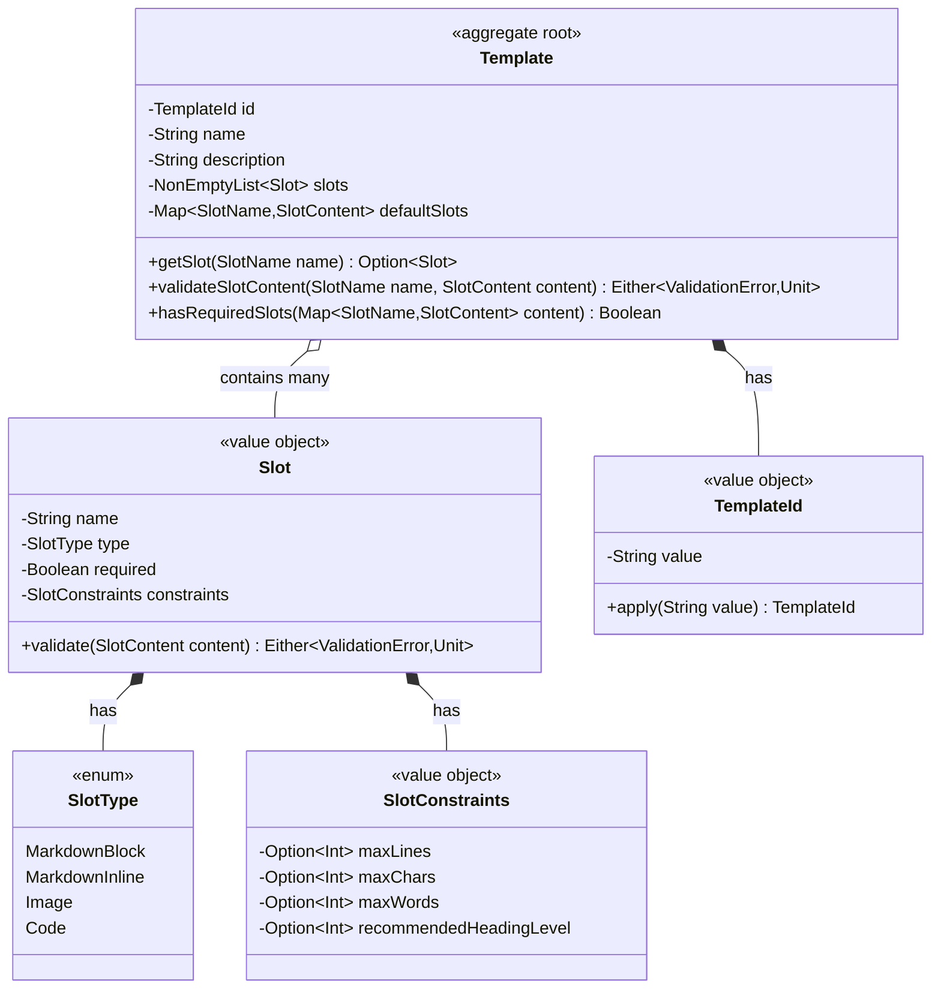
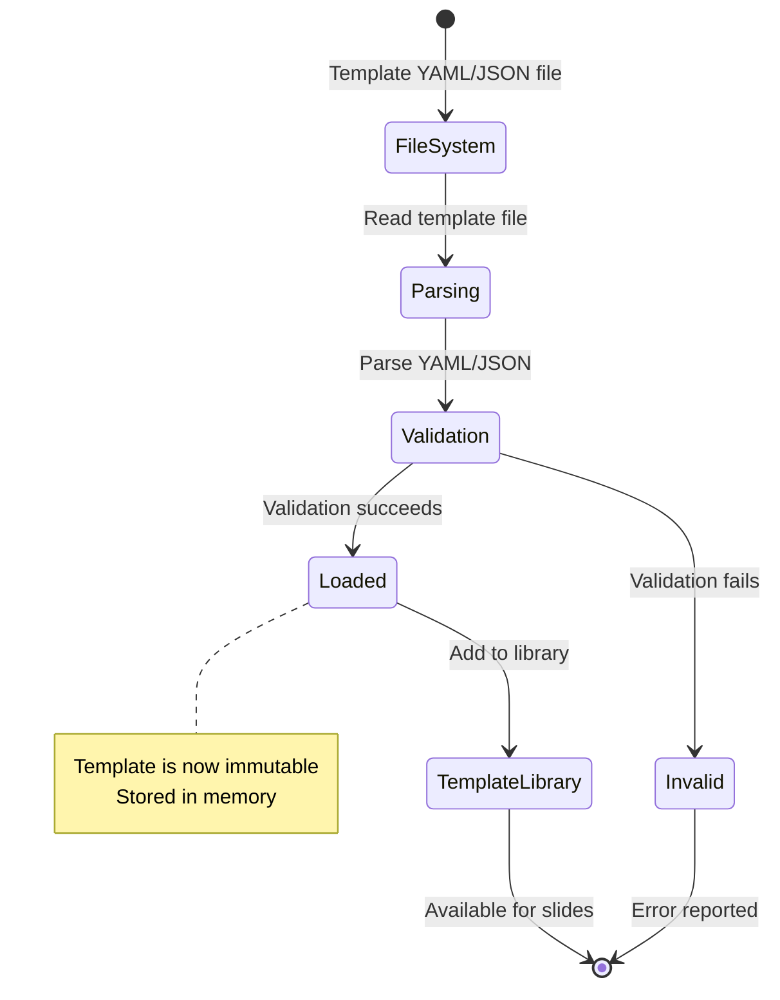

# Aggregate: Template
## Domain Model & Invariants

---

```yaml
# MACHINE-READABLE METADATA
aggregate:
  name: Template
  bounded_context: TemplateLibrary
  aggregate_root: Template
  version: 1.0.0
  created_date: 2024-12-19
  last_updated: 2024-12-19

ownership:
  architect: Tony Moores, Founder, TJM Solutions (https://www.tjm.solutions/)
```

---

## 🎯 Purpose & Scope

**Purpose**: Defines the structural blueprint for slides, specifying what content slots a slide must have and their validation constraints.

**Bounded Context**: Template Library (Supporting Subdomain)

**Business Capability**: Providing reusable slide templates that enforce consistent structure across presentations.

---

## 🏗️ Aggregate Structure

### Mermaid Class Diagram



---

## 📦 Components

### Aggregate Root

| Component | Type | Description | Responsibilities |
|-----------|------|-------------|------------------|
| **Template** | Aggregate Root (immutable) | Defines slide structure | Define slots, validate slot content, provide defaults |

### Entities (within aggregate)

None - Template has no child entities, only value objects (Slots).

### Value Objects

| Value Object | Properties | Validation Rules | Immutable? |
|--------------|------------|------------------|------------|
| **TemplateId** | String value | Kebab-case, 3-50 chars, alphanumeric + hyphen | ✅ Yes |
| **Slot** | name, type, required, constraints | Name unique within template, constraints valid | ✅ Yes |
| **SlotType** | Enum (MarkdownBlock, MarkdownInline, Image, Code) | Valid enum value | ✅ Yes |
| **SlotConstraints** | maxLines, maxChars, maxWords, recommendedHeadingLevel | Positive integers if provided | ✅ Yes |

---

## 🔒 Business Invariants

### Core Invariants

| Invariant | Enforcement Point | Examples | Exceptions |
|-----------|-------------------|----------|------------|
| **Template ID must be unique** | Template Library load | "title" can only exist once | None |
| **Template must have at least 1 slot** | Template constructor | Empty template is invalid | None |
| **Slot names must be unique within template** | Template constructor | Can't have two "title" slots | None |
| **Required slots must be filled** | Slide validation | "title" slot must have content | None |
| **Slot content must satisfy constraints** | validateSlotContent() | Max lines, chars, words enforced | None |
| **Templates are immutable once loaded** | Template Library | No modifications after load | Create new template file |

### Template Lifecycle



---

## 🎬 Commands & Events

### Commands (Read-Only - Templates are Immutable)

| Command | Input | Output | Pre-conditions | Post-conditions |
|---------|-------|--------|----------------|-----------------|
| **loadTemplate(filePath)** | Path to YAML/JSON | Either[Error, Template] | File exists, valid syntax | Template loaded into library |
| **getSlot(slotName)** | SlotName | Option[Slot] | Template loaded | Returns slot if exists |
| **validateSlotContent(slotName, content)** | SlotName, SlotContent | Either[ValidationError, Unit] | Slot exists | Validation result |

**Note**: Templates do NOT have write operations. They are loaded from files and are immutable.

### Domain Events (Published)

| Event | Trigger | Payload | Consumers |
|-------|---------|---------|-----------|
| **TemplateLibraryLoaded** | Application startup | templateIds (List[TemplateId]), count | Slide Deck Authoring context |
| **TemplateResolved** | Slide binds to template | slideId, templateId | Analytics, logging |

---

## 📖 Queries (Read Operations)

| Query | Input | Output | Use Case |
|-------|-------|--------|----------|
| **getSlot(slotName)** | SlotName | Option[Slot] | Check if slot exists |
| **getRequiredSlots()** | None | List[Slot] | Get all required slots |
| **getDefaultSlots()** | None | Map[SlotName, SlotContent] | Get default content for slots |
| **getAllSlots()** | None | NonEmptyList[Slot] | Enumerate all slots |

---

## 🏷️ Standard Templates

### Built-in Template: "title"

**Purpose**: Title slide with main title, subtitle, and author.

**Slots**:
- `title` (required, MarkdownBlock, max 2 lines, heading level 1)
- `subtitle` (optional, MarkdownBlock, max 2 lines)
- `author` (optional, MarkdownInline, max 80 chars)

**YAML Definition**:
```yaml
id: title
name: Title Slide
description: Primary title slide with subtitle and author
slots:
  - name: title
    type: markdown_block
    required: true
    constraints:
      max_lines: 2
      recommended_heading_level: 1
  - name: subtitle
    type: markdown_block
    required: false
    constraints:
      max_lines: 2
  - name: author
    type: markdown_inline
    required: false
    constraints:
      max_chars: 80
```

---

### Built-in Template: "content"

**Purpose**: Standard content slide with heading and body.

**Slots**:
- `heading` (required, MarkdownBlock, max 1 line, heading level 2)
- `body` (required, MarkdownBlock, max 12 lines, max 150 words)

**YAML Definition**:
```yaml
id: content
name: Content Slide
description: Standard slide with heading and body content
slots:
  - name: heading
    type: markdown_block
    required: true
    constraints:
      max_lines: 1
      recommended_heading_level: 2
  - name: body
    type: markdown_block
    required: true
    constraints:
      max_lines: 12
      max_words: 150
```

---

### Built-in Template: "two-column"

**Purpose**: Comparison slide with left and right columns.

**Slots**:
- `heading` (required, MarkdownBlock, max 1 line, heading level 2)
- `left_column` (required, MarkdownBlock, max 10 lines, max 75 words)
- `right_column` (required, MarkdownBlock, max 10 lines, max 75 words)

**YAML Definition**:
```yaml
id: two-column
name: Two Column Comparison
description: Side-by-side comparison slide
slots:
  - name: heading
    type: markdown_block
    required: true
    constraints:
      max_lines: 1
      recommended_heading_level: 2
  - name: left_column
    type: markdown_block
    required: true
    constraints:
      max_lines: 10
      max_words: 75
  - name: right_column
    type: markdown_block
    required: true
    constraints:
      max_lines: 10
      max_words: 75
```

---

### Built-in Template: "image"

**Purpose**: Image-focused slide with caption.

**Slots**:
- `heading` (optional, MarkdownBlock, max 1 line)
- `image` (required, Image, alt text required)
- `caption` (optional, MarkdownInline, max 120 chars)

**YAML Definition**:
```yaml
id: image
name: Image Slide
description: Slide focused on image with optional caption
slots:
  - name: heading
    type: markdown_block
    required: false
    constraints:
      max_lines: 1
  - name: image
    type: image
    required: true
  - name: caption
    type: markdown_inline
    required: false
    constraints:
      max_chars: 120
```

---

### Built-in Template: "code"

**Purpose**: Code snippet slide with optional explanation.

**Slots**:
- `heading` (required, MarkdownBlock, max 1 line)
- `code` (required, Code, max 20 lines, language specified)
- `notes` (optional, MarkdownBlock, max 5 lines, max 50 words)

**YAML Definition**:
```yaml
id: code
name: Code Snippet
description: Code block with optional explanation
slots:
  - name: heading
    type: markdown_block
    required: true
    constraints:
      max_lines: 1
  - name: code
    type: code
    required: true
    constraints:
      max_lines: 20
  - name: notes
    type: markdown_block
    required: false
    constraints:
      max_lines: 5
      max_words: 50
```

---

## 🧪 Example Scenarios (BDD)

### Scenario 1: Load Template from File

```gherkin
Feature: Template Loading

  Scenario: Successfully load title template
    Given a template file "templates/title.yaml"
    When I load the template
    Then the Template has id "title"
    And the Template has 3 slots
    And the "title" slot is required
    And the "subtitle" slot is optional
    And the "author" slot is optional
```

### Scenario 2: Validate Slot Content

```gherkin
  Scenario: Validate slot content against constraints
    Given the "title" template
    And a slide with content "# Very Long Title That Exceeds The Maximum Character Limit Of 100 Characters And Should Be Rejected By Validation Rules"
    When I validate the "title" slot content
    Then validation fails with ContentError "Title exceeds max 100 characters"
```

### Scenario 3: Required Slots Check

```gherkin
  Scenario: Check required slots are filled
    Given the "content" template with required slots ["heading", "body"]
    And a slide with only "heading" slot filled
    When I check if all required slots are filled
    Then the result is false
    And the missing slot is "body"
```

### Scenario 4: Template Resolution

```gherkin
  Scenario: Resolve template by ID from front matter
    Given a slide with front matter:
      """
      ---
      template: two-column
      ---
      """
    When I resolve the template
    Then the Template with id "two-column" is returned
    And the Template has slots ["heading", "left_column", "right_column"]
```

---

## 🧩 Scala 3 Implementation Sketch

```scala
package solns.tjm.mdslides.domain

import cats.data.NonEmptyList
import cats.implicits.*

// Opaque types
opaque type TemplateId = String
object TemplateId:
  def apply(value: String): TemplateId = value

// Enums
enum SlotType:
  case MarkdownBlock, MarkdownInline, Image, Code

// Value objects
case class SlotConstraints(
  maxLines: Option[Int],
  maxChars: Option[Int],
  maxWords: Option[Int],
  recommendedHeadingLevel: Option[Int]
):
  def validate: Either[String, Unit] =
    val negativeChecks = List(
      maxLines.filter(_ <= 0).map(_ => "maxLines must be positive"),
      maxChars.filter(_ <= 0).map(_ => "maxChars must be positive"),
      maxWords.filter(_ <= 0).map(_ => "maxWords must be positive")
    ).flatten

    if negativeChecks.isEmpty then Right(())
    else Left(negativeChecks.mkString(", "))

case class Slot(
  name: String,
  `type`: SlotType,
  required: Boolean,
  constraints: SlotConstraints
):
  def validate(content: SlotContent): Either[ValidationError, Unit] =
    import SlotContent.*

    val errors = List(
      constraints.maxLines.filter(_ < content.lineCount)
        .map(max => s"Content has ${content.lineCount} lines, max $max allowed"),
      constraints.maxChars.filter(_ < content.charCount)
        .map(max => s"Content has ${content.charCount} chars, max $max allowed"),
      constraints.maxWords.filter(_ < content.wordCount)
        .map(max => s"Content has ${content.wordCount} words, max $max allowed")
    ).flatten

    if errors.isEmpty then Right(())
    else Left(ValidationError.ContentError(
      SlideId("unknown"), // Would be provided by caller
      SlotName(name),
      errors.mkString(", ")
    ))

// Aggregate root
case class Template(
  id: TemplateId,
  name: String,
  description: String,
  slots: NonEmptyList[Slot],
  defaultSlots: Map[String, String] = Map.empty
):
  // Queries
  def getSlot(name: SlotName): Option[Slot] =
    slots.toList.find(_.name == name)

  def getRequiredSlots: List[Slot] =
    slots.toList.filter(_.required)

  def getAllSlots: NonEmptyList[Slot] = slots

  // Validation
  def validateSlotContent(
    slotName: SlotName,
    content: SlotContent
  ): Either[ValidationError, Unit] =
    getSlot(slotName) match
      case None => Left(ValidationError.StructureError(
        s"Slot '$slotName' does not exist in template '${id}'"
      ))
      case Some(slot) => slot.validate(content)

  def hasRequiredSlots(content: Map[SlotName, SlotContent]): Boolean =
    getRequiredSlots.forall(slot =>
      content.contains(SlotName(slot.name))
    )

  // Invariant validation
  def validate: Either[String, Unit] =
    val slotNames = slots.toList.map(_.name)
    val duplicates = slotNames.diff(slotNames.distinct)

    if duplicates.nonEmpty then
      Left(s"Duplicate slot names: ${duplicates.mkString(", ")}")
    else
      Right(())

object Template:
  // Factory method with validation
  def apply(
    id: TemplateId,
    name: String,
    description: String,
    slots: NonEmptyList[Slot],
    defaultSlots: Map[String, String] = Map.empty
  ): Either[String, Template] =
    val template = new Template(id, name, description, slots, defaultSlots)
    template.validate.map(_ => template)
```

---

## 📚 Template Library Management

### Directory Structure

```
templates/
├── title.yaml
├── content.yaml
├── two-column.yaml
├── image.yaml
├── code.yaml
└── custom/
    ├── company-intro.yaml
    └── team-slide.yaml
```

### Loading Strategy

**Startup**:
1. Scan `templates/` directory recursively
2. Parse all `.yaml` and `.json` files
3. Validate each template
4. Build in-memory template library (Map[TemplateId, Template])
5. Emit `TemplateLibraryLoaded` event

**Resolution**:
1. **Explicit**: Front matter specifies `template: two-column`
2. **Heuristic**: Content structure suggests template (e.g., `# Title` → title template)
3. **Default**: Use `content` template if no match

**Error Handling**:
- Invalid YAML → log error, skip template
- Duplicate template IDs → last one wins, log warning
- No templates found → fatal error (can't function without templates)

---

## 📚 Related Artifacts

- **Event Storming**: [slide-deck-authoring-events.md](../event-storming/slide-deck-authoring-events.md)
- **Ubiquitous Language**: [ubiquitous-language.md](../ubiquitous-language.md)
- **SlideDeck Aggregate**: [slide-deck-aggregate.md](slide-deck-aggregate.md)
- **Context Map**: [CONTEXT-MAP.md](../../../CONTEXT-MAP.md)

---

**Aggregate Type**: Root Aggregate (no child entities, only value objects)
**Lifecycle**: Loaded from YAML/JSON → immutable → referenced by Slides
**Owned By**: Template Library bounded context
**Version**: 1.0.0
**Created**: 2024-12-19
**Last Updated**: 2024-12-19
