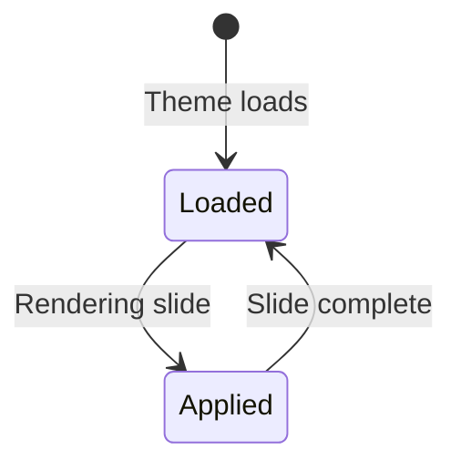

# Template Configuration Aggregate

**Version:** 1.0.0
**Status:** Draft
**Owner:** Architect
**Last Updated:** 2026-01-02

## Overview

Template Configuration allows theme authors to define presentation-specific overrides for individual slide templates (title, content, diagram, etc.). This enables themes with branded backgrounds to control layout, alignment, and styling per template while allowing individual slides to override these theme defaults.

## Ubiquitous Language

| Term | Definition | Examples |
|------|------------|----------|
| **Template Configuration** | Theme-level defaults for a specific template type | Retisio theme: title template bottom-aligned |
| **Template Override** | Per-slide frontmatter that supersedes theme config | Slide-level `vertical-align: top` overrides theme default |
| **Vertical Alignment** | Positioning of slide content (top, center, bottom) | Title slide aligned to bottom for branded header |
| **Template Layout** | Structural arrangement of template content | Section-title rendered as two columns |
| **Color Override** | Template-specific color for headings/body/elements | White headings on diagram slides |
| **Header Template** | Template string for slide headers with placeholders | `{{company}} Confidential` or `{{pageNumber}}/{{totalPages}}` |
| **Footer Template** | Template string for slide footers with placeholders | `{{timer}} | Slide {{pageNumber}}` |
| **Configuration Hierarchy** | Precedence: Slide frontmatter > Theme template config > Global config > Theme defaults | Ensures slide author control |

## Domain Model

### Aggregate Root: TemplateConfiguration

**Identity:** Template name (e.g., "title", "section-title", "diagram")

**State:**
```scala
case class TemplateConfiguration(
  templateName: String,              // "title", "content", "diagram", etc.
  verticalAlign: Option[VerticalAlignment],
  layout: Option[TemplateLayout],
  colors: Option[TemplateColors],
  columnConfig: Option[ColumnConfiguration],  // For two-column layouts
  header: Option[String],            // Theme default header template for this template type
  footer: Option[String]             // Theme default footer template for this template type
)
```

### Value Objects

#### VerticalAlignment
```scala
enum VerticalAlignment:
  case Top
  case Center
  case Bottom
```

**Invariants:**
- Must be one of the three defined values
- Maps to CSS flexbox `justify-content` values

#### TemplateLayout
```scala
enum TemplateLayout:
  case SingleColumn
  case TwoColumn
```

**Invariants:**
- Two-column layout requires `columnConfig` to be defined
- Single-column is default if not specified

#### TemplateColors
```scala
case class TemplateColors(
  heading: Option[String],           // CSS color value
  subtitle: Option[String],
  body: Option[String],
  author: Option[String]             // For title/closing slides
)
```

**Invariants:**
- Color values must be valid CSS (hex, rgb, named colors)
- Optional - None means inherit from theme default colors

#### ColumnConfiguration
```scala
case class ColumnConfiguration(
  leftColumn: ColumnSpec,
  rightColumn: ColumnSpec
)

case class ColumnSpec(
  width: Option[String],             // CSS width ("40%", "300px", etc.)
  colors: Option[TemplateColors]     // Column-specific color overrides
)
```

**Invariants:**
- Widths must be valid CSS values
- If both columns specify width, they should not exceed 100%
- Only applicable when `layout = TwoColumn`

## State Machine

Template Configuration has no state transitions - it's immutable configuration data loaded at theme initialization.



## Business Rules

### BR-1: Configuration Hierarchy
**Rule:** Slide frontmatter overrides theme template config, which overrides theme defaults

**Examples:**
- Theme: title template has `verticalAlign: Bottom`
- Slide: frontmatter has `vertical-align: top`
- Result: Slide uses `top` alignment

### BR-2: Two-Column Layout Validation
**Rule:** `layout: TwoColumn` requires `columnConfig` to be defined

**Violations:**
- Theme specifies `layout: TwoColumn` but no `columnConfig` → Validation error
- Theme specifies `columnConfig` but `layout: SingleColumn` → Warning (ignored)

### BR-3: Color Override Inheritance
**Rule:** Template color overrides apply only to specified elements; others inherit from theme

**Examples:**
- Theme: `colors.heading: #002C74` (default)
- Template config: `title.colors.heading: #FFFFFF`
- Result: Title slides have white headings, other templates use blue

### BR-4: Header/Footer Configuration Hierarchy
**Rule:** Header/footer resolution follows: Slide frontmatter > Theme template config > Global config > None

**Examples:**
- Theme: `title.footer: "{{company}} Confidential"`
- Global config: `footer: "{{pageNumber}}/{{totalPages}}"`
- Slide frontmatter: `footer: "Custom footer"`
- Result for title slide with frontmatter: "Custom footer"
- Result for title slide without frontmatter: "{{company}} Confidential"
- Result for content slide without frontmatter: "{{pageNumber}}/{{totalPages}}"

**Rationale:** Theme template config is more specific than global config, slide overrides are most specific

### BR-5: Template Name Validity
**Rule:** Template configuration keys must match existing template names

**Valid:** title, content, diagram, closing, section-title, two-column
**Invalid:** custom-template (unless template is defined)

## Integration with Theme Aggregate

Template Configuration is **part of** the Theme aggregate:

```scala
case class Theme(
  name: String,
  version: String,
  background: BackgroundConfig,
  templateBackgrounds: Map[String, String],
  templateConfig: Map[String, TemplateConfiguration],  // NEW
  colors: ColorScheme,
  fonts: FontConfig,
  spacing: SpacingConfig,
  syntax: SyntaxConfig,
  slideCounter: SlideCounterConfig
)
```

**Relationship:** Theme contains zero or more template configurations (Map by template name)

## Commands

Template Configuration is passive (read-only at runtime). No commands.

**Loading:** Theme loader reads `templateConfig` from theme.json and validates.

## Events

No domain events - this is configuration, not behavior.

## Invariants

1. **Template name must be valid** - Key in `templateConfig` map must match a known template
2. **Two-column requires column config** - `layout: TwoColumn` implies `columnConfig.isDefined`
3. **Color values must be valid CSS** - Hex, RGB, or named colors only
4. **Vertical alignment must be valid** - Only Top, Center, Bottom allowed

## Integration Points

- **ThemeLoader:** Reads templateConfig from theme.json, validates, and constructs Theme aggregate
- **ConfigLoader:** Reads global header/footer from config.json (lower priority than theme template config)
- **MarkdownParser:** Reads per-slide frontmatter (vertical-align, header, footer, etc.) for overrides
- **HTMLRenderer:** Resolves header/footer hierarchy (slide > theme template > global config), merges with other template config, applies to rendering

## Questions / Unknowns

1. Should we support arbitrary CSS properties in template config, or limit to structured properties?
   - **Decision needed:** Structured (verticalAlign, colors) vs. free-form (`customCSS: "..."`)

2. For two-column layouts, should column widths be required or have sensible defaults?
   - **Proposal:** Default to `50% / 50%` if not specified

3. Should template configuration support responsive layouts (different configs for mobile vs. desktop)?
   - **Out of scope for v1** - Add later if needed

## Related Artifacts

- **Theme Aggregate:** `doc/domain-models/aggregates/theme-aggregate.md` (to be updated)
- **Slide Aggregate:** `doc/domain-models/aggregates/slide-aggregate.md` (existing)
- **Acceptance Criteria:** (to be created after Example Mapping)
