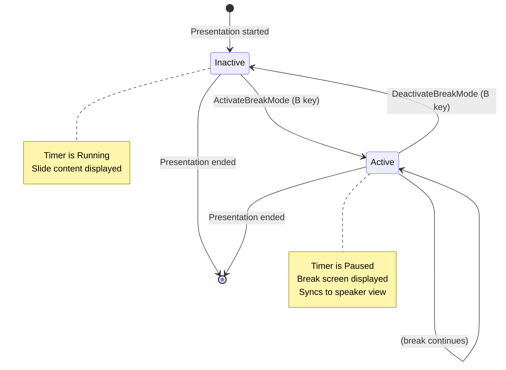

# Event Storming: Break Mode

**Date**: 2025-12-29
**Facilitator**: Architect
**Participants**: Product Owner, Bench Developer, Program Manager
**Bounded Context**: Presentation Runtime
**User Story**: As a presenter, I want to pause my presentation and display a break screen so I can take a break without showing slide content.

---

## Domain Events (Orange Stickies)

### Break Mode Lifecycle Events

1. **BreakModeActivated**
   - When: User presses 'B' key to start break
   - Triggers: Timer pauses, break screen displays
   - Data: activationTimestamp, currentSlideIndex, elapsedTimerValue

2. **BreakScreenDisplayed**
   - When: Break screen image/HTML shown to audience
   - Triggers: Slide content hidden
   - Data: breakScreenType (image | html | solid-color), breakScreenSource

3. **BreakModeDeactivated**
   - When: User presses 'B' key again to end break
   - Triggers: Timer resumes, slide content displays
   - Data: deactivationTimestamp, breakDuration, currentSlideIndex

4. **BreakScreenHidden**
   - When: Break screen removed from display
   - Triggers: Slide content shown
   - Data: resumedSlideIndex

### Synchronization Events

5. **BreakStateSynced**
   - When: Break mode state change needs sync to speaker view
   - Triggers: BroadcastChannel message sent
   - Data: breakModeActive (boolean), breakScreenSource

---

## Commands (Blue Stickies)

1. **ActivateBreakMode**
   - Triggered by: 'B' key press
   - Triggers: BreakModeActivated, BreakScreenDisplayed events
   - Integrates with: PauseTimer command (from Timer aggregate)

2. **DeactivateBreakMode**
   - Triggered by: 'B' key press (toggle)
   - Triggers: BreakModeDeactivated, BreakScreenHidden events
   - Integrates with: ResumeTimer command (from Timer aggregate)

3. **LoadBreakScreen**
   - Triggered by: Presentation initialization
   - Triggers: Break screen configuration loaded
   - Validation: Break screen file exists (if image)
   - Precedence: CLI arg → project config → global config → built-in default

4. **SyncBreakState**
   - Triggered by: Break mode activation/deactivation
   - Triggers: BreakStateSynced event
   - Validation: BroadcastChannel available

---

## Aggregates (Yellow Stickies)

### BreakMode (Aggregate Root)

**Identity**: Single instance per presentation window (singleton per session)

**Invariants**:
- Break mode can only be in one of two states: Active or Inactive
- Break screen must be resolved before activation (cannot activate with null screen)
- Break mode active state must sync with timer paused state
- Cannot activate break mode if presentation not started

**State**:
- `active: Boolean` (true = break mode active, false = inactive)
- `breakScreenSource: BreakScreenConfig` (image path, HTML, or solid color)
- `lastActivationTimestamp: Option[Long]`
- `totalBreakDuration: Long` (cumulative milliseconds in break mode)

**Commands Handled**:
- ActivateBreakMode
- DeactivateBreakMode
- LoadBreakScreen
- SyncBreakState

**Events Emitted**:
- BreakModeActivated
- BreakScreenDisplayed
- BreakModeDeactivated
- BreakScreenHidden
- BreakStateSynced

**Integration with PresentationTimer**:
```scala
def activateBreakMode(timer: PresentationTimer): Either[BreakModeError, (BreakMode, PresentationTimer)] =
  if active then
    Left(BreakModeAlreadyActive)
  else if breakScreenSource.isEmpty then
    Left(NoBreakScreenConfigured)
  else
    val pausedTimer = timer.pause() // Pause timer
    val newBreakMode = copy(
      active = true,
      lastActivationTimestamp = Some(System.currentTimeMillis())
    )
    Right((newBreakMode, pausedTimer.getOrElse(???)))
```

---

### BreakScreenConfig (Value Object)

**Definition**: Configuration for break screen display

**Types**:
```scala
enum BreakScreenConfig:
  case ImageSource(path: String)       // Image file (PNG, JPG, SVG)
  case HtmlSource(content: String)     // Custom HTML (future)
  case SolidColor(hexColor: String)    // Default: "#000000"
```

**Precedence Resolution**:
1. CLI argument: `--break-screen path/to/image.png`
2. Project config: `.mdslides/config.json` → `"breakScreen": "images/break.png"`
3. Global config: `~/.mdslides/config.json` → `"defaults": {"breakScreen": "~/break.png"}`
4. Built-in default: `SolidColor("#000000")`

**Validation**:
- Image paths must exist (file exists check)
- Image paths resolve relative to project directory
- HTML content sanitized (future)
- Hex colors match pattern `#[0-9A-Fa-f]{6}`

---

## State Machine



---

## Temporal Flow

```mermaid
timeline
    title Break Mode Lifecycle
    section Normal Presentation
        00:10:00 : Presenting slide 15
        00:10:30 : B key pressed
    section Break Mode
        00:10:30 : BreakModeActivated
        00:10:30 : TimerPaused (from Timer aggregate)
        00:10:30 : BreakScreenDisplayed
        00:15:00 : Break continues (4.5 min)
        00:15:00 : B key pressed again
    section Resume
        00:15:00 : BreakModeDeactivated
        00:15:00 : TimerResumed (from Timer aggregate)
        00:15:00 : BreakScreenHidden
        00:15:01 : Presenting slide 15 (resumed)
```

---

## Hotspots & Questions (Pink Stickies)

### Hotspot 1: Timer Integration
**Question**: Should break mode directly control timer, or should it be a separate concern?

**Options**:
1. BreakMode aggregate commands PauseTimer/ResumeTimer
2. BreakMode emits events, Timer listens and reacts
3. Orchestration layer coordinates both aggregates

**Decision**: **Option 1 - Direct Command**
- BreakMode calls `timer.pause()` and `timer.resume()` directly
- Simpler than event-driven approach for this use case
- Both aggregates in same bounded context (Presentation Runtime)

**Rationale**: Break mode is fundamentally "pause presentation with alternate display". Timer pause is intrinsic to the behavior, not a side effect.

---

### Hotspot 2: Break Screen Resolution Timing
**Question**: When should break screen configuration be resolved?

**Options**:
1. At presentation initialization (fail early if invalid)
2. At first break activation (lazy loading)
3. On-demand at each activation (most flexible)

**Decision**: **Option 1 - At Initialization**
- Fail early if break screen image doesn't exist
- Avoid runtime surprise during live presentation
- Pre-load image for faster activation

**Rationale**: Better UX to fail at presentation start than during live session.

---

### Hotspot 3: Break Screen Types
**Question**: Which break screen types to support in v3.0.0?

**Options**:
1. Solid color only (simplest)
2. Image files only (PNG, JPG, SVG)
3. Image files + solid color fallback
4. Image files + custom HTML

**Decision**: **Option 3 - Image + Solid Color Fallback**
- v3.0.0: Support image files with black screen as default
- Future: Custom HTML break screens (v3.1.0)

**Rationale**: Images cover 90% of use cases. Solid color is simple default. HTML adds complexity for minimal benefit in v3.0.0.

---

### Hotspot 4: Multiple Break Sessions
**Question**: Should we track multiple break sessions separately?

**Options**:
1. Track only total cumulative break duration
2. Track each break session separately (start/end times)
3. Track break sessions and link to history log

**Decision**: **Option 1 for v3.0.0, Option 3 for v3.1.0**
- v3.0.0: Only `totalBreakDuration` (cumulative)
- v3.1.0: Add break sessions to history log with per-break metrics

**Rationale**: Cumulative duration sufficient for timer exclusion. Detailed tracking deferred to history logging feature.

---

### Hotspot 5: Break Mode and Speaker View
**Question**: Should speaker view show break screen or remain showing slide?

**Options**:
1. Both show break screen (fully synchronized)
2. Main shows break screen, speaker view shows slide + notes
3. Configurable (allow presenter to choose)

**Decision**: **Option 2 - Differentiated Behavior**
- Main presentation window: Shows break screen
- Speaker view: Shows current slide + speaker notes + timer (paused)
- Speaker can see content while audience sees break screen

**Rationale**: Speaker needs context during break. Audience should not see slide content.

---

## Integration Points

### Upstream Dependencies
- **PresentationTimer**: Break mode pauses/resumes timer
- **Configuration**: Break screen config from CLI/project/global config

### Downstream Consumers
- **Keyboard Handler**: 'B' key triggers activate/deactivate
- **Display Renderer**: Shows/hides break screen
- **Speaker View Sync**: Synchronizes break state via BroadcastChannel
- **History Logger**: (v3.1.0) Records break sessions

---

## Acceptance Criteria (Preview)

1. **Break mode activates on 'B' key press**
   - Break screen displays
   - Timer pauses
   - Current slide hidden

2. **Break mode deactivates on second 'B' key press**
   - Break screen hides
   - Timer resumes
   - Current slide displays

3. **Break screen resolves via precedence**
   - CLI arg > project config > global config > built-in default

4. **Break mode syncs to speaker view**
   - Main window shows break screen
   - Speaker view shows slide + notes
   - Timer shows paused state in both windows

5. **Break screen images validated at initialization**
   - Invalid image path fails presentation start
   - Missing image falls back to solid black

---

## Next Steps

1. ✅ **Event Storming** - Complete (this document)
2. ⏭️ **Ubiquitous Language Workshop** - Extract terms from events
3. ⏭️ **Domain Modeling Workshop** - Define BreakMode aggregate
4. ⏭️ **Three Amigos** - Write BDD scenarios for break mode
5. ⏭️ **Implementation** - TDD break mode functionality

---

**Facilitator Notes**:
- Break mode is tightly coupled with Timer aggregate (both in Presentation Runtime context)
- Configuration layer needs to resolve break screen at initialization
- Cross-window sync similar to timer sync (reuse BroadcastChannel pattern)
- Speaker view behavior differs from main presentation (design decision)

