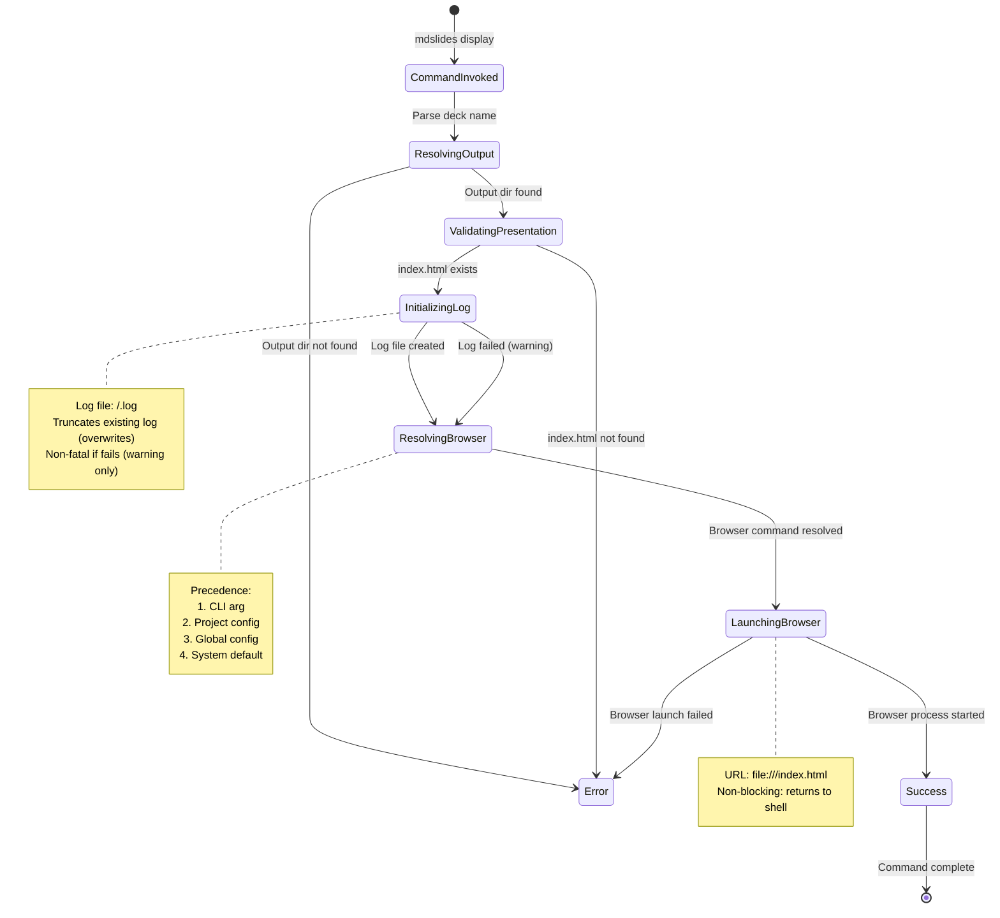

# Event Storming: Display Command

**Date**: 2025-12-29
**Facilitator**: Architect
**Participants**: Product Owner, Bench Developer, Program Manager
**Bounded Context**: Presentation Delivery & Session Management
**User Story**: As a presentation author, I want to open my rendered presentation in a browser with logging enabled so I can deliver my talk and capture session metrics for later analysis.

---

## Domain Events (Orange Stickies)

### Command Invocation Events

1. **DisplayCommandInvoked**
   - When: User runs `mdslides display <deck-name>`
   - Triggers: Output directory resolution
   - Data: deckName, browserPreference, timestamp

2. **OutputDirectoryResolved**
   - When: Deck name mapped to output directory path
   - Triggers: Presentation file validation
   - Data: deckName, outputDirPath

3. **OutputDirectoryNotFound**
   - When: Output directory does not exist
   - Triggers: Error message, command exits
   - Data: expectedPath, deckName

### Presentation File Validation Events

4. **PresentationFileValidated**
   - When: `index.html` exists and is readable
   - Triggers: Logging initialization
   - Data: indexHtmlPath, fileSize, lastModified

5. **PresentationFileNotFound**
   - When: `index.html` does not exist in output directory
   - Triggers: Error with suggestion to run render, command exits
   - Data: outputDirPath, deckName

### Logging Initialization Events

6. **LogFileInitialized**
   - When: Log file created or truncated at `<output-dir>/<deck-name>.log`
   - Triggers: Initial log entry written (session metadata)
   - Data: logFilePath, sessionId, startTime

7. **LogFileCreationFailed**
   - When: Unable to create or write log file
   - Triggers: Warning message (non-fatal, continues without logging)
   - Data: logFilePath, error

### Browser Launch Events

8. **BrowserResolved**
   - When: Browser command determined from config precedence
   - Triggers: Browser process launch
   - Data: browserCommand, browserArgs, url

9. **BrowserLaunched**
   - When: Browser process started successfully
   - Triggers: Console success message, command completes
   - Data: browserName, url, processId

10. **BrowserLaunchFailed**
    - When: Browser process fails to start
    - Triggers: Error message with troubleshooting, command exits
    - Data: browserCommand, error

---

## Commands (Blue Stickies)

1. **InvokeDisplayCommand**
   - Triggered by: User CLI invocation
   - Triggers: DisplayCommandInvoked event
   - Validation: deckName provided

2. **ResolveOutputDirectory**
   - Triggered by: DisplayCommandInvoked event
   - Triggers: OutputDirectoryResolved or OutputDirectoryNotFound event
   - Resolution: Same logic as render command (deckName → output path)

3. **ValidatePresentationFile**
   - Triggered by: OutputDirectoryResolved event
   - Triggers: PresentationFileValidated or PresentationFileNotFound event
   - Check: `<output-dir>/index.html` exists and is readable

4. **InitializeLogFile**
   - Triggered by: PresentationFileValidated event
   - Triggers: LogFileInitialized or LogFileCreationFailed event
   - Action: Create/truncate log file, write initial session metadata

5. **ResolveBrowserCommand**
   - Triggered by: LogFileInitialized event (or after warning if log failed)
   - Triggers: BrowserResolved event
   - Precedence: CLI arg > project config > global config > system default

6. **LaunchBrowser**
   - Triggered by: BrowserResolved event
   - Triggers: BrowserLaunched or BrowserLaunchFailed event
   - Action: Execute browser command with `file://<absolute-path>/index.html`

---

## Aggregates (Yellow Stickies)

### DisplaySession (Aggregate Root)

**Definition**: A presentation display session with browser launch and logging configuration

**Properties**:
```scala
case class DisplaySession(
  deckName: String,
  outputDir: Path,
  indexHtmlPath: Path,
  logFilePath: Path,
  browserConfig: BrowserConfig,
  sessionId: String,           // UUID for this session
  startTime: Instant,
  loggingEnabled: Boolean      // true if log file successfully initialized
)

case class BrowserConfig(
  command: String,             // Browser executable command
  args: List[String],          // Additional browser arguments
  displayName: String          // Human-readable name for console output
)

object BrowserConfig:
  val SystemDefault = BrowserConfig(
    command = determineSystemDefaultBrowser(),
    args = List.empty,
    displayName = "system default browser"
  )

  def fromName(name: String): BrowserConfig = name.toLowerCase match
    case "default" => SystemDefault
    case "firefox" => BrowserConfig("firefox", List.empty, "Firefox")
    case "chromium" => BrowserConfig("chromium", List.empty, "Chromium")
    case "google-chrome" => BrowserConfig("google-chrome", List.empty, "Google Chrome")
    case "brave" => BrowserConfig("brave", List.empty, "Brave Browser")
    case custom => BrowserConfig(custom, List.empty, s"Custom ($custom)")

  def determineSystemDefaultBrowser(): String =
    val osName = System.getProperty("os.name").toLowerCase
    if osName.contains("linux") then "xdg-open"
    else if osName.contains("mac") then "open"
    else "cmd /c start"  // Windows
```

**Invariants**:
1. **Output Directory Exists**: outputDir must exist before browser launch
2. **Index HTML Exists**: indexHtmlPath must exist and be readable
3. **Log File Writable**: logFilePath must be writable (or logging disabled with warning)
4. **Browser Resolvable**: browserConfig.command must be valid executable
5. **Absolute Path URL**: Browser URL must use absolute file path (no relative paths)

**Session Initialization**:
```scala
def createSession(
  deckName: String,
  browserPreference: Option[String],
  config: AppConfig
): IO[Either[DisplayError, DisplaySession]] =
  for {
    // Resolve output directory
    outputDir <- IO.fromEither(PathResolver.resolveOutputDir(deckName))

    // Validate index.html exists
    indexHtmlPath = outputDir.resolve("index.html")
    exists <- IO(Files.exists(indexHtmlPath))
    _ <- if !exists then
      IO.raiseError(DisplayError.PresentationNotRendered(deckName, outputDir))
    else IO.unit

    // Initialize log file
    logFilePath = outputDir.resolve(s"${outputDir.getFileName}.log")
    loggingEnabled <- initializeLogFile(logFilePath).attempt.map(_.isRight)

    // Resolve browser
    browserConfig <- resolveBrowser(browserPreference, config)

    // Create session
    session = DisplaySession(
      deckName = deckName,
      outputDir = outputDir,
      indexHtmlPath = indexHtmlPath,
      logFilePath = logFilePath,
      browserConfig = browserConfig,
      sessionId = UUID.randomUUID().toString,
      startTime = Instant.now(),
      loggingEnabled = loggingEnabled
    )
  } yield Right(session)
```

---

### Browser Resolution (4-Layer Config Precedence)

**Precedence Order**:
1. **CLI Argument** (highest): `--browser firefox`
2. **Project Config**: `.mdslides/config.json` → `"browser": "chromium"`
3. **Global Config**: `~/.mdslides/config.json` → `"defaults": {"browser": "firefox"}`
4. **Built-in Default** (lowest): System default (`xdg-open`, `open`, `cmd /c start`)

**Implementation**:
```scala
def resolveBrowser(
  cliArg: Option[String],
  config: AppConfig
): IO[BrowserConfig] =
  val browserName = cliArg
    .orElse(config.project.flatMap(_.browser))
    .orElse(config.global.flatMap(_.defaults.browser))
    .getOrElse("default")

  IO.pure(BrowserConfig.fromName(browserName))
```

---

## State Machine



---

## Hotspots & Questions (Pink Stickies)

### Hotspot 1: Presentation Not Rendered
**Question**: What if user runs `display` before `render`?

**Decision**: **Error with Actionable Message**
```
✗ Presentation not rendered: my-talk

  Expected file: my-talk/index.html (NOT FOUND)

  To render the presentation first, run:
    java -jar ../mdslides.jar render my-talk

  Or use the smart default command to auto-render:
    java -jar ../mdslides.jar my-talk
```

**Rationale**: Clear guidance on how to fix the problem.

---

### Hotspot 2: Log File Initialization Failure
**Question**: Should display command fail if log file cannot be created?

**Options**:
1. Fail command (fatal error)
2. Warn and continue without logging (non-fatal)
3. Prompt user to fix permissions

**Decision**: **Option 2 - Warn and Continue Without Logging**
```
⚠ Warning: Unable to create log file: my-talk/my-talk.log
  Reason: Permission denied

  Presentation will open without session logging.
  To enable logging, fix file permissions or run with appropriate privileges.

✓ Opened presentation in browser: file:///path/to/my-talk/index.html
```

**Rationale**: Display is more important than logging. User can still present.

---

### Hotspot 3: Browser Not Found
**Question**: What if configured browser is not installed?

**Decision**: **Error with Troubleshooting Steps**
```
✗ Failed to launch browser: firefox

  Error: Command not found: firefox

  Troubleshooting:
  1. Check if Firefox is installed: which firefox
  2. Specify a different browser: --browser chromium
  3. Use system default: --browser default

  Available browsers to try:
  - firefox, chromium, google-chrome, brave
  - Or provide full path: --browser /usr/bin/custom-browser
```

**Rationale**: Help user diagnose and fix browser issues.

---

### Hotspot 4: Browser Launch Mode
**Question**: Should browser launch block or return to shell?

**Options**:
1. Blocking: Command waits for browser to close
2. Non-blocking: Command returns immediately after launch
3. Configurable via flag

**Decision**: **Option 2 - Non-Blocking (Default Behavior)**
- Launch browser process in background
- Return to shell immediately
- Print success message with URL

**Implementation**:
```scala
def launchBrowserNonBlocking(url: String, browserConfig: BrowserConfig): IO[Unit] =
  IO {
    val command = browserConfig.command :: url :: browserConfig.args
    val process = new ProcessBuilder(command: _*)
      .inheritIO()
      .start()

    println(s"✓ Opened presentation in ${browserConfig.displayName}")
    println(s"  URL: $url")
  }
```

**Rationale**: Standard CLI tool behavior, allows user to continue working.

---

### Hotspot 5: Multiple Display Sessions
**Question**: What happens if user runs `display` multiple times for same deck?

**Behavior**:
- Each invocation creates a new browser window/tab
- Log file is **truncated** (overwrites previous session)
- Only the **most recent** session is logged

**Warning Message** (optional):
```
⚠ Note: Existing log file will be overwritten
  Previous session: 2025-12-29 14:23:45 (45 minutes ago)

  To preserve previous session data:
  1. Copy log file: cp my-talk/my-talk.log my-talk/my-talk-2025-12-29.log
  2. Or use report command first: java -jar ../mdslides.jar report my-talk
```

**Decision**: **Truncate Without Warning for v3.0.0**
- Simple implementation (single log per deck)
- Advanced users can manually copy logs if needed
- Future: Add `--append` flag or date-stamped logs in v3.1.0

**Rationale**: Most users give presentation once per render. YAGNI for multi-session.

---

### Hotspot 6: Relative vs. Absolute File Paths
**Question**: Should browser URL use relative or absolute file paths?

**Decision**: **Absolute File Paths Always**
```
file:///home/user/projects/mdslides/my-talk/index.html
```

**Why Absolute**:
- Browsers require absolute paths for `file://` URLs
- Relative paths fail when browser's working directory differs
- Cross-platform compatibility (Windows, Linux, macOS)

**Implementation**:
```scala
def constructFileUrl(indexHtmlPath: Path): String =
  s"file://${indexHtmlPath.toAbsolutePath}"
```

**Rationale**: Reliability over brevity, no ambiguity.

---

### Hotspot 7: Browser Arguments
**Question**: Should we support custom browser arguments (e.g., `--incognito`)?

**Options**:
1. No custom args (simple)
2. Hardcoded args per browser (e.g., Firefox always in private mode)
3. Configurable args via config file

**Decision**: **Option 1 - No Custom Args for v3.0.0**
- Simple implementation
- Browsers open in default mode
- Users can manually open in incognito/private mode if needed
- Future: Add `browserArgs` config option in v3.1.0 if requested

**Future Enhancement (v3.1.0)**:
```json
{
  "browser": "firefox",
  "browserArgs": ["--private-window", "--new-instance"]
}
```

**Rationale**: YAGNI, users can open browser manually with custom args.

---

### Hotspot 8: Console Output Verbosity
**Question**: How much information should be printed to console?

**Decision**: **Minimal Output (Success Message + URL)**
```
✓ Opened presentation in Firefox
  URL: file:///home/user/projects/mdslides/my-talk/index.html
```

**Verbose Mode** (future):
```
$ java -jar ../mdslides.jar display my-talk --verbose

Resolving output directory: my-talk
✓ Output directory: /home/user/projects/mdslides/my-talk
✓ Presentation file: /home/user/projects/mdslides/my-talk/index.html
✓ Log file initialized: /home/user/projects/mdslides/my-talk/my-talk.log
✓ Browser resolved: Firefox (from global config)
✓ Launching browser: firefox file:///home/user/projects/mdslides/my-talk/index.html
✓ Browser process started (PID: 12345)
```

**Rationale**: Quiet by default, verbose mode for debugging.

---

## Integration Points

### Upstream Dependencies
- **Render Command**: Must have run successfully to create `index.html`
- **Output Directory Resolution**: Same logic as render command
- **Config System**: Browser preference from 4-layer config
- **File System**: Read presentation files, write log files

### Downstream Consumers
- **Browser Process**: Launched with file URL
- **History Logging**: Log file initialized for JavaScript logger
- **Operating System**: Process execution, file permissions

---

## Example Scenarios

### Scenario 1: Successful Display (First Time)
```bash
$ java -jar ../mdslides.jar display mdslides-tutorial

✓ Opened presentation in system default browser
  URL: file:///home/user/projects/mdslides/mdslides-tutorial/index.html
```

**Behavior**:
- Output directory resolved: `mdslides-tutorial/`
- Validated: `mdslides-tutorial/index.html` exists
- Log file created: `mdslides-tutorial/mdslides-tutorial.log`
- Browser: System default (xdg-open on Linux)
- Browser launched in background, command returns to shell

---

### Scenario 2: Display with Custom Browser
```bash
$ java -jar ../mdslides.jar display mdslides-tutorial --browser firefox

✓ Opened presentation in Firefox
  URL: file:///home/user/projects/mdslides/mdslides-tutorial/index.html
```

**Behavior**:
- Browser resolved: `firefox` from CLI argument (highest precedence)
- Browser command: `firefox file:///home/.../index.html`

---

### Scenario 3: Presentation Not Rendered
```bash
$ java -jar ../mdslides.jar display my-new-talk

✗ Presentation not rendered: my-new-talk

  Expected file: my-new-talk/index.html (NOT FOUND)

  To render the presentation first, run:
    java -jar ../mdslides.jar render my-new-talk

  Or use the smart default command to auto-render:
    java -jar ../mdslides.jar my-new-talk
```

---

### Scenario 4: Browser Not Found
```bash
$ java -jar ../mdslides.jar display mdslides-tutorial --browser safari

✗ Failed to launch browser: safari

  Error: Command not found: safari

  Troubleshooting:
  1. Check if Safari is installed: which safari
  2. Specify a different browser: --browser chromium
  3. Use system default: --browser default

  Available browsers to try:
  - firefox, chromium, google-chrome, brave
  - Or provide full path: --browser /usr/bin/custom-browser
```

---

### Scenario 5: Log File Permission Denied
```bash
$ java -jar ../mdslides.jar display mdslides-tutorial

⚠ Warning: Unable to create log file: mdslides-tutorial/mdslides-tutorial.log
  Reason: Permission denied

  Presentation will open without session logging.
  To enable logging, fix file permissions or run with appropriate privileges.

✓ Opened presentation in system default browser
  URL: file:///home/user/projects/mdslides/mdslides-tutorial/index.html
```

---

## Acceptance Criteria (Preview)

1. **Command invocation**
   - Syntax: `java -jar ../mdslides.jar display <deck-name> [--browser <name>]`
   - Resolves deck name to output directory

2. **Output directory validation**
   - Checks `<output-dir>/index.html` exists
   - Error if not found with suggestion to run render

3. **Log file initialization**
   - Creates or truncates `<output-dir>/<deck-name>.log`
   - Writes initial session metadata (sessionId, startTime, theme, totalSlides)
   - Non-fatal if fails (warning only, continues without logging)

4. **Browser resolution (4-layer precedence)**
   - CLI argument `--browser <name>` (highest)
   - Project config `.mdslides/config.json` → `"browser": "<name>"`
   - Global config `~/.mdslides/config.json` → `"defaults": {"browser": "<name>"}`
   - System default: `xdg-open` (Linux), `open` (macOS), `cmd /c start` (Windows)

5. **Supported browsers**
   - `default`: System default browser
   - `firefox`: Mozilla Firefox
   - `chromium`: Chromium
   - `google-chrome`: Google Chrome
   - `brave`: Brave Browser
   - Custom path: Full path to executable

6. **Browser launch**
   - Absolute file URL: `file://<absolute-path>/index.html`
   - Non-blocking: Command returns to shell after launch
   - Success message with browser name and URL

7. **Error handling**
   - Presentation not rendered: Clear message with render command suggestion
   - Browser not found: Troubleshooting steps, list of alternatives
   - Log file permission denied: Warning (non-fatal), continue without logging

8. **Exit codes**
   - 0: Success (browser launched)
   - 1: Presentation not found or not rendered
   - 2: Browser launch failed

---

## Next Steps

1. ✅ **Event Storming** - Complete (this document)
2. ⏭️ **Ubiquitous Language Workshop** - Add DisplaySession, BrowserConfig terms
3. ⏭️ **Domain Modeling Workshop** - Define DisplaySession aggregate
4. ⏭️ **Three Amigos** - Write BDD scenarios for display command, browser launch, error handling
5. ⏭️ **Implementation** - Display command, browser launcher, log initializer

---

**Facilitator Notes**:
- Display command is the primary entry point for giving presentations (creates logs)
- Opening `index.html` directly in browser does NOT create logs (no CLI context)
- Browser launch is non-blocking (standard CLI tool behavior)
- Log file truncation is intentional (single session per output directory)
- Browser resolution uses same 4-layer config precedence as other features
- Error messages are actionable (tell user how to fix the problem)
- Log initialization failure is non-fatal (presentation is more important than logging)
