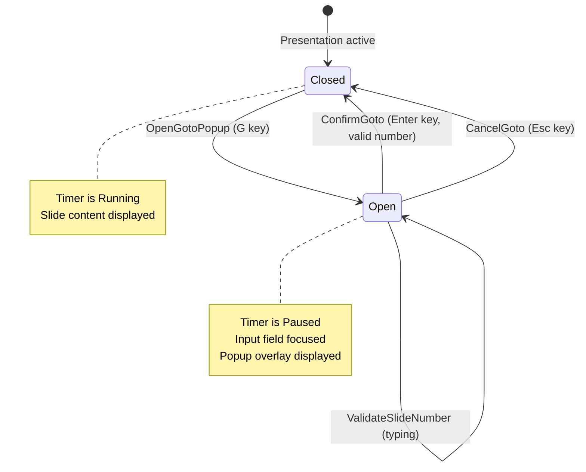

# Event Storming: Goto Function

**Date**: 2025-12-29
**Facilitator**: Architect
**Participants**: Product Owner, Bench Developer, Program Manager
**Bounded Context**: Presentation Runtime
**User Story**: As a presenter, I want to jump to any slide by number so I can quickly respond to audience questions.

---

## Domain Events (Orange Stickies)

### Goto Popup Lifecycle Events

1. **GotoPopupOpened**
   - When: User presses 'G' key
   - Triggers: Popup overlay displays, timer pauses
   - Data: currentSlideIndex, timestamp

2. **SlideNumberEntered**
   - When: User types slide number in input field
   - Triggers: Input validation, preview update (if enabled)
   - Data: enteredNumber, isValid

3. **SlideSelected**
   - When: User confirms slide selection (Enter key or click)
   - Triggers: Navigation to target slide, popup closes
   - Data: targetSlideIndex, navigationMethod (goto)

4. **GotoPopupCancelled**
   - When: User presses Esc key or clicks cancel
   - Triggers: Popup closes, returns to current slide
   - Data: timestamp

5. **GotoPopupClosed**
   - When: Popup dismissed (either confirmed or cancelled)
   - Triggers: Timer resumes, focus returns to presentation
   - Data: targetSlideIndex (or null if cancelled)

### Timer Integration Events

6. **TimerPausedForGoto**
   - When: Goto popup opens
   - Triggers: Timer pauses (from Timer aggregate)
   - Data: pauseReason (goto), elapsedTimerValue

7. **TimerResumedAfterGoto**
   - When: Goto popup closes
   - Triggers: Timer resumes (from Timer aggregate)
   - Data: resumeReason (goto-complete), pauseDuration

---

## Commands (Blue Stickies)

1. **OpenGotoPopup**
   - Triggered by: 'G' key press
   - Triggers: GotoPopupOpened, TimerPausedForGoto events
   - Integrates with: PauseTimer command (from Timer aggregate)
   - Validation: Presentation is active (not in break mode)

2. **ValidateSlideNumber**
   - Triggered by: User typing in input field
   - Triggers: SlideNumberEntered event
   - Validation: Number in range [0, totalSlides)
   - Side effect: Update preview if valid

3. **ConfirmGoto**
   - Triggered by: Enter key or OK button click
   - Triggers: SlideSelected, GotoPopupClosed, TimerResumedAfterGoto events
   - Validation: Entered number is valid
   - Side effect: Navigate to target slide, push to history

4. **CancelGoto**
   - Triggered by: Esc key or Cancel button click
   - Triggers: GotoPopupCancelled, GotoPopupClosed, TimerResumedAfterGoto events
   - Side effect: Stay on current slide, no history change

5. **NavigateToSlideByNumber**
   - Triggered by: ConfirmGoto command
   - Triggers: SlideEntered event (from History Logging)
   - Side effect: Update current slide index, render new slide

6. **ShowSlidePreview**
   - Triggered by: Valid slide number entered (optional feature)
   - Triggers: Preview thumbnail displayed
   - Data: targetSlideIndex, thumbnailUrl

---

## Aggregates (Yellow Stickies)

### GotoPopup (Aggregate Root)

**Identity**: Single instance per presentation window (singleton, ephemeral)

**Lifecycle**: Created when 'G' pressed → Destroyed when popup closes

**Invariants**:
- Popup can only be open when presentation is active (not in break mode)
- Entered slide number must be in range [0, totalSlides) to confirm
- Timer must be paused while popup is open
- Popup state must sync to speaker view

**State**:
```scala
case class GotoPopup(
  isOpen: Boolean,
  currentSlideIndex: Int,    // Slide before goto (for cancel)
  enteredNumber: Option[Int], // User-entered slide number
  totalSlides: Int,           // For validation
  openedTimestamp: Long       // For calculating pause duration
)
```

**Commands Handled**:
- OpenGotoPopup
- ValidateSlideNumber
- ConfirmGoto
- CancelGoto
- NavigateToSlideByNumber
- ShowSlidePreview (optional)

**Events Emitted**:
- GotoPopupOpened
- SlideNumberEntered
- SlideSelected
- GotoPopupCancelled
- GotoPopupClosed
- TimerPausedForGoto
- TimerResumedAfterGoto

**Business Logic**:
```scala
def openPopup(currentSlide: Int, timer: PresentationTimer): (GotoPopup, PresentationTimer) =
  val pausedTimer = timer.pause().getOrElse(???)
  val popup = GotoPopup(
    isOpen = true,
    currentSlideIndex = currentSlide,
    enteredNumber = None,
    totalSlides = totalSlides,
    openedTimestamp = System.currentTimeMillis()
  )
  (popup, pausedTimer)

def confirmGoto(): Either[GotoError, (Int, NavigationHistory)] =
  enteredNumber match
    case None =>
      Left(NoSlideNumberEntered)
    case Some(n) if n < 0 || n >= totalSlides =>
      Left(InvalidSlideNumber(n, totalSlides))
    case Some(n) =>
      // Navigate to slide n, add to history
      val newHistory = navigationHistory.pushToHistory(n)
      Right((n, newHistory))

def cancelGoto(): Int =
  currentSlideIndex  // Return to slide before goto
```

---

## State Machine



---

## Temporal Flow

```mermaid
timeline
    title Goto Function Lifecycle
    section Normal Presentation
        00:10:00 : Presenting slide 15
        00:10:15 : G key pressed
    section Goto Popup
        00:10:15 : GotoPopupOpened
        00:10:15 : TimerPausedForGoto
        00:10:16 : User types "42" (SlideNumberEntered)
        00:10:17 : User presses Enter (ConfirmGoto)
    section Navigation
        00:10:17 : SlideSelected (slide 42)
        00:10:17 : GotoPopupClosed
        00:10:17 : TimerResumedAfterGoto
        00:10:17 : Presenting slide 42
        00:10:20 : Added to history (15 → 42)
```

---

## Hotspots & Questions (Pink Stickies)

### Hotspot 1: Popup UI Design
**Question**: What UI components should the goto popup include?

**Options**:
1. Simple: Input field + OK/Cancel buttons
2. Enhanced: Input field + slide list/dropdown + preview
3. Minimal: Input field only (Enter to confirm, Esc to cancel)

**Decision**: **Option 1 for v3.0.0, Option 2 for v3.1.0**
- v3.0.0: Input field + OK/Cancel buttons
- Future: Add slide list and preview thumbnail

**Rationale**: Simple implementation sufficient. Enhanced features add complexity.

---

### Hotspot 2: Slide Number Format
**Question**: Should slide numbers be 0-indexed or 1-indexed in UI?

**Options**:
1. 0-indexed (matches internal representation)
2. 1-indexed (user-friendly, "slide 1" not "slide 0")
3. Configurable

**Decision**: **Option 2 - 1-indexed in UI**
- User enters 1-42 (not 0-41)
- Internally convert to 0-indexed (user input - 1)
- Display as "Slide 1 of 42" not "Slide 0 of 41"

**Rationale**: "Slide 1" is conventional. Internal 0-indexing is implementation detail.

---

### Hotspot 3: Invalid Input Handling
**Question**: What happens when user enters invalid slide number?

**Examples**: -1, 100 (when only 42 slides), "abc"

**Decision**: **Real-time Validation with Error Message**
- Input field validates on each keystroke
- Invalid input: Red border + error message below input
- OK button disabled until valid number entered
- Non-numeric input: Ignored (input field blocks non-digits)

**Rationale**: Immediate feedback prevents user frustration.

---

### Hotspot 4: Goto and History Stack
**Question**: Should goto add to history stack?

**Decision**: **Yes - Add to History, Clear Forward History**
- Goto navigation: Push current slide to backward stack
- Forward history: Cleared (same as other non-P/N navigation)
- Enables P key to return to slide before goto

**Rationale**: Consistent with navigation model. Goto is a "new decision path".

---

### Hotspot 5: Goto in Speaker View
**Question**: Should speaker view also have goto function?

**Options**:
1. Both main and speaker view have independent goto
2. Only main view has goto, speaker syncs
3. Goto syncs between windows (same popup state)

**Decision**: **Option 2 - Main View Only, Speaker Syncs**
- 'G' key in main window: Opens goto popup, pauses timer
- 'G' key in speaker view: No-op (speaker view observes, doesn't control)
- When main navigates via goto: Speaker view syncs to same slide

**Rationale**: Main window is "source of truth". Speaker view is passive observer.

---

### Hotspot 6: Timer Pause During Goto
**Question**: Should timer pause while goto popup is open?

**Decision**: **Yes - Pause Timer During Goto**
- Opening popup: Pauses timer
- Closing popup (confirm or cancel): Resumes timer
- Pause duration: Excluded from elapsed time (same as break mode)

**Rationale**: Goto popup is an interruption to presentation flow, like break mode.

---

### Hotspot 7: Slide Preview
**Question**: Should goto popup show preview of selected slide?

**Decision**: **Not in v3.0.0, Deferred to v3.1.0**
- v3.0.0: Text input only
- v3.1.0: Add thumbnail preview (requires slide rendering to images)

**Rationale**: Preview adds complexity (image generation, caching). Not essential for MVP.

---

### Hotspot 8: Goto and Break Mode
**Question**: Can user activate goto while in break mode?

**Decision**: **No - Goto Disabled During Break Mode**
- 'G' key ignored while break mode active
- User must exit break mode (B key) before using goto
- Rationale: Popup over break screen is confusing UX

**Validation**:
```scala
def openPopup(breakMode: BreakMode): Either[GotoError, GotoPopup] =
  if breakMode.active then
    Left(GotoNotAvailableInBreakMode)
  else
    Right(/* open popup */)
```

---

## Integration Points

### Upstream Dependencies
- **Slide Deck**: totalSlides count for validation
- **Navigation History**: pushToHistory on goto
- **PresentationTimer**: pause/resume on popup open/close
- **Keyboard Handler**: 'G' key event

### Downstream Consumers
- **Slide Renderer**: Displays target slide
- **Speaker View Sync**: Syncs goto navigation
- **History Logging**: Records goto event

---

## Acceptance Criteria (Preview)

1. **Goto popup opens on 'G' key press**
   - Timer pauses
   - Input field focused
   - Current slide remains visible behind overlay

2. **User enters slide number (1-indexed)**
   - Input validates in real-time
   - Invalid input: Red border + error message
   - OK button disabled until valid

3. **Enter key or OK button confirms navigation**
   - Navigate to target slide
   - Popup closes
   - Timer resumes
   - Goto added to history

4. **Esc key or Cancel button cancels goto**
   - Stay on current slide
   - Popup closes
   - Timer resumes
   - No history change

5. **Goto syncs to speaker view**
   - Both windows show target slide after goto

6. **Goto disabled during break mode**
   - 'G' key ignored while break active

---

## Next Steps

1. ✅ **Event Storming** - Complete (this document)
2. ⏭️ **Ubiquitous Language Workshop** - Extract terms
3. ⏭️ **Domain Modeling Workshop** - Define GotoPopup aggregate
4. ⏭️ **Three Amigos** - Write BDD scenarios
5. ⏭️ **Implementation** - TDD goto functionality

---

**Facilitator Notes**:
- Goto function is ephemeral (popup exists only while open)
- Tightly integrated with Timer (pause/resume)
- Adds to navigation history (enables P key to return)
- 1-indexed in UI, 0-indexed internally (user-friendly)

