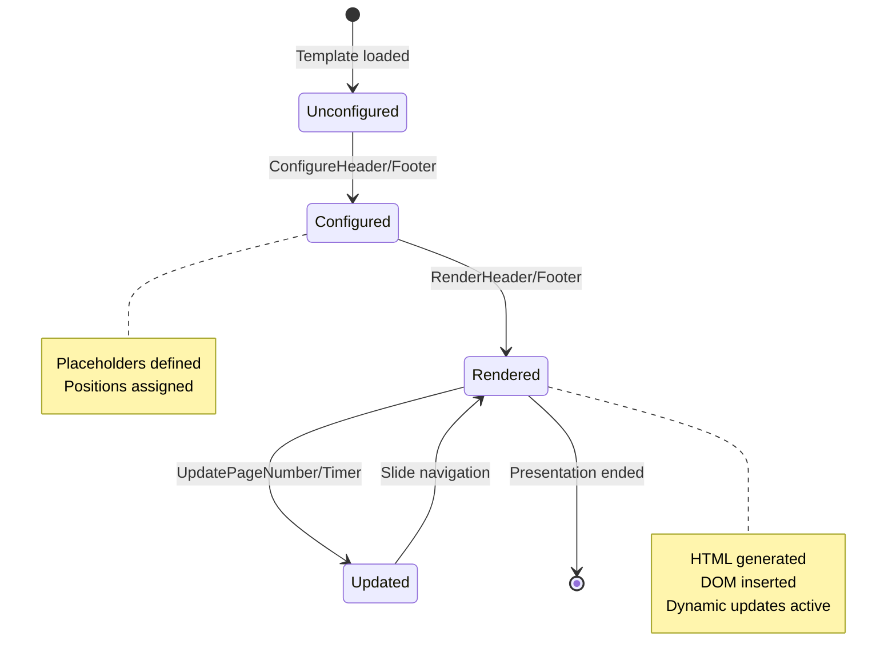

# Event Storming: Header/Footer Enhancements

**Date**: 2025-12-29
**Facilitator**: Architect
**Participants**: Product Owner, Bench Developer, Program Manager
**Bounded Context**: Slide Deck Authoring (Theme/Template)
**User Story**: As a presentation author, I want customizable headers and footers so I can display branding, timer, and page numbers consistently across slides.

---

## Domain Events (Orange Stickies)

### Template Configuration Events

1. **HeaderConfigured**
   - When: Template specifies header configuration
   - Triggers: Header element added to slide layout
   - Data: headerPosition (top-left | top-center | top-right), headerContent

2. **FooterConfigured**
   - When: Template specifies footer configuration
   - Triggers: Footer element added to slide layout
   - Data: footerPosition (bottom-left | bottom-center | bottom-right), footerContent

3. **HeaderContentResolved**
   - When: Header placeholders replaced with actual values
   - Triggers: Header HTML generated
   - Data: resolvedContent, placeholderValues

4. **FooterContentResolved**
   - When: Footer placeholders replaced with actual values
   - Triggers: Footer HTML generated
   - Data: resolvedContent, placeholderValues

### Runtime Rendering Events

5. **HeaderRendered**
   - When: Slide rendered with header element
   - Triggers: Header HTML inserted into slide DOM
   - Data: slideIndex, headerHtml

6. **FooterRendered**
   - When: Slide rendered with footer element
   - Triggers: Footer HTML inserted into slide DOM
   - Data: slideIndex, footerHtml

7. **PageNumberUpdated**
   - When: Slide navigation changes page number
   - Triggers: Footer page number re-rendered
   - Data: slideIndex, totalSlides, formattedPageNumber

8. **TimerDisplayUpdated**
   - When: Timer value changes (every second)
   - Triggers: Footer timer re-rendered
   - Data: formattedTime (hh:mm:ss)

---

## Commands (Blue Stickies)

1. **ConfigureHeader**
   - Triggered by: Template YAML parsing
   - Triggers: HeaderConfigured event
   - Validation: position valid, content not empty

2. **ConfigureFooter**
   - Triggered by: Template YAML parsing
   - Triggers: FooterConfigured event
   - Validation: position valid, content not empty

3. **ResolvePlaceholders**
   - Triggered by: Slide rendering
   - Triggers: HeaderContentResolved, FooterContentResolved events
   - Replaces: `{{pageNumber}}`, `{{totalPages}}`, `{{timer}}`, `{{title}}`

4. **RenderHeader**
   - Triggered by: Slide render cycle
   - Triggers: HeaderRendered event
   - Generates: HTML for header element

5. **RenderFooter**
   - Triggered by: Slide render cycle
   - Triggers: FooterRendered event
   - Generates: HTML for footer element

6. **UpdatePageNumber**
   - Triggered by: Slide navigation
   - Triggers: PageNumberUpdated event
   - Format: "Slide N of M" or "N / M"

7. **UpdateTimer**
   - Triggered by: Timer tick (every second)
   - Triggers: TimerDisplayUpdated event
   - Format: "hh:mm:ss"

---

## Aggregates (Yellow Stickies)

### HeaderFooterConfig (Value Object)

**Definition**: Configuration for header/footer layout and content

**Properties**:
```scala
case class HeaderFooterConfig(
  header: Option[HeaderConfig],
  footer: Option[FooterConfig]
)

case class HeaderConfig(
  position: HeaderPosition,   // TopLeft | TopCenter | TopRight
  content: String,             // May include placeholders
  cssClass: Option[String]     // Custom CSS class for styling
)

case class FooterConfig(
  position: FooterPosition,   // BottomLeft | BottomCenter | BottomRight
  content: String,             // May include placeholders
  cssClass: Option[String]     // Custom CSS class for styling
)

enum HeaderPosition:
  case TopLeft, TopCenter, TopRight

enum FooterPosition:
  case BottomLeft, BottomCenter, BottomRight
```

**Invariants**:
- Header and footer positions must be distinct (no overlap)
- Content cannot be empty string
- Placeholders must match known set: `{{pageNumber}}`, `{{totalPages}}`, `{{timer}}`, `{{title}}`

**Placeholder Resolution**:
```scala
def resolvePlaceholders(content: String, context: RenderContext): String =
  content
    .replace("{{pageNumber}}", context.currentSlideIndex + 1)
    .replace("{{totalPages}}", context.totalSlides)
    .replace("{{timer}}", """<div class="presentation-timer">00:00:00</div>""")
    .replace("{{title}}", context.presentationTitle)
```

---

### Supported Placeholders

| Placeholder | Description | Example Value | Renders |
|-------------|-------------|---------------|---------|
| `{{pageNumber}}` | Current slide number (1-indexed) | 15 | "15" |
| `{{totalPages}}` | Total slides in deck | 42 | "42" |
| `{{timer}}` | Elapsed presentation timer (dynamic) | | `<div class="presentation-timer">00:15:30</div>` |
| `{{title}}` | Presentation title | "MDSlides Tutorial" | "MDSlides Tutorial" |

**Notes**:
- `{{timer}}` placeholder: Inserts timer div, updated by JavaScript
- `{{pageNumber}}` and `{{totalPages}}`: Static per slide, updated on navigation
- `{{title}}`: From frontmatter or filename

---

## Default Configurations (Per Template)

### Title Template
```yaml
header:
  position: top-right
  content: "{{title}}"
footer:
  position: bottom-right
  content: "Slide {{pageNumber}} of {{totalPages}}"
```

### Section-Title Template
```yaml
header:
  position: top-center
  content: "{{title}}"
footer:
  position: bottom-center
  content: "{{pageNumber}} / {{totalPages}}"
```

### Content Template
```yaml
header:
  position: top-left
  content: ""  # No header by default
footer:
  position: bottom-left
  content: "{{timer}}"  # Timer bottom-left
  # Second footer position
  bottom-right:
    content: "{{pageNumber}}"  # Page number bottom-right
```

### Closing Template
```yaml
header:
  position: top-right
  content: "{{title}}"
footer:
  position: bottom-center
  content: "Thank you!"
```

---

## State Machine



---

## Hotspots & Questions (Pink Stickies)

### Hotspot 1: Multiple Footer Elements
**Question**: Should we support multiple footer elements (e.g., timer bottom-left AND page number bottom-right)?

**Options**:
1. Single footer element per slide (choose one position)
2. Multiple footer elements (up to 3 positions)
3. Flexible layout (arbitrary number of elements)

**Decision**: **Option 2 - Multiple Footer Elements (up to 3)**
- Support all 3 positions simultaneously: bottom-left, bottom-center, bottom-right
- Example: Timer (bottom-left) + Company logo (bottom-center) + Page number (bottom-right)
- Rationale: Common use case, bounded complexity

**Template Config**:
```yaml
footer:
  bottom-left:
    content: "{{timer}}"
  bottom-center:
    content: "© TJM Solutions 2025"
  bottom-right:
    content: "{{pageNumber}}"
```

---

### Hotspot 2: Header vs. Footer Defaults
**Question**: What are sensible defaults if template doesn't specify header/footer?

**Decision**: **Template-Specific Defaults**
- Each template (title, content, etc.) has its own header/footer defaults
- If template YAML omits header/footer: Use template default
- If no default: No header/footer rendered

**Rationale**: Different slide types have different needs (title slide vs. content).

---

### Hotspot 3: Custom CSS Classes
**Question**: Should users be able to style headers/footers with custom CSS?

**Decision**: **Yes - Support Optional CSS Class**
```yaml
footer:
  bottom-left:
    content: "{{timer}}"
    cssClass: "custom-timer-style"
```

**Generated HTML**:
```html
<div class="footer-bottom-left custom-timer-style">
  <div class="presentation-timer">00:00:00</div>
</div>
```

**Rationale**: Enables per-presentation customization without modifying themes.

---

### Hotspot 4: Timer Placeholder Special Case
**Question**: How is `{{timer}}` placeholder different from others?

**Decision**: **Timer is Dynamic, Others are Static**
- `{{pageNumber}}`, `{{totalPages}}`, `{{title}}`: Resolved once at slide render
- `{{timer}}`: Inserts `<div class="presentation-timer">00:00:00</div>`, updated by JavaScript every second

**Implementation**:
- Placeholder resolution: Insert timer div with initial "00:00:00"
- JavaScript (presentation-timer.js): Updates div content every second

**Rationale**: Timer is runtime-dynamic, others are render-time-static.

---

### Hotspot 5: Page Number Format
**Question**: How should page numbers be formatted?

**Options**:
1. "Slide N of M" (verbose)
2. "N / M" (compact)
3. "N" only (minimalist)
4. Configurable via template

**Decision**: **Option 4 - Configurable via Content String**
- Template controls format via content string:
  - `content: "Slide {{pageNumber}} of {{totalPages}}"` → "Slide 15 of 42"
  - `content: "{{pageNumber}} / {{totalPages}}"` → "15 / 42"
  - `content: "{{pageNumber}}"` → "15"

**Rationale**: Maximum flexibility, simple implementation (string replacement).

---

### Hotspot 6: Header/Footer Visibility Per Slide
**Question**: Should individual slides be able to hide header/footer?

**Options**:
1. Template controls header/footer (all slides same)
2. Per-slide override via frontmatter
3. No per-slide control

**Decision**: **Option 1 for v3.0.0, Option 2 for v3.1.0**
- v3.0.0: Template controls header/footer for all slides of that type
- Future: Add per-slide frontmatter override:
  ```markdown
  ---
  template: content
  hideHeader: true
  hideFooter: true
  ---
  ```

**Rationale**: Per-slide control adds complexity. Template defaults cover 90% of cases.

---

### Hotspot 7: Z-Index and Overlay
**Question**: Should headers/footers overlay slide content or push content down?

**Decision**: **Overlay (Fixed Position, No Content Push)**
- Headers/footers: `position: fixed`, `z-index: 100`
- Slide content: Full viewport height, headers/footers overlay
- Slide content margins: Account for header/footer height

**CSS**:
```css
.header { position: fixed; top: 0; z-index: 100; }
.footer { position: fixed; bottom: 0; z-index: 100; }
.slide-content { margin-top: 60px; margin-bottom: 40px; }
```

**Rationale**: Consistent layout, headers/footers always visible during navigation.

---

## Integration Points

### Upstream Dependencies
- **Template**: Header/footer configuration
- **Theme**: CSS styling for header/footer elements
- **Frontmatter**: Presentation title, custom values (future)

### Downstream Consumers
- **Slide Renderer**: Generates header/footer HTML
- **PresentationTimer**: Updates timer display in footer
- **Navigation**: Updates page numbers on slide change

---

## Acceptance Criteria (Preview)

1. **Templates define header/footer configuration**
   - Position (top/bottom, left/center/right)
   - Content with placeholders

2. **Placeholders resolved at render time**
   - `{{pageNumber}}`, `{{totalPages}}`, `{{title}}` replaced
   - `{{timer}}` inserts timer div

3. **Multiple footer elements supported**
   - Up to 3 positions: bottom-left, bottom-center, bottom-right
   - Each position independent

4. **Timer placeholder creates dynamic element**
   - Initial value "00:00:00"
   - JavaScript updates every second

5. **Page numbers update on navigation**
   - 1-indexed display ("Slide 1 of 42")

6. **Custom CSS classes supported**
   - Optional cssClass attribute per header/footer

---

## Next Steps

1. ✅ **Event Storming** - Complete (this document)
2. ⏭️ **Ubiquitous Language Workshop** - Extract terms
3. ⏭️ **Domain Modeling Workshop** - Define HeaderFooterConfig value object
4. ⏭️ **Three Amigos** - Write BDD scenarios
5. ⏭️ **Implementation** - Update template YAML schema, renderer

---

**Facilitator Notes**:
- Header/footer is authoring concern (template config) + runtime concern (rendering)
- Timer placeholder is special case (dynamic JavaScript update)
- Multiple footer elements cover common use case (timer + page number)
- Per-slide overrides deferred to v3.1.0 (YAGNI for v3.0.0)

