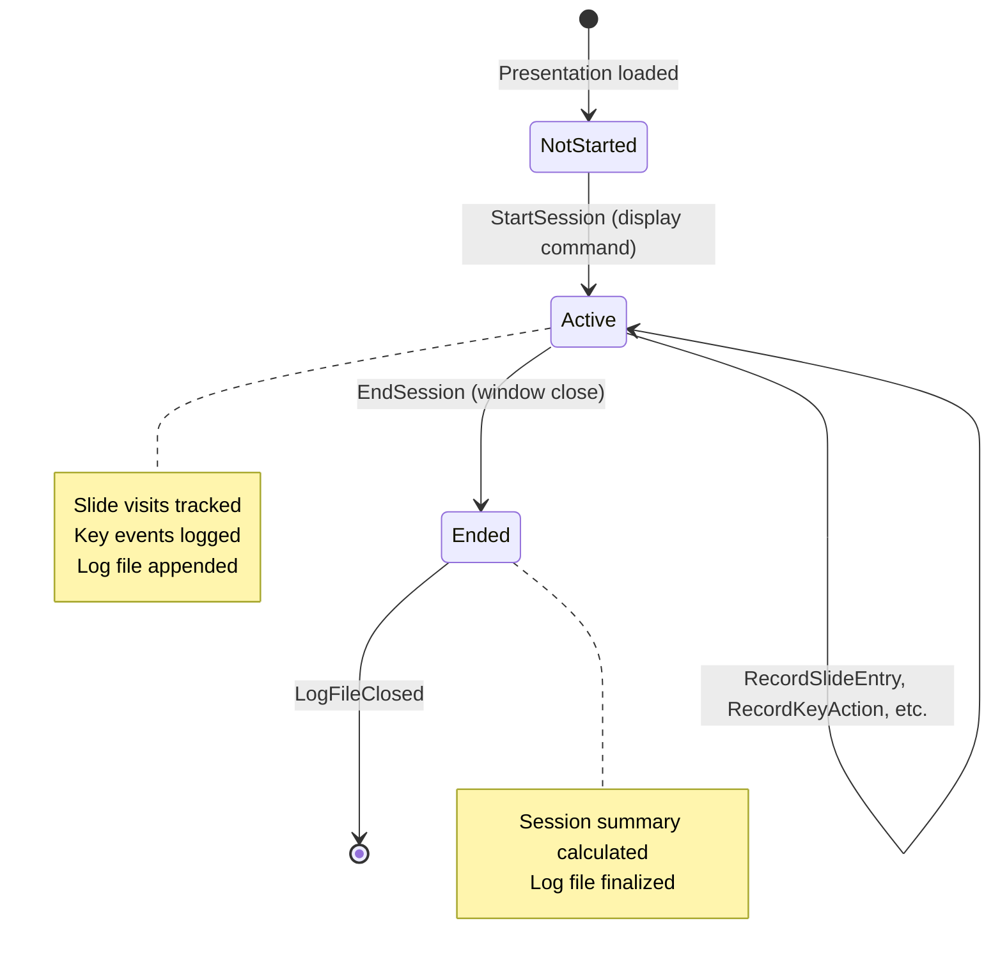

# Event Storming: History Logging

**Date**: 2025-12-29
**Facilitator**: Architect
**Participants**: Product Owner, Bench Developer, Program Manager
**Bounded Context**: Presentation Runtime
**User Story**: As a presenter, I want my presentation session automatically logged so I can analyze timing and navigation patterns afterward.

---

## Domain Events (Orange Stickies)

### Session Lifecycle Events

1. **SessionStarted**
   - When: Presentation displayed via `display` command
   - Triggers: Log file creation, session metadata written
   - Data: sessionId, presentationName, theme, totalSlides, startTimestamp

2. **SessionEnded**
   - When: Presentation window closed
   - Triggers: Session summary calculated and written
   - Data: sessionId, endTimestamp, totalDuration, slidesViewed

### Slide Navigation Events

3. **SlideEntered**
   - When: User navigates to a slide
   - Triggers: Slide entry time recorded
   - Data: slideIndex, entryTimestamp, navigationMethod (next | previous | goto | direct)

4. **SlideExited**
   - When: User navigates away from slide
   - Triggers: Slide exit time recorded, elapsed time calculated
   - Data: slideIndex, exitTimestamp, elapsedSeconds

### Keyboard Event Logging

5. **KeyActionRecorded**
   - When: User presses significant key (B, S, G, but NOT P or F)
   - Triggers: Event logged to history
   - Data: timestamp, key, action, slideIndex

### Timer Events (from Timer Aggregate)

6. **TimerPauseRecorded**
   - When: Timer paused (via break mode or goto)
   - Triggers: Pause event logged
   - Data: timestamp, pauseReason (break | goto), elapsedTimerValue

7. **TimerResumeRecorded**
   - When: Timer resumed
   - Triggers: Resume event logged
   - Data: timestamp, resumeReason (break-end | goto-complete), pauseDuration

### Log Writing Events

8. **LogFileCreated**
   - When: Session starts
   - Triggers: JSON log file initialized
   - Data: logFilePath, presentationName

9. **LogEntryAppended**
   - When: Any loggable event occurs
   - Triggers: JSON entry written to log
   - Data: entryType, entryData

10. **LogFileClosed**
    - When: Session ends
    - Triggers: Log file finalized, summary written
    - Data: logFilePath, finalSize

---

## Commands (Blue Stickies)

1. **StartSession**
   - Triggered by: `display` command execution
   - Triggers: SessionStarted, LogFileCreated events
   - Validation: Output directory exists, writable

2. **EndSession**
   - Triggered by: Window beforeunload event
   - Triggers: SessionEnded, LogFileClosed events

3. **RecordSlideEntry**
   - Triggered by: Slide navigation (any method)
   - Triggers: SlideEntered event
   - Validation: slideIndex in valid range

4. **RecordSlideExit**
   - Triggered by: Navigating away from slide
   - Triggers: SlideExited event
   - Calculation: elapsedSeconds = exitTimestamp - entryTimestamp

5. **RecordKeyAction**
   - Triggered by: Keyboard event listener
   - Triggers: KeyActionRecorded event
   - Validation: Key in whitelist (B, S, G), excludes P and F

6. **RecordTimerPause**
   - Triggered by: TimerPaused event (from Timer aggregate)
   - Triggers: TimerPauseRecorded event

7. **RecordTimerResume**
   - Triggered by: TimerResumed event (from Timer aggregate)
   - Triggers: TimerResumeRecorded event

8. **WriteLogEntry**
   - Triggered by: Any recorded event
   - Triggers: LogEntryAppended event
   - Persistence: Appends to JSON log file

9. **CalculateSessionSummary**
   - Triggered by: SessionEnded event
   - Triggers: Summary calculation and log write
   - Calculation: Total duration, slides viewed, navigation pattern

---

## Aggregates (Yellow Stickies)

### PresentationSession (Aggregate Root)

**Identity**: sessionId (UUID generated at start)

**Lifecycle**: Created when `display` command runs → Destroyed when presentation closes

**Invariants**:
- Session can only be started once (no restart)
- Slide entry must precede slide exit (cannot exit slide not entered)
- Session end timestamp must be >= start timestamp
- Slide elapsed time must be >= 0

**State**:
- `sessionId: UUID`
- `presentationName: String`
- `theme: String`
- `totalSlides: Int`
- `startTimestamp: Long`
- `currentSlideIndex: Int`
- `currentSlideEntryTimestamp: Option[Long]`
- `slideHistory: List[SlideVisit]` (chronological)
- `eventLog: List[KeyEvent]`
- `logFilePath: String`

**Commands Handled**:
- StartSession
- EndSession
- RecordSlideEntry
- RecordSlideExit
- RecordKeyAction
- RecordTimerPause
- RecordTimerResume
- WriteLogEntry
- CalculateSessionSummary

**Events Emitted**:
- SessionStarted
- SessionEnded
- SlideEntered
- SlideExited
- KeyActionRecorded
- TimerPauseRecorded
- TimerResumeRecorded
- LogFileCreated
- LogEntryAppended
- LogFileClosed

**Business Logic**:
```scala
def recordSlideEntry(slideIndex: Int, method: NavigationMethod): PresentationSession =
  // If currently on a slide, record exit first
  val withExit = currentSlideEntryTimestamp match
    case Some(entryTime) =>
      val exitTime = System.currentTimeMillis()
      val elapsed = (exitTime - entryTime) / 1000
      val visit = SlideVisit(currentSlideIndex, entryTime, exitTime, elapsed, previousMethod)
      copy(slideHistory = slideHistory :+ visit)
    case None =>
      this

  // Record new slide entry
  withExit.copy(
    currentSlideIndex = slideIndex,
    currentSlideEntryTimestamp = Some(System.currentTimeMillis()),
    previousMethod = method
  )
```

---

### SlideVisit (Entity)

**Identity**: Combination of slideIndex + entryTimestamp (unique per visit)

**Properties**:
```scala
case class SlideVisit(
  slideIndex: Int,
  entryTimestamp: Long,       // Epoch milliseconds
  exitTimestamp: Long,         // Epoch milliseconds
  elapsedSeconds: Long,        // Calculated: (exit - entry) / 1000
  navigationMethod: NavigationMethod
)
```

**Navigation Methods**:
```scala
enum NavigationMethod:
  case Start         // First slide when presentation opens
  case Next          // Right arrow, space, or next button
  case Previous      // Left arrow or P key (history-based)
  case Goto          // G key dialog
  case Direct        // URL parameter or bookmark
```

---

### KeyEvent (Entity)

**Identity**: Combination of timestamp + key (unique per keypress)

**Properties**:
```scala
case class KeyEvent(
  timestamp: Long,
  key: String,              // "B", "S", "G"
  action: String,           // "break_mode_enabled", "speaker_view_opened", etc.
  slideIndex: Int           // Slide where key was pressed
)
```

**Excluded Keys**:
- P (previous) - Too noisy, every backward navigation
- F (fullscreen) - Browser feature, not presentation behavior

---

## State Machine



---

## Temporal Flow

```mermaid
timeline
    title Presentation Session Logging
    section Initialization
        00:00:00 : display command executed
        00:00:00 : SessionStarted
        00:00:00 : LogFileCreated (output/deck-name.log)
    section Slide Navigation
        00:00:00 : SlideEntered (slide 0, method: Start)
        00:00:27 : SlideExited (slide 0, elapsed: 27s)
        00:00:27 : SlideEntered (slide 1, method: Next)
        00:01:18 : SlideExited (slide 1, elapsed: 51s)
    section Key Actions
        00:05:45 : KeyActionRecorded (B, break_mode_enabled, slide 5)
        00:07:52 : KeyActionRecorded (B, break_mode_disabled, slide 5)
        00:08:20 : KeyActionRecorded (S, speaker_view_opened, slide 6)
    section Session End
        00:45:00 : SessionEnded
        00:45:00 : SessionSummary calculated
        00:45:00 : LogFileClosed
```

---

## Hotspots & Questions (Pink Stickies)

### Hotspot 1: Log File Location
**Question**: Where should log files be stored?

**Options**:
1. Same directory as rendered HTML (`output/deck-name/deck-name.log`)
2. Separate logs directory (`output/deck-name/.logs/session-123.log`)
3. User home directory (`~/.mdslides/logs/session-123.log`)

**Decision**: **Option 1 - Same Directory as HTML**
- Log file: `output/deck-name/deck-name.log`
- Easy to find (co-located with presentation)
- One log file per output directory (overwrites previous session)
- To preserve multiple sessions: copy output directory before re-presenting

**Rationale**: Simplest for users to find. Co-location makes sense for session data.

---

### Hotspot 2: Log File Format
**Question**: What format should log files use?

**Options**:
1. JSON (structured, parseable)
2. CSV (simple, Excel-friendly)
3. Plain text (human-readable)
4. Binary (compact, requires tool)

**Decision**: **Option 1 - JSON**
- Structured format for programmatic analysis
- Human-readable with formatting
- Supports nested data (slide visits, events)
- Enables future `report` command to parse logs

**Rationale**: JSON balances human readability and machine parseability.

---

### Hotspot 3: Logging Activation
**Question**: When should logging be active?

**Options**:
1. Always (even when opening HTML directly)
2. Only when using `display` command
3. Opt-in via `--log` flag
4. Opt-out via `--no-log` flag

**Decision**: **Option 2 - Only with `display` Command**
- Automatic when using: `java -jar mdslides.jar display <deck-name>`
- No logging when: Opening `index.html` directly in browser
- No opt-in/opt-out flags (simplicity)

**Rationale**: `display` command implies "I'm presenting", so logging makes sense. Direct HTML open is often testing/preview.

---

### Hotspot 4: Slide Visit Overlap
**Question**: What if user navigates before slide exit is recorded?

**Example**: User presses right arrow twice quickly (slide 1 → 2 → 3)

**Decision**: **Auto-Exit Previous Slide on New Entry**
- When entering slide N, automatically exit slide N-1 if still active
- Use navigation timestamp as exit timestamp for previous slide
- Guarantees no overlapping visits

**Implementation**:
```scala
def recordSlideEntry(newSlideIndex: Int): PresentationSession =
  currentSlideEntryTimestamp match
    case Some(entryTime) =>
      // Auto-exit previous slide
      val exitTime = System.currentTimeMillis()
      val visit = SlideVisit(currentSlideIndex, entryTime, exitTime, ...)
      // ... then record new slide entry
```

**Rationale**: Prevents invalid state (slide entered but never exited).

---

### Hotspot 5: Log File Overwrite
**Question**: Should we preserve previous session logs?

**Options**:
1. Overwrite previous log (single log per output directory)
2. Append session to same log file (growing log)
3. Create timestamped log files (session-2025-12-29-14-23-45.log)

**Decision**: **Option 1 - Overwrite**
- Single log file per output directory: `deck-name.log`
- Each new `display` session overwrites previous
- To preserve: copy output directory before re-presenting

**Rationale**: Simplest behavior. Most users only care about latest session.

---

### Hotspot 6: Speaker View Logging
**Question**: Should speaker view window also log events?

**Options**:
1. Both windows log (duplicate events)
2. Only main window logs
3. Separate log files for main and speaker view

**Decision**: **Option 2 - Only Main Window Logs**
- Main presentation window is authoritative
- Speaker view is observer (syncs but doesn't log)
- Avoids duplicate entries for same event

**Rationale**: Main window is "source of truth" for presentation session.

---

## Integration Points

### Upstream Dependencies
- **Display Command**: Activates logging
- **PresentationTimer**: Provides timer pause/resume events
- **Navigation**: Provides slide entry/exit events
- **Keyboard Handler**: Provides key action events

### Downstream Consumers
- **Report Command** (v3.0.0): Parses log files for analysis
- **Analytics** (future): Aggregate logs for presentation insights

---

## Acceptance Criteria (Preview)

1. **Log file created when using `display` command**
   - Path: `output/deck-name/deck-name.log`
   - Format: JSON
   - No log when opening HTML directly

2. **Session metadata recorded**
   - Presentation name, theme, total slides
   - Start timestamp, end timestamp

3. **Slide visits tracked**
   - Entry/exit timestamps
   - Elapsed time per slide
   - Navigation method

4. **Key actions logged (B, S, G only)**
   - Timestamp, key, action, slide index
   - P and F keys excluded

5. **Timer events logged**
   - Pause/resume with reasons

6. **Session summary calculated at end**
   - Total duration, slides viewed

---

## Next Steps

1. ✅ **Event Storming** - Complete (this document)
2. ⏭️ **Ubiquitous Language Workshop** - Extract terms
3. ⏭️ **Domain Modeling Workshop** - Define PresentationSession aggregate
4. ⏭️ **Three Amigos** - Write BDD scenarios
5. ⏭️ **Implementation** - TDD logging functionality

---

**Facilitator Notes**:
- Logging is passive observer (doesn't affect presentation behavior)
- Main complexity is slide visit tracking (auto-exit on new entry)
- Log file format (JSON) enables future reporting/analytics
- Only active when using `display` command (not manual HTML open)

