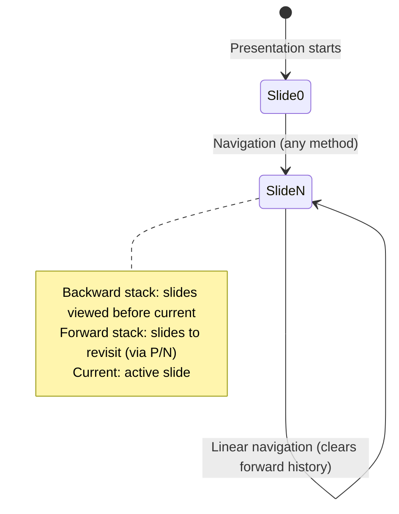

# Event Storming: Previous/Next Navigation

**Date**: 2025-12-29
**Facilitator**: Architect
**Participants**: Product Owner, Bench Developer, Program Manager
**Bounded Context**: Presentation Runtime
**User Story**: As a presenter, I want to navigate backward through my viewed slides (not linearly) so I can return to previously discussed content.

---

## Domain Events (Orange Stickies)

### Navigation Stack Events

1. **SlideAddedToHistory**
   - When: User navigates to a new slide
   - Triggers: Slide index pushed to history stack
   - Data: slideIndex, navigationMethod, timestamp

2. **NavigatedToPrevious**
   - When: User presses 'P' key
   - Triggers: Navigate to previous slide in history stack
   - Data: previousSlideIndex, currentSlideIndex, timestamp

3. **NavigatedToNext**
   - When: User presses 'N' key
   - Triggers: Navigate forward in history (if forward history exists)
   - Data: nextSlideIndex, currentSlideIndex, timestamp

4. **HistoryStackPopped**
   - When: Moving backward in history (P key)
   - Triggers: Remove top slide from backward stack, push to forward stack
   - Data: poppedSlideIndex

5. **HistoryStackCleared**
   - When: Non-linear navigation (goto, direct) after P/N usage
   - Triggers: Forward history invalidated
   - Data: clearedStackSize

---

## Commands (Blue Stickies)

1. **NavigatePrevious**
   - Triggered by: 'P' key press
   - Triggers: NavigatedToPrevious, HistoryStackPopped events
   - Validation: History stack not empty
   - Fallback: If empty, assume slide 0

2. **NavigateNext**
   - Triggered by: 'N' key press (or right arrow, space)
   - Triggers: NavigatedToNext event
   - Behavior: If forward history exists, use it; else advance linearly

3. **PushToHistory**
   - Triggered by: Any slide navigation (except P/N)
   - Triggers: SlideAddedToHistory event
   - Side effect: Clears forward history stack

4. **ClearForwardHistory**
   - Triggered by: Non-P/N navigation after using P/N
   - Triggers: HistoryStackCleared event

---

## Aggregates (Yellow Stickies)

### NavigationHistory (Aggregate Root)

**Identity**: Single instance per presentation window (singleton)

**Lifecycle**: Created when presentation starts → Destroyed when presentation closes

**Invariants**:
- Current position always valid (>= 0, < totalSlides)
- History stack never contains invalid indices
- Forward stack cleared on non-P/N navigation
- History and forward stacks together <= total slides viewed

**State**:
```scala
case class NavigationHistory(
  backwardStack: List[Int],     // Stack of previously viewed slides (LIFO)
  forwardStack: List[Int],      // Stack for forward navigation after P
  currentSlideIndex: Int,       // Currently displayed slide
  totalSlides: Int              // Total slides in deck (for validation)
)
```

**Commands Handled**:
- NavigatePrevious
- NavigateNext
- PushToHistory
- ClearForwardHistory

**Events Emitted**:
- SlideAddedToHistory
- NavigatedToPrevious
- NavigatedToNext
- HistoryStackPopped
- HistoryStackCleared

**Business Logic**:
```scala
def navigatePrevious(): Either[NavigationError, (NavigationHistory, Int)] =
  backwardStack match
    case Nil =>
      // No history, assume slide 0
      Right((this, 0))
    case head :: tail =>
      // Pop from backward stack, push current to forward stack
      val newHistory = copy(
        backwardStack = tail,
        forwardStack = currentSlideIndex :: forwardStack,
        currentSlideIndex = head
      )
      Right((newHistory, head))

def navigateNext(): Either[NavigationError, (NavigationHistory, Int)] =
  forwardStack match
    case Nil =>
      // No forward history, advance linearly
      val nextIndex = Math.min(currentSlideIndex + 1, totalSlides - 1)
      val newHistory = copy(
        backwardStack = currentSlideIndex :: backwardStack,
        currentSlideIndex = nextIndex
      )
      Right((newHistory, nextIndex))
    case head :: tail =>
      // Pop from forward stack, push current to backward stack
      val newHistory = copy(
        backwardStack = currentSlideIndex :: backwardStack,
        forwardStack = tail,
        currentSlideIndex = head
      )
      Right((newHistory, head))

def pushToHistory(slideIndex: Int): NavigationHistory =
  // Clear forward history on non-P/N navigation
  copy(
    backwardStack = currentSlideIndex :: backwardStack,
    forwardStack = Nil,  // Forward history invalidated
    currentSlideIndex = slideIndex
  )
```

---

## State Machine



---

## Temporal Flow

```mermaid
timeline
    title Navigation History Example
    section Linear Navigation
        00:00:00 : Slide 0 (start)
        00:00:30 : Slide 1 (next)
        00:01:00 : Slide 2 (next)
        00:01:30 : Slide 3 (next)
    section Backward Navigation (P key)
        00:02:00 : Slide 2 (P pressed, backward: [1,0], forward: [3])
        00:02:15 : Slide 1 (P pressed, backward: [0], forward: [2,3])
        00:02:30 : Slide 0 (P pressed, backward: [], forward: [1,2,3])
    section Forward Navigation (N key)
        00:03:00 : Slide 1 (N pressed, backward: [0], forward: [2,3])
        00:03:15 : Slide 2 (N pressed, backward: [1,0], forward: [3])
    section Non-Linear Jump (Goto)
        00:03:30 : Slide 10 (G key, goto, forward history cleared)
        00:04:00 : Slide 11 (next, backward: [10,2,1,0], forward: [])
```

---

## Hotspots & Questions (Pink Stickies)

### Hotspot 1: History Stack Size
**Question**: Should we limit the size of the history stack?

**Options**:
1. Unlimited history (entire session)
2. Limited history (e.g., last 50 slides)
3. Configurable limit

**Decision**: **Option 1 - Unlimited**
- Store entire navigation history
- Modern browsers can handle thousands of entries
- Useful for long presentations with complex navigation

**Rationale**: Memory is cheap. Complex presentations benefit from full history.

---

### Hotspot 2: P Key on Empty History
**Question**: What happens when user presses P on first slide (no history)?

**Options**:
1. No-op (stay on current slide)
2. Go to slide 0 (convention)
3. Show error message

**Decision**: **Option 2 - Go to Slide 0**
- If history empty, assume slide 0
- Provides consistent "go back to start" behavior
- No error needed (graceful fallback)

**Rationale**: "Previous" without history means "beginning of presentation".

---

### Hotspot 3: N Key Behavior
**Question**: Should N key be "redo" or "next slide"?

**Options**:
1. N is always "next slide" (linear)
2. N is "redo" if forward history exists, else "next slide"
3. N is only "redo" (right arrow is "next")

**Decision**: **Option 2 - Hybrid Behavior**
- If forward history exists: Navigate forward in history (redo)
- If no forward history: Advance linearly (next slide)
- Provides intuitive "undo/redo" when using P/N together

**Rationale**: Matches user mental model of P/N as bidirectional navigation.

---

### Hotspot 4: Forward History Invalidation
**Question**: When should forward history be cleared?

**Example**: User navigates 1 → 2 → 3, presses P to go to 2, then uses goto to jump to slide 10. Should forward history (3) be preserved?

**Decision**: **Clear Forward History on Non-P/N Navigation**
- Forward history cleared when:
  - Goto (G key)
  - Right arrow / Space (linear next)
  - Direct URL navigation
- Forward history preserved when:
  - P key (previous)
  - N key (next)

**Rationale**: Non-P/N navigation represents "new decision path", invalidating redo.

---

### Hotspot 5: Integration with Timer
**Question**: Should P/N navigation affect the timer?

**Decision**: **No - Timer Continues Running**
- P and N keys do NOT pause timer
- Only B key (break mode) and G key (goto popup) pause timer
- Rationale: P/N are quick navigation, not interruptions

**Contrast with Goto**:
- Goto pauses timer (user enters dialog, selects slide)
- P/N are instant (no dialog, immediate navigation)

---

### Hotspot 6: Duplicate Slides in History
**Question**: If user visits slide 5 multiple times, is each visit in history?

**Decision**: **Yes - Track Every Visit**
- Backward stack: `[5, 3, 5, 2, 1]` if user visited 1 → 2 → 5 → 3 → 5
- Pressing P repeatedly: 5 → 3 → 5 → 2 → 1
- Rationale: Preserves actual navigation flow

**Rationale**: History reflects temporal sequence, not unique slides.

---

## Integration Points

### Upstream Dependencies
- **Slide Deck**: totalSlides count for validation
- **Keyboard Handler**: P and N key events

### Downstream Consumers
- **Slide Renderer**: Displays slide at new index
- **History Logging**: Records navigation events
- **Speaker View Sync**: Syncs navigation via BroadcastChannel

---

## Acceptance Criteria (Preview)

1. **P key navigates to previous viewed slide**
   - Uses history stack (not linear)
   - If no history, go to slide 0

2. **N key navigates forward**
   - If forward history exists: redo
   - If no forward history: advance linearly

3. **Forward history cleared on non-P/N navigation**
   - Goto, linear next clear forward stack
   - P/N preserve forward stack

4. **P and N do not pause timer**
   - Timer continues running during P/N navigation

5. **Navigation syncs to speaker view**
   - Both windows show same slide after P/N

---

## Next Steps

1. ✅ **Event Storming** - Complete (this document)
2. ⏭️ **Ubiquitous Language Workshop** - Extract terms
3. ⏭️ **Domain Modeling Workshop** - Define NavigationHistory aggregate
4. ⏭️ **Three Amigos** - Write BDD scenarios
5. ⏭️ **Implementation** - TDD navigation functionality

---

**Facilitator Notes**:
- Navigation history is separate from session logging (different concerns)
- P/N provide non-linear navigation (history-based, not slide order)
- Forward history invalidation is key design decision
- Integration with timer is minimal (P/N don't pause, unlike G)

