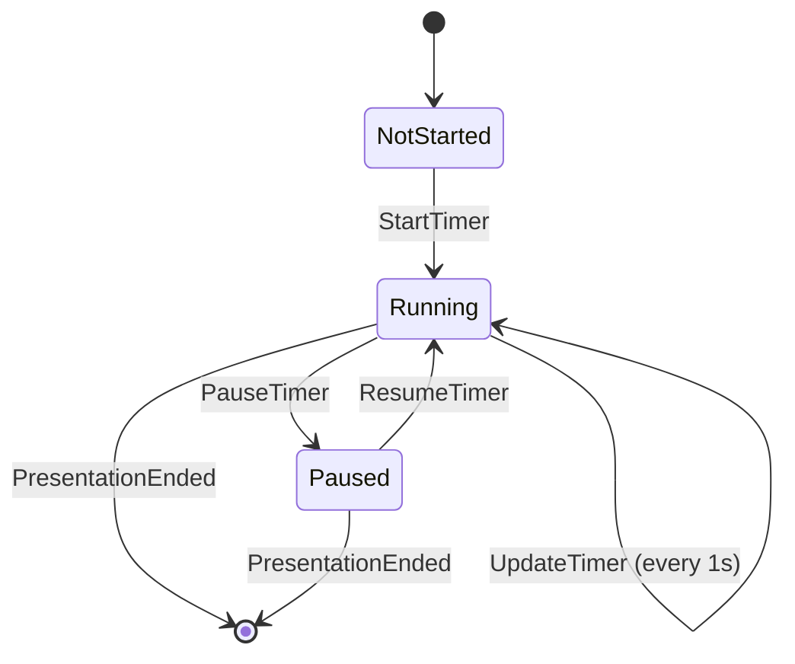

# Event Storming: Presentation Timer

**Date**: 2025-12-29
**Facilitator**: Architect
**Participants**: Product Owner, Bench Developer, Program Manager
**Bounded Context**: Presentation Runtime
**User Story**: As a presenter, I want to see elapsed presentation time so I can manage my presentation duration.

---

## Domain Events (Orange Stickies)

Events are things that **have happened** in the domain (past tense).

### Timer Lifecycle Events

1. **PresentationStarted**
   - When: User opens presentation (index.html loads)
   - Triggers: Timer initialization
   - Data: startTimestamp, presentationName

2. **TimerStarted**
   - When: Presentation becomes visible or first navigation
   - Triggers: Timer begins counting
   - Data: startTimestamp

3. **TimerPaused**
   - When: Break mode activated (B key pressed)
   - Triggers: Timer stops counting
   - Data: pauseTimestamp, elapsedSeconds

4. **TimerResumed**
   - When: Break mode deactivated (B key pressed again)
   - Triggers: Timer continues counting
   - Data: resumeTimestamp, totalPausedSeconds

5. **TimerUpdated**
   - When: Every second while running
   - Triggers: Display update in footer
   - Data: currentTimestamp, elapsedSeconds, formattedTime (hh:mm:ss)

6. **PresentationEnded**
   - When: User closes presentation window
   - Triggers: Final timer value recorded
   - Data: endTimestamp, totalElapsedSeconds

### Synchronization Events

7. **TimerStateSynced**
   - When: Timer state changes and needs sync to speaker view
   - Triggers: BroadcastChannel message sent
   - Data: timerState (running/paused), elapsedSeconds

8. **SpeakerViewOpened**
   - When: User presses 'S' key
   - Triggers: Speaker view window opens, timer sync initiated
   - Data: currentSlideIndex, timerState

---

## Commands (Blue Stickies)

Commands are **intentions** that trigger events (imperative).

1. **StartTimer**
   - Triggered by: Presentation initialization
   - Triggers: TimerStarted event
   - Validation: Timer not already running

2. **PauseTimer**
   - Triggered by: Break mode activation (B key)
   - Triggers: TimerPaused event
   - Validation: Timer is currently running

3. **ResumeTimer**
   - Triggered by: Break mode deactivation (B key)
   - Triggers: TimerResumed event
   - Validation: Timer is currently paused

4. **UpdateTimer**
   - Triggered by: setInterval (every 1000ms)
   - Triggers: TimerUpdated event
   - Validation: Timer is running (not paused)

5. **SyncTimerState**
   - Triggered by: Any timer state change
   - Triggers: TimerStateSynced event
   - Validation: BroadcastChannel available

---

## Aggregates (Yellow Stickies)

Aggregates are **entities** that handle commands and emit events.

### PresentationTimer (Aggregate Root)

**Identity**: Single instance per presentation window

**Invariants**:
- Timer can only be in one state: NotStarted, Running, or Paused
- Elapsed time is always monotonically increasing
- Timer cannot be paused if not running
- Timer cannot be resumed if not paused

**State**:
- `state: TimerState` (NotStarted | Running | Paused)
- `startTimestamp: Long` (milliseconds since epoch)
- `totalPausedDuration: Long` (milliseconds)
- `lastPauseTimestamp: Option[Long]`
- `elapsedSeconds: Long` (computed)

**Commands Handled**:
- StartTimer
- PauseTimer
- ResumeTimer
- UpdateTimer
- SyncTimerState

**Events Emitted**:
- TimerStarted
- TimerPaused
- TimerResumed
- TimerUpdated
- TimerStateSynced

**Business Logic**:
```scala
def calculateElapsedSeconds(): Long =
  if startTimestamp == 0 then 0
  else
    val now = System.currentTimeMillis()
    val totalRuntime = now - startTimestamp
    val effectiveRuntime = totalRuntime - totalPausedDuration
    effectiveRuntime / 1000
```

---

## State Machine



---

## Temporal Flow

```mermaid
timeline
    title Presentation Timer Lifecycle
    section Initialization
        00:00:00 : PresentationStarted
        00:00:00 : TimerStarted
    section Active Presentation
        00:05:23 : TimerUpdated (every 1s)
        00:10:45 : SpeakerViewOpened
        00:15:30 : TimerPaused (Break mode)
    section Break
        00:15:30 : Timer paused
        00:20:15 : TimerResumed (Break mode off)
    section Continuation
        00:45:22 : TimerUpdated (continuing)
        00:50:00 : PresentationEnded
```

---

## Hotspots & Questions (Pink Stickies)

### Hotspot 1: Cross-Window Synchronization
**Question**: How do we ensure timer stays synchronized between main presentation and speaker view?

**Options**:
1. BroadcastChannel API (requires same origin)
2. LocalStorage polling (less efficient)
3. WebSocket (overkill for local sync)

**Decision**: Use BroadcastChannel API (already used for slide sync)

---

### Hotspot 2: Timer Persistence
**Question**: Should timer state persist if user refreshes the page?

**Options**:
1. No persistence (timer resets on refresh)
2. LocalStorage persistence (timer survives refresh)
3. Session-based (timer tied to session ID)

**Decision**: No persistence initially (v3.0.0). Consider LocalStorage in v3.1.0 if requested.

**Rationale**: Refreshing during presentation is rare. Simpler implementation without persistence.

---

### Hotspot 3: Timer Reset
**Question**: Should there be a way to reset the timer to 00:00:00?

**Design Decision** (from v3.0.0-DESIGN-SPECIFICATIONS.md): **No reset capability**

**Rationale**: Timer represents actual presentation session duration. Resetting would lose accuracy for session logging.

---

### Hotspot 4: Multiple Browser Windows
**Question**: What happens if user opens presentation in multiple browser windows?

**Current Behavior**: Each window has independent timer (BroadcastChannel scoped to window)

**Acceptable**: Yes - unusual use case, not worth added complexity

---

## Integration Points

### Upstream Dependencies
- **Presentation HTML**: Timer display element in footer
- **Navigation JavaScript**: Slide change events (for history logging later)
- **Speaker View**: Timer display synchronization

### Downstream Consumers
- **Break Mode**: Pauses/resumes timer
- **History Logging**: Records timer values per slide
- **Footer Renderer**: Displays formatted time

---

## Acceptance Criteria (Preview)

Based on event storming, preliminary acceptance criteria:

1. **Timer starts at 00:00:00** when presentation loads
2. **Timer increments every second** while running
3. **Timer displays in hh:mm:ss format** in footer (bottom-left)
4. **Timer pauses** when Break mode activated (B key)
5. **Timer resumes** when Break mode deactivated (B key again)
6. **Timer syncs** between main presentation and speaker view
7. **Timer does NOT reset** (runs continuously for session)

---

## Next Steps

1. ✅ **Event Storming** - Complete (this document)
2. ⏭️ **Ubiquitous Language Workshop** - Extract terms from events
3. ⏭️ **Domain Modeling Workshop** - Define PresentationTimer aggregate
4. ⏭️ **Three Amigos** - Write BDD scenarios for timer
5. ⏭️ **Implementation** - TDD timer functionality

---

**Facilitator Notes**:
- Timer domain is relatively simple (single aggregate, clear state machine)
- Main complexity is cross-window synchronization (BroadcastChannel)
- Footer rendering requires coordination with Footer Enhancement feature
- Break mode integration point identified (will be separate event storming)
