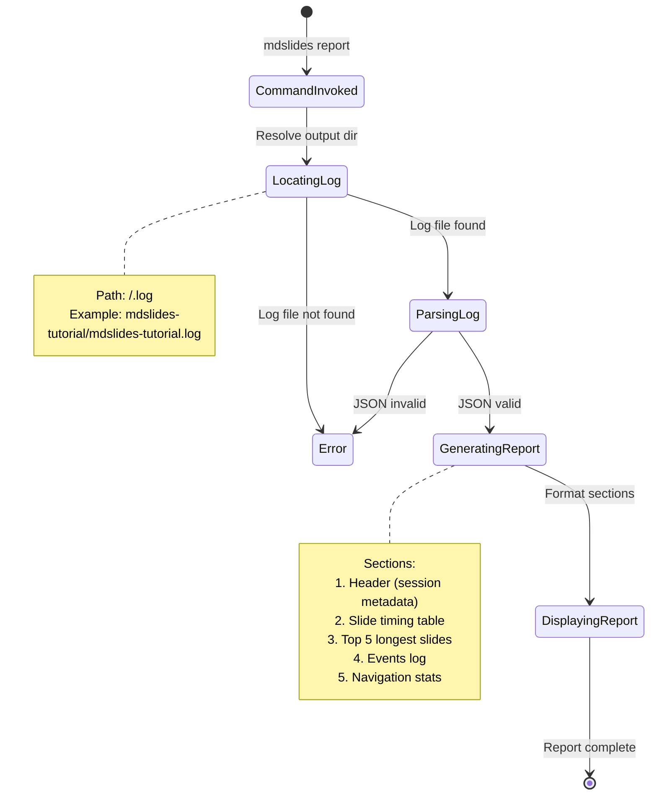

# Event Storming: Report Command

**Date**: 2025-12-29
**Facilitator**: Architect
**Participants**: Product Owner, Bench Developer, Program Manager
**Bounded Context**: Presentation Analytics & Reporting
**User Story**: As a presentation author, I want to review my presentation session metrics so I can analyze timing, navigation patterns, and identify areas for improvement.

---

## Domain Events (Orange Stickies)

### Log File Discovery Events

1. **ReportCommandInvoked**
   - When: User runs `mdslides report <deck-name>`
   - Triggers: Log file lookup initiated
   - Data: deckName, timestamp

2. **LogFileLocated**
   - When: Log file found at `<output-dir>/<deck-name>.log`
   - Triggers: Log parsing initiated
   - Data: logFilePath, fileSize, lastModified

3. **LogFileNotFound**
   - When: Log file does not exist at expected location
   - Triggers: Error message displayed, command exits
   - Data: expectedPath, deckName

### Log Parsing Events

4. **LogFileParsed**
   - When: JSON log file successfully parsed
   - Triggers: Report generation initiated
   - Data: sessionMetadata, slideTiming, events, summary

5. **LogParsingFailed**
   - When: Log file corrupted or invalid JSON
   - Triggers: Error message displayed, command exits
   - Data: filePath, parseError, lineNumber

### Report Display Events

6. **ReportHeaderRendered**
   - When: Report title and session info formatted
   - Triggers: Console output started
   - Data: presentationName, startTime, duration, theme

7. **SlideTimingSummaryRendered**
   - When: Per-slide timing table formatted
   - Triggers: ASCII table output
   - Data: slideTimings (List of slide number, title, duration)

8. **TopSlidesListRendered**
   - When: Top 5 longest slides identified and formatted
   - Triggers: Ranked list output
   - Data: longestSlides (List of slide, duration)

9. **EventsLogRendered**
   - When: Key press events formatted chronologically
   - Triggers: Event timeline output
   - Data: events (List of timestamp, key, action)

10. **NavigationStatsRendered**
    - When: Navigation pattern statistics formatted
    - Triggers: Stats summary output
    - Data: forwardCount, backwardCount, gotoCount, revisitCount

11. **ReportFooterRendered**
    - When: Report footer separator displayed
    - Triggers: Command completion
    - Data: timestamp

---

## Commands (Blue Stickies)

1. **InvokeReportCommand**
   - Triggered by: User CLI invocation
   - Triggers: ReportCommandInvoked event
   - Validation: deckName provided

2. **LocateLogFile**
   - Triggered by: ReportCommandInvoked event
   - Triggers: LogFileLocated or LogFileNotFound event
   - Resolution: `<output-dir>/<deck-name>.log`

3. **ParseLogFile**
   - Triggered by: LogFileLocated event
   - Triggers: LogFileParsed or LogParsingFailed event
   - Validation: Valid JSON format, required fields present

4. **GenerateReport**
   - Triggered by: LogFileParsed event
   - Triggers: ReportHeaderRendered, SlideTimingSummaryRendered, etc.
   - Generates: Formatted console output

5. **FormatSlideTimingTable**
   - Triggered by: Report generation
   - Triggers: SlideTimingSummaryRendered event
   - Format: ASCII table with columns: No., Title, Duration

6. **CalculateTopSlides**
   - Triggered by: Report generation
   - Triggers: TopSlidesListRendered event
   - Logic: Sort slides by duration descending, take top 5

7. **FormatEventsTimeline**
   - Triggered by: Report generation
   - Triggers: EventsLogRendered event
   - Format: Chronological list with timestamp, key, action

8. **CalculateNavigationStats**
   - Triggered by: Report generation
   - Triggers: NavigationStatsRendered event
   - Logic: Count navigation methods, calculate revisits

---

## Aggregates (Yellow Stickies)

### PresentationReport (Aggregate Root)

**Definition**: Formatted representation of a presentation session's metrics, timing, and navigation patterns

**Properties**:
```scala
case class PresentationReport(
  session: SessionMetadata,
  slideTiming: List[SlideVisit],
  events: List[PresentationEvent],
  navigationStats: NavigationStats
)

case class SessionMetadata(
  presentationName: String,
  startTime: Instant,
  endTime: Option[Instant],
  duration: Duration,
  theme: String,
  totalSlides: Int,
  uniqueSlidesViewed: Int
)

case class SlideVisit(
  slideIndex: Int,
  slideTitle: String,
  entryTime: Instant,
  exitTime: Option[Instant],
  duration: Duration,
  navigationMethod: NavigationMethod
)

enum NavigationMethod:
  case Start           // First slide on session start
  case Next            // Linear forward (arrow, space, click)
  case Previous        // History-based backward (P key)
  case Goto            // Jump via Goto popup (G key)
  case Direct          // Direct URL navigation or refresh

case class PresentationEvent(
  timestamp: Instant,
  eventType: EventType,
  key: Option[String],      // B, S, G, etc.
  action: String            // "break_mode_enabled", "speaker_view_opened", etc.
)

enum EventType:
  case KeyPress
  case Navigation
  case StateChange

case class NavigationStats(
  forwardNavigations: Int,    // Next key or linear advance
  backwardNavigations: Int,   // P key (previous)
  gotoNavigations: Int,       // G key (goto)
  slidesRevisited: Int,       // Distinct slides viewed > 1 time
  totalSlideViews: Int        // Sum of all slide visits
)
```

**Invariants**:
1. **Session Completeness**: startTime always present, endTime optional (session may be ongoing)
2. **Duration Consistency**: duration = endTime - startTime (if endTime present)
3. **Slide Count**: uniqueSlidesViewed ≤ totalSlides
4. **View Count**: totalSlideViews ≥ uniqueSlidesViewed
5. **Timing Sequence**: Each slide's entryTime < exitTime (if exitTime present)
6. **Non-Negative Durations**: All durations ≥ 0

**Report Formatting**:
```scala
def formatReport(report: PresentationReport): String =
  val sections = List(
    formatHeader(report.session),
    formatSlideTimingTable(report.slideTiming),
    formatTopSlides(report.slideTiming.sortBy(-_.duration.toSeconds).take(5)),
    formatEventsLog(report.events),
    formatNavigationStats(report.navigationStats),
    formatFooter()
  )
  sections.mkString("\n\n")
```

---

### Report Sections

#### 1. Header Section
```
═══════════════════════════════════════════════════════════════
  Presentation Report: mdslides-tutorial
═══════════════════════════════════════════════════════════════

Session Information:
  Started:        2025-12-29 14:23:45
  Duration:       00:45:32
  Theme:          dark
  Total Slides:   42
  Slides Viewed:  38/42 (90%)
```

#### 2. Slide Timing Table
```
Slide Timing Summary:
  ┌─────┬──────────────────────────────────────┬──────────┐
  │ No. │ Title                                │ Duration │
  ├─────┼──────────────────────────────────────┼──────────┤
  │  1  │ MDSlides v2.0.0                      │ 00:00:27 │
  │  2  │ About This Tutorial                  │ 00:00:51 │
  │  3  │ Configuration Precedence             │ 00:01:15 │
  │  4  │ Project Configuration                │ 00:00:45 │
  │  5  │ Global Configuration                 │ 00:01:02 │
  │ ... │ ...                                  │ ...      │
  │ 42  │ Thank You!                           │ 00:00:18 │
  └─────┴──────────────────────────────────────┴──────────┘
```

#### 3. Top 5 Longest Slides
```
Top 5 Longest Slides:
  1. Mermaid Diagrams (Slide 12)           03:25
  2. Two-Column Layout (Slide 18)          02:47
  3. Accessibility Features (Slide 28)     02:15
  4. Configuration System (Slide 3)        01:15
  5. Code Highlighting (Slide 23)          01:02
```

#### 4. Events Log
```
Events Log:
  14:26:15  [B] Break mode enabled
  14:28:22  [B] Break mode disabled
  14:29:10  [S] Speaker view opened
  14:35:42  [G] Goto slide 25
  14:40:18  [B] Break mode enabled
  14:42:05  [B] Break mode disabled
```

#### 5. Navigation Statistics
```
Navigation Statistics:
  Forward navigations:      35
  Backward navigations:     8
  Goto jumps:              3
  Slides revisited:        7
```

---

## State Machine



---

## Hotspots & Questions (Pink Stickies)

### Hotspot 1: Log File Not Found Handling
**Question**: What should happen if log file doesn't exist?

**Options**:
1. Error message only
2. Suggest running `display` command to create log
3. Offer to display presentation now (creates log for next time)

**Decision**: **Option 2 - Error with Suggestion**
```
✗ No log file found for presentation: mdslides-tutorial

  Expected location: mdslides-tutorial/mdslides-tutorial.log

  To create a log file, present the deck using:
    java -jar ../mdslides.jar display mdslides-tutorial

  Note: Opening index.html directly in browser does NOT create logs.
```

**Rationale**: Educate users on how to generate logs, clear actionable message.

---

### Hotspot 2: Report Output Format
**Question**: Should report use ASCII tables or styled console output?

**Options**:
1. Plain text (simple, portable)
2. ASCII box-drawing characters (Unicode tables)
3. ANSI color codes (colored output)
4. Both plain and colored (flag-based)

**Decision**: **Option 2 - ASCII Box-Drawing for v3.0.0**
- Unicode box-drawing characters (┌─┬─┐ │ ├─┼─┤ └─┴─┘)
- No color codes (ANSI compatibility issues)
- Professional appearance, widely supported
- Future: Add `--color` flag in v3.1.0 for ANSI color output

**Box-Drawing Characters**:
```
┌ ─ ┬ ─ ┐
│   │   │
├ ─ ┼ ─ ┤
│   │   │
└ ─ ┴ ─ ┘
```

**Rationale**: Balance aesthetics with portability, color is nice-to-have.

---

### Hotspot 3: Slide Title Truncation
**Question**: What if slide titles exceed column width?

**Options**:
1. Truncate with ellipsis: "This is a very long slide ti..."
2. Wrap to multiple lines
3. Auto-adjust column width (dynamic)

**Decision**: **Option 1 - Truncate with Ellipsis at 38 Characters**
```
│ 12  │ This is a very long slide title t... │ 00:03:25 │
```

- Fixed column width: 40 characters (including padding)
- Truncate at 38 chars + "..." if longer
- Preserves table alignment
- Full title available in JSON log file

**Rationale**: Fixed-width tables are easier to read, full data available in JSON.

---

### Hotspot 4: Duration Format
**Question**: How should durations be formatted?

**Options**:
1. Seconds only: "185s"
2. Minutes and seconds: "3m 5s"
3. hh:mm:ss: "00:03:05"
4. Variable format: "3:05" (mm:ss) or "1:23:45" (h:mm:ss)

**Decision**: **Option 3 - Consistent hh:mm:ss Format**
- Same format as presentation timer
- Consistent across all durations (slide timing, top slides, session duration)
- Easy to compare visually
- Always includes hours (even if 00)

**Examples**:
- 27 seconds → "00:00:27"
- 3 minutes 5 seconds → "00:03:05"
- 1 hour 23 minutes 45 seconds → "01:23:45"

**Rationale**: Consistency with timer, unambiguous format.

---

### Hotspot 5: Empty Sections Handling
**Question**: What if a section has no data (e.g., no events logged)?

**Options**:
1. Omit section entirely
2. Display section header with "None" message
3. Display empty table

**Decision**: **Option 2 - Display Header with "None" Message**
```
Events Log:
  No events recorded during this session.
```

**Rationale**: Shows report completeness, user knows section exists but is empty.

---

### Hotspot 6: Top Slides Count
**Question**: Should "Top N Longest Slides" be configurable?

**Options**:
1. Fixed at 5 slides
2. Configurable via CLI flag: `--top-slides 10`
3. Dynamic: Show all slides over 1 minute threshold

**Decision**: **Option 1 - Fixed at Top 5 for v3.0.0**
- Most presentations: 5 outliers sufficient
- Avoids decision fatigue
- Future: Add `--top-slides N` flag in v3.1.0 if requested

**Rationale**: YAGNI, top 5 covers common case.

---

### Hotspot 7: Navigation Stats Calculation
**Question**: How do we count "slides revisited"?

**Definition Clarification**:
- **Slides Revisited**: Distinct slides viewed more than once
- Example: View slides 1, 2, 3, 2, 4, 3, 5
  - Total slide views: 7
  - Unique slides viewed: 5 (slides 1, 2, 3, 4, 5)
  - Slides revisited: 2 (slides 2 and 3 viewed twice)

**Implementation**:
```scala
def calculateRevisitedSlides(visits: List[SlideVisit]): Int =
  visits.groupBy(_.slideIndex)
        .filter { case (_, visits) => visits.length > 1 }
        .size
```

**Rationale**: Clear definition prevents ambiguity.

---

### Hotspot 8: Ongoing Session Handling
**Question**: What if presentation is still in progress (no endTime)?

**Options**:
1. Error: "Cannot generate report for active session"
2. Warning + partial report (show data up to current time)
3. Display report with "Session In Progress" indicator

**Decision**: **Option 3 - Display Partial Report with Indicator**
```
Session Information:
  Started:        2025-12-29 14:23:45
  Duration:       00:45:32 (IN PROGRESS)
  Theme:          dark
  Total Slides:   42
  Slides Viewed:  38/42 (90%)
```

- Shows data collected so far
- Last slide may have entryTime but no exitTime (ongoing)
- Duration: currentTime - startTime
- Indicator: "(IN PROGRESS)" suffix

**Rationale**: Useful for real-time monitoring (second screen scenario).

---

## Integration Points

### Upstream Dependencies
- **History Logging**: Log file created by `display` command
- **Log File Format**: JSON structure with session, slides, events, summary
- **File System**: Read log file from `<output-dir>/<deck-name>.log`

### Downstream Consumers
- **Console Output**: Formatted report displayed to stdout
- **Error Handling**: Error messages to stderr
- **Exit Codes**: 0 (success), 1 (log not found), 2 (parse error)

---

## Example Scenarios

### Scenario 1: Successful Report Generation
```bash
$ java -jar ../mdslides.jar report mdslides-tutorial

═══════════════════════════════════════════════════════════════
  Presentation Report: mdslides-tutorial
═══════════════════════════════════════════════════════════════

Session Information:
  Started:        2025-12-29 14:23:45
  Duration:       00:45:32
  Theme:          dark
  Total Slides:   42
  Slides Viewed:  38/42 (90%)

[... full report output ...]

═══════════════════════════════════════════════════════════════
```

---

### Scenario 2: Log File Not Found
```bash
$ java -jar ../mdslides.jar report my-talk

✗ No log file found for presentation: my-talk

  Expected location: my-talk/my-talk.log

  To create a log file, present the deck using:
    java -jar ../mdslides.jar display my-talk

  Note: Opening index.html directly in browser does NOT create logs.
```

---

### Scenario 3: Corrupted Log File
```bash
$ java -jar ../mdslides.jar report mdslides-tutorial

✗ Failed to parse log file: mdslides-tutorial/mdslides-tutorial.log

  Parse error at line 23: Unexpected end of JSON input

  The log file may be corrupted. To regenerate:
  1. Delete or rename the corrupted log file
  2. Present the deck again using: java -jar ../mdslides.jar display mdslides-tutorial
```

---

### Scenario 4: Session In Progress
```bash
$ java -jar ../mdslides.jar report mdslides-tutorial

═══════════════════════════════════════════════════════════════
  Presentation Report: mdslides-tutorial
═══════════════════════════════════════════════════════════════

Session Information:
  Started:        2025-12-29 14:23:45
  Duration:       00:18:47 (IN PROGRESS)
  Theme:          dark
  Total Slides:   42
  Slides Viewed:  15/42 (36%)

[... partial report output ...]

Note: Session is currently in progress. Report shows data up to now.
```

---

## Acceptance Criteria (Preview)

1. **Command invocation**
   - Syntax: `java -jar ../mdslides.jar report <deck-name>`
   - Resolves deck name to output directory

2. **Log file location**
   - Path: `<output-dir>/<deck-name>.log`
   - Error if file not found with actionable message

3. **JSON parsing**
   - Validate JSON structure
   - Error if corrupted with line number

4. **Report sections rendered**
   - Header: Session metadata (name, start time, duration, theme, slides viewed)
   - Slide timing table: All slides with number, title, duration
   - Top 5 longest slides: Ranked by duration descending
   - Events log: Chronological list of key presses and actions
   - Navigation statistics: Forward, backward, goto counts, revisited slides

5. **Duration formatting**
   - Consistent hh:mm:ss format
   - Example: "00:03:25" for 3 minutes 25 seconds

6. **Title truncation**
   - Max 38 characters + "..." ellipsis if longer
   - Preserves table alignment

7. **Empty sections handling**
   - Display section header with "None" or "No events recorded" message

8. **Ongoing session support**
   - Partial report with "(IN PROGRESS)" indicator
   - Duration: currentTime - startTime

9. **Exit codes**
   - 0: Success
   - 1: Log file not found
   - 2: Parse error

---

## Next Steps

1. ✅ **Event Storming** - Complete (this document)
2. ⏭️ **Ubiquitous Language Workshop** - Add PresentationReport, SessionMetadata terms
3. ⏭️ **Domain Modeling Workshop** - Define PresentationReport aggregate
4. ⏭️ **Three Amigos** - Write BDD scenarios for report generation, error handling
5. ⏭️ **Implementation** - Report command, log parser, console formatter

---

**Facilitator Notes**:
- Report command is read-only (no side effects)
- Depends on History Logging feature (log file must exist)
- Console formatting uses Unicode box-drawing characters (widely supported)
- Partial reports supported for ongoing sessions (useful for real-time monitoring)
- Error messages are actionable (tell user how to fix the problem)
