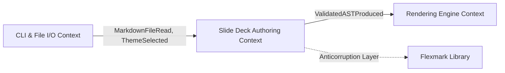

# Event Storming Session: Slide Deck Authoring
## Domain Events Discovery & Temporal Ordering

---

```yaml
# MACHINE-READABLE METADATA
session:
  id: ES-SLIDEDECKAUTHORING-2024-12-19
  context_name: SlideDeckAuthoring
  session_date: 2024-12-19
  facilitator: Tony Moores (TJM Solutions)
  participants:
    - Tony Moores
  duration_hours: 1-2
  status: draft
```

---

## 📋 Session Overview

**Context**: Slide Deck Authoring - the core domain for creating and validating slide decks from Markdown DSL.

**Goal**: Map the complete lifecycle of slide deck creation, from reading a Markdown file through validation to producing a validated AST ready for rendering.

**Scope**:
- ✅ In Scope: DSL parsing, template/slot binding, theme application, validation (structure, density, accessibility)
- ❌ Out of Scope: Rendering to HTML/PDF (separate context), CLI argument parsing (generic subdomain), VS Code extension (future)

---

## 🎯 Domain Events (Orange Stickies)

### Temporal Flow

```mermaid
timeline
    title Event Flow: Slide Deck Authoring
    section Input Processing
        MarkdownFileRead : User provides .md file with slide content
        ThemeSelected : User specifies theme (default or custom)
        TemplateLibraryLoaded : Templates loaded from templates/ directory
    section Parsing
        MarkdownParsed : DSL converted to intermediate AST
        FrontMatterExtracted : Slide metadata (id, tags, template) extracted
        SlideStructureExtracted : Individual slides identified from --- separators
    section Template Binding
        TemplateResolved : Slide matched to template by ID or heuristic
        SlotsExtracted : Content mapped to template slots (title, body, etc.)
        SlotConstraintsValidated : Slot content checked against template rules
    section Domain Model Creation
        SlideDeckCreated : Root aggregate instantiated with metadata
        SlideAdded : Each slide added to deck with template and slot content
        ThemeApplied : Theme colors/fonts/layouts applied to deck
    section Validation
        StructureValidated : Slide count, title presence, structure rules checked
        DensityValidated : "Fits on slide" heuristics checked (max words, lines)
        ContentValidated : Slot content validated (no empty slides, max chars)
        AccessibilityValidated : Color contrast, alt text for images verified
        ValidationFailed : Validation rules violated, errors collected
        ValidationSucceeded : All validation rules passed
    section Output
        ValidatedASTProduced : Immutable domain model ready for rendering
```



### Event Catalog

| Event Name | Trigger | Data | Questions/Issues |
|------------|---------|------|------------------|
| **MarkdownFileRead** | User runs CLI with input file path | filePath, rawContent | What if file doesn't exist or is too large? |
| **ThemeSelected** | User specifies theme name or path | themeName, themeConfig | What if theme doesn't exist? Use default? |
| **MarkdownParsed** | Flexmark library processes markdown | markdownAST (library-specific) | Do we validate markdown syntax errors here? |
| **SlideStructureExtracted** | System identifies slide boundaries (## headers) | slideCount, slideHeaders | What if no headers found (invalid format)? |
| **SlideDeckCreated** | First slide parsed with title | deckTitle, author, metadata | Is author optional or required? |
| **SlideAdded** | Each slide section processed | slideId, title, content, layout | What determines layout (auto-detect vs explicit)? |
| **ThemeApplied** | Theme config merged with deck | theme (colors, fonts) | Can theme change after creation? |
| **StructureValidated** | Validation rules run on deck structure | validationResults | What's minimum/maximum slide count? |
| **ContentValidated** | Validation rules run on slide content | validationResults | What content rules (max length, no empty)? |
| **AccessibilityValidated** | Accessibility rules checked | validationResults | Required for v1.0 or nice-to-have? |
| **ValidationFailed** | Any validation rule fails | errors (NonEmptyList) | Fail fast or collect all errors? |
| **ValidationSucceeded** | All validation rules pass | validatedDeck | Is this immutable? |
| **ValidatedASTProduced** | Final domain model ready | slideDeck (pure ADT) | Passed to rendering context |

---

## 👤 Actors/External Systems (Yellow Stickies)

| Actor/System | Role | Events Triggered | Events Consumed |
|--------------|------|------------------|-----------------|
| **User (CLI)** | Initiates slide deck generation | MarkdownFileRead, ThemeSelected | ValidationFailed, ValidationSucceeded |
| **Flexmark Parser** | External library for markdown parsing | MarkdownParsed | MarkdownFileRead |
| **Rendering Context** | Downstream consumer | (none - read only) | ValidatedASTProduced |
| **File System** | External storage | MarkdownFileRead | (none) |

---

## 📊 Commands (Blue Stickies)

| Command | Triggered By | Produces Event(s) | Business Rules |
|---------|-------------|-------------------|----------------|
| **ReadMarkdownFile** | User via CLI | MarkdownFileRead | File must exist, be readable, < 10MB |
| **SelectTheme** | User via CLI | ThemeSelected | Theme must exist in themes/ directory |
| **ParseMarkdown** | System after file read | MarkdownParsed | Must be valid markdown syntax |
| **ExtractSlideStructure** | System after parsing | SlideStructureExtracted | Must have at least 1 slide (## header) |
| **CreateSlideDeck** | System after structure extraction | SlideDeckCreated | Must have title (# header) |
| **AddSlide** | System for each slide | SlideAdded | Slide must have title and content |
| **ApplyTheme** | System after deck creation | ThemeApplied | Theme must be valid (all required fields) |
| **ValidateDeck** | System after theme applied | StructureValidated, ContentValidated, AccessibilityValidated | All rules must pass or fail |
| **ProduceValidatedAST** | System after validation succeeds | ValidatedASTProduced | Deck must be immutable |

---

## 📖 Read Models/Queries (Green Stickies)

| Query | Data Source | Used By | Notes |
|-------|-------------|---------|-------|
| **GetSlideCount** | SlideDeck aggregate | Validation rules | Returns slide count |
| **GetDeckTitle** | SlideDeck aggregate | Rendering, validation | Returns title |
| **GetTheme** | SlideDeck aggregate | Rendering | Returns applied theme |
| **GetSlideByIndex** | SlideDeck aggregate | Rendering, validation | Returns slide at position |
| **GetAllSlides** | SlideDeck aggregate | Rendering | Returns all slides in order |
| **GetValidationErrors** | ValidationResult | User (error reporting) | Returns collected errors |
| **ListAvailableThemes** | File system (themes/ dir) | CLI autocomplete | Lists theme names |

---

## 🔒 Business Rules/Invariants (Bright Purple Stickies)

| Rule | Aggregate | Enforcement Point | Examples |
|------|-----------|-------------------|----------|
| **Deck must have at least 1 slide** | SlideDeck | CreateSlideDeck command | Empty deck is invalid |
| **Deck title required** | SlideDeck | CreateSlideDeck command | First # header becomes title |
| **Slide title max 100 characters** | Slide | AddSlide command | "This is a very very very... [100+ chars]" → error |
| **Slide content max 5000 characters** | Slide | AddSlide command | Prevents rendering issues |
| **No empty slides** | Slide | AddSlide command | Slide must have content after title |
| **Deck max 200 slides** | SlideDeck | AddSlide command | Performance constraint |
| **Theme must have all required fields** | Theme | ApplyTheme command | background, foreground, accent colors required |
| **Color contrast ratio >= 4.5:1** | Theme | AccessibilityValidated | WCAG AA compliance |
| **Slide transitions must be valid** | Slide | AddSlide command | Only: None, Fade, Slide, Zoom |
| **Slide layout must be valid** | Slide | AddSlide command | Only: Title, Content, TwoColumn, Image, Code |

---

## ❓ Questions/Issues (Pink Stickies)

| Question | Asked By | Priority | Resolution |
|----------|----------|----------|------------|
| What if markdown has no # title header? | Developer | High | **ANSWER**: Fail validation - title required |
| How to detect slide layout from markdown? | Developer | High | **ANSWER**: Auto-detect from content (image → Image layout, code block → Code layout, default → Content) |
| Can user override auto-detected layout? | Developer | Medium | **DEFERRED**: Not in v1.0, manual layout hints later |
| What if theme file is malformed JSON? | Developer | High | **ANSWER**: Fail with clear error, suggest using default theme |
| Should we validate markdown syntax errors? | Developer | Medium | **ANSWER**: Flexmark handles this - propagate errors as ValidationFailed |
| Do we need slide numbers? | Developer | Low | **ANSWER**: Yes, but added during rendering (not in domain model) |
| Can slides be reordered after creation? | Developer | Medium | **DEFERRED**: v1.0 is immutable pipeline, reordering later |
| What's the default theme? | Developer | High | **ANSWER**: "default" theme with safe colors (white bg, black text, blue accent) |

---

## 🔄 Aggregate Candidates (Large Yellow Stickies)

Based on event clustering, potential aggregates:

| Aggregate Candidate | Events Owned | Business Rules | Notes |
|---------------------|--------------|----------------|-------|
| **SlideDeck** | SlideDeckCreated, SlideAdded, ThemeApplied, ValidationSucceeded | Min 1 slide, max 200 slides, title required | **Root aggregate** |
| **Slide** | SlideAdded, TemplateResolved, SlotsExtracted | Must bind to template, all required slots filled | Entity within SlideDeck |
| **Template** | TemplateLibraryLoaded, TemplateResolved | Has ID, name, slots with constraints | **Aggregate root** (separate from SlideDeck) |
| **Slot** | SlotsExtracted, SlotConstraintsValidated | Content must satisfy constraints (max lines, chars) | Value object within Template |
| **Theme** | ThemeApplied | All colors required, valid contrast ratio | Value object (immutable) |
| **ValidationResult** | ValidationSucceeded, ValidationFailed, DensityValidated | N/A (represents validation outcome) | Value object |

**Decisions**:
- `SlideDeck` is the **root aggregate** (manages slides, enforces invariants)
- `Template` is a **separate root aggregate** (managed independently, loaded from templates/)
- `Slide` is an **entity** (has identity, references a Template)
- `Slot` is a **value object** within Template (defines content areas with constraints)
- `Theme` is a **value object** (immutable, no identity)
- `ValidationResult` is a **value object** (Either[NonEmptyList[Error], SlideDeck])

---

## 🗺️ Bounded Context Boundaries

### Upstream/Downstream Relationships



### Context Interactions

| Upstream Context | Downstream Context | Integration Pattern | Events/Commands Exchanged |
|------------------|-------------------|---------------------|---------------------------|
| CLI & File I/O | Slide Deck Authoring | Direct function call | ReadMarkdownFile, SelectTheme |
| Slide Deck Authoring | Rendering Engine | Published domain model | ValidatedASTProduced (pure ADT) |
| Flexmark Library | Slide Deck Authoring | Anticorruption Layer | MarkdownParsed (wrapped in domain model) |

**Key Decision**: Flexmark library returns its own AST - we need an **Anticorruption Layer** to convert Flexmark's data structures to our domain model (SlideDeck, Slide).

---

## 🎭 Hot Spots (Red Stickies)

Issues, conflicts, or areas needing further exploration:

| Hot Spot | Type | Description | Next Steps |
|----------|------|-------------|------------|
| **Flexmark Integration** | Complexity | How to map Flexmark AST to domain model cleanly? | Create adapter/parser in infrastructure layer |
| **Theme File Format** | Design | JSON vs YAML vs HOCON for theme config? | Use JSON (Circe support, simple) |
| **Validation Error Reporting** | UX | How to format validation errors for CLI output? | Use cats.data.NonEmptyList, pretty-print with colors |
| **Layout Auto-Detection** | Algorithm | How to reliably detect slide layout from markdown? | Heuristics: check for image tags, code blocks, column markers |
| **Accessibility Validation** | Scope | Is WCAG AA compliance required for v1.0? | Product decision: required for themes, warnings for user content |

---

## ✅ Step 5: Validate CRUD/CPQ Coverage

**CRITICAL CHECK:** Event Storming discovers domain events, but we also need query operations.

### CRUD/CPQ Checklist

- [x] **Create:** `SlideDeck` created from markdown (Event: `SlideDeckCreated`)
- [x] **Read/Query:** Queries listed above (GetSlideCount, GetDeckTitle, etc.) - **NO EVENTS, but needed for rendering and validation**
- [ ] **Update/Patch:** ⚠️ Not in v1.0 - deck is immutable once created
- [ ] **Delete/Archive:** ⚠️ Not applicable - stateless CLI, no persistence

### Common Gap: Missing Query Operations

✅ **Captured queries** in Read Models section above:
- GetSlideCount, GetDeckTitle, GetTheme, GetSlideByIndex, GetAllSlides
- GetValidationErrors, ListAvailableThemes

These queries **don't emit events** but are critical for:
- Rendering (GetAllSlides, GetTheme)
- Validation (GetSlideCount)
- Error reporting (GetValidationErrors)

---

## 📝 Session Notes

### Insights Discovered
- **Immutability is key**: Once validated, SlideDeck should be immutable (pure functional pipeline)
- **Validation is multi-stage**: Structure → Content → Accessibility (fail fast or collect all?)
- **Anticorruption Layer needed**: Flexmark AST ≠ domain model (need adapter)
- **Theme as value object**: Themes are immutable configs (no identity, structural equality)

### Terminology Clarifications
- **"Slide Deck"** vs **"Presentation"**: Use "Slide Deck" (matches file extension `.md`)
- **"DSL"** vs **"Markdown"**: DSL is our domain term (Markdown is implementation detail)
- **"Validated AST"** vs **"Domain Model"**: Same thing (pure algebraic data type)
- **"Layout"**: Refers to slide structure (Title, Content, TwoColumn, etc.), not theme
- **"Theme"**: Refers to visual styling (colors, fonts), not content structure

### Follow-Up Actions

| Action | Owner | Deadline | Related Ceremony |
|--------|-------|----------|------------------|
| Define opaque types for SlideTitle, Content | Developer | Next session | Domain Modeling Workshop |
| Document ubiquitous language glossary | Developer | Next session | Ubiquitous Language Workshop |
| Model SlideDeck aggregate in detail | Developer | Next session | Domain Modeling Workshop |
| Design Flexmark adapter (ACL) | Developer | Phase 3 | Implementation |
| Create default theme JSON file | Developer | Phase 3 | Implementation |

---

## 🔗 Related Artifacts

- **Context Map**: [CONTEXT-MAP.md](../../../CONTEXT-MAP.md) (already created)
- **Aggregate Model**: `doc/domain-models/aggregates/slide-deck-aggregate.md` (to be created in Ceremony 1.3)
- **Ubiquitous Language**: `doc/domain-models/ubiquitous-language.md` (to be created in Ceremony 1.2)
- **Service Charter**: [CHARTER.md](../../../CHARTER.md) (Phase 0, complete)

---

## 📸 Visual Board Snapshot

(Solo developer session - mental model captured above)

---

**Ceremony Type**: Event Storming (Phase 1: Discovery)
**Session Date**: 2024-12-19
**Facilitator**: Tony Moores (TJM Solutions)
**Next Review**: After Ubiquitous Language Workshop (Ceremony 1.2)
