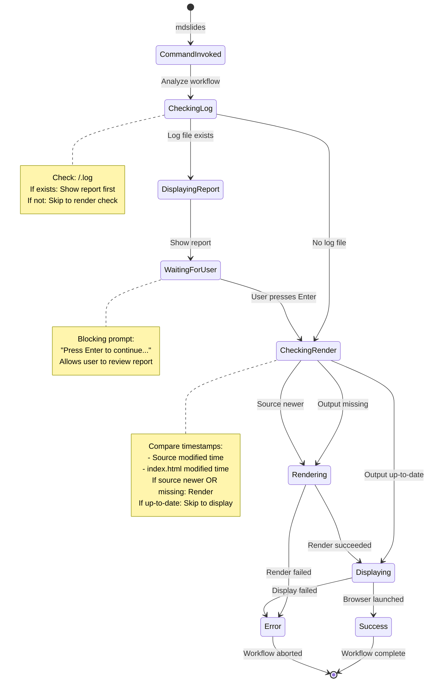

# Event Storming: Smart Default Command

**Date**: 2025-12-29
**Facilitator**: Architect
**Participants**: Product Owner, Bench Developer, Program Manager
**Bounded Context**: Workflow Automation & User Experience
**User Story**: As a presentation author, I want a single command that intelligently handles report/render/display based on file state so I can minimize repetitive CLI invocations and follow a smart workflow.

---

## Domain Events (Orange Stickies)

### Command Invocation Events

1. **SmartDefaultCommandInvoked**
   - When: User runs `mdslides <deck-name>` (no subcommand)
   - Triggers: Workflow decision tree initiated
   - Data: deckName, timestamp

2. **WorkflowDecisionStarted**
   - When: Smart command begins analyzing file state
   - Triggers: Log file check
   - Data: deckName, outputDirPath

### Log File Check Events

3. **LogFileFound**
   - When: Log file exists at `<output-dir>/<deck-name>.log`
   - Triggers: Report command invoked, user prompt for continuation
   - Data: logFilePath, fileSize, lastModified

4. **LogFileNotFound**
   - When: No log file found (never presented before)
   - Triggers: Skip report, proceed to render check
   - Data: expectedPath

### Render Status Check Events

5. **OutputNotFound**
   - When: Output directory or `index.html` does not exist
   - Triggers: Render + Display workflow
   - Data: outputDirPath, deckName

6. **OutputOutdated**
   - When: Source file modified after `index.html` was rendered
   - Triggers: Re-render + Display workflow
   - Data: sourceModifiedTime, outputModifiedTime, timeDelta

7. **OutputUpToDate**
   - When: Output exists and is newer than source
   - Triggers: Display only workflow
   - Data: sourceModifiedTime, outputModifiedTime

### Report Display Events

8. **ReportDisplayed**
   - When: Report command completed successfully
   - Triggers: User prompt "Press Enter to continue..."
   - Data: reportContent, slideCount, duration

9. **UserContinuedAfterReport**
   - When: User presses Enter after viewing report
   - Triggers: Proceed to render check
   - Data: timestamp

### Render Workflow Events

10. **RenderTriggered**
    - When: Smart command decides rendering is needed
    - Triggers: Render command invoked
    - Data: deckName, reason (OutputNotFound | OutputOutdated)

11. **RenderCompleted**
    - When: Render command finished successfully
    - Triggers: Display command invoked
    - Data: outputDirPath, renderDuration

12. **RenderFailed**
    - When: Render command failed with error
    - Triggers: Error message, workflow halts
    - Data: error, deckName

### Display Workflow Events

13. **DisplayTriggered**
    - When: Smart command decides to open presentation
    - Triggers: Display command invoked
    - Data: deckName, renderStatus (UpToDate | Rendered | NotRendered)

14. **DisplayCompleted**
    - When: Display command finished (browser launched)
    - Triggers: Workflow complete
    - Data: browserName, url

15. **DisplayFailed**
    - When: Display command failed
    - Triggers: Error message, workflow halts
    - Data: error

---

## Commands (Blue Stickies)

1. **InvokeSmartDefaultCommand**
   - Triggered by: User CLI invocation (no subcommand)
   - Triggers: SmartDefaultCommandInvoked event
   - Validation: deckName provided

2. **CheckLogFile**
   - Triggered by: WorkflowDecisionStarted event
   - Triggers: LogFileFound or LogFileNotFound event
   - Check: `<output-dir>/<deck-name>.log` exists

3. **DisplayReportAndPrompt**
   - Triggered by: LogFileFound event
   - Triggers: ReportDisplayed event, waits for user input
   - Action: Run report command, display "Press Enter to continue..."

4. **CheckRenderStatus**
   - Triggered by: LogFileNotFound or UserContinuedAfterReport event
   - Triggers: OutputNotFound, OutputOutdated, or OutputUpToDate event
   - Logic: Compare source and output timestamps

5. **TriggerRender**
   - Triggered by: OutputNotFound or OutputOutdated event
   - Triggers: RenderTriggered event, runs render command
   - Action: Invoke render command with current config

6. **TriggerDisplay**
   - Triggered by: RenderCompleted or OutputUpToDate event
   - Triggers: DisplayTriggered event, runs display command
   - Action: Invoke display command with current config

---

## Aggregates (Yellow Stickies)

### SmartWorkflow (Aggregate Root)

**Definition**: Intelligent workflow orchestrator that decides whether to report, render, and/or display based on file state analysis

**Properties**:
```scala
case class SmartWorkflow(
  deckName: String,
  sourceFile: Path,
  outputDir: Path,
  logFile: Path,
  fileState: FileState,
  workflowDecisions: WorkflowDecisions
)

case class FileState(
  sourceExists: Boolean,
  sourceModifiedTime: Option[Instant],
  outputExists: Boolean,
  outputModifiedTime: Option[Instant],
  logExists: Boolean,
  logModifiedTime: Option[Instant]
)

case class WorkflowDecisions(
  shouldReport: Boolean,
  shouldRender: Boolean,
  shouldDisplay: Boolean,
  renderReason: Option[RenderReason]
)

enum RenderReason:
  case OutputNotFound         // index.html doesn't exist
  case OutputOutdated         // Source modified after output
  case ManualRequest          // User explicitly requested render
```

**Invariants**:
1. **Source Exists**: sourceFile must exist (error if not)
2. **Report Precondition**: shouldReport = true IFF logExists = true
3. **Render Precondition**: shouldRender = true IFF (outputExists = false OR outputOutdated)
4. **Display Always**: shouldDisplay = true (always display after render or if up-to-date)
5. **Workflow Sequence**: Report (if log) → Render (if needed) → Display (always)

**Workflow Decision Logic**:
```scala
def analyzeWorkflow(deckName: String): IO[SmartWorkflow] =
  for {
    // Step 1: Resolve paths
    sourceFile <- IO.fromEither(PathResolver.findInputFile(deckName))
    outputDir <- IO.pure(PathResolver.determineOutputDir(deckName))
    logFile = outputDir.resolve(s"${outputDir.getFileName}.log")
    indexFile = outputDir.resolve("index.html")

    // Step 2: Check file existence and timestamps
    sourceModTime <- IO(Files.getLastModifiedTime(sourceFile).toInstant)
    outputExists <- IO(Files.exists(indexFile))
    outputModTime <- if outputExists then
      IO(Some(Files.getLastModifiedTime(indexFile).toInstant))
    else
      IO.pure(None)
    logExists <- IO(Files.exists(logFile))

    // Step 3: Make decisions
    fileState = FileState(
      sourceExists = true,
      sourceModifiedTime = Some(sourceModTime),
      outputExists = outputExists,
      outputModifiedTime = outputModTime,
      logExists = logExists,
      logModifiedTime = None  // Not needed for decisions
    )

    decisions = makeDecisions(fileState)

    workflow = SmartWorkflow(
      deckName = deckName,
      sourceFile = sourceFile,
      outputDir = outputDir,
      logFile = logFile,
      fileState = fileState,
      workflowDecisions = decisions
    )
  } yield workflow

def makeDecisions(fileState: FileState): WorkflowDecisions =
  val shouldReport = fileState.logExists

  val (shouldRender, renderReason) = fileState.outputModifiedTime match
    case None =>
      // Output doesn't exist, must render
      (true, Some(RenderReason.OutputNotFound))
    case Some(outputTime) =>
      // Output exists, check if source is newer
      fileState.sourceModifiedTime match
        case Some(sourceTime) if sourceTime.isAfter(outputTime) =>
          (true, Some(RenderReason.OutputOutdated))
        case _ =>
          (false, None)  // Output is up-to-date

  WorkflowDecisions(
    shouldReport = shouldReport,
    shouldRender = shouldRender,
    shouldDisplay = true,  // Always display
    renderReason = renderReason
  )
```

---

## State Machine



---

## Hotspots & Questions (Pink Stickies)

### Hotspot 1: User Prompt After Report
**Question**: Should we require user interaction after displaying the report?

**Options**:
1. Blocking prompt: "Press Enter to continue..."
2. Auto-continue after timeout (e.g., 5 seconds)
3. No prompt, immediate continuation

**Decision**: **Option 1 - Blocking Prompt "Press Enter to Continue..."**
```
═══════════════════════════════════════════════════════════════
  Presentation Report: mdslides-tutorial
═══════════════════════════════════════════════════════════════
[... full report output ...]

Press Enter to continue...
```

**Rationale**:
- Gives user time to review metrics (especially after long presentation)
- User controls when to proceed
- Simple, predictable behavior

---

### Hotspot 2: Source File Not Found
**Question**: What if source file doesn't exist but output does?

**Scenario**: User deleted or renamed source `.md` file after rendering.

**Options**:
1. Error: "Source file not found"
2. Skip render, display existing output
3. Prompt user for confirmation

**Decision**: **Option 1 - Error (Source Required)**
```
✗ Source file not found: my-talk.md

  Smart command requires source file to determine render status.

  If you only want to display the existing rendered presentation:
    java -jar ../mdslides.jar display my-talk
```

**Rationale**: Source file is required to determine if render is needed. Display command available for display-only.

---

### Hotspot 3: Render Failure Handling
**Question**: What if render fails during smart workflow?

**Decision**: **Halt Workflow with Error**
```
✗ Render failed for: my-talk

  [Render error details...]

  Workflow halted. Fix the error and try again.
```

- Do NOT proceed to display if render fails
- Show full render error message
- User must fix error and retry

**Rationale**: Don't display stale/broken presentation, fail fast.

---

### Hotspot 4: Console Output Clarity
**Question**: How do we communicate workflow decisions to the user?

**Decision**: **Explicit Status Messages at Each Step**

**Example 1: First-time render + display**
```
$ java -jar ../mdslides.jar mdslides-tutorial

No log file found (presentation not given yet).

Rendering presentation: mdslides-tutorial
✓ Pre-rendering 8 mermaid diagram(s)...
✓ Rendering HTML with theme: dark
✓ Writing files to: mdslides-tutorial/
✓ Opened presentation in system default browser
  URL: file:///home/.../mdslides-tutorial/index.html
```

**Example 2: After giving presentation (log exists, output up-to-date)**
```
$ java -jar ../mdslides.jar mdslides-tutorial

═══════════════════════════════════════════════════════════════
  Presentation Report: mdslides-tutorial
═══════════════════════════════════════════════════════════════
[... report content ...]

Press Enter to continue...

Presentation up-to-date: mdslides-tutorial
✓ Opened presentation in system default browser
  URL: file:///home/.../mdslides-tutorial/index.html
```

**Example 3: Source modified, re-render needed**
```
$ java -jar ../mdslides.jar mdslides-tutorial

Rendering presentation: mdslides-tutorial (source modified)
✓ Pre-rendering 8 mermaid diagram(s)...
✓ Rendering HTML with theme: dark
✓ Writing files to: mdslides-tutorial/
✓ Opened presentation in system default browser
  URL: file:///home/.../mdslides-tutorial/index.html
```

**Rationale**: Clear, actionable feedback at each step, user knows what's happening.

---

### Hotspot 5: Timestamp Comparison Precision
**Question**: How precise should timestamp comparison be for detecting source changes?

**Decision**: **Second-Level Precision (Truncate Milliseconds)**
```scala
def isSourceNewer(sourceTime: Instant, outputTime: Instant): Boolean =
  sourceTime.truncatedTo(ChronoUnit.SECONDS)
    .isAfter(outputTime.truncatedTo(ChronoUnit.SECONDS))
```

**Rationale**:
- File system timestamp granularity varies (some filesystems use seconds, not milliseconds)
- Avoid false positives from millisecond-level differences
- Second-level precision sufficient for authoring workflow

---

### Hotspot 6: Config Inheritance
**Question**: Does smart command respect same config as render/display?

**Decision**: **Yes - Smart Command Inherits All Config**
- Theme: From render config
- Browser: From display config
- Footer text: From render config
- All 4-layer precedence rules apply

**Example**:
```bash
# These two workflows are equivalent:

# Manual:
java -jar ../mdslides.jar render my-talk --theme dark
java -jar ../mdslides.jar display my-talk --browser firefox

# Smart (with config):
# .mdslides/config.json: {"theme": "dark", "browser": "firefox"}
java -jar ../mdslides.jar my-talk
```

**Rationale**: Smart command is convenience wrapper, not a different workflow.

---

### Hotspot 7: Multiple Deck Names
**Question**: Should smart command support multiple deck names?

**Options**:
1. Single deck only: `mdslides <deck-name>`
2. Multiple decks: `mdslides <deck1> <deck2> <deck3>`
3. Wildcard support: `mdslides talks/*`

**Decision**: **Option 1 - Single Deck Only for v3.0.0**
- Simple, unambiguous
- Each deck may require different workflow (report/render/display)
- User can script multiple invocations if needed

**Future Enhancement (v3.1.0)**:
```bash
# Sequential processing of multiple decks
mdslides --batch my-talk-1 my-talk-2 my-talk-3
```

**Rationale**: Start simple, add batching if requested (YAGNI).

---

### Hotspot 8: Error Recovery
**Question**: Should smart command support retry on render failure?

**Options**:
1. No retry, fail immediately
2. Auto-retry once
3. Prompt user: "Retry render? (y/n)"

**Decision**: **Option 1 - No Retry, Fail Immediately**
```
✗ Render failed for: my-talk

  Error: Mermaid diagram parsing failed at slide 12

  Fix the error and run the command again.
```

**Rationale**:
- Render errors are deterministic (bad markdown, invalid diagram syntax)
- Retrying won't fix the issue
- User must fix source file first

---

## Integration Points

### Upstream Dependencies
- **Path Resolver**: Find source file, determine output directory
- **File System**: Check file existence, compare timestamps
- **Report Command**: Display session log
- **Render Command**: Build presentation HTML
- **Display Command**: Launch browser

### Downstream Consumers
- **Console Output**: Status messages, prompts
- **Exit Codes**: 0 (success), 1 (error)

---

## Example Scenarios

### Scenario 1: First-Time Presenter (No Log, No Output)
```bash
$ java -jar ../mdslides.jar my-talk

No log file found (presentation not given yet).

Rendering presentation: my-talk
✓ Pre-rendering 5 mermaid diagram(s)...
✓ Rendering HTML with theme: light
✓ Writing files to: my-talk/
✓ Opened presentation in system default browser
  URL: file:///home/user/projects/mdslides/my-talk/index.html
```

**Workflow**:
1. Check log: NOT FOUND → Skip report
2. Check output: NOT FOUND → Render needed
3. Render: SUCCESS
4. Display: SUCCESS

---

### Scenario 2: After Giving Presentation (Log Exists, Output Up-to-Date)
```bash
$ java -jar ../mdslides.jar my-talk

═══════════════════════════════════════════════════════════════
  Presentation Report: my-talk
═══════════════════════════════════════════════════════════════

Session Information:
  Started:        2025-12-29 14:23:45
  Duration:       00:35:42
  Theme:          light
  Total Slides:   28
  Slides Viewed:  28/28 (100%)

[... full report ...]

Press Enter to continue...

Presentation up-to-date: my-talk
✓ Opened presentation in system default browser
  URL: file:///home/user/projects/mdslides/my-talk/index.html
```

**Workflow**:
1. Check log: FOUND → Display report, prompt user
2. User presses Enter
3. Check output: UP-TO-DATE → Skip render
4. Display: SUCCESS

---

### Scenario 3: Modified Source File (Log Exists, Output Outdated)
```bash
$ java -jar ../mdslides.jar my-talk

Rendering presentation: my-talk (source modified)
✓ Pre-rendering 5 mermaid diagram(s)...
✓ Rendering HTML with theme: light
✓ Writing files to: my-talk/
✓ Opened presentation in system default browser
  URL: file:///home/user/projects/mdslides/my-talk/index.html
```

**Workflow**:
1. Check log: FOUND → But no report shown (render is needed, so skip report)
2. Check output: OUTDATED → Render needed
3. Render: SUCCESS
4. Display: SUCCESS

**Design Decision**: **Skip report if render is needed** (optimization)
- Report shows OLD session data (before source changes)
- User probably wants to see updated presentation, not old report
- Saves time by skipping unnecessary report display

**Alternative Flow** (show report anyway):
```
If user wants to see old report before re-rendering:
  java -jar ../mdslides.jar report my-talk
  # Review report
  java -jar ../mdslides.jar my-talk
  # Re-render + display
```

---

### Scenario 4: Source File Not Found
```bash
$ java -jar ../mdslides.jar my-talk

✗ Source file not found: my-talk.md

  Smart command requires source file to determine render status.

  If you only want to display the existing rendered presentation:
    java -jar ../mdslides.jar display my-talk

  If you renamed or moved the source file, update the deck name.
```

---

### Scenario 5: Render Failure
```bash
$ java -jar ../mdslides.jar my-talk

Rendering presentation: my-talk
✗ Render failed: Mermaid diagram parsing failed at slide 12

  Error: Syntax error in mermaid diagram
  Line: graph TD A[Start] --> B[End

  Fix the error in my-talk.md and try again.
```

**Workflow**:
1. Check log: NOT FOUND → Skip report
2. Check output: NOT FOUND → Render needed
3. Render: FAILED → Halt workflow, display error
4. Display: NOT EXECUTED

---

## Acceptance Criteria (Preview)

1. **Command invocation**
   - Syntax: `java -jar ../mdslides.jar <deck-name>` (no subcommand)
   - Resolves deck name to source file and output directory

2. **Workflow decision tree**
   - **Step 1**: Check log file (`<output-dir>/<deck-name>.log`)
     - If exists: Display report, prompt "Press Enter to continue...", wait for user
     - If not exists: Skip to Step 2
   - **Step 2**: Check render status
     - If output missing: Render + Display
     - If source newer: Render + Display
     - If output up-to-date: Display only

3. **Report phase (if log exists)**
   - Display full report using report command
   - Blocking prompt: "Press Enter to continue..."
   - User presses Enter to proceed to next phase

4. **Render phase (if needed)**
   - Status message: "Rendering presentation: <deck-name>"
   - Reason suffix: "(source modified)" if output outdated, "" if output missing
   - Run render command with current config (theme, footer-text, etc.)
   - Halt workflow if render fails

5. **Display phase (always)**
   - Status message: "Presentation up-to-date: <deck-name>" if no render, "" if rendered
   - Run display command with current config (browser, etc.)
   - Launch browser in background, return to shell

6. **Error handling**
   - Source file not found: Clear error, suggest using display command
   - Render failure: Show error, halt workflow
   - Display failure: Show error, halt workflow

7. **Exit codes**
   - 0: Success (all phases completed)
   - 1: Error (source not found, render failed, display failed)

8. **Config inheritance**
   - Render config: theme, footer-text, header-position, etc.
   - Display config: browser
   - All 4-layer precedence rules apply

---

## Next Steps

1. ✅ **Event Storming** - Complete (this document)
2. ⏭️ **Ubiquitous Language Workshop** - Add SmartWorkflow, FileState terms
3. ⏭️ **Domain Modeling Workshop** - Define SmartWorkflow aggregate
4. ⏭️ **Three Amigos** - Write BDD scenarios for all workflow paths
5. ⏭️ **Implementation** - Smart command orchestrator, file state analyzer

---

**Facilitator Notes**:
- Smart default command is a convenience wrapper (NOT a new workflow)
- Inherits ALL config from render and display commands
- Decision tree: Log → Render (if needed) → Display (always)
- Blocking prompt after report allows user to review metrics
- Source file required (error if missing, unlike display command)
- Render failure halts workflow (fail fast, don't display stale output)
- Optimization: Skip report if render is needed (show updated presentation, not old report)
- YAGNI: Single deck only in v3.0.0, batch processing in v3.1.0 if needed
