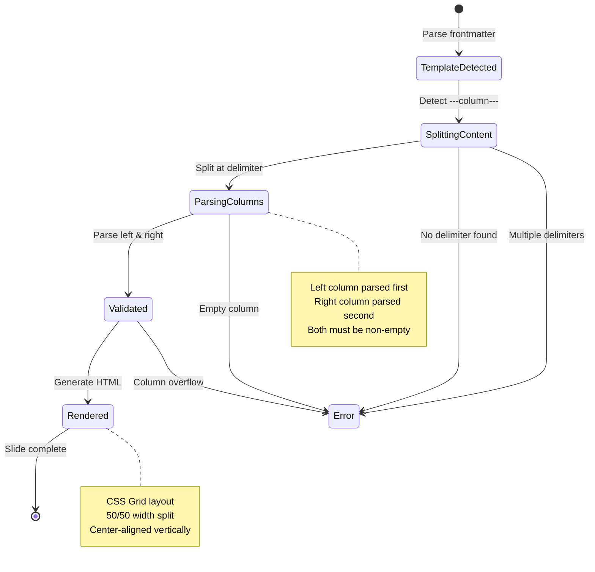
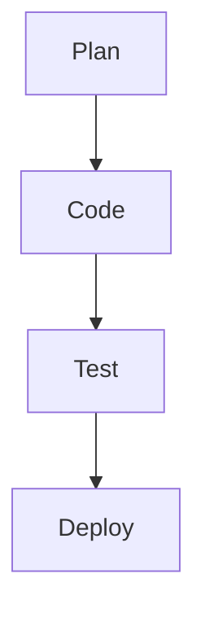
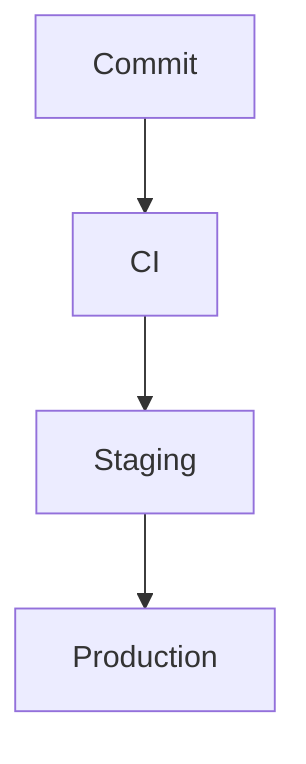

# Event Storming: Two-Column Layout Template

**Date**: 2025-12-29
**Facilitator**: Architect
**Participants**: Product Owner, Bench Developer, Program Manager
**Bounded Context**: Slide Deck Authoring (Template System)
**User Story**: As a presentation author, I want to create slides with two-column layouts so I can display code alongside explanations, compare before/after states, or show diagrams side-by-side.

---

## Domain Events (Orange Stickies)

### Template Configuration Events

1. **TwoColumnTemplateRecognized**
   - When: Parser encounters `template: two-column` in frontmatter
   - Triggers: Two-column parsing mode activated
   - Data: slideIndex

2. **ColumnDelimiterDetected**
   - When: Parser encounters `---column---` separator
   - Triggers: Content split into left and right slots
   - Data: delimiterPosition, leftContent, rightContent

3. **LeftColumnParsed**
   - When: Content before `---column---` parsed as FormattedContent
   - Triggers: Left slot populated
   - Data: leftSlotContent (FormattedContent)

4. **RightColumnParsed**
   - When: Content after `---column---` parsed as FormattedContent
   - Triggers: Right slot populated
   - Data: rightSlotContent (FormattedContent)

### Rendering Events

5. **TwoColumnSlideRendered**
   - When: Two-column template rendered to HTML
   - Triggers: CSS Grid layout generated
   - Data: slideIndex, leftColumnHtml, rightColumnHtml

6. **ColumnContentOverflow**
   - When: Column content exceeds vertical viewport limit
   - Triggers: Validation error or density warning
   - Data: slideIndex, columnSide (left | right), contentHeight, viewportHeight

7. **AccessibilityOrderValidated**
   - When: Two-column HTML structure validated for reading order
   - Triggers: ARIA attributes added for screen readers
   - Data: slideIndex, readingOrder (left-first)

---

## Commands (Blue Stickies)

1. **ParseTwoColumnSlide**
   - Triggered by: Template type detection
   - Triggers: TwoColumnTemplateRecognized event
   - Validation: Frontmatter contains `template: two-column`

2. **SplitContentAtDelimiter**
   - Triggered by: ColumnDelimiterDetected event
   - Triggers: LeftColumnParsed, RightColumnParsed events
   - Validation: Exactly one `---column---` delimiter present, non-empty columns

3. **RenderTwoColumnLayout**
   - Triggered by: Slide rendering pipeline
   - Triggers: TwoColumnSlideRendered event
   - Generates: CSS Grid HTML with left and right sections

4. **ValidateColumnDensity**
   - Triggered by: Slide validation phase
   - Triggers: ColumnContentOverflow event (if fails)
   - Validation: Each column content ≤ 70vh (same as single-column)

5. **ApplyColumnAlignment**
   - Triggered by: CSS rendering
   - Triggers: Column styles applied
   - Data: horizontalAlign (left | center | right), verticalAlign (top | center | bottom)

---

## Aggregates (Yellow Stickies)

### TwoColumnSlide (Aggregate Root)

**Definition**: A slide containing two independent content columns with equal width distribution

**Properties**:
```scala
case class TwoColumnSlide(
  metadata: SlideMetadata,
  leftColumn: FormattedContent,   // Left column slot
  rightColumn: FormattedContent,  // Right column slot
  alignment: ColumnAlignment      // Layout alignment settings
) extends Slide

case class ColumnAlignment(
  horizontal: HorizontalAlign,    // Left | Center | Right (default: Left)
  vertical: VerticalAlign         // Top | Center | Bottom (default: Center)
)

enum HorizontalAlign:
  case Left, Center, Right

enum VerticalAlign:
  case Top, Center, Bottom
```

**Invariants**:
1. **Column Count**: Exactly two columns (left and right)
2. **Column Delimiter**: Exactly one `---column---` separator in source
3. **Non-Empty Columns**: Both columns must have content (non-empty)
4. **Equal Width**: Columns always 50/50 width split (not configurable in v3.0.0)
5. **Density Constraint**: Each column content ≤ 70vh vertical height
6. **Reading Order**: Left column always rendered before right column in DOM

**Column Parsing**:
```scala
def parseTwoColumnContent(markdown: String): Either[ParseError, (String, String)] =
  val parts = markdown.split("---column---")
  if parts.length != 2 then
    Left(ParseError("Two-column template requires exactly one '---column---' delimiter"))
  else if parts(0).trim.isEmpty || parts(1).trim.isEmpty then
    Left(ParseError("Both columns must contain content"))
  else
    Right((parts(0).trim, parts(1).trim))
```

---

### Template Definition

```scala
Template(
  name = "two-column",
  description = "Two-column layout with 50/50 split",
  slots = List(
    SlotDefinition(name = "left", required = true),
    SlotDefinition(name = "right", required = true)
  ),
  defaultAlignment = ColumnAlignment(
    horizontal = HorizontalAlign.Left,
    vertical = VerticalAlign.Center
  )
)
```

---

## State Machine



---

## Hotspots & Questions (Pink Stickies)

### Hotspot 1: Column Delimiter Syntax
**Question**: What syntax should authors use to separate columns?

**Options**:
1. Explicit delimiter: `---column---` (consistent with `---` slide separator)
2. HTML comments: `<!-- column -->` or `<!-- right column -->`
3. Frontmatter directive: `layout: two-column` + auto-split by heading count
4. Both delimiter and frontmatter (hybrid approach)

**Decision**: **Option 1 - Explicit Delimiter `---column---`**
- Consistent with existing `---` slide separator syntax
- Explicit and unambiguous
- Works with all content types (no heading requirement)
- Easy to validate (exactly one delimiter required)

**Rationale**: Explicit is better than implicit. Delimiter makes column split obvious.

---

### Hotspot 2: Empty Column Handling
**Question**: Should we allow one column to be empty?

**Options**:
1. Require both columns non-empty (strict)
2. Allow empty columns (flexible)
3. Allow empty right column only

**Decision**: **Option 1 - Require Both Columns Non-Empty**
- Empty column indicates authoring error (forgot content)
- No valid use case for empty column (just use single-column template)
- Fails early with clear error message

**Error Message**:
```
✗ Slide 12: Two-column template requires both columns to have content
  Left column: 45 lines
  Right column: 0 lines (EMPTY)

  Fix: Add content to right column or change to single-column template
```

**Rationale**: Strict validation prevents authoring mistakes.

---

### Hotspot 3: Column Width Ratio
**Question**: Should column widths be configurable (e.g., 60/40, 70/30)?

**Options**:
1. Fixed 50/50 split (simple)
2. Configurable via frontmatter: `column-ratio: "60/40"`
3. Named layouts: `layout: two-column-wide-left` (60/40)

**Decision**: **Option 1 - Fixed 50/50 for v3.0.0**
- Simpler implementation (no ratio parsing)
- Covers 80% of use cases (equal importance)
- Reduces decision fatigue for authors
- Future enhancement: Add configurable ratios in v3.1.0

**Future Enhancement (v3.1.0)**:
```markdown
---
template: two-column
column-ratio: "60/40"  # Left 60%, Right 40%
---
```

**Rationale**: Start simple, add complexity when needed (YAGNI).

---

### Hotspot 4: Vertical Alignment
**Question**: How should column content be aligned vertically?

**Options**:
1. Top-aligned (content starts at top)
2. Center-aligned (content centered vertically)
3. Bottom-aligned (content aligns to bottom)
4. Configurable per slide

**Decision**: **Option 2 - Center-Aligned by Default, Configurable in v3.1.0**
- Center alignment: Most visually balanced for presentations
- Matches single-column vertical centering behavior
- Consistent with existing template alignment

**CSS Implementation**:
```css
.column {
  display: flex;
  flex-direction: column;
  justify-content: center;  /* Vertical center */
  align-items: flex-start;  /* Horizontal left (default) */
}
```

**Future Enhancement (v3.1.0)**:
```markdown
---
template: two-column
vertical-align: top  # or center, bottom
---
```

**Rationale**: Default to most common case, enable customization later.

---

### Hotspot 5: Content Types Support
**Question**: What content types should be supported in columns?

**Options**:
1. Text only (headings, paragraphs, lists)
2. Text + images
3. Text + images + code blocks
4. All content types (including mermaid diagrams)

**Decision**: **Option 4 - All Content Types Supported**
- No arbitrary restrictions
- Each column is independent FormattedContent
- Mermaid diagrams pre-rendered to SVG (fits in column width)
- Code blocks with syntax highlighting (existing feature)

**Content Types Supported**:
- ✅ Headings (h2, h3, h4)
- ✅ Paragraphs
- ✅ Lists (bulleted, numbered)
- ✅ Images (local and remote)
- ✅ Code blocks (with syntax highlighting)
- ✅ Inline formatting (bold, italic, links, inline code)
- ✅ Mermaid diagrams (pre-rendered SVG, scaled to column width)
- ✅ Mixed content (any combination of above)

**Constraints**:
- Each column: Max 70vh vertical height (same as single-column)
- Mermaid diagrams: Max 50% viewport width per column (CSS scaling)
- Images: Scaled to fit column width (max 50% viewport)

**Rationale**: Maximize flexibility, leverage existing FormattedContent parser.

---

### Hotspot 6: Accessibility and Reading Order
**Question**: How should screen readers navigate two-column layouts?

**Options**:
1. Left-to-right: Read entire left column, then entire right column
2. Interleaved: Alternate between columns by element
3. User choice via ARIA navigation

**Decision**: **Option 1 - Left-to-Right Sequential Reading**
- Screen reader reads left column completely, then right column
- Matches visual reading order (Western languages)
- Achieved via DOM order (left `<section>` before right `<section>`)

**HTML Structure**:
```html
<div class="two-column-layout" role="region" aria-label="Two-column slide">
  <section class="column column-left" aria-label="Left column">
    <!-- Left column content -->
  </section>
  <section class="column column-right" aria-label="Right column">
    <!-- Right column content -->
  </section>
</div>
```

**ARIA Labels**:
- Main container: `role="region"` with `aria-label="Two-column slide"`
- Left section: `aria-label="Left column"`
- Right section: `aria-label="Right column"`

**Rationale**: Predictable reading order, matches visual layout.

---

### Hotspot 7: Column Density Validation
**Question**: How do we validate that columns don't overflow?

**Options**:
1. No validation (let CSS handle overflow)
2. Per-column validation (each ≤ 70vh)
3. Combined validation (both columns together ≤ 70vh)

**Decision**: **Option 2 - Per-Column Validation (Each ≤ 70vh)**
- Each column independently validated against 70vh limit
- Same density constraint as single-column slides
- Validation occurs during render phase
- Fail build if column overflows (strict mode)

**Validation Logic**:
```scala
def validateColumnDensity(column: FormattedContent, side: ColumnSide): Either[ValidationError, Unit] =
  val estimatedHeight = estimateContentHeight(column)
  if estimatedHeight > MAX_COLUMN_HEIGHT then
    Left(ValidationError.ColumnOverflow(
      side = side,
      estimatedHeight = estimatedHeight,
      maxHeight = MAX_COLUMN_HEIGHT
    ))
  else
    Right(())
```

**Error Message**:
```
✗ Slide 18: Right column content exceeds vertical limit
  Estimated height: 85vh (max: 70vh)

  Suggestions:
  - Split content across multiple slides
  - Reduce font size or line spacing
  - Remove less critical content
  - Use image thumbnails instead of full-size images
```

**Rationale**: Prevent unreadable slides with overflow, same standard as single-column.

---

### Hotspot 8: Gap Between Columns
**Question**: How much spacing should be between columns?

**Options**:
1. Fixed gap: `2rem` (32px at default font size)
2. Configurable gap via frontmatter
3. Theme-specific gap (different per theme)

**Decision**: **Option 1 - Fixed Gap `2rem` for v3.0.0**
- Consistent spacing across all two-column slides
- Visually balanced for most content
- Simplifies implementation (no configuration needed)

**CSS Implementation**:
```css
.two-column-layout {
  display: grid;
  grid-template-columns: 1fr 1fr;
  gap: 2rem;  /* 32px at 16px base font */
}
```

**Future Enhancement (v3.1.0)**:
```markdown
---
template: two-column
column-gap: 3rem  # Override default
---
```

**Rationale**: Start with sensible default, enable customization if needed.

---

## Integration Points

### Upstream Dependencies
- **Markdown Parser**: Recognize `---column---` delimiter, split content
- **Template System**: Define two-column template with two slots
- **FormattedContent**: Parse left and right columns independently
- **Mermaid Renderer**: Scale diagrams to fit column width (max 50vw)

### Downstream Consumers
- **HTML Renderer**: Generate CSS Grid layout HTML
- **Theme CSS**: Two-column layout styles (gap, alignment, responsive)
- **Density Validator**: Validate each column ≤ 70vh
- **Accessibility Validator**: Ensure proper reading order, ARIA labels

---

## Example Scenarios

### Scenario 1: Code + Explanation
```markdown
---
template: two-column
---

## Implementation

```scala
def renderSlide(slide: Slide): Html =
  div(
    cls := "slide",
    renderSlots(slide.slots)
  )
```

---column---

## Explanation

This function renders a slide by:
1. Creating a div container
2. Adding the "slide" CSS class
3. Rendering all slot content
```

**Rendered HTML**:
```html
<div class="two-column-layout">
  <section class="column column-left">
    <h2>Implementation</h2>
    <pre><code class="language-scala">...</code></pre>
  </section>
  <section class="column column-right">
    <h2>Explanation</h2>
    <p>This function renders a slide by:</p>
    <ol>
      <li>Creating a div container</li>
      <li>Adding the "slide" CSS class</li>
      <li>Rendering all slot content</li>
    </ol>
  </section>
</div>
```

---

### Scenario 2: Before/After Comparison
```markdown
---
template: two-column
---

## Before

Old approach with limitations:
- Manual HTML
- No validation
- Inconsistent styling

---column---

## After

New approach with benefits:
- Markdown simplicity
- WCAG validation
- Theme system
```

---

### Scenario 3: Image + Description
```markdown
---
template: two-column
---


---column---

## System Architecture

The diagram shows:
- **Client Layer**: Web and mobile apps
- **API Gateway**: Request routing and auth
- **Service Layer**: Business logic
- **Data Persistence**: PostgreSQL database
```

---

### Scenario 4: Side-by-Side Diagrams
```markdown
---
template: two-column
---

## Development Flow



---column---

## Deployment Pipeline


```

---

## Acceptance Criteria (Preview)

1. **Parser recognizes two-column template**
   - Frontmatter contains `template: two-column`
   - Content split at `---column---` delimiter

2. **Exactly one column delimiter required**
   - Error if zero delimiters: "Two-column template requires '---column---' separator"
   - Error if multiple delimiters: "Two-column template allows only one '---column---' separator"

3. **Both columns must be non-empty**
   - Error if left column empty
   - Error if right column empty

4. **All content types supported in columns**
   - Text (headings, paragraphs, lists)
   - Images (local and remote, with alt text)
   - Code blocks (with syntax highlighting)
   - Mermaid diagrams (pre-rendered SVG, scaled to column width)

5. **Even 50/50 width split**
   - CSS Grid: `grid-template-columns: 1fr 1fr`
   - Gap between columns: `2rem`

6. **Default alignment**
   - Horizontal: Left-aligned
   - Vertical: Center-aligned

7. **Column density validation**
   - Each column: Max 70vh vertical height
   - Build fails if column overflows

8. **Accessible reading order**
   - Left column read before right column
   - ARIA labels for sections
   - Semantic HTML structure

9. **Responsive to column width**
   - Images scaled to fit column (max 50vw)
   - Mermaid diagrams scaled to fit column (max 50vw)
   - Code blocks wrap or scroll within column

---

## Next Steps

1. ✅ **Event Storming** - Complete (this document)
2. ⏭️ **Ubiquitous Language Workshop** - Add TwoColumnSlide, ColumnAlignment terms
3. ⏭️ **Domain Modeling Workshop** - Define TwoColumnSlide aggregate
4. ⏭️ **Three Amigos** - Write BDD scenarios for parsing, rendering, validation
5. ⏭️ **Implementation** - Parser changes, template definition, HTML renderer, CSS

---

**Facilitator Notes**:
- Two-column layout is HIGH priority (explicitly marked in design specs)
- Strict validation (non-empty columns, density limits) prevents authoring errors
- All content types supported via FormattedContent reuse (no special cases)
- Fixed 50/50 split for v3.0.0, configurable ratios deferred to v3.1.0 (YAGNI)
- Accessibility: Left-to-right reading order matches visual layout
- Integration: Minimal parser changes (recognize delimiter), existing FormattedContent pipeline
