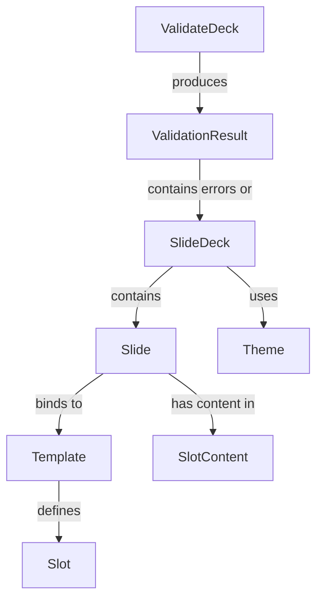

# Ubiquitous Language: Slide Deck Authoring
## Living Glossary of Domain Terms

---

```yaml
# MACHINE-READABLE METADATA
glossary:
  bounded_context: SlideDeckAuthoring
  version: 1.0.0
  created_date: 2024-12-19
  last_updated: 2024-12-19

ownership:
  architect: Tony Moores, Founder, TJM Solutions (https://www.tjm.solutions/)
```

---

## 📖 Purpose

This living glossary defines the **ubiquitous language** for the **Slide Deck Authoring** bounded context. All code, documentation, and conversations must use these exact terms.

**Philosophy**: The language of the domain IS the language of the code.

---

## 🚫 Banned Terms

These generic technical terms are **FORBIDDEN** in domain code and conversations:

- ❌ `Manager`, `Handler`, `Service`, `Helper`, `Util`, `Processor`
- ❌ `DTO`, `Entity` (use specific terms like `SlideDeck`, `Theme`)
- ❌ `Data`, `Info`, `Object`, `Thing`
- ❌ `Config` (use `Configuration` or `Theme`)
- ❌ `Layout` as a theme concept (it's a **slide template structure**, not visual style)

---

## 🗂️ Glossary

### Core Aggregates

#### SlideDeck

**Definition**: The root aggregate representing a complete presentation consisting of multiple slides, a theme, and metadata.

**Synonyms** (AVOID): Presentation, Deck, Slideshow

**Properties**:
- `Title`: The presentation title (required, max 100 chars)
- `Author`: Optional author name
- `Slides`: Ordered collection of `Slide` entities (min 1, max 200)
- `Theme`: The visual theme applied to all slides
- `Metadata`: Deck-level metadata (tags, created date, etc.)

**Examples**:
- ✅ "The SlideDeck has 15 slides and uses the 'dark' theme"
- ❌ "The presentation has 15 pages" (wrong terms)

**Business Rules**:
- Must have at least 1 slide
- Maximum 200 slides (performance constraint)
- Title is required (extracted from first `#` header in Markdown)
- Once validated, the SlideDeck is immutable

**Code Reference** (Scala 3):
```scala
case class SlideDeck(
  title: SlideTitle,
  author: Option[String],
  slides: NonEmptyList[Slide],
  theme: Theme,
  metadata: DeckMetadata
):
  def addSlide(slide: Slide): SlideDeck = ???
  def changeTheme(newTheme: Theme): SlideDeck = ???
  def validate: Either[NonEmptyList[ValidationError], SlideDeck] = ???
```

**BDD Usage**:
```gherkin
Given a SlideDeck with title "My Presentation"
When I add a slide with template "title"
Then the SlideDeck contains 1 slide
```

---

#### Slide

**Definition**: An individual page within a SlideDeck, bound to a Template and containing content organized into Slots.

**Synonyms** (AVOID): Page, Screen, Frame

**Properties**:
- `SlideId`: Unique identifier within the deck
- `Template`: The slide template this slide conforms to
- `SlotContent`: Map of slot names to content (e.g., `{"title": "...", "body": "..."}`)
- `Metadata`: Slide-level metadata (id, tags, speaker notes)
- `Transition`: Animation between slides (None, Fade, Slide, Zoom)

**Examples**:
- ✅ "Slide 'intro' uses the 'title' template"
- ❌ "Page 1 is a title page" (wrong terms)

**Business Rules**:
- Must bind to exactly one Template
- All required slots (per template) must have content
- Slide title max 100 characters
- Slide content (all slots combined) max 5000 characters
- No empty slides (at least one slot with content)

**Code Reference** (Scala 3):
```scala
case class Slide(
  id: SlideId,
  template: Template,
  slotContent: Map[SlotName, SlotContent],
  metadata: SlideMetadata,
  transition: SlideTransition
):
  def getSlotContent(slotName: SlotName): Option[SlotContent] = ???
  def hasRequiredSlots: Boolean = ???
```

**BDD Usage**:
```gherkin
Given a Slide with template "two-column"
When I set the "left_column" slot content to "Feature A"
Then the Slide has content in the "left_column" slot
```

---

#### Template

**Definition**: A reusable structural definition that specifies what content slots a slide should have and their constraints.

**Synonyms** (AVOID): Layout (layout is visual, template is structural), SlideType, Format

**Properties**:
- `TemplateId`: Unique identifier (e.g., "title", "content", "two-column")
- `Name`: Human-readable name (e.g., "Title Slide")
- `Description`: What this template is for
- `Slots`: Collection of `Slot` definitions with constraints
- `DefaultSlots`: Optional default content for slots

**Examples**:
- ✅ "The 'title' template has slots: title, subtitle, author"
- ❌ "The title layout has a header and footer" (wrong term)

**Template Types** (common):
- `title`: Title slide with title, subtitle, author
- `content`: Standard content slide with heading and body
- `two-column`: Comparison slide with left/right columns
- `image`: Image-focused slide with caption
- `code`: Code snippet slide with syntax highlighting

**Business Rules**:
- Template ID must be unique within template library
- All slots must have names, types, and constraints
- Templates are immutable once loaded

**Code Reference** (Scala 3):
```scala
case class Template(
  id: TemplateId,
  name: String,
  description: String,
  slots: NonEmptyList[Slot],
  defaultSlots: Map[SlotName, SlotContent] = Map.empty
):
  def getSlot(name: SlotName): Option[Slot] = ???
  def validateSlotContent(slotName: SlotName, content: SlotContent): Either[ValidationError, Unit] = ???
```

**Template Definition** (YAML):
```yaml
id: title
name: Title Slide
description: Primary title slide with subtitle and author
slots:
  - name: title
    type: markdown_block
    required: true
    constraints:
      max_lines: 2
      recommended_heading_level: 1
  - name: subtitle
    type: markdown_block
    required: false
    constraints:
      max_lines: 2
  - name: author
    type: markdown_inline
    required: false
    constraints:
      max_chars: 80
```

**BDD Usage**:
```gherkin
Given a Template with id "title"
When I validate a Slide against this Template
Then all required slots must have content
```

---

### Value Objects

#### Slot

**Definition**: A named content area within a Template, with constraints on what content is allowed.

**Synonyms** (AVOID): Field, Section, Area, Placeholder

**Properties**:
- `Name`: Slot identifier (e.g., "title", "body", "left_column")
- `Type`: Content type (markdown_block, markdown_inline, image, code)
- `Required`: Whether this slot must have content
- `Constraints`: Rules limiting content (max_lines, max_chars, max_words)

**Slot Types**:
- `markdown_block`: Multi-line Markdown (paragraphs, lists, headers)
- `markdown_inline`: Single-line text
- `image`: Image reference (URL or path)
- `code`: Code block with optional language

**Examples**:
- ✅ "The 'title' slot is required and allows max 2 lines"
- ❌ "The title field is mandatory" (wrong term)

**Business Rules**:
- Required slots MUST have content or slide is invalid
- Content must satisfy all constraints (max lines, chars, words)
- Slot names must be unique within a template

**Code Reference** (Scala 3):
```scala
enum SlotType:
  case MarkdownBlock, MarkdownInline, Image, Code

case class SlotConstraints(
  maxLines: Option[Int],
  maxChars: Option[Int],
  maxWords: Option[Int],
  recommendedHeadingLevel: Option[Int]
)

case class Slot(
  name: SlotName,
  `type`: SlotType,
  required: Boolean,
  constraints: SlotConstraints
):
  def validateContent(content: SlotContent): Either[ValidationError, Unit] = ???
```

---

#### Theme

**Definition**: An immutable visual style specification defining colors, fonts, and spacing for the entire SlideDeck.

**Synonyms** (AVOID): Skin, Style, Look, Design

**Properties**:
- `Name`: Theme identifier (e.g., "default", "dark", "corporate")
- `Colors`: Background, foreground, accent colors
- `Fonts`: Font families and sizes for different text roles
- `Layout`: Spacing, padding, margins
- `Accessibility`: WCAG compliance settings

**Examples**:
- ✅ "The 'dark' theme uses white text on a dark blue background"
- ❌ "The dark skin has white font" (wrong terms)

**Business Rules**:
- All colors must have valid hex codes
- Foreground/background contrast ratio >= 4.5:1 (WCAG AA)
- Font sizes must be positive integers
- Themes are immutable (new theme = new object)

**Code Reference** (Scala 3):
```scala
opaque type HexColor = String

case class ColorScheme(
  background: HexColor,
  foreground: HexColor,
  accent: HexColor
)

case class FontSpec(
  family: String,
  titleSize: Int,
  subtitleSize: Int,
  headingSize: Int,
  bodySize: Int,
  codeSize: Int
)

case class Theme(
  name: String,
  colors: ColorScheme,
  fonts: FontSpec,
  layout: LayoutSpec
):
  def validateAccessibility: Either[ValidationError, Unit] = ???
```

**Theme File** (JSON):
```json
{
  "name": "default",
  "colors": {
    "background": "#FFFFFF",
    "foreground": "#000000",
    "accent": "#0066CC"
  },
  "fonts": {
    "family": "Inter, sans-serif",
    "titleSize": 52,
    "subtitleSize": 40,
    "headingSize": 36,
    "bodySize": 28,
    "codeSize": 24
  },
  "layout": {
    "slidePadding": 40,
    "maxBodyLines": 12
  }
}
```

---

#### SlotContent

**Definition**: The actual content (text, image URL, code) assigned to a Slot in a Slide.

**Synonyms** (AVOID): Data, Value, Text

**Properties**:
- `RawContent`: The actual content string
- `Type`: Matches the slot type (MarkdownBlock, MarkdownInline, etc.)
- `Metadata`: Optional metadata (language for code blocks, alt text for images)

**Examples**:
- ✅ "SlotContent for the 'title' slot is '# My Presentation'"
- ❌ "The title data is 'My Presentation'" (wrong term)

**Code Reference** (Scala 3):
```scala
opaque type SlotContent = String

object SlotContent:
  def apply(raw: String, slotType: SlotType): Either[ValidationError, SlotContent] =
    // Validate content matches slot type
    ???

  def lineCount(content: SlotContent): Int = ???
  def charCount(content: SlotContent): Int = ???
  def wordCount(content: SlotContent): Int = ???
```

---

#### ValidationResult

**Definition**: The outcome of running validation rules on a SlideDeck, either success or a collection of errors.

**Synonyms** (AVOID): Result, Outcome, Status

**Code Reference** (Scala 3):
```scala
import cats.data.NonEmptyList

enum ValidationError:
  case StructureError(message: String)
  case ContentError(slideId: SlideId, slotName: SlotName, message: String)
  case DensityError(slideId: SlideId, message: String)
  case AccessibilityError(message: String)

type ValidationResult = Either[NonEmptyList[ValidationError], SlideDeck]
```

**Examples**:
- ✅ "ValidationResult failed with 3 ContentErrors"
- ❌ "Validation returned errors" (imprecise)

---

### Commands (Blue Stickies)

Commands represent intentions/actions in the system. They are verbs.

#### ParseMarkdown

**Definition**: Convert raw Markdown text into an intermediate AST.

**Input**: Raw markdown string
**Output**: Markdown AST (from Flexmark)
**Side Effects**: None (pure)

---

#### ExtractFrontMatter

**Definition**: Parse YAML front matter from a slide to extract metadata.

**Input**: Markdown text for a single slide
**Output**: SlideMetadata (id, tags, template, speaker notes)

---

#### ResolveTemplate

**Definition**: Match a slide to its template, either by explicit front matter or heuristic.

**Input**: Slide metadata, template library
**Output**: Template
**Resolution Strategy**:
1. Explicit: Front matter specifies `template: title`
2. Heuristic: Content structure suggests template (e.g., `# Title` → title template)
3. Default: Use `content` template if no match

---

#### ExtractSlots

**Definition**: Map slide content to template slots.

**Input**: Markdown AST, Template
**Output**: Map[SlotName, SlotContent]

---

#### ValidateDeck

**Definition**: Run all validation rules on a SlideDeck.

**Validation Stages**:
1. **StructureValidation**: Slide count, title presence, slide ordering
2. **DensityValidation**: "Fits on slide" heuristics (max words, lines per slot)
3. **ContentValidation**: Slot content satisfies constraints
4. **AccessibilityValidation**: Color contrast, alt text, heading hierarchy

**Input**: SlideDeck
**Output**: ValidationResult

---

### Domain Events (Orange Stickies)

Events represent things that happened in the past. They are past tense.

#### SlideDeckCreated

**When**: After parsing markdown and creating root aggregate
**Data**: SlideDeck (with title, author, initial metadata)

---

#### SlideAdded

**When**: Each slide is added to the deck during parsing
**Data**: Slide (with template, slot content, metadata)

---

#### TemplateResolved

**When**: A slide is matched to a template
**Data**: SlideId, TemplateId

---

#### SlotsExtracted

**When**: Slide content is mapped to template slots
**Data**: SlideId, Map[SlotName, SlotContent]

---

#### ThemeApplied

**When**: Theme is applied to the deck
**Data**: Theme

---

#### ValidationSucceeded

**When**: All validation rules pass
**Data**: ValidatedSlideDeck

---

#### ValidationFailed

**When**: Any validation rule fails
**Data**: NonEmptyList[ValidationError]

---

## 📊 Domain Concepts vs. Technical Concepts

### Domain Concepts (use in domain layer)

- SlideDeck, Slide, Template, Slot, Theme
- SlotContent, ValidationResult, ValidationError
- SlideTitle, Author, SlideMetadata
- TemplateId, SlotName, HexColor

### Technical Concepts (use in infrastructure layer only)

- Flexmark AST (Anticorruption Layer)
- JSON parser (Circe)
- File system (os-lib)
- HTML renderer (Scalatags)
- Effect types (IO, cats.effect)

**Rule**: Domain layer code MUST NOT reference technical concepts directly.

---

## 🔄 Relationships



---

## 📋 Example Usage in Different Contexts

### In Conversation

✅ **Correct**:
> "The SlideDeck has 10 slides. Slide 3 uses the 'two-column' template with content in both the left_column and right_column slots. The 'dark' theme is applied."

❌ **Wrong**:
> "The presentation has 10 pages. Page 3 uses a two-column layout with data in both columns. The dark skin is applied."

---

### In Code (Scala 3)

✅ **Correct**:
```scala
package solns.tjm.mdslides.domain

case class SlideDeck(
  title: SlideTitle,
  slides: NonEmptyList[Slide],
  theme: Theme
)

case class Slide(
  id: SlideId,
  template: Template,
  slotContent: Map[SlotName, SlotContent]
)
```

❌ **Wrong**:
```scala
package solns.tjm.mdslides.domain

case class PresentationManager(  // ❌ "Manager" is banned
  data: List[PageDTO],            // ❌ "DTO", "Page" wrong
  config: ThemeConfig             // ❌ Generic "config"
)
```

---

### In BDD Scenarios

✅ **Correct**:
```gherkin
Feature: Slide Deck Creation

  Scenario: Create deck from markdown with title template
    Given a markdown file with front matter "template: title"
    And the markdown contains a "# Title" heading
    When I parse the markdown into a SlideDeck
    Then the SlideDeck has 1 Slide
    And the Slide uses the "title" Template
    And the "title" Slot contains "Title"
```

❌ **Wrong**:
```gherkin
Feature: Presentation Management  # ❌ Wrong term

  Scenario: Create presentation from file
    Given a file with layout "title"  # ❌ Layout is visual, not structural
    When I process the file
    Then the presentation has 1 page  # ❌ "Page" wrong
```

---

## 📚 Related Artifacts

- **Event Storming**: [doc/domain-models/event-storming/slide-deck-authoring-events.md](event-storming/slide-deck-authoring-events.md)
- **Context Map**: [CONTEXT-MAP.md](../../CONTEXT-MAP.md)
- **Aggregate Models**: [doc/domain-models/aggregates/](aggregates/) (to be created)
- **Initial Thoughts**: [initial-thoughts.md](../../initial-thoughts.md) (inspiration for templates/slots)

---

**Version**: 1.0.0
**Created**: 2024-12-19
**Last Updated**: 2024-12-19
**Maintained By**: Tony Moores, TJM Solutions
**Review Cadence**: After each domain modeling change
