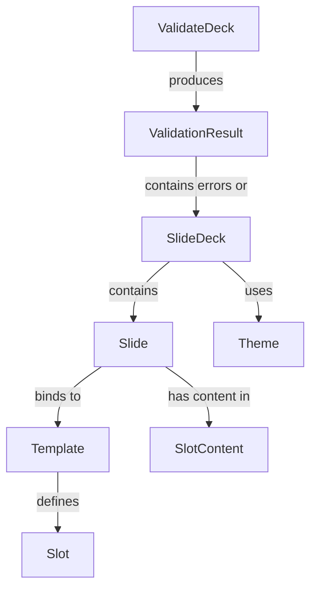

# Ubiquitous Language: Slide Deck Authoring
## Living Glossary of Domain Terms

---

```yaml
# MACHINE-READABLE METADATA
glossary:
  bounded_contexts:
    - SlideDeckAuthoring
    - PresentationRuntime
    - PresentationAnalytics
  version: 1.2.0
  created_date: 2024-12-19
  last_updated: 2025-12-29

ownership:
  architect: Tony Moores, Founder, TJM Solutions (https://www.tjm.solutions/)
```

---

## 📖 Purpose

This living glossary defines the **ubiquitous language** for the **Slide Deck Authoring** bounded context. All code, documentation, and conversations must use these exact terms.

**Philosophy**: The language of the domain IS the language of the code.

---

## 🚫 Banned Terms

These generic technical terms are **FORBIDDEN** in domain code and conversations:

- ❌ `Manager`, `Handler`, `Service`, `Helper`, `Util`, `Processor`
- ❌ `DTO`, `Entity` (use specific terms like `SlideDeck`, `Theme`)
- ❌ `Data`, `Info`, `Object`, `Thing`
- ❌ `Config` (use `Configuration` or `Theme`)
- ❌ `Layout` as a theme concept (it's a **slide template structure**, not visual style)

---

## 🗂️ Glossary

### Core Aggregates

#### SlideDeck

**Definition**: The root aggregate representing a complete presentation consisting of multiple slides, a theme, and metadata.

**Synonyms** (AVOID): Presentation, Deck, Slideshow

**Properties**:
- `Title`: The presentation title (required, max 100 chars)
- `Author`: Optional author name
- `Slides`: Ordered collection of `Slide` entities (min 1, max 200)
- `Theme`: The visual theme applied to all slides
- `Metadata`: Deck-level metadata (tags, created date, etc.)

**Examples**:
- ✅ "The SlideDeck has 15 slides and uses the 'dark' theme"
- ❌ "The presentation has 15 pages" (wrong terms)

**Business Rules**:
- Must have at least 1 slide
- Maximum 200 slides (performance constraint)
- Title is required (extracted from first `#` header in Markdown)
- Once validated, the SlideDeck is immutable

**Code Reference** (Scala 3):
```scala
case class SlideDeck(
  title: SlideTitle,
  author: Option[String],
  slides: NonEmptyList[Slide],
  theme: Theme,
  metadata: DeckMetadata
):
  def addSlide(slide: Slide): SlideDeck = ???
  def changeTheme(newTheme: Theme): SlideDeck = ???
  def validate: Either[NonEmptyList[ValidationError], SlideDeck] = ???
```

**BDD Usage**:
```gherkin
Given a SlideDeck with title "My Presentation"
When I add a slide with template "title"
Then the SlideDeck contains 1 slide
```

---

#### Slide

**Definition**: An individual page within a SlideDeck, bound to a Template and containing content organized into Slots.

**Synonyms** (AVOID): Page, Screen, Frame

**Properties**:
- `SlideId`: Unique identifier within the deck
- `Template`: The slide template this slide conforms to
- `SlotContent`: Map of slot names to content (e.g., `{"title": "...", "body": "..."}`)
- `Metadata`: Slide-level metadata (id, tags, speaker notes)
- `Transition`: Animation between slides (None, Fade, Slide, Zoom)

**Examples**:
- ✅ "Slide 'intro' uses the 'title' template"
- ❌ "Page 1 is a title page" (wrong terms)

**Business Rules**:
- Must bind to exactly one Template
- All required slots (per template) must have content
- Slide title max 100 characters
- Slide content (all slots combined) max 5000 characters
- No empty slides (at least one slot with content)

**Code Reference** (Scala 3):
```scala
case class Slide(
  id: SlideId,
  template: Template,
  slotContent: Map[SlotName, SlotContent],
  metadata: SlideMetadata,
  transition: SlideTransition
):
  def getSlotContent(slotName: SlotName): Option[SlotContent] = ???
  def hasRequiredSlots: Boolean = ???
```

**BDD Usage**:
```gherkin
Given a Slide with template "two-column"
When I set the "left_column" slot content to "Feature A"
Then the Slide has content in the "left_column" slot
```

---

#### Template

**Definition**: A reusable structural definition that specifies what content slots a slide should have and their constraints.

**Synonyms** (AVOID): Layout (layout is visual, template is structural), SlideType, Format

**Properties**:
- `TemplateId`: Unique identifier (e.g., "title", "content", "two-column")
- `Name`: Human-readable name (e.g., "Title Slide")
- `Description`: What this template is for
- `Slots`: Collection of `Slot` definitions with constraints
- `DefaultSlots`: Optional default content for slots

**Examples**:
- ✅ "The 'title' template has slots: title, subtitle, author"
- ❌ "The title layout has a header and footer" (wrong term)

**Template Types** (common):
- `title`: Title slide with title, subtitle, author
- `content`: Standard content slide with heading and body
- `two-column`: Comparison slide with left/right columns
- `image`: Image-focused slide with caption
- `code`: Code snippet slide with syntax highlighting

**Business Rules**:
- Template ID must be unique within template library
- All slots must have names, types, and constraints
- Templates are immutable once loaded

**Code Reference** (Scala 3):
```scala
case class Template(
  id: TemplateId,
  name: String,
  description: String,
  slots: NonEmptyList[Slot],
  defaultSlots: Map[SlotName, SlotContent] = Map.empty
):
  def getSlot(name: SlotName): Option[Slot] = ???
  def validateSlotContent(slotName: SlotName, content: SlotContent): Either[ValidationError, Unit] = ???
```

**Template Definition** (YAML):
```yaml
id: title
name: Title Slide
description: Primary title slide with subtitle and author
slots:
  - name: title
    type: markdown_block
    required: true
    constraints:
      max_lines: 2
      recommended_heading_level: 1
  - name: subtitle
    type: markdown_block
    required: false
    constraints:
      max_lines: 2
  - name: author
    type: markdown_inline
    required: false
    constraints:
      max_chars: 80
```

**BDD Usage**:
```gherkin
Given a Template with id "title"
When I validate a Slide against this Template
Then all required slots must have content
```

---

### Value Objects

#### Slot

**Definition**: A named content area within a Template, with constraints on what content is allowed.

**Synonyms** (AVOID): Field, Section, Area, Placeholder

**Properties**:
- `Name`: Slot identifier (e.g., "title", "body", "left_column")
- `Type`: Content type (markdown_block, markdown_inline, image, code)
- `Required`: Whether this slot must have content
- `Constraints`: Rules limiting content (max_lines, max_chars, max_words)

**Slot Types**:
- `markdown_block`: Multi-line Markdown (paragraphs, lists, headers)
- `markdown_inline`: Single-line text
- `image`: Image reference (URL or path)
- `code`: Code block with optional language

**Examples**:
- ✅ "The 'title' slot is required and allows max 2 lines"
- ❌ "The title field is mandatory" (wrong term)

**Business Rules**:
- Required slots MUST have content or slide is invalid
- Content must satisfy all constraints (max lines, chars, words)
- Slot names must be unique within a template

**Code Reference** (Scala 3):
```scala
enum SlotType:
  case MarkdownBlock, MarkdownInline, Image, Code

case class SlotConstraints(
  maxLines: Option[Int],
  maxChars: Option[Int],
  maxWords: Option[Int],
  recommendedHeadingLevel: Option[Int]
)

case class Slot(
  name: SlotName,
  `type`: SlotType,
  required: Boolean,
  constraints: SlotConstraints
):
  def validateContent(content: SlotContent): Either[ValidationError, Unit] = ???
```

---

#### Theme

**Definition**: An immutable visual style specification defining colors, fonts, and spacing for the entire SlideDeck.

**Synonyms** (AVOID): Skin, Style, Look, Design

**Properties**:
- `Name`: Theme identifier (e.g., "default", "dark", "corporate")
- `Colors`: Background, foreground, accent colors
- `Fonts`: Font families and sizes for different text roles
- `Layout`: Spacing, padding, margins
- `Accessibility`: WCAG compliance settings

**Examples**:
- ✅ "The 'dark' theme uses white text on a dark blue background"
- ❌ "The dark skin has white font" (wrong terms)

**Business Rules**:
- All colors must have valid hex codes
- Foreground/background contrast ratio >= 4.5:1 (WCAG AA)
- Font sizes must be positive integers
- Themes are immutable (new theme = new object)

**Code Reference** (Scala 3):
```scala
opaque type HexColor = String

case class ColorScheme(
  background: HexColor,
  foreground: HexColor,
  accent: HexColor
)

case class FontSpec(
  family: String,
  titleSize: Int,
  subtitleSize: Int,
  headingSize: Int,
  bodySize: Int,
  codeSize: Int
)

case class Theme(
  name: String,
  colors: ColorScheme,
  fonts: FontSpec,
  layout: LayoutSpec
):
  def validateAccessibility: Either[ValidationError, Unit] = ???
```

**Theme File** (JSON):
```json
{
  "name": "default",
  "colors": {
    "background": "#FFFFFF",
    "foreground": "#000000",
    "accent": "#0066CC"
  },
  "fonts": {
    "family": "Inter, sans-serif",
    "titleSize": 52,
    "subtitleSize": 40,
    "headingSize": 36,
    "bodySize": 28,
    "codeSize": 24
  },
  "layout": {
    "slidePadding": 40,
    "maxBodyLines": 12
  }
}
```

---

#### SlotContent

**Definition**: The actual content (text, image URL, code) assigned to a Slot in a Slide.

**Synonyms** (AVOID): Data, Value, Text

**Properties**:
- `RawContent`: The actual content string
- `Type`: Matches the slot type (MarkdownBlock, MarkdownInline, etc.)
- `Metadata`: Optional metadata (language for code blocks, alt text for images)

**Examples**:
- ✅ "SlotContent for the 'title' slot is '# My Presentation'"
- ❌ "The title data is 'My Presentation'" (wrong term)

**Code Reference** (Scala 3):
```scala
opaque type SlotContent = String

object SlotContent:
  def apply(raw: String, slotType: SlotType): Either[ValidationError, SlotContent] =
    // Validate content matches slot type
    ???

  def lineCount(content: SlotContent): Int = ???
  def charCount(content: SlotContent): Int = ???
  def wordCount(content: SlotContent): Int = ???
```

---

#### ValidationResult

**Definition**: The outcome of running validation rules on a SlideDeck, either success or a collection of errors.

**Synonyms** (AVOID): Result, Outcome, Status

**Code Reference** (Scala 3):
```scala
import cats.data.NonEmptyList

enum ValidationError:
  case StructureError(message: String)
  case ContentError(slideId: SlideId, slotName: SlotName, message: String)
  case DensityError(slideId: SlideId, message: String)
  case AccessibilityError(message: String)

type ValidationResult = Either[NonEmptyList[ValidationError], SlideDeck]
```

**Examples**:
- ✅ "ValidationResult failed with 3 ContentErrors"
- ❌ "Validation returned errors" (imprecise)

---

### Commands (Blue Stickies)

Commands represent intentions/actions in the system. They are verbs.

#### ParseMarkdown

**Definition**: Convert raw Markdown text into an intermediate AST.

**Input**: Raw markdown string
**Output**: Markdown AST (from Flexmark)
**Side Effects**: None (pure)

---

#### ExtractFrontMatter

**Definition**: Parse YAML front matter from a slide to extract metadata.

**Input**: Markdown text for a single slide
**Output**: SlideMetadata (id, tags, template, speaker notes)

---

#### ResolveTemplate

**Definition**: Match a slide to its template, either by explicit front matter or heuristic.

**Input**: Slide metadata, template library
**Output**: Template
**Resolution Strategy**:
1. Explicit: Front matter specifies `template: title`
2. Heuristic: Content structure suggests template (e.g., `# Title` → title template)
3. Default: Use `content` template if no match

---

#### ExtractSlots

**Definition**: Map slide content to template slots.

**Input**: Markdown AST, Template
**Output**: Map[SlotName, SlotContent]

---

#### ValidateDeck

**Definition**: Run all validation rules on a SlideDeck.

**Validation Stages**:
1. **StructureValidation**: Slide count, title presence, slide ordering
2. **DensityValidation**: "Fits on slide" heuristics (max words, lines per slot)
3. **ContentValidation**: Slot content satisfies constraints
4. **AccessibilityValidation**: Color contrast, alt text, heading hierarchy

**Input**: SlideDeck
**Output**: ValidationResult

---

### Domain Events (Orange Stickies)

Events represent things that happened in the past. They are past tense.

#### SlideDeckCreated

**When**: After parsing markdown and creating root aggregate
**Data**: SlideDeck (with title, author, initial metadata)

---

#### SlideAdded

**When**: Each slide is added to the deck during parsing
**Data**: Slide (with template, slot content, metadata)

---

#### TemplateResolved

**When**: A slide is matched to a template
**Data**: SlideId, TemplateId

---

#### SlotsExtracted

**When**: Slide content is mapped to template slots
**Data**: SlideId, Map[SlotName, SlotContent]

---

#### ThemeApplied

**When**: Theme is applied to the deck
**Data**: Theme

---

#### ValidationSucceeded

**When**: All validation rules pass
**Data**: ValidatedSlideDeck

---

#### ValidationFailed

**When**: Any validation rule fails
**Data**: NonEmptyList[ValidationError]

---

## 📊 Domain Concepts vs. Technical Concepts

### Domain Concepts (use in domain layer)

- SlideDeck, Slide, Template, Slot, Theme
- SlotContent, ValidationResult, ValidationError
- SlideTitle, Author, SlideMetadata
- TemplateId, SlotName, HexColor

### Technical Concepts (use in infrastructure layer only)

- Flexmark AST (Anticorruption Layer)
- JSON parser (Circe)
- File system (os-lib)
- HTML renderer (Scalatags)
- Effect types (IO, cats.effect)

**Rule**: Domain layer code MUST NOT reference technical concepts directly.

---

## 🔄 Relationships



---

## 📋 Example Usage in Different Contexts

### In Conversation

✅ **Correct**:
> "The SlideDeck has 10 slides. Slide 3 uses the 'two-column' template with content in both the left_column and right_column slots. The 'dark' theme is applied."

❌ **Wrong**:
> "The presentation has 10 pages. Page 3 uses a two-column layout with data in both columns. The dark skin is applied."

---

### In Code (Scala 3)

✅ **Correct**:
```scala
package solns.tjm.mdslides.domain

case class SlideDeck(
  title: SlideTitle,
  slides: NonEmptyList[Slide],
  theme: Theme
)

case class Slide(
  id: SlideId,
  template: Template,
  slotContent: Map[SlotName, SlotContent]
)
```

❌ **Wrong**:
```scala
package solns.tjm.mdslides.domain

case class PresentationManager(  // ❌ "Manager" is banned
  data: List[PageDTO],            // ❌ "DTO", "Page" wrong
  config: ThemeConfig             // ❌ Generic "config"
)
```

---

### In BDD Scenarios

✅ **Correct**:
```gherkin
Feature: Slide Deck Creation

  Scenario: Create deck from markdown with title template
    Given a markdown file with front matter "template: title"
    And the markdown contains a "# Title" heading
    When I parse the markdown into a SlideDeck
    Then the SlideDeck has 1 Slide
    And the Slide uses the "title" Template
    And the "title" Slot contains "Title"
```

❌ **Wrong**:
```gherkin
Feature: Presentation Management  # ❌ Wrong term

  Scenario: Create presentation from file
    Given a file with layout "title"  # ❌ Layout is visual, not structural
    When I process the file
    Then the presentation has 1 page  # ❌ "Page" wrong
```

---

## 📚 Related Artifacts

- **Event Storming**: [doc/domain-models/event-storming/slide-deck-authoring-events.md](event-storming/slide-deck-authoring-events.md)
- **Context Map**: [CONTEXT-MAP.md](../../CONTEXT-MAP.md)
- **Aggregate Models**: [doc/domain-models/aggregates/](aggregates/) (to be created)
- **Initial Thoughts**: [initial-thoughts.md](../../initial-thoughts.md) (inspiration for templates/slots)

---

---

## 🆕 Presentation Runtime Domain (v3.0.0)

### New Bounded Context: Presentation Runtime

The **Presentation Runtime** bounded context handles the live presentation experience, including timing, navigation history, break modes, and session tracking. This is separate from the **Slide Deck Authoring** context.

---

### Runtime Aggregates

#### PresentationTimer

**Definition**: The aggregate that tracks elapsed time during a live presentation session, with pause/resume capability for breaks.

**Synonyms** (AVOID): Clock, Stopwatch, TimeTracker

**Properties**:
- `state`: TimerState (NotStarted | Running | Paused)
- `startTimestamp`: Long (milliseconds since epoch, 0 if not started)
- `totalPausedDuration`: Long (cumulative milliseconds paused)
- `lastPauseTimestamp`: Option[Long] (timestamp of most recent pause)
- `elapsedSeconds`: Long (computed from current time - start - paused duration)

**Invariants**:
- Timer can only be in one state at a time
- Elapsed time is monotonically increasing (never decreases)
- Cannot pause if not running
- Cannot resume if not paused
- Total paused duration cannot exceed total runtime

**State Machine**:
```
NotStarted → Running (StartTimer)
Running → Paused (PauseTimer)
Paused → Running (ResumeTimer)
Running/Paused → [End] (PresentationEnded)
```

**Examples**:
- ✅ "The PresentationTimer shows 00:15:30 after 15 minutes 30 seconds of runtime"
- ✅ "The PresentationTimer is paused during break mode"
- ❌ "The timer is stopped" (we pause, not stop - paused can be resumed)
- ❌ "The clock shows 3:30 PM" (elapsed time, not wall clock time)

**Business Rules**:
- Timer starts at 00:00:00 when presentation loads
- Timer increments every 1 second while in Running state
- Timer does not reset (no reset capability in v3.0.0)
- Timer syncs between main presentation and speaker view
- Paused duration is excluded from elapsed time calculation

**Code Reference** (Scala 3):
```scala
enum TimerState:
  case NotStarted, Running, Paused

case class PresentationTimer(
  state: TimerState,
  startTimestamp: Long,
  totalPausedDuration: Long,
  lastPauseTimestamp: Option[Long]
):
  def start(): PresentationTimer = ???
  def pause(): PresentationTimer = ???
  def resume(): PresentationTimer = ???
  def elapsedSeconds(): Long =
    if startTimestamp == 0 then 0
    else
      val now = System.currentTimeMillis()
      val totalRuntime = now - startTimestamp
      val effectiveRuntime = totalRuntime - totalPausedDuration
      effectiveRuntime / 1000

  def formattedTime(): String =
    val seconds = elapsedSeconds()
    val hours = seconds / 3600
    val minutes = (seconds % 3600) / 60
    val secs = seconds % 60
    f"$hours%02d:$minutes%02d:$secs%02d"
```

**BDD Usage**:
```gherkin
Given a PresentationTimer in NotStarted state
When I start the timer
Then the PresentationTimer state is Running
And the elapsed time is "00:00:00"

Given a PresentationTimer that has been running for 300 seconds
When I pause the timer
Then the PresentationTimer state is Paused
And the elapsed time is "00:05:00"
```

---

### Runtime Value Objects

#### TimerState

**Definition**: An enumeration representing the current operational state of the PresentationTimer.

**Values**:
- `NotStarted`: Timer has not yet been started (initial state)
- `Running`: Timer is actively counting elapsed time
- `Paused`: Timer is temporarily stopped (during break mode)

**Examples**:
- ✅ "TimerState transitioned from Running to Paused"
- ❌ "Timer is stopped" (use Paused, not Stopped)

---

#### TimerDuration

**Definition**: A formatted representation of elapsed time in hh:mm:ss format.

**Format**: `hh:mm:ss` where:
- `hh`: Hours (00-99, zero-padded)
- `mm`: Minutes (00-59, zero-padded)
- `ss`: Seconds (00-59, zero-padded)

**Examples**:
- ✅ "TimerDuration is '00:15:30' after 930 seconds"
- ✅ "TimerDuration displays as '01:00:00' for 1 hour"
- ❌ "Duration is '15:30'" (missing hours component)

**Code Reference** (Scala 3):
```scala
opaque type TimerDuration = String

object TimerDuration:
  def fromSeconds(seconds: Long): TimerDuration =
    val hours = seconds / 3600
    val minutes = (seconds % 3600) / 60
    val secs = seconds % 60
    f"$hours%02d:$minutes%02d:$secs%02d"
```

---

### Runtime Commands

These commands extend the existing command vocabulary for presentation runtime.

#### StartTimer

**Definition**: Initialize and start the PresentationTimer when the presentation loads.

**Preconditions**: Timer state is NotStarted
**Postconditions**: Timer state is Running, startTimestamp recorded
**Triggers**: PresentationStarted, TimerStarted events

**Examples**:
- ✅ "StartTimer command initializes the presentation session"
- ❌ "StartClock" (wrong term - we use Timer, not Clock)

---

#### PauseTimer

**Definition**: Temporarily stop the PresentationTimer during a break.

**Preconditions**: Timer state is Running
**Postconditions**: Timer state is Paused, lastPauseTimestamp recorded
**Triggers**: TimerPaused event
**Triggered By**: Break mode activation (B key press)

**Examples**:
- ✅ "PauseTimer command is issued when presenter activates break mode"
- ❌ "StopTimer" (we pause, not stop - implies can resume)

---

#### ResumeTimer

**Definition**: Resume the PresentationTimer after a break.

**Preconditions**: Timer state is Paused
**Postconditions**: Timer state is Running, totalPausedDuration updated
**Triggers**: TimerResumed event
**Triggered By**: Break mode deactivation (B key press)

**Examples**:
- ✅ "ResumeTimer command continues counting after break"
- ❌ "RestartTimer" (restart implies from 00:00:00, we continue from paused time)

---

#### UpdateTimer

**Definition**: Recalculate elapsed time and update display (occurs every 1 second).

**Preconditions**: Timer state is Running
**Postconditions**: elapsedSeconds recalculated, display updated
**Triggers**: TimerUpdated event
**Triggered By**: JavaScript setInterval (every 1000ms)

**Examples**:
- ✅ "UpdateTimer command fires every second while timer is running"

---

#### SyncTimerState

**Definition**: Synchronize timer state between main presentation and speaker view windows.

**Preconditions**: BroadcastChannel available
**Postconditions**: Both windows have identical timer state
**Triggers**: TimerStateSynced event
**Triggered By**: Any timer state change (start, pause, resume, update)

**Examples**:
- ✅ "SyncTimerState ensures speaker view shows same time as main presentation"

---

### Runtime Events

These events extend the existing event vocabulary for presentation runtime.

#### PresentationStarted

**When**: User opens presentation (index.html loads in browser)
**Data**: startTimestamp, presentationName
**Triggered By**: Browser loading index.html
**Triggers**: StartTimer command

**Examples**:
- ✅ "PresentationStarted event records session initiation"

---

#### TimerStarted

**When**: PresentationTimer transitions from NotStarted to Running
**Data**: startTimestamp
**Triggered By**: StartTimer command
**Side Effects**: Timer begins incrementing

**Examples**:
- ✅ "TimerStarted event marks beginning of timed presentation session"

---

#### TimerPaused

**When**: PresentationTimer transitions from Running to Paused
**Data**: pauseTimestamp, elapsedSeconds (at pause time)
**Triggered By**: PauseTimer command
**Side Effects**: Timer stops incrementing, break screen displays

**Examples**:
- ✅ "TimerPaused event occurs when presenter takes a break"

---

#### TimerResumed

**When**: PresentationTimer transitions from Paused to Running
**Data**: resumeTimestamp, totalPausedSeconds
**Triggered By**: ResumeTimer command
**Side Effects**: Timer resumes incrementing, presentation screen displays

**Examples**:
- ✅ "TimerResumed event marks end of break period"

---

#### TimerUpdated

**When**: Every 1 second while timer is Running
**Data**: currentTimestamp, elapsedSeconds, formattedTime
**Triggered By**: UpdateTimer command (via setInterval)
**Side Effects**: Footer display updated

**Examples**:
- ✅ "TimerUpdated event refreshes footer display every second"

---

#### PresentationEnded

**When**: User closes presentation window
**Data**: endTimestamp, totalElapsedSeconds
**Side Effects**: Final timer value may be logged to history

**Examples**:
- ✅ "PresentationEnded event marks session completion"

---

#### TimerStateSynced

**When**: Timer state changes and must sync to speaker view
**Data**: timerState, elapsedSeconds
**Triggered By**: SyncTimerState command
**Side Effects**: BroadcastChannel message sent

**Examples**:
- ✅ "TimerStateSynced event keeps main and speaker view synchronized"

---

#### SpeakerViewOpened

**When**: User presses 'S' key to open speaker view
**Data**: currentSlideIndex, timerState
**Triggers**: Timer sync to newly opened window

**Examples**:
- ✅ "SpeakerViewOpened event initiates cross-window synchronization"

---

## 🔗 Cross-Context Integration

### Authoring Context → Runtime Context

- **SlideDeck** (Authoring) is loaded by **PresentationSession** (Runtime)
- **Slide** content is displayed during **PresentationTimer** tracking
- **Theme** (Authoring) determines footer display location for timer

### Runtime Context → Logging Context (Future)

- **PresentationTimer** events feed **SessionLog** (v3.0.0 History Logging)
- **TimerPaused** / **TimerResumed** events logged for session analysis

---

#### BreakMode

**Definition**: The aggregate that manages the paused state during a presentation break, displaying a break screen and suspending the timer.

**Synonyms** (AVOID): Pause, Intermission, Halt

**Properties**:
- `isActive`: Boolean (true when break mode is active)
- `breakScreenPath`: Option[Path] (custom break screen image)
- `breakStartTimestamp`: Option[Long] (when break started)
- `breakCount`: Int (number of break sessions in this presentation)

**Invariants**:
- Break mode directly pauses the PresentationTimer
- Break screen must exist at configured path (validated on activation)
- Cannot activate break mode when already active
- Cannot deactivate break mode when inactive

**State Machine**:
```
Inactive → Active (ActivateBreakMode)
Active → Inactive (DeactivateBreakMode)
```

**Examples**:
- ✅ "BreakMode is active, displaying the configured break screen"
- ✅ "BreakMode pauses the PresentationTimer when activated"
- ❌ "Presentation is paused" (use BreakMode, not generic pause)

**Business Rules**:
- B key toggles break mode on/off
- Main view shows break screen when active
- Speaker view shows current slide + notes + break indicator
- Timer pauses during break (excluded from elapsed time)
- Break screen fallback: black screen if no custom image configured

**Code Reference** (Scala 3):
```scala
case class BreakMode(
  isActive: Boolean,
  breakScreenPath: Option[Path],
  breakStartTimestamp: Option[Long],
  breakCount: Int
):
  def activate(screenPath: Option[Path]): Either[BreakModeError, BreakMode] = ???
  def deactivate(): Either[BreakModeError, BreakMode] = ???
  def currentBreakDuration(): Option[Long] = ???
```

**BDD Usage**:
```gherkin
Given a presentation with BreakMode inactive
When I press the B key
Then BreakMode is activated
And the PresentationTimer is paused
And the break screen is displayed
```

---

#### NavigationHistory

**Definition**: The aggregate that maintains a stack-based history of slide visits, enabling previous/next navigation distinct from linear slide order.

**Synonyms** (AVOID): History, SlideStack, VisitLog

**Properties**:
- `visitStack`: List[SlideIndex] (chronological visit history, LIFO for previous)
- `forwardStack`: List[SlideIndex] (redo stack for next navigation)
- `currentSlideIndex`: Int (current slide position)

**Invariants**:
- Visit stack is unbounded (entire session tracked)
- Forward stack cleared on non-P/N navigation (goto, linear next)
- Duplicate slides preserved in history (temporal sequence)
- Current slide index always valid (0 ≤ index < totalSlides)

**State Machine**:
```
Empty → Populated (NavigateToSlide)
Populated → WithForwardHistory (NavigatePrevious)
WithForwardHistory → ClearedForward (NavigateToSlide, NavigateNext if end)
```

**Examples**:
- ✅ "NavigationHistory contains [1, 5, 3, 8] after viewing those slides"
- ✅ "NavigationHistory forward stack is [5, 3, 8] after pressing P twice"
- ❌ "History stack" (use NavigationHistory, not generic history)

**Business Rules**:
- P key: Pop from visit stack, push current to forward stack
- N key: Pop from forward stack if exists, else linear advance
- Goto: Add to visit stack, clear forward stack
- Linear navigation: Add to visit stack, clear forward stack
- Slide 0 (first slide) assumed if P pressed with empty history

**Code Reference** (Scala 3):
```scala
case class NavigationHistory(
  visitStack: List[Int],
  forwardStack: List[Int],
  currentSlideIndex: Int,
  totalSlides: Int
):
  def navigateTo(slideIndex: Int): NavigationHistory = ???
  def navigatePrevious(): Either[NavigationError, NavigationHistory] = ???
  def navigateNext(): NavigationHistory = ???
  def canNavigatePrevious: Boolean = visitStack.nonEmpty
  def canNavigateForward: Boolean = forwardStack.nonEmpty
```

**BDD Usage**:
```gherkin
Given a NavigationHistory with visits [1, 5, 3, 8]
And I am on slide 8
When I press P (previous)
Then I navigate to slide 3
And the forward stack contains [8]
```

---

#### GotoPopup

**Definition**: The aggregate managing the goto slide selection popup overlay, including validation and timer pause.

**Synonyms** (AVOID): JumpDialog, SlideSelector, Navigator

**Properties**:
- `isOpen`: Boolean (true when popup is displayed)
- `inputValue`: String (user's typed slide number)
- `validationError`: Option[String] (error message if invalid)
- `targetSlideIndex`: Option[Int] (resolved slide index, 0-indexed)

**Invariants**:
- Popup pauses PresentationTimer when opened
- Popup disabled during BreakMode
- Input validation: 1-indexed in UI, converted to 0-indexed internally
- Real-time validation as user types

**State Machine**:
```
Closed → Open (OpenGotoPopup)
Open → Validated (ValidateInput)
Validated → Closed (ConfirmNavigation | CancelNavigation)
```

**Examples**:
- ✅ "GotoPopup is open, validating user input '15'"
- ✅ "GotoPopup converts input '15' to slide index 14"
- ❌ "Jump dialog is showing" (use GotoPopup)

**Business Rules**:
- G key opens popup (pauses timer)
- ESC key closes popup without navigation (resumes timer)
- ENTER key confirms navigation (resumes timer, adds to history)
- Input range: 1 to totalSlides (inclusive)
- Input must be positive integer
- Invalid input shows error message in real-time

**Code Reference** (Scala 3):
```scala
case class GotoPopup(
  isOpen: Boolean,
  inputValue: String,
  validationError: Option[String],
  targetSlideIndex: Option[Int],
  totalSlides: Int
):
  def open(): GotoPopup = ???
  def updateInput(value: String): GotoPopup = ???
  def validate(): Either[ValidationError, Int] = ???
  def confirm(): Either[GotoError, Int] = ???
  def cancel(): GotoPopup = ???
```

**BDD Usage**:
```gherkin
Given a GotoPopup is closed
When I press the G key
Then the GotoPopup is open
And the PresentationTimer is paused

Given a GotoPopup with input "15"
When I press ENTER
Then I navigate to slide 14 (0-indexed)
And the NavigationHistory is updated
```

---

#### HeaderFooterConfig

**Definition**: Value object defining the configuration for slide header and footer elements, including positioning and placeholder content.

**Synonyms** (AVOID): HeaderSettings, FooterSettings

**Properties**:
- `header`: Option[HeaderConfig] (header configuration, if enabled)
- `footer`: FooterConfig (footer configuration, always present)

**Sub-types**:
```scala
case class HeaderConfig(
  position: HeaderPosition,   // TopLeft | TopCenter | TopRight
  content: String,             // May include placeholders
  cssClass: Option[String]     // Custom CSS class
)

case class FooterConfig(
  positions: Map[FooterPosition, FooterElement]  // Up to 3 positions
)

enum HeaderPosition:
  case TopLeft, TopCenter, TopRight

enum FooterPosition:
  case BottomLeft, BottomCenter, BottomRight

case class FooterElement(
  content: String,             // May include placeholders
  cssClass: Option[String]     // Custom CSS class
)
```

**Placeholders**:
- `{{pageNumber}}`: Current slide number (1-indexed)
- `{{totalPages}}`: Total slides in deck
- `{{timer}}`: Presentation timer div (dynamic, JavaScript-updated)
- `{{title}}`: Presentation title

**Examples**:
- ✅ "HeaderFooterConfig has footer at BottomLeft with {{timer}} placeholder"
- ✅ "FooterElement content is 'Slide {{pageNumber}} of {{totalPages}}'"
- ❌ "Header settings" (use HeaderFooterConfig)

**Business Rules**:
- Multiple footer elements supported (up to 3 positions)
- Timer placeholder inserts dynamic div (JavaScript-updated)
- Other placeholders resolved once at slide render (static)
- Headers/footers overlay content (fixed position, z-index: 100)

**Code Reference** (Scala 3):
```scala
case class HeaderFooterConfig(
  header: Option[HeaderConfig],
  footer: FooterConfig
)

def resolvePlaceholders(content: String, context: RenderContext): String =
  content
    .replace("{{pageNumber}}", (context.currentSlideIndex + 1).toString)
    .replace("{{totalPages}}", context.totalSlides.toString)
    .replace("{{timer}}", """<div class="presentation-timer">00:00:00</div>""")
    .replace("{{title}}", context.presentationTitle)
```

---

#### TwoColumnSlide

**Definition**: A specialized slide template with two independent content columns, each containing FormattedContent.

**Synonyms** (AVOID): SplitSlide, DualColumnSlide, ComparisonSlide

**Properties**:
- `leftColumn`: FormattedContent (left column content)
- `rightColumn`: FormattedContent (right column content)
- `alignment`: ColumnAlignment (horizontal and vertical alignment)

**Sub-types**:
```scala
case class ColumnAlignment(
  horizontal: HorizontalAlign,    // Left | Center | Right (default: Left)
  vertical: VerticalAlign         // Top | Center | Bottom (default: Center)
)

enum HorizontalAlign:
  case Left, Center, Right

enum VerticalAlign:
  case Top, Center, Bottom
```

**Invariants**:
- Exactly two columns (left and right)
- Both columns must be non-empty
- Equal width split (50/50)
- Each column max 70vh vertical height
- Reading order: left column before right column (accessibility)

**Examples**:
- ✅ "TwoColumnSlide with code in left column, explanation in right column"
- ✅ "TwoColumnSlide columns separated by ---column--- delimiter"
- ❌ "Split layout" (use TwoColumnSlide)

**Business Rules**:
- Delimiter: `---column---` separates left and right content
- All content types supported in columns (text, images, code, mermaid)
- Images and mermaid diagrams scaled to column width (max 50vw)
- Default alignment: horizontal left, vertical center
- Per-column density validation (each ≤ 70vh)

**Code Reference** (Scala 3):
```scala
case class TwoColumnSlide(
  metadata: SlideMetadata,
  leftColumn: FormattedContent,
  rightColumn: FormattedContent,
  alignment: ColumnAlignment
) extends Slide

def parseTwoColumnContent(markdown: String): Either[ParseError, (String, String)] =
  val parts = markdown.split("---column---")
  if parts.length != 2 then
    Left(ParseError("Two-column template requires exactly one '---column---' delimiter"))
  else if parts(0).trim.isEmpty || parts(1).trim.isEmpty then
    Left(ParseError("Both columns must contain content"))
  else
    Right((parts(0).trim, parts(1).trim))
```

---

## 🆕 Presentation Analytics Domain (v3.0.0)

### Analytics Aggregates

#### SessionLog

**Definition**: The aggregate representing a complete presentation session's history, including slide visits, events, and navigation patterns.

**Synonyms** (AVOID): PresentationLog, History, Session

**Properties**:
- `sessionId`: String (UUID for this session)
- `presentationName`: String (deck name)
- `startTime`: Instant (session start timestamp)
- `endTime`: Option[Instant] (session end timestamp, if completed)
- `theme`: String (theme used)
- `totalSlides`: Int (total slides in deck)
- `slideVisits`: List[SlideVisit] (chronological slide visits)
- `events`: List[SessionEvent] (key presses, state changes)

**Invariants**:
- Session starts when `display` command launches browser
- Log file location: `<output-dir>/<deck-name>.log`
- Log file overwrites previous session (single session per output dir)
- Slide visits auto-exit when navigating to new slide

**Examples**:
- ✅ "SessionLog contains 42 slide visits across 30 minutes"
- ✅ "SessionLog records BreakModeActivated event at 14:26:15"
- ❌ "Presentation log" (use SessionLog)

**Business Rules**:
- Only created when using `display` command (not direct HTML open)
- JSON format for structured data
- Logged events: B (break), S (speaker view), G (goto)
- Excluded events: P/F (too noisy)
- Auto-exit previous slide on navigation

**Code Reference** (Scala 3):
```scala
case class SessionLog(
  sessionId: String,
  presentationName: String,
  startTime: Instant,
  endTime: Option[Instant],
  theme: String,
  totalSlides: Int,
  slideVisits: List[SlideVisit],
  events: List[SessionEvent]
):
  def recordSlideEntry(slideIndex: Int, method: NavigationMethod): SessionLog = ???
  def recordSlideExit(slideIndex: Int): SessionLog = ???
  def recordEvent(event: SessionEvent): SessionLog = ???
  def duration: Duration = ???

case class SlideVisit(
  slideIndex: Int,
  slideTitle: String,
  entryTime: Instant,
  exitTime: Option[Instant],
  navigationMethod: NavigationMethod
)

enum NavigationMethod:
  case Start, Next, Previous, Goto, Direct

case class SessionEvent(
  timestamp: Instant,
  eventType: EventType,
  key: Option[String],
  action: String
)

enum EventType:
  case KeyPress, Navigation, StateChange
```

**BDD Usage**:
```gherkin
Given a SessionLog for presentation "my-talk"
When I navigate to slide 5 using Goto
Then the SessionLog records a SlideVisit with navigationMethod Goto
And the previous slide's exitTime is set
```

---

#### PresentationReport

**Definition**: A formatted representation of a SessionLog, displaying metrics, timing, and navigation patterns.

**Synonyms** (AVOID**: Report, SessionSummary, Analytics

**Properties**:
- `session`: SessionMetadata (start time, duration, theme, slides viewed)
- `slideTiming`: List[SlideVisit] (per-slide timing table)
- `events`: List[SessionEvent] (chronological event log)
- `navigationStats`: NavigationStats (forward, backward, goto counts)

**Sub-types**:
```scala
case class NavigationStats(
  forwardNavigations: Int,
  backwardNavigations: Int,
  gotoNavigations: Int,
  slidesRevisited: Int,        // Distinct slides viewed > 1 time
  totalSlideViews: Int
)
```

**Examples**:
- ✅ "PresentationReport shows top 5 longest slides with durations"
- ✅ "PresentationReport displays navigation stats: 35 forward, 8 backward"
- ❌ "Session report" (use PresentationReport)

**Business Rules**:
- Generated from SessionLog via `report` command
- Formatted as Unicode box-drawing tables
- Duration format: consistent hh:mm:ss
- Slide titles truncated at 38 characters + "..."
- Top 5 longest slides highlighted
- Empty sections display "None" message

**Code Reference** (Scala 3):
```scala
case class PresentationReport(
  session: SessionMetadata,
  slideTiming: List[SlideVisit],
  events: List[SessionEvent],
  navigationStats: NavigationStats
)

def formatReport(report: PresentationReport): String =
  List(
    formatHeader(report.session),
    formatSlideTimingTable(report.slideTiming),
    formatTopSlides(report.slideTiming.sortBy(-_.duration.toSeconds).take(5)),
    formatEventsLog(report.events),
    formatNavigationStats(report.navigationStats)
  ).mkString("\n\n")
```

---

#### DisplaySession

**Definition**: A presentation display session with browser launch configuration and logging initialization.

**Synonyms** (AVOID): BrowserSession, PresentationInstance

**Properties**:
- `deckName`: String (presentation name)
- `outputDir`: Path (output directory path)
- `indexHtmlPath`: Path (presentation HTML file)
- `logFilePath`: Path (session log file)
- `browserConfig`: BrowserConfig (browser launch configuration)
- `sessionId`: String (UUID for this session)
- `loggingEnabled`: Boolean (true if log file successfully initialized)

**Sub-types**:
```scala
case class BrowserConfig(
  command: String,             // Browser executable
  args: List[String],          // Browser arguments
  displayName: String          // Human-readable name
)
```

**Examples**:
- ✅ "DisplaySession launches Firefox with logging enabled"
- ✅ "DisplaySession uses system default browser (xdg-open)"
- ❌ "Browser session" (use DisplaySession)

**Business Rules**:
- Browser resolution: CLI arg > project config > global config > system default
- Log file created/truncated on session start
- Log file creation failure: non-fatal (warning, continue without logging)
- Browser launch: non-blocking (returns to shell)
- Absolute file URLs: `file://<absolute-path>/index.html`

**Code Reference** (Scala 3):
```scala
case class DisplaySession(
  deckName: String,
  outputDir: Path,
  indexHtmlPath: Path,
  logFilePath: Path,
  browserConfig: BrowserConfig,
  sessionId: String,
  startTime: Instant,
  loggingEnabled: Boolean
)
```

---

#### SmartWorkflow

**Definition**: Intelligent workflow orchestrator that decides whether to report, render, and/or display based on file state analysis.

**Synonyms** (AVOID): WorkflowManager, SmartCommand, AutoWorkflow

**Properties**:
- `deckName`: String (presentation name)
- `sourceFile`: Path (markdown source file)
- `outputDir`: Path (output directory)
- `fileState`: FileState (file existence and timestamps)
- `workflowDecisions`: WorkflowDecisions (report/render/display decisions)

**Sub-types**:
```scala
case class FileState(
  sourceExists: Boolean,
  sourceModifiedTime: Option[Instant],
  outputExists: Boolean,
  outputModifiedTime: Option[Instant],
  logExists: Boolean
)

case class WorkflowDecisions(
  shouldReport: Boolean,       // true IFF logExists
  shouldRender: Boolean,       // true IFF output missing OR outdated
  shouldDisplay: Boolean,      // always true
  renderReason: Option[RenderReason]
)

enum RenderReason:
  case OutputNotFound, OutputOutdated
```

**Examples**:
- ✅ "SmartWorkflow decides to render (output outdated) then display"
- ✅ "SmartWorkflow shows report first, then displays existing presentation"
- ❌ "Auto workflow" (use SmartWorkflow)

**Business Rules**:
- Decision tree: Log → Render (if needed) → Display (always)
- Report phase: blocking prompt "Press Enter to continue..."
- Render phase: only if output missing or source newer
- Display phase: always executes (browser launch)
- Source file required (error if missing)

**Code Reference** (Scala 3):
```scala
case class SmartWorkflow(
  deckName: String,
  sourceFile: Path,
  outputDir: Path,
  fileState: FileState,
  workflowDecisions: WorkflowDecisions
)

def makeDecisions(fileState: FileState): WorkflowDecisions =
  val shouldReport = fileState.logExists
  val (shouldRender, renderReason) = fileState.outputModifiedTime match
    case None => (true, Some(RenderReason.OutputNotFound))
    case Some(outputTime) =>
      fileState.sourceModifiedTime match
        case Some(sourceTime) if sourceTime.isAfter(outputTime) =>
          (true, Some(RenderReason.OutputOutdated))
        case _ => (false, None)
  WorkflowDecisions(shouldReport, shouldRender, true, renderReason)
```

---

### Extended Runtime Commands

#### ActivateBreakMode

**Definition**: Pause the presentation and display break screen.

**Preconditions**: BreakMode is inactive, PresentationTimer is running
**Postconditions**: BreakMode is active, PresentationTimer is paused
**Triggers**: BreakModeActivated, TimerPaused events

---

#### DeactivateBreakMode

**Definition**: Resume the presentation from break.

**Preconditions**: BreakMode is active
**Postconditions**: BreakMode is inactive, PresentationTimer is resumed
**Triggers**: BreakModeDeactivated, TimerResumed events

---

#### OpenGotoPopup

**Definition**: Display the goto slide selection popup and pause timer.

**Preconditions**: GotoPopup is closed, BreakMode is inactive
**Postconditions**: GotoPopup is open, PresentationTimer is paused
**Triggers**: GotoPopupOpened, TimerPaused events

---

#### NavigatePrevious

**Definition**: Navigate to the previously viewed slide from history stack.

**Preconditions**: NavigationHistory is not empty OR default to slide 0
**Postconditions**: Current slide updated, forward stack updated
**Triggers**: NavigatedToPreviousSlide event

---

#### NavigateNext

**Definition**: Navigate forward (redo if forward history exists, else linear advance).

**Preconditions**: None
**Postconditions**: Current slide updated, visit stack updated
**Triggers**: NavigatedToNextSlide event

---

#### RecordSlideVisit

**Definition**: Log a slide visit to the SessionLog.

**Preconditions**: SessionLog initialized
**Postconditions**: SlideVisit added to log, previous slide exited
**Triggers**: SlideVisitRecorded event

---

#### GenerateReport

**Definition**: Parse SessionLog and format as PresentationReport.

**Preconditions**: SessionLog file exists and is valid JSON
**Postconditions**: PresentationReport formatted and displayed
**Triggers**: ReportGenerated event

---

#### LaunchBrowser

**Definition**: Open presentation in browser with absolute file URL.

**Preconditions**: index.html exists, browser command valid
**Postconditions**: Browser process started, log file initialized
**Triggers**: BrowserLaunched, SessionLogInitialized events

---

### Extended Runtime Events

#### BreakModeActivated

**When**: User presses B key, BreakMode becomes active
**Data**: breakStartTimestamp, breakScreenPath
**Triggered By**: ActivateBreakMode command

---

#### BreakModeDeactivated

**When**: User presses B key again, BreakMode becomes inactive
**Data**: breakDuration, breakCount
**Triggered By**: DeactivateBreakMode command

---

#### GotoPopupOpened

**When**: User presses G key, GotoPopup displays
**Data**: currentSlideIndex
**Triggered By**: OpenGotoPopup command

---

#### GotoPopupClosed

**When**: User presses ESC or ENTER, GotoPopup closes
**Data**: navigated (boolean), targetSlideIndex (if navigated)
**Triggered By**: GotoPopup.confirm() or GotoPopup.cancel()

---

#### NavigatedToPreviousSlide

**When**: User presses P key, navigates to previous in history
**Data**: previousSlideIndex, currentSlideIndex, forwardStackUpdated
**Triggered By**: NavigatePrevious command

---

#### NavigatedToNextSlide

**When**: User presses N key or right arrow, navigates forward
**Data**: nextSlideIndex, method (redo | linear)
**Triggered By**: NavigateNext command

---

#### SlideVisitRecorded

**When**: User navigates to a slide, visit logged
**Data**: slideIndex, entryTime, navigationMethod
**Triggered By**: RecordSlideVisit command

---

#### SessionLogInitialized

**When**: display command creates log file
**Data**: logFilePath, sessionId, startTime
**Triggered By**: DisplaySession creation

---

#### BrowserLaunched

**When**: Browser process starts successfully
**Data**: browserName, url, processId
**Triggered By**: LaunchBrowser command

---

#### ReportGenerated

**When**: report command formats and displays report
**Data**: reportContent, slideCount, duration
**Triggered By**: GenerateReport command

---

## 🔗 Extended Cross-Context Integration

### Authoring Context → Runtime Context

- **TwoColumnSlide** (Authoring) rendered with CSS Grid in Runtime
- **HeaderFooterConfig** (Authoring) determines footer layout for PresentationTimer display
- **Template** (Authoring) defines header/footer defaults per template type

### Runtime Context → Analytics Context

- **PresentationTimer** events feed **SessionLog** (elapsed time, pauses)
- **BreakMode** activation logged as **SessionEvent**
- **NavigationHistory** visits logged as **SlideVisit** records
- **GotoPopup** navigation logged with NavigationMethod.Goto

### Analytics Context → User Feedback

- **SessionLog** consumed by **PresentationReport**
- **PresentationReport** displayed via `report` command (Unicode tables)
- **SmartWorkflow** decides when to show **PresentationReport** (if log exists)

---

**Version**: 1.2.0 (added Break Mode, Navigation, Goto, Logging, Header/Footer, Two-Column, Report, Display, Smart Workflow)
**Created**: 2024-12-19
**Last Updated**: 2025-12-29 (v3.0.0 complete domain model)
**Maintained By**: Tony Moores, TJM Solutions
**Review Cadence**: After each domain modeling change
