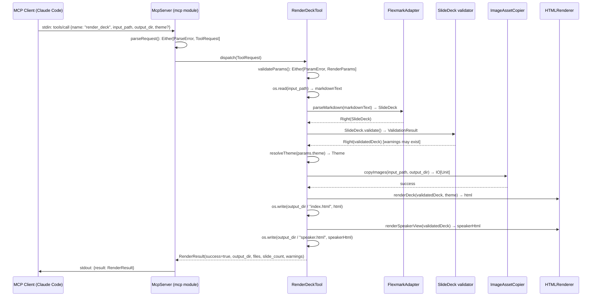
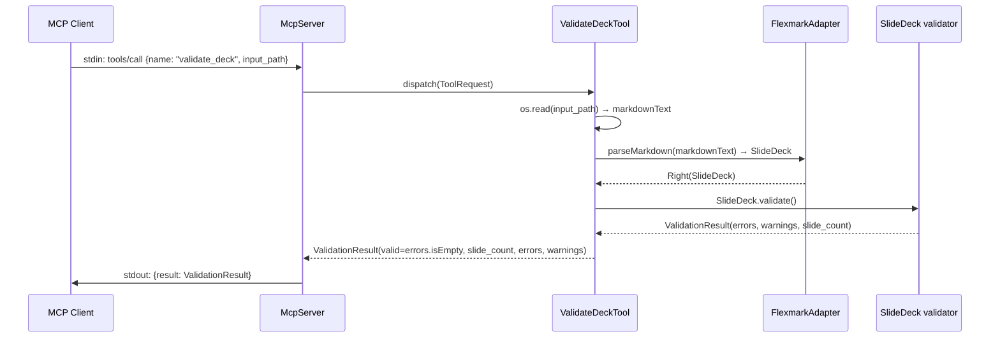

# MS-012: MCP Server Tier 1 — Sequence Diagrams (Pre-scaffold Gate)

**Status:** Pre-scaffold gate — sequence diagrams for review before implementation
**Related:** ADR-013 (file-in/file-out architecture), MS-012 (WORK-QUEUE)
**Date:** 2026-05-17

---

## render_deck — Happy Path



**Notes:**
- Warnings (density, accessibility) are collected but do NOT fail the render
- `theme` defaults to `light` if not supplied
- `output_dir` is created if it doesn't exist (`os.makeDir.all`)
- `files` in the result lists `["index.html", "speaker.html"]` + any JS support files

---

## render_deck — Primary Error Paths

```mermaid
sequenceDiagram
    participant C as MCP Client (Claude Code)
    participant S as McpServer
    participant P as RenderDeckTool
    participant F as FlexmarkAdapter

    Note over C,F: Error Path A — Input file not found

    C->>S: stdin: tools/call {name: "render_deck", input_path: "missing.md", output_dir}
    S->>P: dispatch(ToolRequest)
    P->>P: os.exists(input_path) → false
    P-->>S: Left(McpError("Input file not found: missing.md"))
    S->>C: stdout: {error: {code: -32602, message: "Input file not found: missing.md"}}

    Note over C,F: Error Path B — Markdown parse fails (fatal structure error)

    C->>S: stdin: tools/call {name: "render_deck", input_path: "broken.md", output_dir}
    S->>P: dispatch(ToolRequest)
    P->>P: os.read(input_path) → markdownText
    P->>F: parseMarkdown(markdownText)
    F-->>P: Left(ParseError("No slides found in deck"))
    P-->>S: Left(McpError("Parse failed: No slides found in deck"))
    S->>C: stdout: {error: {code: -32603, message: "Parse failed: No slides found in deck"}}

    Note over C,F: Error Path C — Output dir write fails (permissions)

    C->>S: stdin: tools/call {name: "render_deck", input_path: "deck.md", output_dir: "/root/out"}
    S->>P: dispatch(ToolRequest)
    P->>P: os.read → markdownText; parseMarkdown → SlideDeck; renderDeck → html
    P->>P: os.makeDir.all("/root/out") → throws IOException
    P-->>S: Left(McpError("Cannot write to output directory: /root/out"))
    S->>C: stdout: {error: {code: -32603, message: "Cannot write to output directory: /root/out"}}
```

**Error code conventions (JSON-RPC 2.0):**
- `-32700` — Parse error (malformed JSON in request)
- `-32602` — Invalid params (input file not found, bad param types)
- `-32603` — Internal error (render failed, write failed, unexpected exception)

---

## validate_deck — Happy Path



**Notes:**
- `valid: true` when `errors` is empty (warnings are acceptable, not blocking)
- Returns slide count and both blocking errors + density warnings
- Does NOT write any files; safe to call on read-only inputs

---

## MCP Protocol Layer Design

### JSON-RPC 2.0 Wire Format

**Request (stdin):**
```json
{
  "jsonrpc": "2.0",
  "id": 1,
  "method": "tools/call",
  "params": {
    "name": "render_deck",
    "arguments": {
      "input_path": "/path/to/deck.md",
      "output_dir": "/path/to/output",
      "theme": "dark"
    }
  }
}
```

**Success response (stdout):**
```json
{
  "jsonrpc": "2.0",
  "id": 1,
  "result": {
    "content": [{
      "type": "text",
      "text": "{\"success\":true,\"output_dir\":\"/path/to/output\",\"files\":[\"index.html\",\"speaker.html\"],\"slide_count\":12,\"warnings\":[]}"
    }]
  }
}
```

**Error response (stdout):**
```json
{
  "jsonrpc": "2.0",
  "id": 1,
  "error": {
    "code": -32602,
    "message": "Input file not found: /path/to/missing.md"
  }
}
```

### tools/list Response

```json
{
  "jsonrpc": "2.0",
  "id": 1,
  "result": {
    "tools": [
      {
        "name": "render_deck",
        "description": "Render a markdown slide deck to HTML. Returns paths to generated files.",
        "inputSchema": {
          "type": "object",
          "properties": {
            "input_path": {"type": "string", "description": "Path to .md deck file"},
            "output_dir": {"type": "string", "description": "Directory for generated HTML"},
            "theme": {"type": "string", "description": "Theme name (light/dark/corporate) or path to JSON theme file", "default": "light"},
            "no_copy_images": {"type": "boolean", "description": "Skip image asset copying", "default": false}
          },
          "required": ["input_path", "output_dir"]
        }
      },
      {
        "name": "validate_deck",
        "description": "Validate a markdown slide deck without rendering. Returns errors and warnings.",
        "inputSchema": {
          "type": "object",
          "properties": {
            "input_path": {"type": "string", "description": "Path to .md deck file"}
          },
          "required": ["input_path"]
        }
      }
    ]
  }
}
```

---

## Module Structure

```
mcp/
  src/com/tjmsolutions/mdslides/mcp/
    Main.scala             — IOApp entry point; reads stdin, dispatches, writes stdout
    McpServer.scala        — JSON-RPC 2.0 transport layer; request/response loop
    ToolRegistry.scala     — maps tool names → handlers
    tools/
      RenderDeckTool.scala  — render_deck handler
      ValidateDeckTool.scala — validate_deck handler
    model/
      McpRequest.scala      — case class for incoming JSON-RPC request
      McpResponse.scala     — case class for outgoing JSON-RPC response
      RenderResult.scala    — render_deck result model
      ValidationResult.scala — validate_deck result model
```

**Estimated LoC:** ~200 for transport layer + ~150 for tool handlers + ~100 for models = ~450 total.

---

## Gate Status

Pre-scaffold gate: **PASSED** — sequence diagrams for render_deck happy path and primary error path present. Implementation (MS-012) may proceed.
