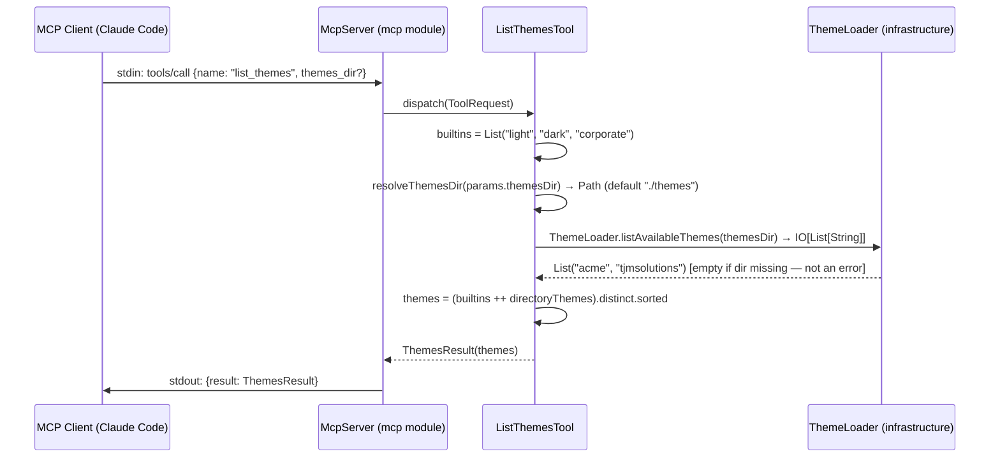
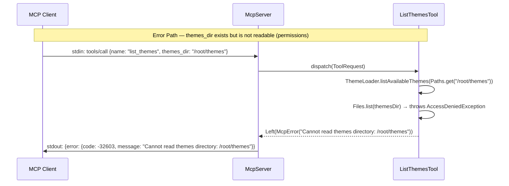
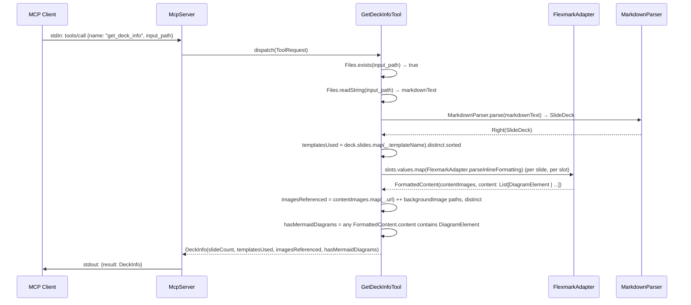
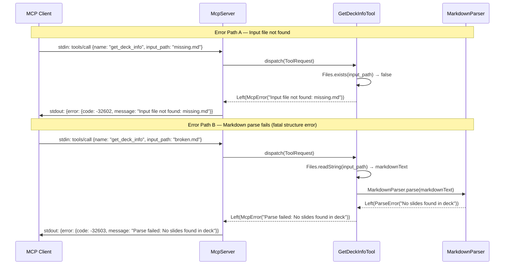

# MS-019: MCP Server Tier 2 — Sequence Diagrams (Pre-scaffold Gate)

**Status:** Pre-scaffold gate — sequence diagrams for review before implementation
**Related:** ADR-013 (file-in/file-out architecture, Tier 2 capability surface), MS-019 (WORK-QUEUE), MS-012 (Tier 1 — same pattern)
**Date:** 2026-07-11

---

## list_themes — Happy Path



**Notes:**
- Built-in themes (`light`, `dark`, `corporate`) are always included — they require no directory.
- `themes_dir` is optional; defaults to `./themes` (same default as CLI `--theme-dir`).
- A missing or nonexistent `themes_dir` is NOT an error — `ThemeLoader.listAvailableThemes` already returns `Nil` for a missing directory (see `infrastructure/.../theme/ThemeLoader.scala:98-111`), so the result degrades to built-ins only.
- A directory theme is valid only if it is a directory containing `theme.json` — same rule `ThemeLoader` already enforces.

---

## list_themes — Primary Error Path



**Notes:**
- There is deliberately no "not found" error path for `list_themes` — a missing directory is a valid, empty result (see happy-path note above). Only I/O failures on an existing-but-unreadable directory are errors.

---

## get_deck_info — Happy Path



**Notes:**
- Read-only: does not validate structure/content and does not render — deliberately cheaper than `validate_deck`.
- `images_referenced` combines inline content images (parsed per-slot via `FlexmarkAdapter.parseInlineFormatting`, same helper `RenderDeckTool`/CLI `Main.extractImageUrls` already use) and per-slide `backgroundImage` overrides (string or `BackgroundConfig`), deduplicated — mirrors `cli.Main.extractImageUrls` logic without depending on the `cli` module (ADR-013: `mcp` has no compile-time dependency on `cli`).
- `has_mermaid_diagrams` is derived by scanning parsed slot content for `DiagramElement`, not by checking `templateName == "diagram"` — a deck can reference Mermaid outside the dedicated diagram template.

---

## get_deck_info — Primary Error Paths



**Error code conventions (JSON-RPC 2.0, unchanged from MS-012):**
- `-32700` — Parse error (malformed JSON in request)
- `-32602` — Invalid params (input file not found, bad param types)
- `-32603` — Internal error (I/O failure, deck parse failure, unexpected exception)

---

## MCP Protocol Layer — tools/list Additions

```json
{
  "name": "list_themes",
  "description": "List available built-in and directory-based themes.",
  "inputSchema": {
    "type": "object",
    "properties": {
      "themes_dir": {
        "type": "string",
        "description": "Directory containing directory-based themes (default: ./themes)"
      }
    },
    "required": []
  }
}
```

```json
{
  "name": "get_deck_info",
  "description": "Inspect a markdown slide deck without rendering: slide count, templates used, images referenced, and whether it contains Mermaid diagrams.",
  "inputSchema": {
    "type": "object",
    "properties": {
      "input_path": {
        "type": "string",
        "description": "Absolute or relative path to the .md deck file"
      }
    },
    "required": ["input_path"]
  }
}
```

**Result shapes (per ADR-013):**

```json
{"themes": ["corporate", "dark", "light", "tjmsolutions"]}
```

```json
{
  "slide_count": 12,
  "templates_used": ["title", "two-column", "body"],
  "images_referenced": ["images/logo.png"],
  "has_mermaid_diagrams": false
}
```

---

## Module Structure (additions to MS-012's layout)

```
mcp/
  src/com/tjmsolutions/mdslides/mcp/
    McpServer.scala          — add "list_themes" / "get_deck_info" tool descriptors + dispatch cases
    tools/
      ListThemesTool.scala    — list_themes handler (wraps infrastructure ThemeLoader)
      GetDeckInfoTool.scala   — get_deck_info handler
    model/
      McpModels.scala         — add ThemesResult, DeckInfo case classes + Encoders
```

**Estimated LoC:** ~60 for the two tool handlers + ~30 for models + ~30 for McpServer wiring = ~120 total (smaller than Tier 1 — both tools are read-only, no rendering/writing).

---

## Gate Status

Pre-scaffold gate: **PASSED** — sequence diagrams for `list_themes` happy path + primary error path, and `get_deck_info` happy path + primary error paths, present. Implementation (MS-019) may proceed.
