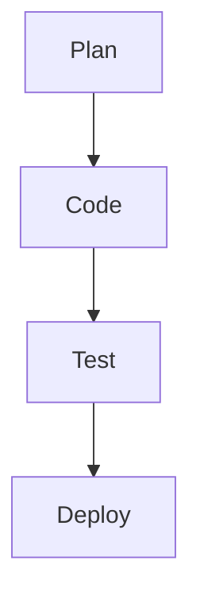
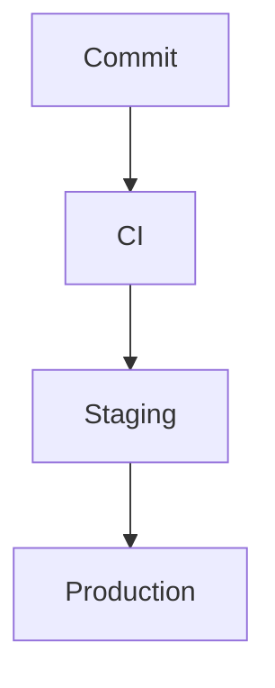

# MDSlides v3.0.0 - Design Specifications

**Status:** Design Discussion Complete
**Date:** 2025-12-29
**Version:** 3.0.0 (Future Release)

This document captures the complete design specifications for MDSlides v3.0.0 features, discussed and agreed upon during design sessions. These specifications will inform formal ceremonies (Event Storming, Three Amigos, Example Mapping) prior to implementation.

---

## Table of Contents

1. [Elapsed Presentation Timer](#1-elapsed-presentation-timer)
2. [Break Mode](#2-break-mode)
3. [Goto Function](#3-goto-function)
4. [Previous/Next Navigation](#4-previousnext-navigation)
5. [History Logging](#5-history-logging)
6. [Two-Column Layout](#6-two-column-layout)
7. [Header/Footer Enhancements](#7-headerfooter-enhancements)
8. [Report Command](#8-report-command)
9. [Display Command](#9-display-command)
10. [Smart Default Command](#10-smart-default-command)

---

## 1. Elapsed Presentation Timer

### Display Specifications

**Format:** `hh:mm:ss` (hours:minutes:seconds)

**Location:** Bottom-left corner of footer (mirroring page numbers on bottom-right)

**Initial Value:** `00:00:00` when presentation first displayed

**Styling:** Implemented as footer element (see Header/Footer Enhancements)

### Behavior

- **Start:** Automatically when presentation is displayed
- **Synchronized:** Between main presentation window and speaker view using BroadcastChannel API
- **Pause:** When Break mode is activated (B key)
- **Resume:** When Break mode is deactivated (B key again)
- **Pause during Goto:** Pauses during Goto function popup (G key)
- **Resume after Goto:** Resumes after Goto navigation completes
- **No Reset:** Timer runs continuously for entire session, no reset capability

### Technical Notes

- Will be implemented as footer element
- Requires cross-window sync via BroadcastChannel
- State management for pause/resume
- Updates every second via JavaScript interval

---

## 2. Break Mode

### Activation

**Keyboard:** `B` key (mnemonic: "Break")

**Action:** Toggles break mode on/off

### Behavior

1. Pauses elapsed presentation timer
2. Displays break screen (configurable)
3. Synchronized between main and speaker view
4. Pressing B again resumes presentation and timer

### Break Screen Configuration (4-layer precedence)

1. **CLI argument:** `--break-screen path/to/image.png`
2. **Project config:** `.mdslides/config.json` → `"breakScreen": "images/break.png"`
3. **Global config:** `~/.mdslides/config.json` → `"defaults": {"breakScreen": "~/break.png"}`
4. **Built-in default:** Black screen (`background: #000000`)

### Supported Break Screen Types

- Image files (PNG, JPG, SVG, etc.)
- Custom HTML slide (future enhancement)
- Solid color screen (default: black)

### Technical Requirements

- Keyboard event handler for B key
- Config layer for break screen path
- Timer state management for pause/resume
- Cross-window sync for speaker view

---

## 3. Goto Function

### Activation

**Keyboard:** `G` key (mnemonic: "Go to")

### Behavior Flow

1. Pause elapsed presentation timer
2. Display popup overlay with slide selector
3. User selects target slide (via number entry or list)
4. Navigate to selected slide
5. Resume elapsed presentation timer
6. Record navigation in history stack

### UI Design (To Be Determined)

- Popup overlay with semi-transparent backdrop
- Slide list or number entry field
- Preview of selected slide (optional)
- ESC key to cancel (returns to current slide, resumes timer)
- ENTER key to confirm selection

### History Impact

- Navigation via G adds to history stack
- Enables P (previous) to return to slide before Goto

---

## 4. Previous/Next Navigation

### P Key - Previous Viewed Slide

- Navigate to previously viewed slide (from history stack)
- History-based, not linear
- If no history exists, assume first slide (slide 0)
- Does NOT pause timer
- Adds current slide to history before navigating

### N Key - Next

- Navigate to next slide in history (if exists)
- If no forward history, interpret as "advance forward"
- Does NOT pause timer
- Standard forward navigation behavior

### History Stack Design

- Stack-based (LIFO for previous)
- Records slide index for each navigation
- Separate from linear slide order
- Enables non-linear presentation flow

### Example Flow

```
Viewed: 1 → 5 → 3 → 8
Press P: 8 → 3 → 5 → 1
Press N: 1 → 5 → 3 → 8
```

---

## 5. History Logging

### Activation

**Automatic when using:** `java -jar ../mdslides.jar display <deck-name>`

**No logging when:** Opening HTML file directly in browser

### Log File Location

**Path:** `<output-dir>/<deck-name>.log`

**Examples:**
- `mdslides-tutorial/mdslides-tutorial.log`
- `talks/conference-2025/conference-2025.log`
- `mdslides-tutorial-dark/mdslides-tutorial-dark.log`

**Behavior:**
- Single log file per output directory
- Overwrites previous session (one session per log)
- To preserve multiple sessions: copy output directory before re-presenting

### Log Contents

#### 1. Session Metadata
- Presentation start timestamp (ISO 8601 format)
- Presentation name
- Theme used
- Total slides

#### 2. Per-Slide Metrics
- Slide index/number
- Entry timestamp
- Exit timestamp
- Elapsed time on slide
- Navigation method (next, previous, goto, direct)

#### 3. Button Press Events
- Timestamp
- Key pressed (B, S, G, etc.)
- Action taken
- **Excluded keys:** P (previous), F (fullscreen toggle) - too noisy

#### 4. Session Summary
- Total presentation time
- Total slides viewed
- Navigation pattern analysis (optional)

### Example Log Format (JSON)

```json
{
  "session": {
    "presentationName": "mdslides-tutorial-dark",
    "startTime": "2025-12-29T14:23:45Z",
    "theme": "dark",
    "totalSlides": 42
  },
  "slides": [
    {
      "slideIndex": 0,
      "entryTime": "2025-12-29T14:23:45Z",
      "exitTime": "2025-12-29T14:24:12Z",
      "elapsedSeconds": 27,
      "navigationMethod": "start"
    },
    {
      "slideIndex": 1,
      "entryTime": "2025-12-29T14:24:12Z",
      "exitTime": "2025-12-29T14:25:03Z",
      "elapsedSeconds": 51,
      "navigationMethod": "next"
    }
  ],
  "events": [
    {
      "timestamp": "2025-12-29T14:26:15Z",
      "key": "B",
      "action": "break_mode_enabled"
    },
    {
      "timestamp": "2025-12-29T14:28:22Z",
      "key": "B",
      "action": "break_mode_disabled"
    },
    {
      "timestamp": "2025-12-29T14:29:10Z",
      "key": "S",
      "action": "speaker_view_opened"
    }
  ],
  "summary": {
    "totalDurationSeconds": 3600,
    "uniqueSlidesViewed": 38,
    "totalSlideViews": 45
  }
}
```

### Use Cases

- Post-presentation analysis
- Rehearsal timing optimization
- Identifying slides that need more/less content
- Understanding navigation patterns
- Detecting presentation flow issues

---

## 6. Two-Column Layout

### Priority

**HIGH** - Explicitly marked as "important"

### Layout Specifications

**Column Split:** Even 50/50 width distribution

**Content Support:** All content types supported in each column
- Text (paragraphs, headings, lists)
- Images (local and remote)
- Code blocks (with syntax highlighting)
- Mermaid diagrams (pre-rendered SVG)
- Inline formatting (bold, italic, links, inline code)
- Mixed content types within single column

### Alignment Defaults

**Horizontal (content within columns):** Left-aligned
- Applies to both single-column and two-column layouts
- Maintains consistency across template types

**Vertical (column content positioning):** Center-aligned
- Each column's content vertically centered within available space
- Applies to both single-column and two-column layouts

### Template Syntax (Proposed)

**Option 1 - New template type with column delimiter:**
```markdown
---
template: two-column
---

## Left Column Content

This is the first column with text, images, code, etc.

```scala
case class Example(value: String)
```

---column---

## Right Column Content

This is the second column.


- Bullet points
- More content
```

**Option 2 - Directive within content template:**
```markdown
---
template: content
layout: two-column
---

<!-- Left column -->
## First Column

Content here

<!-- Right column -->
## Second Column

Content here
```

### CSS Grid Implementation (Proposed)

```css
.two-column-layout {
  display: grid;
  grid-template-columns: 1fr 1fr;  /* Even 50/50 split */
  gap: 2rem;  /* Spacing between columns */
  align-items: center;  /* Vertical center alignment */
  height: 100%;
}

.column {
  text-align: left;  /* Horizontal left alignment */
  display: flex;
  flex-direction: column;
  justify-content: center;  /* Vertical centering of content */
}
```

### Responsive Behavior

- **Desktop/presentation mode:** Side-by-side columns
- **Mobile/narrow displays:** Consider stacking vertically (future enhancement)
- **Print mode:** Maintain side-by-side for presentation fidelity

### Implementation Files Affected

1. **Template definitions** - Add two-column template type
2. **Markdown parser** - Recognize `---column---` delimiter or layout directive
3. **Domain model** - Support multi-slot templates or column-aware slots
4. **HTMLRenderer.scala** - Generate two-column grid HTML
5. **Theme CSS** - Two-column layout styles with alignment defaults
6. **Accessibility** - Ensure proper reading order (left column before right)

### Accessibility Considerations

- HTML structure should preserve left-to-right reading order
- Use semantic markup (`<section>` or `<div role="region">`)
- Ensure keyboard navigation flows logically
- Screen readers should read left column completely before right column
- Alt text required for images in both columns (existing validation applies)

### Example Use Cases

#### 1. Code + Explanation
```markdown
---
template: two-column
---

## Implementation

```scala
def renderSlide(slide: Slide): Html =
  div(
    cls := "slide",
    renderSlots(slide.slots)
  )
```

---column---

## Explanation

This function renders a slide by:
1. Creating a div container
2. Adding the "slide" CSS class
3. Rendering all slot content
```

#### 2. Before/After Comparison
```markdown
---
template: two-column
---

## Before

Old approach with limitations:
- Manual HTML
- No validation
- Inconsistent styling

---column---

## After

New approach with benefits:
- Markdown simplicity
- WCAG validation
- Theme system
```

#### 3. Image + Description
```markdown
---
template: two-column
---


---column---

## System Architecture

The diagram shows:
- Client layer
- API gateway
- Service layer
- Data persistence
```

#### 4. Side-by-side Diagrams
```markdown
---
template: two-column
---

## Development Flow



---column---

## Deployment Pipeline


```

### Configuration Options (Future Enhancement)

While defaulting to 50/50 even splits, future versions could support:
```json
{
  "twoColumnDefaults": {
    "splitRatio": "50/50",
    "horizontalAlign": "left",
    "verticalAlign": "center",
    "gap": "2rem"
  }
}
```

### Technical Implementation Notes

#### 1. Parser Changes
Need to recognize `---column---` as slot separator:
- First section = left column slot
- Second section = right column slot
- Each slot independently parsed as FormattedContent

#### 2. Domain Model
Two-column template definition:
```scala
Template(
  name = "two-column",
  slots = List(
    SlotDefinition("left", required = true),
    SlotDefinition("right", required = true)
  )
)
```

#### 3. HTML Rendering
Grid layout with semantic structure:
```scala
def renderTwoColumn(leftSlot: FormattedContent, rightSlot: FormattedContent): Frag =
  div(
    cls := "two-column-layout",
    section(
      cls := "column column-left",
      attr("aria-label") := "Left column",
      renderFormattedContent(leftSlot)
    ),
    section(
      cls := "column column-right",
      attr("aria-label") := "Right column",
      renderFormattedContent(rightSlot)
    )
  )
```

#### 4. Diagram Support
Each column can contain mermaid diagrams:
- Pre-rendering occurs before column split
- SVG size constraints apply within column width (max 50% viewport)
- Vertical scaling remains at 70vh maximum

---

## 7. Header/Footer Enhancements

### Header Specifications

#### Content
Display slide title/heading

#### Positioning (Configurable)

**Default:** `top-of-content` (current behavior)
- Positioned inside the content area
- Below the slide margin/padding
- Title is part of content flow

**Optional:** `top-of-slide`
- Positioned at the very top of the slide
- Above content margins
- Fixed header bar spanning full slide width

#### Configuration (4-layer precedence)

```json
{
  "headerPosition": "top-of-content"  // or "top-of-slide"
}
```

#### CLI Override

```bash
mdslides render deck.md --header-position top-of-slide
```

### Footer Specifications

#### Layout

Three-section horizontal bar:

```
┌─────────────────────────────────────────────────────────┐
│ 00:15:23    Internal Only - Do not Distribute    12/42 │
│ (left)      (center)                              (right)│
└─────────────────────────────────────────────────────────┘
```

#### Left Section: Elapsed Time
- Format: `hh:mm:ss`
- Left-justified
- Synced between main and speaker view
- Pauses during break mode (B key)
- Starts at `00:00:00`

#### Center Section: Custom Footer Text
- Optional custom string
- Center-justified
- Can be empty (no text displayed)
- Configurable via 4-layer precedence

#### Right Section: Page Numbers
- Format: `current/total` (e.g., `12/42`)
- Right-justified
- Updates as slides change
- Current behavior maintained

### Footer Text Configuration (4-layer precedence)

#### 1. CLI Argument (Highest Priority)

```bash
# Short form
mdslides render deck.md --footer-text foo

# Full text with spaces
mdslides render deck.md --footer-text "Internal Only - Do not Distribute"

# Explicitly empty
mdslides render deck.md --footer-text ""
```

#### 2. Slide-Level Override (Author in frontmatter)

```markdown
---
template: content
footer-text: "Confidential - Q4 2025"
---

## Slide Content
```

#### 3. Template-Level Default

Template definitions include default footer text:
```scala
Template(
  name = "content",
  footerText = Some(""),  // Empty by default
  slots = ...
)

// Or for specific templates:
Template(
  name = "confidential",
  footerText = Some("Internal Use Only"),
  slots = ...
)
```

#### 4. Project/Global Config

```json
// .mdslides/config.json (project)
{
  "footerText": "© 2025 TJM Solutions"
}

// ~/.mdslides/config.json (global)
{
  "defaults": {
    "footerText": ""
  }
}
```

#### 5. Built-in Default

Empty string (no center text displayed)

### CSS Implementation (Proposed)

```css
/* Header positioning */
.slide-header.top-of-content {
  /* Current behavior - part of content flow */
  margin-bottom: 1.5rem;
}

.slide-header.top-of-slide {
  /* New behavior - fixed at top */
  position: absolute;
  top: 0;
  left: 0;
  right: 0;
  padding: 1rem 2rem;
  background: rgba(255, 255, 255, 0.05);
  border-bottom: 1px solid rgba(255, 255, 255, 0.1);
}

/* Footer layout */
.slide-footer {
  position: absolute;
  bottom: 0;
  left: 0;
  right: 0;
  display: grid;
  grid-template-columns: 1fr 2fr 1fr;  /* Left, Center (wider), Right */
  padding: 0.75rem 2rem;
  font-size: 0.9rem;
  background: rgba(0, 0, 0, 0.05);
  border-top: 1px solid rgba(0, 0, 0, 0.1);
}

.footer-elapsed-time {
  text-align: left;
  font-family: 'Courier New', monospace;
}

.footer-custom-text {
  text-align: center;
  font-weight: 500;
}

.footer-page-numbers {
  text-align: right;
  font-family: 'Courier New', monospace;
}

/* Theme-aware styling */
.theme-dark .slide-footer {
  background: rgba(255, 255, 255, 0.05);
  border-top: 1px solid rgba(255, 255, 255, 0.1);
}
```

### HTML Structure (Proposed)

```html
<!-- Header: top-of-content (default) -->
<div class="slide-content">
  <header class="slide-header top-of-content">
    <h2>Slide Title</h2>
  </header>
  <div class="slide-body">
    <!-- Slide content -->
  </div>
</div>

<!-- Header: top-of-slide (configured) -->
<div class="slide-wrapper">
  <header class="slide-header top-of-slide">
    <h2>Slide Title</h2>
  </header>
  <div class="slide-content">
    <!-- Slide content without header -->
  </div>
</div>

<!-- Footer (always present) -->
<footer class="slide-footer">
  <div class="footer-elapsed-time" id="elapsed-time">00:00:00</div>
  <div class="footer-custom-text">Internal Only - Do not Distribute</div>
  <div class="footer-page-numbers">
    <span id="current-slide">12</span>/<span id="total-slides">42</span>
  </div>
</footer>
```

### Implementation Files Affected

1. **HTMLRenderer.scala** - Generate header/footer HTML with configuration
2. **Main.scala** - Parse `--footer-text` and `--header-position` CLI args
3. **ConfigManager.scala** - Support `footerText` and `headerPosition` in config layers
4. **Theme CSS files** - Footer and header styling for each theme
5. **JavaScript (timer)** - Update footer elapsed time element
6. **Domain model** - Add `footerText` and `headerPosition` to relevant types

### Example Use Cases

#### 1. Corporate Presentation
```bash
mdslides render quarterly-results.md \
  --theme retisio \
  --footer-text "Confidential - Q4 2025"
```

#### 2. Public Conference Talk
```bash
mdslides render conference-talk.md \
  --theme dark \
  --footer-text "ScalaCon 2025"
```

#### 3. Internal Training
```bash
mdslides render training.md \
  --footer-text "Internal Only - Do not Distribute" \
  --header-position top-of-slide
```

#### 4. No Footer Text (Clean)
```bash
mdslides render deck.md --footer-text ""
```

#### 5. Per-Slide Footer Override
```markdown
---
template: content
footer-text: "Special Notice"
---

This slide has custom footer text different from the rest.

---
template: content
---

This slide uses the default footer text from config/CLI.
```

### Accessibility Considerations

#### Footer
- Use semantic `<footer>` element
- Include `role="contentinfo"` for screen readers
- Ensure sufficient contrast for footer text
- Footer should not obscure main content
- Timer updates should not trigger screen reader announcements (use `aria-live="off"`)

#### Header
- Use semantic `<header>` element when `top-of-slide`
- Maintain proper heading hierarchy (h1 for title slide, h2 for content slides)
- Ensure header doesn't overlap with content

### Configuration Schema Updates

#### AppConfig Additions

```scala
case class AppConfig(
  // ... existing fields ...
  footerText: Option[String] = None,
  headerPosition: HeaderPosition = HeaderPosition.TopOfContent
)

enum HeaderPosition:
  case TopOfContent
  case TopOfSlide
```

#### JSON Schema

```json
{
  "footerText": {
    "type": "string",
    "description": "Custom text displayed in footer center",
    "default": ""
  },
  "headerPosition": {
    "type": "string",
    "enum": ["top-of-content", "top-of-slide"],
    "default": "top-of-content",
    "description": "Position of slide header/title"
  }
}
```

---

## 8. Report Command

### Purpose

Display formatted presentation session log in console

### Syntax

```bash
java -jar ../mdslides.jar report <deck-name>

# Examples:
java -jar ../mdslides.jar report mdslides-tutorial
java -jar ../mdslides.jar report talks/conference-2025
```

### Behavior

1. Resolve deck name to output directory (same as render)
   - `mdslides-tutorial` → `mdslides-tutorial/`
   - `talks/conference-2025` → `talks/conference-2025/`

2. Look for log file: `<output-dir>/<deck-name>.log`
   - Example: `mdslides-tutorial/mdslides-tutorial.log`

3. Parse log file (JSON or structured format)

4. Display nicely formatted console output

### Error Handling

- **If log file doesn't exist:** `✗ No log file found for presentation: <deck-name>`
- **If log file is corrupted:** `✗ Failed to parse log file: <error>`
- **If output directory doesn't exist:** `✗ Presentation not found: <deck-name>`

### Report Output Format (Proposed)

```
═══════════════════════════════════════════════════════════════
  Presentation Report: mdslides-tutorial
═══════════════════════════════════════════════════════════════

Session Information:
  Started:        2025-12-29 14:23:45
  Duration:       00:45:32
  Theme:          dark
  Total Slides:   42
  Slides Viewed:  38/42 (90%)

Slide Timing Summary:
  ┌─────┬──────────────────────────────────────┬──────────┐
  │ No. │ Title                                │ Duration │
  ├─────┼──────────────────────────────────────┼──────────┤
  │  1  │ MDSlides v2.0.0                      │ 00:00:27 │
  │  2  │ About This Tutorial                  │ 00:00:51 │
  │  3  │ Configuration Precedence             │ 00:01:15 │
  │  4  │ Project Configuration                │ 00:00:45 │
  │  5  │ Global Configuration                 │ 00:01:02 │
  │ ... │ ...                                  │ ...      │
  │ 42  │ Thank You!                           │ 00:00:18 │
  └─────┴──────────────────────────────────────┴──────────┘

Top 5 Longest Slides:
  1. Mermaid Diagrams (Slide 12)           03:25
  2. Two-Column Layout (Slide 18)          02:47
  3. Accessibility Features (Slide 28)     02:15
  4. Configuration System (Slide 3)        01:15
  5. Code Highlighting (Slide 23)          01:02

Events Log:
  14:26:15  [B] Break mode enabled
  14:28:22  [B] Break mode disabled
  14:29:10  [S] Speaker view opened
  14:35:42  [G] Goto slide 25
  14:40:18  [B] Break mode enabled
  14:42:05  [B] Break mode disabled

Navigation Statistics:
  Forward navigations:      35
  Backward navigations:     8
  Goto jumps:              3
  Slides revisited:        7

═══════════════════════════════════════════════════════════════
```

---

## 9. Display Command

### Purpose

Open rendered presentation in browser with history logging enabled

### Syntax

```bash
java -jar ../mdslides.jar display <deck-name>

# Examples:
java -jar ../mdslides.jar display mdslides-tutorial
java -jar ../mdslides.jar display mdslides-tutorial-dark
java -jar ../mdslides.jar display talks/conference-2025
```

### Behavior

1. Resolve deck name to output directory
   - `mdslides-tutorial` → `mdslides-tutorial/`
   - `mdslides-tutorial-dark` → `mdslides-tutorial-dark/`

2. Check if `index.html` exists in output directory
   - If not: `✗ Presentation not rendered. Run 'mdslides render <deck-name>' first.`

3. Launch browser with `file://<absolute-path>/index.html`

4. **Enable history logging** - Inject JavaScript to log session to `<deck-name>.log`

5. Return to console (non-blocking)

### Browser Selection (4-layer config)

#### 1. CLI Argument
```bash
mdslides display deck --browser firefox
mdslides display deck --browser "google-chrome"
```

#### 2. Project Config
```json
{
  "browser": "firefox"
}
```

#### 3. Global Config
```json
{
  "defaults": {
    "browser": "chromium"
  }
}
```

#### 4. Built-in Default
- **Linux:** `xdg-open` (system default browser)
- **macOS:** `open` (system default browser)
- **Windows:** `start` (system default browser)

### Supported Browser Values

- `"default"` - Use system default (xdg-open, open, start)
- `"firefox"` - Mozilla Firefox
- `"chromium"` - Chromium
- `"google-chrome"` - Google Chrome
- `"brave"` - Brave Browser
- Custom path: `"/usr/bin/custom-browser"`

### Implementation (Scala)

```scala
def launchBrowser(htmlPath: Path, browser: String): IO[Unit] =
  IO {
    val url = s"file://${htmlPath.toAbsolutePath}"
    val command = browser.toLowerCase match
      case "default" =>
        if System.getProperty("os.name").contains("Linux") then
          Seq("xdg-open", url)
        else if System.getProperty("os.name").contains("Mac") then
          Seq("open", url)
        else
          Seq("cmd", "/c", "start", url)
      case "firefox" => Seq("firefox", url)
      case "chromium" => Seq("chromium", url)
      case "google-chrome" => Seq("google-chrome", url)
      case "brave" => Seq("brave", url)
      case customPath => Seq(customPath, url)

    Process(command).run()
    println(s"✓ Opened presentation in browser: $url")
  }
```

---

## 10. Smart Default Command

### Purpose

Intelligent workflow combining report, render, and display based on file state

### Syntax

```bash
java -jar ../mdslides.jar <deck-name>

# Examples:
java -jar ../mdslides.jar mdslides-tutorial
java -jar ../mdslides.jar talks/conference-2025
```

### Behavior Flow

```
┌─────────────────────────────────────────────┐
│ Step 1: Check for log file                 │
│   <output-dir>/<deck-name>.log              │
└──────────────┬──────────────────────────────┘
               │
               ├─ If exists ──> Run REPORT command
               │                Display formatted log
               │                Ask: "Press Enter to continue..."
               │
               └─ If not exists ──> Continue to Step 2

┌─────────────────────────────────────────────┐
│ Step 2: Check render status                │
│   Compare source vs output timestamps       │
└──────────────┬──────────────────────────────┘
               │
               ├─ Output doesn't exist ──> Run RENDER + DISPLAY
               │                            Build presentation
               │                            Open in browser
               │
               ├─ Source newer than output ──> Run RENDER + DISPLAY
               │                                Rebuild presentation
               │                                Open in browser
               │
               └─ Output up-to-date ──> Run DISPLAY only
                                        Open in browser
```

### Implementation Logic

```scala
def smartDefaultCommand(deckName: String, config: AppConfig): IO[Unit] =
  for {
    // Step 1: Check for log file
    outputDir <- IO.pure(PathResolver.determineOutputDir(deckName))
    logFile = outputDir.resolve(s"${outputDir.getFileName}.log")
    hasLog <- IO(Files.exists(logFile))

    // If log exists, show report first
    _ <- if hasLog then
      reportCommand(deckName) *>
      IO.println("\nPress Enter to continue...") *>
      IO.readLine
    else
      IO.unit

    // Step 2: Check render status
    sourceFile <- IO.fromEither(PathResolver.findInputFile(deckName))
    indexFile = outputDir.resolve("index.html")
    outputExists <- IO(Files.exists(indexFile))

    needsRender <- if !outputExists then
      IO.pure(true)
    else
      IO {
        val sourceTime = Files.getLastModifiedTime(sourceFile)
        val outputTime = Files.getLastModifiedTime(indexFile)
        sourceTime.compareTo(outputTime) > 0
      }

    // Render if needed
    _ <- if needsRender then
      IO.println(s"Rendering presentation: $deckName") *>
      renderCommand(deckName, config)
    else
      IO.println(s"Presentation up-to-date: $deckName")

    // Always display
    _ <- displayCommand(deckName, config)
  } yield ()
```

### Example Scenarios

#### Scenario 1: First Time Presenting

```bash
$ java -jar ../mdslides.jar mdslides-tutorial
Rendering presentation: mdslides-tutorial
✓ Pre-rendering 8 mermaid diagram(s)...
✓ Rendering HTML with theme: dark
✓ Writing files to: mdslides-tutorial/
✓ Opened presentation in browser: file:///path/to/mdslides-tutorial/index.html
```

#### Scenario 2: After Giving Presentation (log exists)

```bash
$ java -jar ../mdslides.jar mdslides-tutorial
═══════════════════════════════════════════════════════════════
  Presentation Report: mdslides-tutorial
═══════════════════════════════════════════════════════════════
[... formatted log output ...]

Press Enter to continue...

Presentation up-to-date: mdslides-tutorial
✓ Opened presentation in browser: file:///path/to/mdslides-tutorial/index.html
```

#### Scenario 3: Modified Source File

```bash
$ java -jar ../mdslides.jar mdslides-tutorial
Rendering presentation: mdslides-tutorial (source modified)
✓ Pre-rendering 8 mermaid diagram(s)...
✓ Rendering HTML with theme: dark
✓ Writing files to: mdslides-tutorial/
✓ Opened presentation in browser: file:///path/to/mdslides-tutorial/index.html
```

---

## Complete CLI Command Summary

### All Commands

1. **`mdslides render <deck-name> [options]`**
   - Render markdown to HTML presentation
   - Options: `--theme`, `--footer-text`, `--header-position`, etc.

2. **`mdslides display <deck-name> [options]`**
   - Open rendered presentation in browser
   - Enables history logging
   - Options: `--browser`

3. **`mdslides report <deck-name>`**
   - Display formatted session log
   - Shows timing, navigation, events

4. **`mdslides <deck-name>`** (Smart default)
   - Report (if log exists) → Render (if needed) → Display
   - Convenience command for common workflow

5. **`mdslides config`**
   - Display merged configuration (existing)

6. **`mdslides --help`**
   - Show help text (existing)

### Workflow Examples

#### First-Time Presenter

```bash
# Write presentation
vim my-talk.md

# Quick preview (smart command)
mdslides my-talk

# Present to audience (creates log)
# ... give presentation ...

# Review session metrics
mdslides report my-talk
```

#### Iterative Development

```bash
# Edit source
vim my-talk.md

# Preview (auto-rebuilds if source changed)
mdslides my-talk

# Repeat...
```

#### Production Render with Options

```bash
# Explicit render with all options
mdslides render quarterly-review.md \
  --theme retisio \
  --footer-text "Confidential - Q4 2025" \
  --header-position top-of-slide

# Display in specific browser
mdslides display quarterly-review --browser firefox
```

---

## Next Steps

### Formal Ceremonies Required

1. **Event Storming**
   - Identify domain events for each feature
   - Map event flows and workflows
   - Discover hidden requirements

2. **Three Amigos**
   - Discuss scenarios and edge cases
   - Define acceptance criteria
   - Clarify ambiguities

3. **Example Mapping**
   - Create concrete examples for each feature
   - Document rules and constraints
   - Identify unknowns

### Implementation Planning

After formal ceremonies, create:
- User stories with acceptance criteria
- Technical tasks and spike tickets
- Test scenarios and test data
- Architecture decision records (ADRs)

### Design Decisions Deferred

The following design decisions require further discussion:

1. **Goto UI Design** - Exact popup implementation (list vs number entry vs both)
2. **Multi-session logging** - Single log vs date-sequenced logs
3. **Two-column parser** - Column delimiter syntax vs layout directive
4. **Report formatting** - ASCII table vs styled console output
5. **Browser detection** - Automatic detection vs manual configuration only

---

## Document History

- **2025-12-29:** Initial design specifications captured from design discussion session
