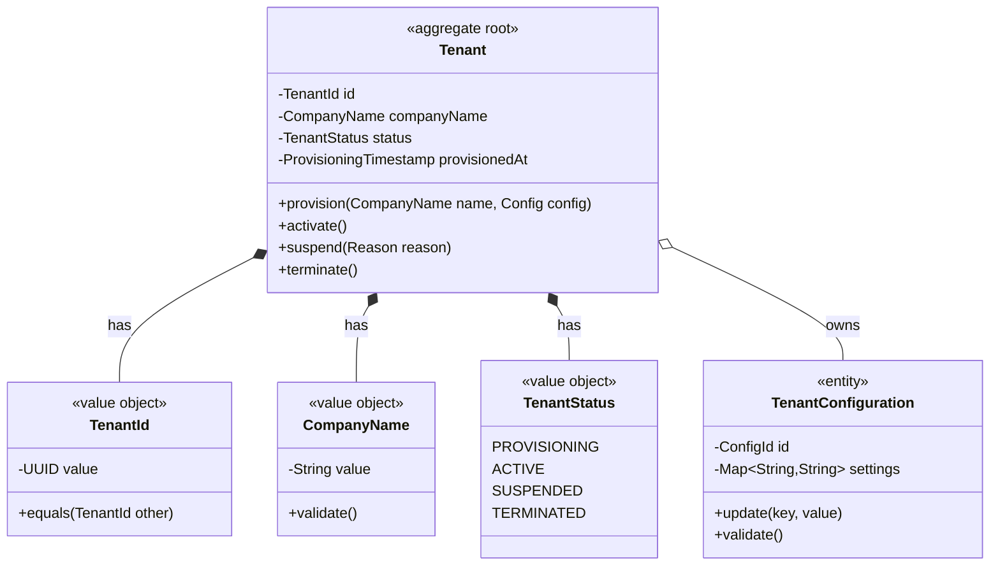
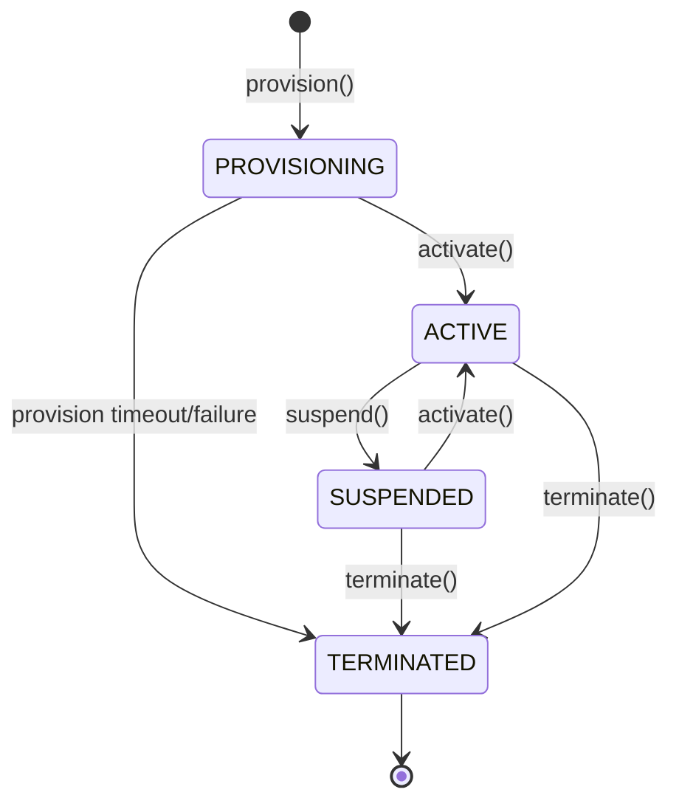

# Aggregate: [AGGREGATE-NAME]
## Domain Model & Invariants

---

```yaml
# MACHINE-READABLE METADATA
aggregate:
  name: AggregateName
  bounded_context: ContextName
  aggregate_root: EntityName
  version: 1.0.0
  created_date: YYYY-MM-DD
  last_updated: YYYY-MM-DD
  
ownership:
  domain_architect: architect@company.com
  product_owner: product.owner@company.com
  tech_lead: tech.lead@company.com
```

---

## 🎯 Purpose & Scope

**Purpose**: One-sentence description of what business capability this aggregate encapsulates.

**Bounded Context**: Which context does this aggregate belong to?

**Business Capability**: What business problem does this aggregate solve?

---

## 🏗️ Aggregate Structure

### Mermaid Class Diagram



---

## 📦 Components

### Aggregate Root

| Component | Type | Description | Responsibilities |
|-----------|------|-------------|------------------|
| **Tenant** | Entity (Aggregate Root) | Represents a provisioned tenant | Enforce tenant lifecycle, maintain invariants |

### Entities (within aggregate)

| Entity | Identity | Lifecycle | Why Inside Aggregate? |
|--------|----------|-----------|----------------------|
| **TenantConfiguration** | ConfigId | Managed by Tenant | Configuration validity depends on tenant state |

### Value Objects

| Value Object | Properties | Validation Rules | Immutable? |
|--------------|------------|------------------|------------|
| **TenantId** | UUID value | Must be valid UUID | ✅ Yes |
| **CompanyName** | String value | 3-50 chars, alphanumeric + hyphen, unique | ✅ Yes |
| **TenantStatus** | Enum (PROVISIONING, ACTIVE, SUSPENDED, TERMINATED) | Valid state transitions only | ✅ Yes |

---

## 🔒 Business Invariants

### Core Invariants

| Invariant | Enforcement Point | Examples | Exceptions |
|-----------|-------------------|----------|------------|
| **Tenant name must be unique across system** | provision() command | "acme-corp" can only exist once | None |
| **Only ACTIVE tenants can process requests** | All operations except activate() | Suspended tenant can't create users | Admin operations allowed |
| **Tenant cannot be terminated with active users** | terminate() command | Must suspend first, wait for cleanup | Force terminate with flag |
| **Configuration changes require ACTIVE state** | TenantConfiguration.update() | Can't change config during provisioning | None |

### State Transition Rules



| Transition | Allowed From | Triggered By | Preconditions | Side Effects |
|------------|--------------|--------------|---------------|--------------|
| **provision()** | None (new) | Admin command | Valid company name, config | Publishes TenantProvisioningRequested |
| **activate()** | PROVISIONING, SUSPENDED | System/Admin | All validations passed | Publishes TenantActivated |
| **suspend()** | ACTIVE | Admin command | None | Publishes TenantSuspended, blocks requests |
| **terminate()** | ACTIVE, SUSPENDED | Admin command | No active users (or force flag) | Publishes TenantTerminated, irreversible |

---

## 🎬 Commands & Events

### Commands (Write Operations)

| Command | Input | Output | Pre-conditions | Post-conditions |
|---------|-------|--------|----------------|-----------------|
| **provision(CompanyName, Config)** | Company name, config | TenantId | Name is unique | Tenant in PROVISIONING state |
| **activate()** | None | void | Status is PROVISIONING or SUSPENDED | Status is ACTIVE |
| **suspend(Reason)** | Suspension reason | void | Status is ACTIVE | Status is SUSPENDED |
| **terminate()** | None | void | Status is ACTIVE/SUSPENDED, no active users | Status is TERMINATED |

### Domain Events (Published)

| Event | Trigger | Payload | Consumers |
|-------|---------|---------|-----------|
| **TenantProvisioningRequested** | provision() called | tenantId, companyName, config, timestamp | Validation Service, Audit Log |
| **TenantActivated** | activate() called | tenantId, timestamp | Billing System, User Management |
| **TenantSuspended** | suspend() called | tenantId, reason, timestamp | Billing System, Notification Service |
| **TenantTerminated** | terminate() called | tenantId, reason, timestamp | Billing System, Cleanup Service |

---

## 📖 Queries (Read Operations)

| Query | Input | Output | Use Case |
|-------|-------|--------|----------|
| **getTenantById(TenantId)** | TenantId | Tenant | Lookup tenant details |
| **getTenantByCompanyName(CompanyName)** | CompanyName | Tenant | Check name uniqueness |
| **getTenantConfiguration(TenantId)** | TenantId | TenantConfiguration | Get config for operations |
| **listTenantsByStatus(TenantStatus)** | TenantStatus | List<Tenant> | Admin dashboard |

---

## 🧪 Example Scenarios (BDD)

### Scenario: Successful Tenant Provisioning

```gherkin
Feature: Tenant Provisioning
  As an admin
  I want to provision a new tenant
  So that customers can use the system

  Scenario: Provision tenant with valid company name
    Given the company name "acme-corp" is not already in use
    And a valid tenant configuration
    When I provision a tenant with company name "acme-corp"
    Then the tenant is created with status "PROVISIONING"
    And a "TenantProvisioningRequested" event is published
    And the tenant ID is returned
```

### Scenario: Reject Duplicate Company Name

```gherkin
  Scenario: Reject provisioning with duplicate company name
    Given a tenant already exists with company name "acme-corp"
    When I attempt to provision a tenant with company name "acme-corp"
    Then the provisioning is rejected
    And an error is returned: "Company name already in use"
    And no event is published
```

---

## 🔍 Aggregate Boundary Justification

### Why These Entities Are Together

**Tenant + TenantConfiguration**: Configuration validity depends on tenant state. Only ACTIVE tenants can modify config. Configuration is not shared across tenants.

### Why Not Bigger?

**Tenant Users**: Users have their own lifecycle independent of tenant state. Users are a separate aggregate with a reference to TenantId.

**Billing Account**: Billing has separate business rules (invoicing, payments). It's a downstream context that reacts to tenant events.

### Why Not Smaller?

**TenantConfiguration**: Could be a value object, but needs to track change history and has complex validation. Keeping it as entity inside Tenant maintains consistency.

---

## 🔗 Aggregate Dependencies

### References to Other Aggregates

| Referenced Aggregate | Relationship | How Referenced | Consistency Model |
|---------------------|--------------|----------------|-------------------|
| **ValidationService** | External | Query (ValidateTenantName) | Eventual (async validation) |
| **User** (User Context) | Downstream | TenantId reference | Eventual (users react to TenantActivated) |
| **BillingAccount** (Billing Context) | Downstream | TenantId reference | Eventual (billing reacts to TenantActivated) |

### Anti-Corruption Layer

**For Validation Service**: Wrap external service call in adapter to translate errors and handle failures.

```java
// Example
public class TenantNameValidator {
    public ValidationResult validate(CompanyName name) {
        try {
            ExternalValidationResponse response = validationServiceClient.validate(name.value());
            return ValidationResult.from(response); // Translate to domain model
        } catch (ServiceUnavailableException e) {
            return ValidationResult.failed("Validation service temporarily unavailable");
        }
    }
}
```

---

## 📊 Persistence

### Event Sourcing vs State Storage

**Approach**: [ ] Event Sourced  [X] State Stored (traditional)

**Rationale**: Tenant state changes are infrequent, and full event history is not critical for business operations. Audit log tracks key events.

### Aggregate Storage Schema

**Table**: `tenants`

| Column | Type | Description | Constraints |
|--------|------|-------------|-------------|
| id | UUID | Tenant ID (aggregate root) | PRIMARY KEY |
| company_name | VARCHAR(50) | Company name | UNIQUE, NOT NULL |
| status | VARCHAR(20) | Tenant status | NOT NULL, CHECK(status IN ...) |
| provisioned_at | TIMESTAMP | When provisioned | NULL if not ACTIVE |
| suspended_at | TIMESTAMP | When suspended | NULL if not SUSPENDED |
| terminated_at | TIMESTAMP | When terminated | NULL if not TERMINATED |

**Table**: `tenant_configurations`

| Column | Type | Description | Constraints |
|--------|------|-------------|-------------|
| id | UUID | Config ID | PRIMARY KEY |
| tenant_id | UUID | Tenant reference | FOREIGN KEY, NOT NULL |
| settings | JSONB | Config key-value pairs | NOT NULL |
| updated_at | TIMESTAMP | Last update | NOT NULL |

---

## 🧪 TDD Test Coverage

### Unit Tests (Aggregate Behavior)

| Test Name | What It Tests | Invariant Verified |
|-----------|---------------|-------------------|
| `shouldProvisionTenantWithUniqueName()` | provision() succeeds with unique name | Name uniqueness |
| `shouldRejectDuplicateCompanyName()` | provision() fails with duplicate name | Name uniqueness |
| `shouldActivateTenantAfterProvisioning()` | activate() transitions PROVISIONING → ACTIVE | State transition rules |
| `shouldRejectActivationFromTerminated()` | activate() fails from TERMINATED | State transition rules |
| `shouldSuspendActiveTenant()` | suspend() transitions ACTIVE → SUSPENDED | State transition rules |
| `shouldRejectTerminationWithActiveUsers()` | terminate() fails if users exist | Termination precondition |

### Property-Based Tests

**Property**: Tenant state transitions are deterministic and reversible (except TERMINATED)

```java
@Property
void tenantStateTransitionsAreConsistent(@ForAll Tenant tenant, @ForAll TenantStatus targetStatus) {
    TenantStatus initialStatus = tenant.getStatus();
    try {
        tenant.transitionTo(targetStatus);
        assertThat(tenant.getStatus()).isEqualTo(targetStatus);
    } catch (IllegalStateTransitionException e) {
        // Valid rejection - status unchanged
        assertThat(tenant.getStatus()).isEqualTo(initialStatus);
    }
}
```

---

## 🔗 Related Documentation

- **Event Storming Session**: [doc/domain-models/event-storming/tenant-context-events.md](../event-storming/tenant-context-events.md)
- **BDD Scenarios**: [features/tenant-provisioning.feature](../../../features/tenant-provisioning.feature)
- **Service Charter**: [doc/services/tenant-provisioning/SERVICE-CHARTER.md](../../services/tenant-provisioning/SERVICE-CHARTER.md)
- **Context Map**: [doc/domain-models/context-maps/system-context-map.md](../context-maps/system-context-map.md)
- **ADR**: [doc/governance/ADR/ADR-XXX-tenant-aggregate-design.md](../../governance/ADR/ADR-XXX-tenant-aggregate-design.md)

---

**Ceremony Type**: Domain Modeling Workshop (Phase 1: Discovery)  
**Last Updated**: YYYY-MM-DD  
**Domain Architect**: architect@company.com
