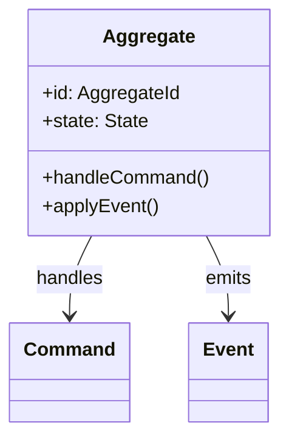
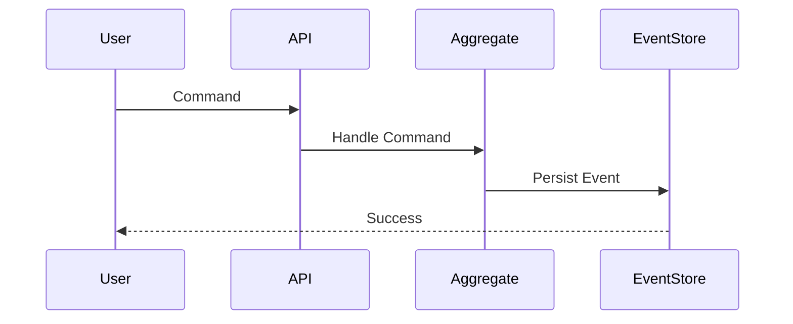
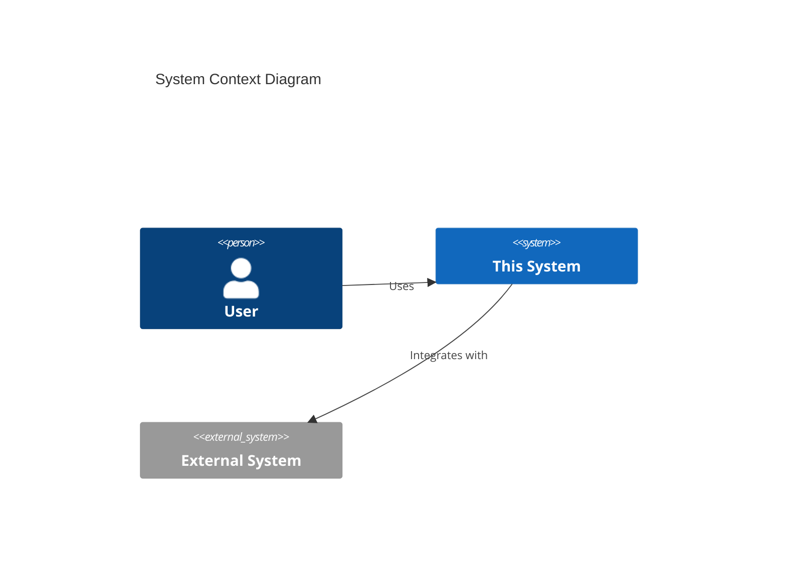
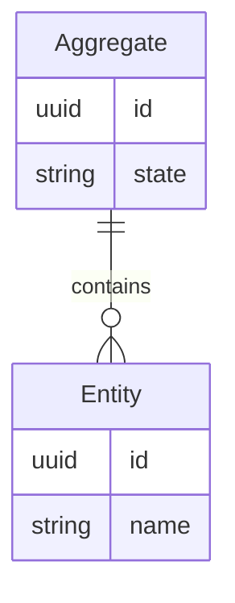

# [Ceremony Name] Demo
## [Feature/Epic Name]

**Date:** [YYYY-MM-DD]  
**Presenter:** [Name, Role]  
**Audience:** [Stakeholders/Team/Execs]

---

## Agenda

1. Context & Goal ([2 min])
2. What We Built ([5 min])
3. Live Demo ([10 min])
4. Technical Highlights ([3 min])
5. Next Steps ([2 min])
6. Q&A ([8 min])

**Total:** 30 minutes

---

## Context: Why This Matters

### Business Problem
[1-2 sentences describing the business problem this solves]

### User Impact
- **Before:** [Pain point]
- **After:** [Improvement]

### Strategic Alignment
[How this fits into larger roadmap/OKRs]

---

## What We Built

### Feature Overview
[2-3 sentence description of the feature]

### User Stories Completed
- ✅ [User Story 1]
- ✅ [User Story 2]
- ✅ [User Story 3]

---

## Live Demo 🎬

### Demo Scenario
**Actor:** [User persona]  
**Goal:** [What the user wants to accomplish]

### Happy Path Demo
1. [Step 1 description]
2. [Step 2 description]
3. [Step 3 description]

---

## Demo: [Step 1 Name]

**Action:** [What we're about to show]

```bash
# Command or API call
[command here]
```

**Expected Result:** [What should happen]

---

## Demo: [Step 2 Name]

**Action:** [What we're about to show]

**Screenshot/Diagram:**
[If applicable, reference screenshot or live demo]

**Expected Result:** [What should happen]

---

## Demo: [Step 3 Name]

**Action:** [What we're about to show]

**Expected Result:** [What should happen]

**Why This Matters:** [Business value of this step]

---

## Edge Cases & Error Handling

### What Happens If...
- ❌ **Invalid input:** [How system responds]
- ❌ **Timeout:** [How system handles]
- ❌ **Duplicate request:** [How system prevents]

**Demo:** [Show one error scenario if time permits]

---

## Technical Highlights

### Architecture Pattern
- **Pattern:** [DDD/Event Sourcing/CQRS/etc.]
- **Why:** [Rationale]

### Key Technologies
- [Tech 1]: [Purpose]
- [Tech 2]: [Purpose]
- [Tech 3]: [Purpose]

---

## Technical: Domain Model



[Brief explanation of domain model]

---

## Technical: Event Flow



[Brief explanation of event flow]

---

## Quality Metrics

### Test Coverage
- **Unit Tests:** [X%] (target: >80%)
- **Integration Tests:** [Y scenarios]
- **BDD Scenarios:** [Z scenarios]

### Validation Results
```bash
mill domainValidate:     ✅ 10/10 checks passed
mill scenarioValidate:   ✅ 7/7 scenarios passed
mill testFirstValidate:  ✅ All tests written first
```

---

## Performance

### Response Times
- **P50:** [X ms]
- **P95:** [Y ms]
- **P99:** [Z ms]

**Target:** [Target SLA]  
**Status:** ✅ Meeting SLA / ⚠️ Close to limit / ❌ Exceeds limit

### Load Testing
- **Throughput:** [X requests/sec]
- **Concurrency:** [Y concurrent users]

---

## Non-Functional Requirements

### Security
- ✅ Authentication: [Method]
- ✅ Authorization: [RBAC/ABAC]
- ✅ Input Validation: [Strategy]
- ✅ Audit Logging: [What's logged]

### Observability
- ✅ Metrics: [Prometheus/Grafana]
- ✅ Traces: [OpenTelemetry]
- ✅ Logs: [Structured JSON logging]
- ✅ Alerts: [Key alert conditions]

---

## What's NOT in This Demo

### Out of Scope (This Sprint)
- [Feature 1] - Planned for Sprint [X]
- [Feature 2] - Planned for Sprint [Y]
- [Feature 3] - Backlog

### Known Limitations
- [Limitation 1] - [Why it exists, when it'll be fixed]
- [Limitation 2] - [Why it exists, when it'll be fixed]

---

## Next Steps

### This Sprint
- [ ] [Remaining work item 1]
- [ ] [Remaining work item 2]

### Next Sprint
- [ ] [Follow-up feature 1]
- [ ] [Follow-up feature 2]

### Future Enhancements
- [Enhancement 1]
- [Enhancement 2]

---

## Impact & Value

### User Benefits
- 🎯 [Benefit 1] - [Quantified if possible]
- 🎯 [Benefit 2] - [Quantified if possible]
- 🎯 [Benefit 3] - [Quantified if possible]

### Business Metrics
- **Cost Savings:** [$ or %]
- **Time Savings:** [Hours/day]
- **Quality Improvement:** [Metric]

---

## Risks & Mitigations

### Identified Risks
- ⚠️ **[Risk 1]**
  - **Impact:** [High/Medium/Low]
  - **Mitigation:** [Strategy]

- ⚠️ **[Risk 2]**
  - **Impact:** [High/Medium/Low]
  - **Mitigation:** [Strategy]

---

## Documentation

### User Documentation
- [User Guide](link) - How to use the feature
- [API Documentation](link) - API reference

### Technical Documentation
- [Architecture Doc](link) - Design decisions
- [Domain Model](link) - Aggregates, events
- [Runbook](link) - Operations guide

---

## Feedback Requested

### Questions We Need Answered
1. [Question 1]
2. [Question 2]
3. [Question 3]

### Areas for Feedback
- [Aspect 1] - [Specific feedback request]
- [Aspect 2] - [Specific feedback request]

---

# Q&A ❓

**Demo Repository:** [GitHub link]  
**Documentation:** [Wiki/Confluence link]  
**Slack Channel:** [#channel-name]

---

## Backup Slides

[Additional slides for deeper dives if questions arise]

---

## Backup: Architecture Deep Dive

### System Context



---

## Backup: Data Model



---

## Backup: Deployment

### Environments
- **Dev:** [URL] - Continuous deployment
- **Staging:** [URL] - Daily deployment
- **Production:** [URL] - Weekly deployment

### Infrastructure
- **Cloud Provider:** [AWS/Azure/GCP]
- **Container Orchestration:** [Kubernetes/ECS]
- **Database:** [PostgreSQL/MongoDB]

---

## Backup: Monitoring Dashboard

### Key Metrics
- **Availability:** [X%]
- **Error Rate:** [Y%]
- **Latency:** [Z ms]

**Grafana Dashboard:** [Link]  
**Alert Manager:** [Link]
