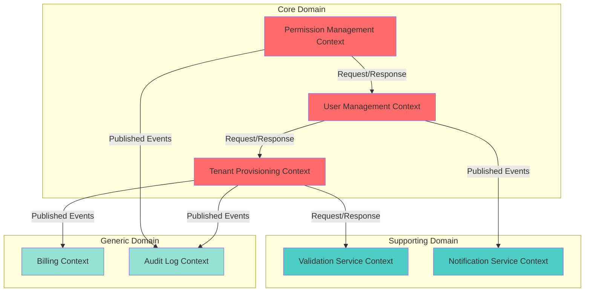

# Context Map: [SYSTEM-NAME]
## Bounded Context Relationships & Integration Patterns

---

```yaml
# MACHINE-READABLE METADATA
context_map:
  system_name: SystemName
  version: 1.0.0
  created_date: YYYY-MM-DD
  last_updated: YYYY-MM-DD
  
ownership:
  chief_architect: architect@company.com
  program_manager: pm@company.com
```

---

## 🎯 Purpose

This context map visualizes the relationships between **bounded contexts** in the system, showing:
- Context boundaries and responsibilities
- Integration patterns (Shared Kernel, Customer-Supplier, etc.)
- Upstream/downstream relationships
- Published language and anti-corruption layers

**Philosophy**: Contexts are organizational boundaries, not just technical boundaries. Each context may have different teams, release cycles, and priorities.

---

## 🗺️ System Context Map



---

## 📊 Context Catalog

| Context Name | Domain Type | Team | Bounded Responsibility | Core Aggregates |
|--------------|-------------|------|------------------------|-----------------|
| **Tenant Provisioning** | Core | Team Alpha | Provision and manage tenant lifecycle | Tenant, TenantConfiguration |
| **User Management** | Core | Team Beta | Manage users within tenants | User, UserProfile |
| **Permission Management** | Core | Team Beta | Control access via RBAC | Role, Permission |
| **Validation Service** | Supporting | Team Gamma | Validate tenant names, emails, etc. | ValidationRequest |
| **Notification Service** | Supporting | Team Gamma | Send emails, SMS, push notifications | Notification |
| **Billing** | Generic | External (3rd party) | Handle subscriptions, invoices, payments | BillingAccount, Invoice |
| **Audit Log** | Generic | Platform Team | Record all system events for compliance | AuditEvent |

---

## 🔗 Context Relationships

### 1. Tenant Provisioning → Billing Context

**Relationship Type**: **Customer-Supplier** (Tenant Provisioning is upstream, Billing is downstream)

**Integration Pattern**: **Published Language** (Domain Events)

**Description**: When a tenant is activated, Tenant Provisioning publishes a `TenantActivated` event. Billing Context subscribes and creates a billing account.

**Published Events**:
- `TenantActivated` (tenantId, companyName, timestamp)
- `TenantSuspended` (tenantId, reason, timestamp)
- `TenantTerminated` (tenantId, timestamp)

**Contract**:
```json
// Event: TenantActivated
{
  "eventType": "TenantActivated",
  "tenantId": "uuid",
  "companyName": "string",
  "timestamp": "iso8601"
}
```

**Failure Handling**: 
- If Billing fails to create account, Tenant Provisioning does NOT rollback (eventual consistency)
- Billing retries failed events from event queue

**Documentation**: [Integration Contract: Tenant Provisioning → Billing](../../architecture/integration-contracts/tenant-provisioning-to-billing.md)

---

### 2. Tenant Provisioning → Validation Service Context

**Relationship Type**: **Customer-Supplier** (Validation Service is upstream, Tenant Provisioning is downstream)

**Integration Pattern**: **Anticorruption Layer** (Request/Response with adapter)

**Description**: Tenant Provisioning queries Validation Service to check company name uniqueness. Validation Service has its own data model, so Tenant Provisioning uses an ACL to translate.

**API Contract**:
```
POST /api/v1/validate/company-name
Request:
{
  "name": "acme-corp"
}

Response (Success):
{
  "valid": true,
  "conflicts": []
}

Response (Failure):
{
  "valid": false,
  "conflicts": ["acme-corporation", "acme-corp-usa"]
}
```

**Anticorruption Layer**:
```java
public class TenantNameValidator {
    private final ValidationServiceClient client;
    
    public ValidationResult validate(CompanyName name) {
        try {
            ExternalValidationResponse response = client.validateCompanyName(name.value());
            return ValidationResult.from(response); // Translate to domain model
        } catch (ServiceUnavailableException e) {
            // Fallback: allow provisioning, validate asynchronously later
            return ValidationResult.pending();
        }
    }
}
```

**Failure Handling**:
- **Circuit Breaker**: After 5 consecutive failures, fallback to pending validation
- **Timeout**: 5-second timeout, then fallback

**Documentation**: [Integration Contract: Tenant Provisioning → Validation Service](../../architecture/integration-contracts/tenant-provisioning-to-validation-service.md)

---

### 3. User Management → Tenant Provisioning Context

**Relationship Type**: **Customer-Supplier** (Tenant Provisioning is upstream, User Management is downstream)

**Integration Pattern**: **Conformist** (User Management conforms to Tenant Provisioning's model)

**Description**: User Management needs to know which tenant a user belongs to. It stores `TenantId` as a foreign key and queries Tenant Provisioning for tenant details.

**API Contract**:
```
GET /api/v1/tenants/{tenantId}
Response:
{
  "tenantId": "uuid",
  "companyName": "acme-corp",
  "status": "ACTIVE"
}
```

**Why Conformist?**:
- User Management is small team with limited resources
- Tenant Provisioning is stable and well-defined
- Cost of building ACL > cost of conforming

**Documentation**: [Integration Contract: User Management → Tenant Provisioning](../../architecture/integration-contracts/user-management-to-tenant-provisioning.md)

---

### 4. Permission Management → User Management Context

**Relationship Type**: **Shared Kernel** (both contexts share `UserId` and `TenantId` definitions)

**Integration Pattern**: **Shared Kernel** (common library)

**Description**: Permission Management and User Management are both owned by Team Beta and share a common library for `UserId` and `TenantId` value objects.

**Shared Library**: `common-identity-lib`

**Shared Types**:
```java
// Shared in common-identity-lib
public class UserId {
    private final UUID value;
}

public class TenantId {
    private final UUID value;
}
```

**Why Shared Kernel?**:
- Both contexts are owned by same team
- Tight coupling is acceptable (team coordination is easy)
- Avoids duplication of identity logic

**Risks**:
- Changes to shared library require coordination between contexts
- Breaking changes impact both contexts

**Mitigation**:
- Shared Kernel is **small and stable** (only identity types)
- Semantic versioning with deprecation policy

**Documentation**: [Shared Kernel: Identity Types](../../architecture/shared-kernels/identity-types.md)

---

### 5. Tenant Provisioning → Audit Log Context

**Relationship Type**: **Separate Ways** (loosely coupled, no direct integration)

**Integration Pattern**: **Published Events** (fire-and-forget)

**Description**: Tenant Provisioning publishes all domain events to an event bus. Audit Log subscribes and records events for compliance. Tenant Provisioning does NOT care if Audit Log is listening.

**Published Events**: (All domain events from Tenant Provisioning)
- `TenantProvisioningRequested`
- `TenantActivated`
- `TenantSuspended`
- `TenantTerminated`

**Contract**: Events use standard envelope format

```json
{
  "eventId": "uuid",
  "eventType": "TenantActivated",
  "aggregateId": "tenantId",
  "timestamp": "iso8601",
  "payload": { ... }
}
```

**Why Separate Ways?**:
- Audit Log is generic (works for all contexts)
- Tenant Provisioning should not depend on Audit Log

**Documentation**: [Event Bus Schema](../../architecture/event-bus-schema.md)

---

## 🎭 Integration Patterns Summary

| Pattern | When to Use | Examples in This System |
|---------|-------------|-------------------------|
| **Published Language** | Upstream publishes events, downstream subscribes | Tenant Provisioning → Billing |
| **Anticorruption Layer** | Protect domain from external model | Tenant Provisioning → Validation Service |
| **Conformist** | Small downstream conforms to upstream | User Management → Tenant Provisioning |
| **Shared Kernel** | Same team, shared code is acceptable | Permission Management ↔ User Management |
| **Separate Ways** | No direct integration needed | Tenant Provisioning → Audit Log |
| **Open Host Service** | Expose API for many consumers | (Not yet in system) |
| **Customer-Supplier** | Negotiated contract between teams | Most upstream/downstream relationships |

---

## 🚨 Context Boundaries & Ownership

| Context | Team | Primary Language | Deployment | Database |
|---------|------|------------------|------------|----------|
| **Tenant Provisioning** | Team Alpha | Java/Spring Boot | Kubernetes | PostgreSQL (tenant_db) |
| **User Management** | Team Beta | Java/Spring Boot | Kubernetes | PostgreSQL (user_db) |
| **Permission Management** | Team Beta | Java/Spring Boot | Kubernetes | PostgreSQL (permission_db) |
| **Validation Service** | Team Gamma | Python/FastAPI | Kubernetes | Redis (cache) |
| **Notification Service** | Team Gamma | Node.js/Express | Kubernetes | PostgreSQL (notification_db) |
| **Billing** | External (Stripe) | N/A | SaaS | N/A |
| **Audit Log** | Platform Team | Java/Spring Boot | Kubernetes | Elasticsearch |

---

## 🔄 Evolution & Refactoring

### Planned Changes

| Change | Reason | Impact | Timeline |
|--------|--------|--------|----------|
| **Split Tenant Provisioning into Tenant Lifecycle + Validation** | Validation logic is complex enough for own context | Medium (ACL needed) | Q1 2026 |
| **Replace Billing (Stripe) with In-House Billing** | Cost savings, custom features | High (new context, migration) | Q3 2026 |

### Historical Changes

| Date | Change | Reason |
|------|--------|--------|
| 2025-11-01 | Merged User + Permission contexts into separate contexts | User Management grew too large |
| 2025-09-15 | Split Tenant Provisioning from Monolith | Monolith becoming bottleneck |

---

## 📝 Context Map Maintenance

### When to Update This Map

- New bounded context added
- Context boundary changed (context split or merged)
- Integration pattern changed (e.g., from ACL to Conformist)
- Ownership transferred to different team

### Update Process

1. Propose change via PR
2. Review in **Context Mapping Ceremony** (Phase 1: Discovery)
3. Update Mermaid diagram
4. Update integration contracts
5. Notify affected teams

---

## 🔗 Related Documentation

- **Event Storming**: [doc/domain-models/event-storming/](../event-storming/) (discover context boundaries)
- **Integration Contracts**: [doc/architecture/integration-contracts/](../../architecture/integration-contracts/) (detailed contracts)
- **Service Charters**: [doc/services/](../../services/) (per-service documentation)
- **ADRs**: [doc/governance/ADR/](../../governance/ADR/) (architectural decisions about contexts)

---

**Ceremony Type**: Context Mapping (Phase 1: Discovery)  
**Last Updated**: YYYY-MM-DD  
**Chief Architect**: architect@company.com  
**Program Manager**: pm@company.com
