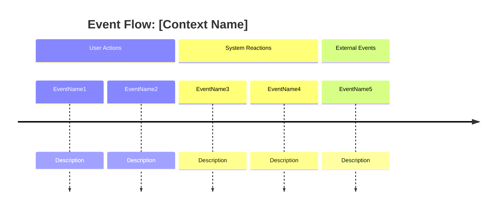
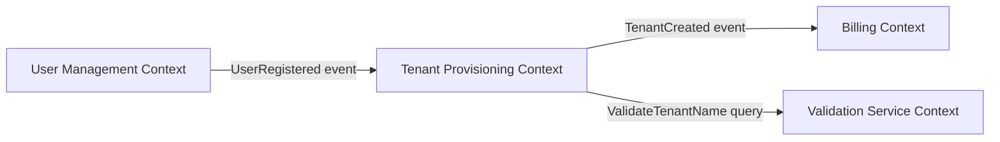

# Event Storming Session: [CONTEXT-NAME]
## Domain Events Discovery & Temporal Ordering

---

```yaml
# MACHINE-READABLE METADATA
session:
  id: ES-CONTEXT-YYYY-MM-DD
  context_name: ContextName
  session_date: YYYY-MM-DD
  facilitator: facilitator@company.com
  participants:
    - product.owner@company.com
    - architect@company.com
    - developer1@company.com
    - developer2@company.com
  duration_hours: 2-4
  status: draft | reviewed | approved
```

---

## 📋 Session Overview

**Context**: Brief description of the bounded context being explored (e.g., "Tenant Provisioning Context").

**Goal**: What domain problem or user journey are we exploring?

**Scope**: What's included and excluded from this session?

---

## 🎯 Domain Events (Orange Stickies)

### Temporal Flow



### Event Catalog

| Event Name | Trigger | Data | Questions/Issues |
|------------|---------|------|------------------|
| **TenantProvisioningRequested** | User submits provisioning form | tenantId, companyName, config | Who validates company name uniqueness? |
| **TenantNameValidated** | Validation service responds | tenantId, isValid, conflicts | What if validation service is down? |
| **TenantCreated** | All validations pass | tenantId, timestamp, config | Do we need to notify external systems? |
| **TenantProvisioningFailed** | Validation fails or timeout | tenantId, reason, timestamp | How do we handle retries? |

---

## 👤 Actors/External Systems (Yellow Stickies)

| Actor/System | Role | Events Triggered | Events Consumed |
|--------------|------|------------------|-----------------|
| **Admin User** | Initiates provisioning | TenantProvisioningRequested | TenantCreated, TenantProvisioningFailed |
| **Validation Service** | Validates tenant names | TenantNameValidated | TenantProvisioningRequested |
| **Billing System** | External billing | AccountCreated | TenantCreated |

---

## 📊 Commands (Blue Stickies)

| Command | Triggered By | Produces Event(s) | Business Rules |
|---------|-------------|-------------------|----------------|
| **ProvisionTenant** | Admin User | TenantProvisioningRequested | Must have valid company name, config |
| **ValidateTenantName** | Validation Service | TenantNameValidated | Name must be unique, valid characters |
| **CreateTenant** | System | TenantCreated | All validations passed |

---

## 📖 Read Models/Queries (Green Stickies)

| Query | Data Source | Used By | Notes |
|-------|-------------|---------|-------|
| **GetTenantStatus** | Tenant aggregate | Admin User | Shows provisioning progress |
| **ListPendingProvisioningRequests** | Event stream | Admin Dashboard | For monitoring |
| **GetTenantConfiguration** | Tenant aggregate | Other services | Config lookup |

---

## 🔒 Business Rules/Invariants (Bright Purple Stickies)

| Rule | Aggregate | Enforcement Point | Examples |
|------|-----------|-------------------|----------|
| **Tenant name must be unique** | Tenant | ProvisionTenant command | "acme-corp" can't be reused |
| **Provisioning timeout after 5 minutes** | Tenant | System policy | Auto-fail if validation takes too long |
| **Company name required** | Tenant | ProvisionTenant command | Can't provision without company name |

---

## ❓ Questions/Issues (Pink Stickies)

| Question | Asked By | Priority | Resolution |
|----------|----------|----------|------------|
| Who validates tenant name uniqueness? | Developer | High | Product Owner: Validation service (external) |
| What happens if billing system is down? | Architect | High | Product Owner: Queue for retry, provision anyway |
| Can users provision multiple tenants? | Developer | Medium | Product Owner: Yes, one per company |
| Do we need tenant name preview? | UX Designer | Low | Product Owner: Not in v1.0 |

---

## 🔄 Aggregate Candidates (Large Yellow Stickies)

Based on event clustering, potential aggregates:

| Aggregate Candidate | Events Owned | Business Rules | Notes |
|---------------------|--------------|----------------|-------|
| **Tenant** | TenantProvisioningRequested, TenantCreated, TenantProvisioningFailed | Uniqueness, timeout policy | Core aggregate |
| **TenantConfiguration** | TenantConfigurationUpdated | Config validation | Could be value object instead |

---

## 🗺️ Bounded Context Boundaries

### Upstream/Downstream Relationships



### Context Interactions

| Upstream Context | Downstream Context | Integration Pattern | Events/Commands Exchanged |
|------------------|-------------------|---------------------|---------------------------|
| User Management | Tenant Provisioning | Published Events | UserRegistered |
| Tenant Provisioning | Billing | Published Events | TenantCreated |
| Validation Service | Tenant Provisioning | Request/Response | ValidateTenantName (query) |

---

## 🎭 Hot Spots (Red Stickies)

Issues, conflicts, or areas needing further exploration:

| Hot Spot | Type | Description | Next Steps |
|----------|------|-------------|------------|
| **Validation Service Availability** | Risk | What if validation service is down? | Design ADR for fallback strategy |
| **Billing Integration Timing** | Conflict | When to notify billing: immediately or after full setup? | Product decision required |
| **Tenant Name Conflicts** | Complexity | How to handle near-duplicates (acme-corp vs acme_corp)? | Ubiquitous language workshop |

---

## ✅ Step 5: Validate CRUD/CPQ Coverage

**CRITICAL CHECK:** Event Storming discovers domain events, but services also need CRUD/CPQ operations.

### CRUD/CPQ Checklist

Review CHARTER.md service responsibilities and verify coverage:

- [ ] **Create:** What entities can be created? (Events: `<Entity>Created`)
- [ ] **Read/Query:** What queries are needed? ⚠️ **Queries don't emit events but MUST appear in Phase 2 scenarios**
- [ ] **Update/Patch:** What fields can be updated after creation? (Events: `<Entity>Updated`, `<Field>Changed`)
- [ ] **Delete/Archive:** How are entities removed? (Events: `<Entity>Deleted`, `<Entity>Archived`)

### Common Gap: Missing Query Operations

**State-machine-heavy services** often miss query/metadata operations during Event Storming because:
- Event Storming is state-transition-oriented
- Queries don't emit events (read-only)
- Teams focus on "things that change" vs "things we need to know"

**Example (Tenant Management Service):**
- ✅ Event Storming captured: Tenant lifecycle (Create → Provision → Activate → Suspend → Archive)
- ❌ Event Storming MISSED: Query tenant by ID, List tenants by status, Get tenant metadata
- ✅ Fixed: Added 35 query scenarios in separate feature file during Phase 2

### Resolution Process

If Phase 2 Three Amigos reveals missing query scenarios:
1. Return to Event Storming (this document)
2. Add query operations to Read Models/Queries section
3. Update ubiquitous language with query terms
4. Update domain model with query value objects
5. Create separate feature file for queries (e.g., `tenant-metadata-queries.feature`)

**Why This Matters:**
- Missing queries discovered late → Incomplete domain model
- Retrospective additions take 2-3x longer than upfront design
- Queries often reveal missing value objects (Description, Contact info, etc.)

---

## 📝 Session Notes

### Insights Discovered
- Tenant provisioning is not atomic - involves multiple steps
- Need compensation logic if billing fails after tenant created
- Validation service is critical path - need circuit breaker

### Terminology Clarifications
- "Tenant" vs "Account": Tenant is infrastructure, Account is billing
- "Provisioning" means full setup (not just name reservation)

### Follow-Up Actions

| Action | Owner | Deadline | Related Ceremony |
|--------|-------|----------|------------------|
| Define validation service fallback strategy | Architect | Next sprint | ADR creation |
| Clarify billing notification timing | Product Owner | This week | PDR creation |
| Model Tenant aggregate | Architect + Dev | Next week | Domain Modeling Workshop |
| Document ubiquitous language | Architect | Next week | Ubiquitous Language Workshop |

---

## 🔗 Related Artifacts

- **Context Map**: [doc/domain-models/context-maps/system-context-map.md](../../domain-models/context-maps/system-context-map.md)
- **Aggregate Model**: [doc/domain-models/aggregates/tenant-aggregate.md](../../domain-models/aggregates/tenant-aggregate.md) (to be created)
- **Ubiquitous Language**: [doc/domain-models/ubiquitous-language.md](../../domain-models/ubiquitous-language.md)
- **Service Charter**: [doc/services/tenant-provisioning/SERVICE-CHARTER.md](../../services/tenant-provisioning/SERVICE-CHARTER.md)

---

## 📸 Visual Board Snapshot

(Optional: Include photo/screenshot of physical/virtual sticky note board)

---

**Ceremony Type**: Event Storming (Phase 1: Discovery)  
**Session Date**: YYYY-MM-DD  
**Facilitator**: facilitator@company.com  
**Next Review**: [Date for follow-up validation session]
