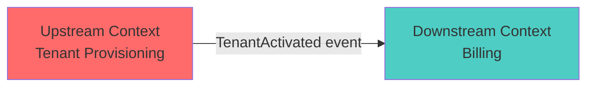

# Integration Contract: [UPSTREAM-CONTEXT] → [DOWNSTREAM-CONTEXT]
## Cross-Context Integration Specification

---

```yaml
# MACHINE-READABLE METADATA
integration_contract:
  upstream_context: UpstreamContextName
  downstream_context: DownstreamContextName
  version: 1.0.0
  created_date: YYYY-MM-DD
  last_updated: YYYY-MM-DD
  
ownership:
  upstream_team: team-alpha@company.com
  downstream_team: team-beta@company.com
  architect: architect@company.com
```

---

## 🎯 Integration Overview

**Upstream Context**: [Context Name] (produces data/events)  
**Downstream Context**: [Context Name] (consumes data/events)

**Integration Pattern**: 
- [ ] Published Language (Domain Events)
- [ ] Open Host Service (REST API)
- [ ] Anticorruption Layer (ACL with adapter)
- [ ] Conformist (downstream conforms to upstream)
- [ ] Shared Kernel (shared library)

**Purpose**: Brief description of why these contexts need to integrate.

---

## 🗺️ Context Relationship



**Relationship Type**: Customer-Supplier

**Power Dynamic**:
- **Upstream**: [Team name] owns the upstream context and defines the contract
- **Downstream**: [Team name] consumes the contract and must adapt

---

## 📡 Integration Method

### Method 1: Domain Events (Asynchronous)

**Event Bus**: Kafka / RabbitMQ / AWS SNS/SQS

**Published Events**:

#### Event: TenantActivated

**Description**: Published when a tenant transitions to ACTIVE status.

**Schema Version**: v1.0.0

**Payload**:
```json
{
  "eventType": "TenantActivated",
  "eventId": "uuid",
  "aggregateId": "tenantId (uuid)",
  "timestamp": "2025-12-09T14:30:00Z",
  "version": "1.0.0",
  "payload": {
    "tenantId": "uuid",
    "companyName": "acme-corp",
    "activatedAt": "2025-12-09T14:30:00Z",
    "configuration": {
      "plan": "premium",
      "maxUsers": 100
    }
  }
}
```

**JSON Schema**:
```json
{
  "$schema": "http://json-schema.org/draft-07/schema#",
  "type": "object",
  "required": ["eventType", "eventId", "aggregateId", "timestamp", "version", "payload"],
  "properties": {
    "eventType": { "const": "TenantActivated" },
    "eventId": { "type": "string", "format": "uuid" },
    "aggregateId": { "type": "string", "format": "uuid" },
    "timestamp": { "type": "string", "format": "date-time" },
    "version": { "type": "string", "pattern": "^[0-9]+\\.[0-9]+\\.[0-9]+$" },
    "payload": {
      "type": "object",
      "required": ["tenantId", "companyName", "activatedAt"],
      "properties": {
        "tenantId": { "type": "string", "format": "uuid" },
        "companyName": { "type": "string", "minLength": 3, "maxLength": 50 },
        "activatedAt": { "type": "string", "format": "date-time" },
        "configuration": { "type": "object" }
      }
    }
  }
}
```

**Consumers**:
- Billing Context (creates billing account)
- User Management Context (enables user creation)
- Audit Log Context (records activation)

**Delivery Guarantee**: At-least-once (idempotent consumer required)

**Retry Policy**: 
- Retry 3 times with exponential backoff (1s, 2s, 4s)
- After 3 failures, move to dead-letter queue
- Manual intervention required for DLQ messages

---

#### Event: TenantSuspended

**Description**: Published when a tenant is suspended.

**Payload**:
```json
{
  "eventType": "TenantSuspended",
  "eventId": "uuid",
  "aggregateId": "tenantId (uuid)",
  "timestamp": "2025-12-09T14:30:00Z",
  "version": "1.0.0",
  "payload": {
    "tenantId": "uuid",
    "reason": "Non-payment",
    "suspendedAt": "2025-12-09T14:30:00Z"
  }
}
```

**Consumers**:
- Billing Context (pauses billing)
- Notification Service (sends suspension notice)

---

### Method 2: REST API (Synchronous)

**Upstream API**: `https://tenant-provisioning-api.company.com/api/v1`

**Authentication**: 
- Bearer token (JWT)
- Service-to-service authentication via OAuth2 client credentials

**Rate Limiting**: 100 requests/second per consumer

#### Endpoint: Get Tenant by ID

**HTTP Method**: `GET`

**Path**: `/tenants/{tenantId}`

**Request**:
```http
GET /api/v1/tenants/123e4567-e89b-12d3-a456-426614174000 HTTP/1.1
Host: tenant-provisioning-api.company.com
Authorization: Bearer <jwt_token>
Accept: application/json
```

**Response (Success - 200 OK)**:
```json
{
  "tenantId": "123e4567-e89b-12d3-a456-426614174000",
  "companyName": "acme-corp",
  "status": "ACTIVE",
  "createdAt": "2025-12-01T10:00:00Z",
  "activatedAt": "2025-12-01T10:05:00Z",
  "configuration": {
    "plan": "premium",
    "maxUsers": 100
  }
}
```

**Response (Not Found - 404)**:
```json
{
  "error": "TenantNotFound",
  "message": "Tenant with ID 123e4567-e89b-12d3-a456-426614174000 does not exist",
  "timestamp": "2025-12-09T14:30:00Z"
}
```

**Response (Server Error - 500)**:
```json
{
  "error": "InternalServerError",
  "message": "An unexpected error occurred",
  "timestamp": "2025-12-09T14:30:00Z",
  "correlationId": "uuid"
}
```

**SLA**:
- **Response Time**: 95th percentile < 200ms
- **Availability**: 99.9% uptime

---

## 🔄 Anticorruption Layer (ACL)

**Required?** [X] Yes  [ ] No

**Reason**: Downstream context (Billing) uses different terminology ("Account" vs "Tenant"). ACL translates upstream model to downstream model.

**Implementation**:

```java
// Downstream (Billing Context) ACL
public class TenantAdapter {
    private final TenantProvisioningClient client;
    
    public BillingAccount toBillingAccount(TenantActivated event) {
        Tenant tenant = client.getTenantById(event.getTenantId());
        
        return new BillingAccount(
            AccountId.of(tenant.getTenantId()), // Translate TenantId → AccountId
            CompanyName.of(tenant.getCompanyName()),
            BillingPlan.from(tenant.getConfiguration().getPlan()), // Translate plan
            AccountStatus.ACTIVE // Translate ACTIVE → ACTIVE
        );
    }
}
```

**Translation Map**:

| Upstream (Tenant Provisioning) | Downstream (Billing) | Notes |
|--------------------------------|----------------------|-------|
| `TenantId` | `AccountId` | Same UUID, different type |
| `CompanyName` | `CompanyName` | Same (no translation) |
| `TenantStatus.ACTIVE` | `AccountStatus.ACTIVE` | Enum value match |
| `TenantStatus.SUSPENDED` | `AccountStatus.PAUSED` | Different terminology |
| `TenantStatus.TERMINATED` | `AccountStatus.CLOSED` | Different terminology |

---

## 🚨 Failure Handling

### Scenario 1: Event Bus Down

**Problem**: Kafka is unavailable, events cannot be published.

**Upstream Behavior**: 
- Store events in outbox table (transactional outbox pattern)
- Background worker polls outbox and publishes when Kafka is available

**Downstream Impact**: 
- Delayed event processing (eventual consistency)
- No data loss

**SLA**: Events delivered within 5 minutes of Kafka recovery

---

### Scenario 2: Downstream Consumer Fails

**Problem**: Billing Context fails to process `TenantActivated` event.

**Retry Policy**:
- Retry 3 times with exponential backoff
- Move to dead-letter queue after 3 failures

**Upstream Behavior**: 
- Upstream does NOT rollback (event already committed)

**Downstream Recovery**:
- Manual intervention: process DLQ messages
- Idempotent event handlers prevent duplicate processing

---

### Scenario 3: Upstream API Unavailable

**Problem**: GET /tenants/{id} returns 503 Service Unavailable.

**Downstream Behavior**:
- Circuit breaker: After 5 consecutive failures, stop calling API for 30 seconds
- Fallback: Use cached tenant data (if available)
- If no cache, return error to caller

**Monitoring**: Alert when circuit breaker opens

---

## 📊 Contract Testing

### Consumer-Driven Contract Tests

**Tool**: Pact (https://pact.io)

**Test Ownership**: 
- Downstream (Billing) writes contract tests
- Upstream (Tenant Provisioning) verifies contract compliance in CI/CD

**Example Contract Test** (Billing Context):
```java
@Pact(consumer = "BillingContext", provider = "TenantProvisioningContext")
public RequestResponsePact getTenantByIdContract(PactDslWithProvider builder) {
    return builder
        .given("tenant with ID exists")
        .uponReceiving("a request for tenant by ID")
        .path("/api/v1/tenants/123e4567-e89b-12d3-a456-426614174000")
        .method("GET")
        .willRespondWith()
        .status(200)
        .body(new PactDslJsonBody()
            .uuid("tenantId", "123e4567-e89b-12d3-a456-426614174000")
            .stringType("companyName", "acme-corp")
            .stringType("status", "ACTIVE")
        )
        .toPact();
}
```

---

## 📈 Observability

### Metrics

| Metric | Description | Alert Threshold |
|--------|-------------|-----------------|
| **Event Publishing Rate** | Events/second published by upstream | <1 event/min (unusually low) |
| **Event Processing Lag** | Time between event published and consumed | >5 minutes |
| **API Response Time** | GET /tenants/{id} p95 latency | >500ms |
| **API Error Rate** | 5xx errors / total requests | >1% |
| **Circuit Breaker Open** | Is circuit breaker open? | Any time (alert immediately) |

### Logging

**Upstream Logs**:
- Log every event published: `INFO: Published TenantActivated event for tenantId=xxx`
- Log API requests: `INFO: GET /tenants/xxx returned 200 in 123ms`

**Downstream Logs**:
- Log every event consumed: `INFO: Consumed TenantActivated event for tenantId=xxx`
- Log ACL translations: `DEBUG: Translated Tenant xxx to BillingAccount yyy`

**Correlation ID**: Use `correlationId` field to trace requests across contexts.

---

## 📝 Versioning & Evolution

### Current Version: v1.0.0

**Breaking Changes Policy**:
- Major version bump (v1 → v2) for breaking changes
- Downstream given 3 months to migrate
- Old version supported during migration period

### Planned Changes

| Change | Version | Breaking? | Timeline |
|--------|---------|-----------|----------|
| Add `tenantRegion` field to TenantActivated event | v1.1.0 | No (optional field) | Q1 2026 |
| Rename `companyName` → `organizationName` | v2.0.0 | Yes | Q3 2026 |

### Deprecation Process

1. Announce deprecation 6 months in advance
2. Add `deprecated` field to schema
3. Upstream continues to publish old + new format
4. Downstream migrates to new format
5. Upstream stops publishing old format after 6 months

---

## 🔗 Related Documentation

- **Context Map**: [doc/domain-models/context-maps/system-context-map.md](../../domain-models/context-maps/system-context-map.md)
- **Upstream Service Charter**: [doc/services/tenant-provisioning/SERVICE-CHARTER.md](../../services/tenant-provisioning/SERVICE-CHARTER.md)
- **Downstream Service Charter**: [doc/services/billing/SERVICE-CHARTER.md](../../services/billing/SERVICE-CHARTER.md)
- **Event Schema Registry**: [Link to schema registry]
- **API Documentation**: [Link to OpenAPI/Swagger docs]

---

**Ceremony Type**: Context Mapping (Phase 1: Discovery)  
**Last Updated**: YYYY-MM-DD  
**Upstream Team**: team-alpha@company.com  
**Downstream Team**: team-beta@company.com  
**Architect**: architect@company.com
