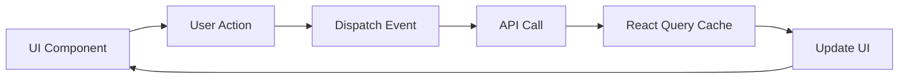

# 📋 Micro-Frontend Charter: MICROFRONTEND-NAME
## Component Strategy, Architecture & Integration

---

```yaml
# MACHINE-READABLE METADATA
charter:
  id: MFE-ID-YYYY-QX
  version: 1.0.0
  status: planning
  type: microfrontend
  created_date: YYYY-MM-DD
  last_updated: YYYY-MM-DD
  
component:
  name: MicroFrontendName
  domain: MicroFrontendDomain
  type: mfe_shell | mfe_component | standalone_app
  framework: react | vue | angular | svelte
  
timeline:
  initial_release_date: YYYY-MM-DD
  current_version: v0.0.0
  next_major_release: vX.0.0
  
owners:
  product_manager: product.manager@company.com
  frontend_lead: frontend.lead@company.com
  ux_designer: ux.designer@company.com
  chief_architect: architect@company.com
  
strategic_alignment:
  parent_product: ProductName
  user_journey: JourneyName (e.g., Checkout, Discovery, Admin)
```

---

## 🎯 Executive Summary

**Purpose:** One-sentence description of what this micro-frontend accomplishes in the user journey.

**Mission:** Short mission statement defining the component's purpose and how it serves users.

**Value Proposition:** Elevator pitch describing the principal value proposition of this frontend component in 2-3 sentences.

**Target Audience:** Description of the ideal user roles and personas who interact with this component.

| Key Metric | Target | Success Criteria |
|------------|--------|------------------|
| **First Contentful Paint** | <1.0s | Lighthouse FCP score |
| **Time to Interactive** | <2.0s | Lighthouse TTI score |
| **Cumulative Layout Shift** | <0.1 | Lighthouse CLS score |
| **User Satisfaction** | >4.5/5 | User feedback score |

---

## I. 🧭 Component Scope & Responsibilities

### 1.1 Component Responsibilities

**Core Responsibilities:**
- Render specific UI screens/widgets for [describe user journey]
- Manage local component state for [specific feature]
- Communicate with backend services via API
- Integrate with other micro-frontends via [event bus / shared state / props]

**NOT Responsible For:**
- Cross-cutting concerns (handled by shell): Authentication, navigation, theme
- Backend business logic (handled by microservices)
- Data persistence (handled by backend)

### 1.2 User Roles & Personas

**Primary Users:**
- **Role 1**: Description of persona and how they use this component
- **Role 2**: Description of persona and their interaction patterns

### 1.3 Bounded Context (UI/UX Domain)

This micro-frontend represents the **[Domain Name]** UI domain, responsible for:
- Screens: List of screens/routes this component owns
- Widgets: Reusable widgets exposed to other components
- User flows: Key user journeys handled by this component

---

## II. 🎨 Routes & Screens

### 2.1 Route Ownership

| URI Pattern | Screen Name | Description | Required Roles |
|-------------|-------------|-------------|----------------|
| `/path/to/screen` | Screen Name | What does this screen do? | Role 1, Role 2 |
| `/path/to/detail/:id` | Detail View | Individual item detail page | Role 1 |
| `/path/to/create` | Creation Form | Create new entity | Admin |

### 2.2 Navigation Integration

**How this MFE integrates into parent shell:**
- Entry points: Links from main nav, dashboard widgets, etc.
- Exit points: Where users go after completing tasks
- Deep linking: Support for direct URL access

---

## III. 🧩 Component Architecture

### 3.1 Component Hierarchy

```
MicroFrontendShell
├── ScreenContainer
│   ├── HeaderComponent
│   ├── ContentComponent
│   │   ├── FormWidget
│   │   ├── TableWidget
│   │   └── ModalDialog
│   └── FooterComponent
└── SharedComponents
    ├── Button
    ├── Input
    └── Dropdown
```

### 3.2 Component Catalog

| Component Name | Type | Description | Reusable? |
|----------------|------|-------------|-----------|
| **HeaderComponent** | Container | Page header with title and actions | ❌ No (screen-specific) |
| **FormWidget** | Widget | Reusable form for entity CRUD | ✅ Yes (exported) |
| **TableWidget** | Widget | Data table with sorting/filtering | ✅ Yes (exported) |
| **Button** | Atom | Styled button component | ✅ Yes (shared library) |

### 3.3 Technology Stack

| Layer | Technology | Version | Rationale |
|-------|-----------|---------|-----------|
| **Framework** | React | v18.x | Component-based, large ecosystem |
| **State Management** | Redux Toolkit | v2.x | Predictable state, devtools |
| **Routing** | React Router | v6.x | Standard routing for SPAs |
| **Styling** | Tailwind CSS | v3.x | Utility-first, fast development |
| **API Client** | React Query | v5.x | Data fetching, caching, sync |
| **Build Tool** | Vite | v5.x | Fast HMR, optimized builds |
| **Testing** | Vitest + Testing Library | Latest | Fast unit tests, user-centric |
| **E2E Testing** | Playwright | Latest | Cross-browser E2E tests |

---

## IV. 🔗 Dependencies & Integration

### 4.1 Backend Service Dependencies

| Service | Endpoints Used | Critical? | Fallback Strategy |
|---------|----------------|-----------|-------------------|
| Tenant Management API | `GET /api/v1/tenants` | ✅ Yes | Show error, block access |
| Product Catalog API | `GET /api/v1/catalog/products` | ✅ Yes | Cache + retry |
| Pricing API | `GET /api/v1/pricing/calculate` | ❌ No | Show estimated price |

### 4.2 Micro-Frontend Dependencies

| MFE Name | Integration Type | What We Consume | What We Expose |
|----------|------------------|-----------------|----------------|
| **Shell MFE** | Parent | Navigation, auth, theme | This component |
| **Header MFE** | Sibling | User context events | Cart update events |
| **Shared Components** | Library | Button, Input, Modal | N/A |

### 4.3 External Dependencies

| Type | Provider | Purpose | Version |
|------|----------|---------|---------|
| CDN | Google Fonts | Typography | - |
| Analytics | Google Analytics | User tracking | GA4 |
| Error Tracking | Sentry | Error monitoring | v7 |

---

## V. 🔄 State Management

### 5.1 State Architecture

**Local State** (React useState, useReducer):
- UI state: Form inputs, modals, dropdowns
- Transient state: Loading indicators, error messages

**Global State** (Redux, Context):
- User context: Current user, tenant, permissions
- App state: Theme, language, feature flags

**Server State** (React Query):
- API data: Products, orders, users
- Cached data: Recently fetched entities
- Mutations: Create, update, delete operations

### 5.2 State Flow



---

## VI. 📡 API Integration

### 6.1 API Patterns

**REST API Calls:**
```typescript
// Example: Fetch products
const { data, isLoading, error } = useQuery({
  queryKey: ['products', tenantId],
  queryFn: () => fetchProducts(tenantId),
  staleTime: 5 * 60 * 1000 // 5 minutes
});
```

**GraphQL (if applicable):**
```typescript
// Example: Query with fragments
const PRODUCT_QUERY = gql`
  query GetProducts($tenantId: ID!) {
    products(tenantId: $tenantId) {
      id
      name
      price
    }
  }
`;
```

### 6.2 Error Handling

| Error Type | Handling Strategy | User Experience |
|------------|-------------------|-----------------|
| **Network Error** | Retry 3x with exponential backoff | Show "Connection lost" toast |
| **401 Unauthorized** | Redirect to login | Session expired message |
| **403 Forbidden** | Show permission error | "Access denied" page |
| **404 Not Found** | Show empty state | "No data found" message |
| **500 Server Error** | Log to Sentry, show generic error | "Something went wrong" + retry button |

---

## VII. 🎨 UI/UX Guidelines

### 7.1 Design System

**Component Library:** [Design System Name] (e.g., Material-UI, Ant Design, custom)

**Key Principles:**
- **Consistency**: Use shared components from design system
- **Accessibility**: WCAG 2.1 AA compliance
- **Responsiveness**: Mobile-first design (breakpoints: 320px, 768px, 1024px, 1280px)
- **Performance**: Lazy load components, code splitting

### 7.2 Accessibility (a11y)

| Requirement | Implementation | Testing |
|-------------|----------------|---------|
| **Keyboard Navigation** | All interactive elements accessible via Tab/Enter | Manual + automated (axe-core) |
| **Screen Reader Support** | ARIA labels, semantic HTML | NVDA, JAWS testing |
| **Color Contrast** | 4.5:1 minimum ratio | Lighthouse audit |
| **Focus Indicators** | Visible focus styles | Visual inspection |

### 7.3 Theming

**Theme Variables:**
```css
:root {
  --color-primary: #0066cc;
  --color-secondary: #6c757d;
  --color-success: #28a745;
  --color-danger: #dc3545;
  --font-family: 'Inter', sans-serif;
  --font-size-base: 16px;
}
```

**Dark Mode Support:** Yes/No (explain strategy if yes)

---

## VIII. 📊 Performance & Optimization

### 8.1 Lighthouse Targets

| URI | FCP | TTI | SpeedIndex | TBT | LCP | CLS | Performance | Accessibility | Best Practices | SEO |
|-----|-----|-----|------------|-----|-----|-----|-------------|---------------|----------------|-----|
| `/main-screen` | <1.0s | <2.0s | <1.5s | <200ms | <2.5s | <0.1 | >90% | >95% | >95% | >90% |
| `/detail-screen` | <1.0s | <2.0s | <1.5s | <200ms | <2.5s | <0.1 | >90% | >95% | >95% | >90% |

### 8.2 Optimization Strategies

**Code Splitting:**
- Route-based splitting (lazy load screens)
- Component-based splitting (lazy load heavy components)

**Asset Optimization:**
- Image lazy loading
- WebP format with fallbacks
- SVG for icons

**Caching:**
- Service worker for offline support
- React Query caching for API responses
- Browser cache for static assets

### 8.3 Bundle Size Targets

| Metric | Target | Current | Status |
|--------|--------|---------|--------|
| **Initial Bundle** | <200 KB (gzipped) | TBD | 🟡 Monitor |
| **Total Bundle** | <500 KB (gzipped) | TBD | 🟡 Monitor |
| **Lazy Chunks** | <50 KB each | TBD | 🟡 Monitor |

---

## IX. 🧪 Testing Strategy

### 9.1 Test Coverage Targets

| Test Type | Coverage Target | Tools |
|-----------|----------------|-------|
| **Unit Tests** | >80% | Vitest, Testing Library |
| **Integration Tests** | >60% | Testing Library, MSW |
| **E2E Tests** | Critical paths only | Playwright |
| **Visual Regression** | All screens | Percy, Chromatic |
| **Accessibility** | 100% automated checks | axe-core, Lighthouse |

### 9.2 Test Structure

```
src/
├── components/
│   ├── Button/
│   │   ├── Button.tsx
│   │   ├── Button.test.tsx
│   │   └── Button.stories.tsx
├── screens/
│   ├── ProductList/
│   │   ├── ProductList.tsx
│   │   ├── ProductList.test.tsx
│   │   └── ProductList.e2e.spec.ts
```

---

## X. 🚀 Deployment & DevOps

### 10.1 Build & Deployment

**Build Process:**
1. Install dependencies: `npm install`
2. Run tests: `npm test`
3. Build for production: `npm run build`
4. Output: `dist/` folder with static assets

**Deployment Targets:**
- **Development**: Auto-deploy on push to `develop` branch
- **Staging**: Auto-deploy on push to `staging` branch
- **Production**: Manual approval required, deploy from `main` branch

**Hosting:** CDN (e.g., AWS CloudFront, Netlify, Vercel)

### 10.2 Environment Configuration

| Environment | Base URL | API Base URL | Feature Flags |
|-------------|----------|--------------|---------------|
| **Development** | http://localhost:5173 | http://localhost:8080/api | All enabled |
| **Staging** | https://staging.example.com | https://api-staging.example.com | All enabled |
| **Production** | https://app.example.com | https://api.example.com | Controlled rollout |

---

## XI. 📈 Observability & Monitoring

### 11.1 Key Metrics

| Metric | Description | Target | Alert Threshold |
|--------|-------------|--------|-----------------|
| **Page Load Time** | Time to interactive | <2.0s | >3.0s |
| **API Error Rate** | Failed API calls / total | <1% | >5% |
| **JavaScript Errors** | Uncaught exceptions | <0.1% of sessions | >1% |
| **User Engagement** | Time on page, clicks | TBD | TBD |

### 11.2 Monitoring Tools

| Tool | Purpose | Integration |
|------|---------|-------------|
| **Google Analytics** | User behavior, page views | GA4 tracking code |
| **Sentry** | Error tracking, performance monitoring | Sentry SDK |
| **LogRocket** | Session replay, debugging | LogRocket SDK |
| **Lighthouse CI** | Performance regression testing | CI/CD pipeline |

---

## XII. 📚 Documentation

### 12.1 Required Documentation

| Document | Description | Location | Status |
|----------|-------------|----------|--------|
| **Installation Guide** | Setup, configuration, local dev | `docs/install.md` | 📋 TODO |
| **Integration Guide** | How to embed in parent shell | `docs/integration.md` | 📋 TODO |
| **Component Storybook** | Interactive component docs | Hosted Storybook | 📋 TODO |
| **User Guide** | End-user instructions | `docs/user-guide.md` | 📋 TODO |
| **API Documentation** | Backend API contracts | Link to API docs | ✅ Complete |

### 12.2 Developer Documentation

**Onboarding:**
- `README.md`: Quick start, npm scripts
- `CONTRIBUTING.md`: Coding standards, PR process
- `ARCHITECTURE.md`: High-level design decisions

**Runbooks:**
- Provisioning: How to set up new environment
- Troubleshooting: Common issues and solutions
- Deployment: Step-by-step deployment guide

---

## XIII. 🔗 Related Documentation

- **Canvas**: [MICROFRONTEND-CANVAS-TEMPLATE.md](./MICROFRONTEND-CANVAS-TEMPLATE.md) (one-page quick reference)
- **Parent Product**: [PRODUCT-CHARTER-TEMPLATE.md](./PRODUCT-CHARTER-TEMPLATE.md)
- **Backend Services**: [doc/services/](../../services/) (API contracts)
- **Design System**: [Link to design system docs]
- **Architecture**: [ARCHITECTURE.md](../../../ARCHITECTURE.md)

---

**Last Updated**: YYYY-MM-DD  
**Frontend Lead**: frontend.lead@company.com  
**Component ID**: MFE-ID-YYYY-QX
