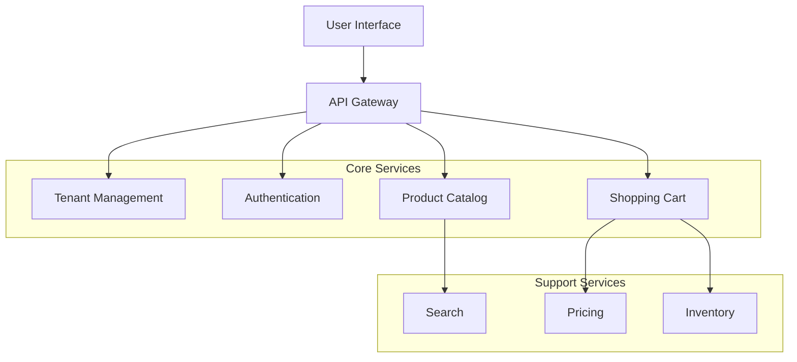

# 📋 Product Charter: PRODUCT-NAME
## Product Strategy, Roadmap & Features

---

```yaml
# MACHINE-READABLE METADATA
charter:
  id: PRODUCT-ID-YYYY-QX
  version: 1.0.0
  status: planning
  type: product
  created_date: YYYY-MM-DD
  last_updated: YYYY-MM-DD
  
product:
  name: ProductName
  domain: ProductDomain
  type: saas_platform | enterprise_product | internal_tool
  
timeline:
  initial_release_date: YYYY-MM-DD
  current_version: v0.0.0
  next_major_release: vX.0.0
  
owners:
  product_owner: product.owner@company.com
  product_manager: product.manager@company.com
  chief_architect: architect@company.com
  sme: subject.matter.expert@company.com
  
strategic_alignment:
  company_okr: Q2-2026-OKR-XX-Description
  product_initiative: Initiative Name
  target_market: Enterprise | SMB | Consumer
```

---

## 🎯 Executive Summary

**Vision:** One-sentence aspirational statement about what this product will become.

**Mission:** Short mission statement defining the product's purpose and how it serves customers.

**Value Proposition:** Elevator pitch describing the principal value proposition of the product in 2-3 sentences.

**Positioning:** Description of the ideal customer and/or target audience of this product.

| Key Metric | Target | Success Criteria |
|------------|--------|------------------|
| **Customer Adoption** | 100 customers | Monthly active users |
| **Customer Satisfaction** | NPS >50 | Quarterly survey |
| **Revenue Impact** | $XM ARR | Annual recurring revenue |
| **Time to Value** | <30 days | Onboarding to first success |

---

## I. 🧭 Product Scope & Strategy

### 1.1 Customer Needs & Problem Statements

| Role | Problem | Need |
|------|---------|------|
| Enterprise Admin | Struggles with manual tenant provisioning taking 2-3 days | Automated provisioning in <1 hour |
| Developer | Struggles with inconsistent APIs across services | Unified API design with clear documentation |
| End User | Struggles with slow product search | <100ms search response time |

### 1.2 Objectives & Key Results (OKRs)

| Role | Objective | Key Result (Measurable) |
|------|-----------|-------------------------|
| Enterprise Admin | Reduce operational overhead | 90% reduction in manual provisioning tasks |
| Developer | Improve developer experience | API adoption rate >80% within 6 months |
| End User | Enhance user experience | User satisfaction score >4.5/5 |

### 1.3 Target Audience

**Primary Personas:**
- **Enterprise Administrator**: Manages multi-tenant platform, provisions new clients, monitors health
- **Software Developer**: Integrates with APIs, builds extensions, troubleshoots issues
- **End User**: Interacts with commerce platform to browse, shop, checkout

**Market Segments:**
- Enterprise clients (1000+ employees)
- Mid-market clients (100-1000 employees)
- Small business clients (<100 employees)

---

## II. 🎨 Features & Capabilities

### 2.1 Feature Overview

| As a... | I can... | To... (Value Prop) |
|---------|----------|-------------------|
| Enterprise Admin | Provision new tenants via UI | Onboard clients without engineering support |
| Enterprise Admin | Monitor tenant health dashboards | Proactively identify and resolve issues |
| Developer | Access unified API documentation | Integrate services efficiently |
| Developer | Use SDKs in multiple languages | Reduce integration time by 50% |
| End User | Search products with filters | Find products faster (<3 seconds) |
| End User | Save shopping carts | Resume shopping across devices |

### 2.2 Feature Roadmap

#### Release v1.0 (Foundation) - Target: Q2 2026
- ✅ Tenant provisioning automation
- ✅ Authentication & RBAC
- ✅ Product catalog management
- ✅ Shopping cart & checkout

#### Release v2.0 (Enhancement) - Target: Q3 2026
- ⏳ Advanced search with AI recommendations
- ⏳ Promotions engine
- ⏳ Multi-currency support
- ⏳ Analytics dashboard

#### Release v3.0 (Scale) - Target: Q4 2026
- 📋 Subscription management
- 📋 Multi-language support
- 📋 Mobile apps (iOS, Android)
- 📋 Advanced reporting

**Legend**: ✅ Completed | ⏳ In Progress | 📋 Planned

---

## III. 📊 Competitive Analysis

| Criteria | Our Position | Competitor | Notes |
|----------|--------------|------------|-------|
| Multi-tenancy | **Strength** - Schema-per-tenant isolation | Competitor A uses row-level security | Better compliance & performance |
| Provisioning Time | **Strength** - <1 hour automated | Competitor B requires 1-2 days manual | Key differentiator |
| API Design | **Strength** - RESTful + GraphQL | Competitor C has inconsistent APIs | Developer-friendly |
| Pricing Flexibility | **Weakness** - Limited rule engine | Competitor A has advanced rules | Roadmap for v2.0 |
| Search Performance | **Differentiator** - <100ms response | Competitor B averages 500ms | AI-powered relevance |

### 3.1 Competitive Positioning

**Why us over Competitor A?**
- Faster provisioning (hours vs. days)
- Stronger tenant isolation (schema-per-tenant)
- Better API documentation and developer experience

**How we handle objections:**
- "Your pricing engine is less flexible" → True today, but v2.0 addresses this. Our focus on core features ensures stability.
- "Competitor has more integrations" → We prioritize deep integrations over breadth. Quality over quantity.

---

## IV. 🏗️ Product Architecture

### 4.1 Component Overview



### 4.2 Technology Stack

| Layer | Technology | Rationale |
|-------|-----------|-----------|
| **Frontend** | React + TypeScript | Modern, type-safe, component-based |
| **API Gateway** | Kong / AWS API Gateway | Rate limiting, authentication, routing |
| **Services** | Node.js / Java Spring Boot | Depends on team expertise |
| **Database** | PostgreSQL | ACID compliance, schema-per-tenant |
| **Search** | Elasticsearch | Full-text search, faceted navigation |
| **Cache** | Redis | Session management, API response caching |
| **Storage** | S3 | Asset storage with CDN |
| **Orchestration** | Kubernetes | Scalability, resilience |

---

## V. 📦 Dependencies

### 5.1 Internal Dependencies

| Type | Target | Version | Critical? |
|------|--------|---------|-----------|
| Service | Tenant Management Service | v1.0+ | ✅ Yes |
| Service | Authentication & RBAC Service | v1.0+ | ✅ Yes |
| Service | Product Catalog Service | v1.0+ | ✅ Yes |
| Service | Pricing Service | v1.0+ | ❌ No |
| Frontend | Admin Portal MFE | v1.0+ | ✅ Yes |

### 5.2 External Dependencies

| Type | Provider | Purpose | Version |
|------|----------|---------|---------|
| Payment Gateway | Stripe | Payment processing | API v2023-10 |
| Email Service | SendGrid | Transactional emails | v3 |
| CDN | Cloudflare | Asset delivery | - |
| Monitoring | DataDog | APM, metrics, logs | Agent v7 |

---

## VI. 📈 Non-Functional Requirements

| Requirement | Target | SLA | How Measured |
|-------------|--------|-----|--------------|
| **Availability** | 99.95% | 99.9% | Uptime monitoring (30-day average) |
| **Performance (P95)** | <150ms | <200ms | API response time |
| **Scalability** | 2000 tenants | 1000 tenants | Load testing |
| **Security** | Zero data leakage | Zero tolerance | Penetration testing, audits |
| **Time to Provision** | <30 min | <1 hour | Automated provisioning tests |

---

## VII. 📊 Observability

### 7.1 Key Metrics

| Metric | Description | Dashboard |
|--------|-------------|-----------|
| **Health Check** | Product-level health status | [Health Dashboard](#) |
| **User Activity** | Daily/monthly active users | [Usage Dashboard](#) |
| **API Performance** | Request rate, latency, errors | [API Dashboard](#) |
| **Business Metrics** | Revenue, conversions, cart abandonment | [Business Dashboard](#) |

### 7.2 Alerts

- API error rate >1% → Page on-call engineer
- Response time P95 >500ms → Warning to team
- Service availability <99.9% → Critical alert

---

## VIII. 📚 Documentation

| Document | Description | Location | Mandatory? |
|----------|-------------|----------|------------|
| **Administration Guide** | Installation, configuration, security, upgrades | [doc/admin/](#) | ✅ Yes |
| **Development Guide** | How to extend, override, integrate | [doc/dev/](#) | ✅ Yes |
| **User Guides** | End-user documentation per component | [doc/user/](#) | ✅ Yes |
| **Product Glossy** | 1-page front/back marketing summary | [doc/marketing/](#) | ✅ Yes |
| **What's New (per version)** | Customer-facing release notes | [doc/releases/](#) | ✅ Yes |
| **API Documentation** | OpenAPI specs, examples | [doc/api/](#) | ✅ Yes |

---

## IX. 🚀 Releases

| Version | Type | Description | Release Date | Status |
|---------|------|-------------|--------------|--------|
| **v1.0.0** | Major | Foundation release (MVP) | Q2 2026 | 📋 Planned |
| **v1.1.0** | Minor | Bug fixes, UX improvements | Q2 2026 + 1 month | 📋 Planned |
| **v2.0.0** | Major | Advanced features (search, promos) | Q3 2026 | 📋 Planned |
| **v2.1.0** | Minor | Multi-currency support | Q3 2026 + 1 month | 📋 Planned |
| **v3.0.0** | Major | Scale features (subscriptions, mobile) | Q4 2026 | 📋 Planned |

**Release Cadence:**
- Major releases: Quarterly
- Minor releases: Monthly (as needed)
- Patch releases: As needed (bug fixes, security)

**End-of-Life Policy:**
- Support current + previous major version
- 90-day deprecation notice before EOL
- Security patches for current version only

---

## X. 📞 Runbooks

| Runbook | Description | Owner |
|---------|-------------|-------|
| [Provisioning](#) | How to provision a new product instance | DevOps |
| [Maintenance](#) | Routine maintenance procedures | DevOps |
| [Upgrading](#) | How to upgrade to new version | DevOps |
| [Deprovisioning](#) | How to safely deprovision | DevOps |
| [Testing & Troubleshooting](#) | Common issues and solutions | Support |
| [Suspension](#) | How to suspend a tenant/product | Support |

---

## XI. 🔗 Related Documentation

- **Canvas**: [PRODUCT-CANVAS-TEMPLATE.md](./PRODUCT-CANVAS-TEMPLATE.md) (one-page quick reference)
- **Service Charters**: [doc/exhibits/CHARTER-*.md](../../exhibits/) (underlying services)
- **Methodology**: [doc/reference/SBPF/Blending-DDD-BDD-TDD.md](../SBPF/Blending-DDD-BDD-TDD.md)
- **Architecture**: [ARCHITECTURE.md](../../../ARCHITECTURE.md) (system-level design)
- **Status**: [STATUS.md](../../../STATUS.md) (current program state)

---

**Last Updated**: YYYY-MM-DD  
**Product Owner**: product.owner@company.com  
**Product ID**: PRODUCT-ID-YYYY-QX
