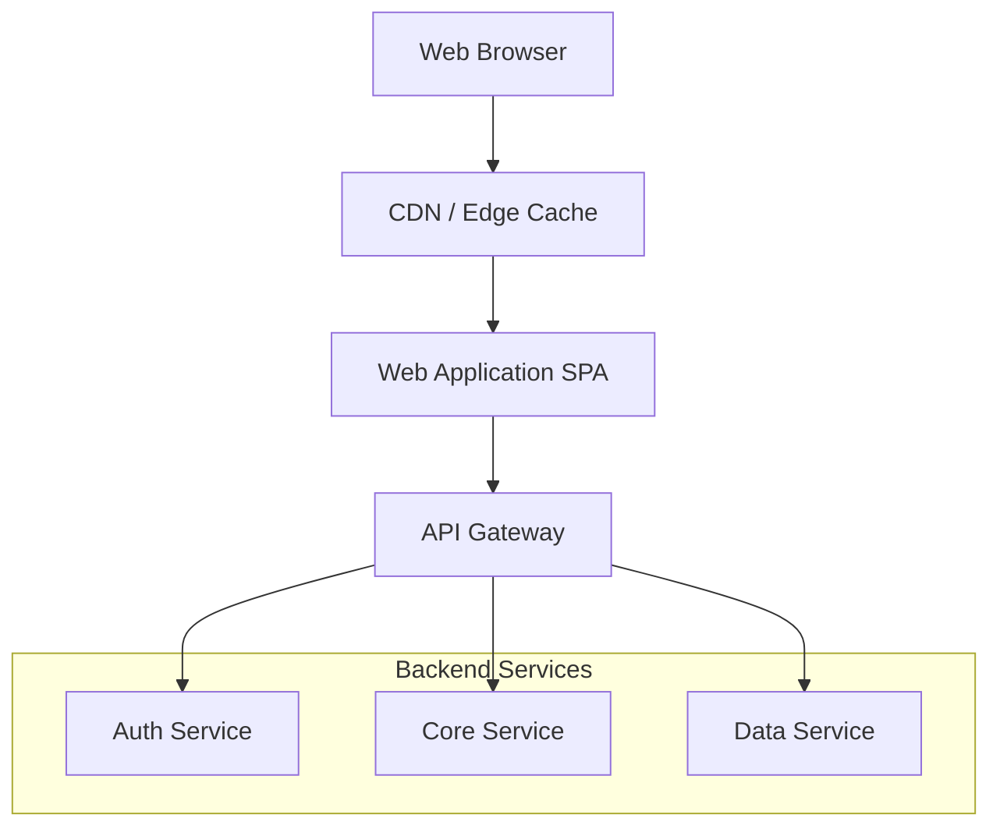
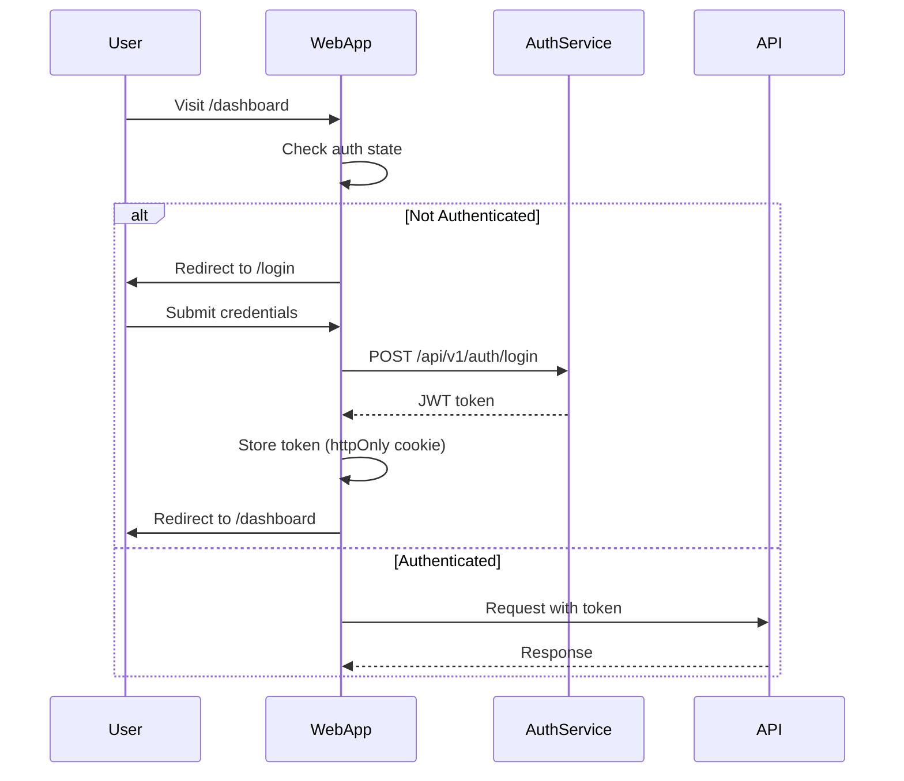

# 📋 Web Application Charter: WEBAPP-NAME
## Application Strategy, Architecture & User Experience

---

```yaml
# MACHINE-READABLE METADATA
charter:
  id: WEBAPP-ID-YYYY-QX
  version: 1.0.0
  status: planning
  type: webapp
  created_date: YYYY-MM-DD
  last_updated: YYYY-MM-DD
  
application:
  name: WebAppName
  domain: ApplicationDomain
  type: spa | ssr | static | hybrid
  framework: react | next | vue | angular
  
timeline:
  initial_release_date: YYYY-MM-DD
  current_version: v0.0.0
  next_major_release: vX.0.0
  
owners:
  product_manager: product.manager@company.com
  frontend_lead: frontend.lead@company.com
  backend_lead: backend.lead@company.com
  ux_designer: ux.designer@company.com
  chief_architect: architect@company.com
  
strategic_alignment:
  company_okr: Q2-2026-OKR-XX-Description
  product_initiative: Initiative Name
  target_audience: Enterprise | SMB | Consumer
```

---

## 🎯 Executive Summary

**Vision:** One-sentence aspirational statement about what this web application will become.

**Mission:** Short mission statement defining the application's purpose and how it serves users.

**Value Proposition:** Elevator pitch describing the principal value proposition of this application in 2-3 sentences.

**Target Audience:** Description of the ideal users and personas who will use this application.

| Key Metric | Target | Success Criteria |
|------------|--------|------------------|
| **Monthly Active Users** | 10,000 | Analytics tracking |
| **User Satisfaction** | NPS >50 | Quarterly survey |
| **Page Load Time** | <2.0s | Lighthouse score |
| **Conversion Rate** | 5% | Funnel analysis |

---

## I. 🧭 Application Scope & Goals

### 1.1 Application Responsibilities

**Core Responsibilities:**
- Provide web-based interface for [describe primary function]
- Enable users to [list key user actions]
- Integrate with backend services for data persistence
- Support [list of user roles/personas]

**NOT Responsible For:**
- Backend business logic (handled by microservices)
- Mobile native experience (separate mobile app if needed)
- Desktop application features (web-only scope)

### 1.2 User Roles & Personas

**Primary Personas:**
- **Admin User**: Manages configuration, users, and system settings
- **Power User**: Frequent user with advanced features access
- **End User**: Regular user performing standard workflows

### 1.3 User Journeys

Key user journeys supported by this application:
1. **Onboarding**: User registration, profile setup, initial configuration
2. **Core Workflow**: [Describe main user workflow]
3. **Management**: Settings, preferences, account management
4. **Support**: Help, documentation, contact support

---

## II. 🗺️ Application Architecture

### 2.1 High-Level Architecture



### 2.2 Technology Stack

| Layer | Technology | Version | Rationale |
|-------|-----------|---------|-----------|
| **Framework** | React + TypeScript | v18.x | Type safety, large ecosystem |
| **SSR/SSG** | Next.js | v14.x | Server-side rendering, SEO |
| **State Management** | Zustand | v4.x | Lightweight, no boilerplate |
| **Routing** | Next.js App Router | v14.x | File-based routing, layouts |
| **Styling** | Tailwind CSS + shadcn/ui | v3.x | Utility-first, accessible components |
| **API Client** | TanStack Query | v5.x | Data fetching, caching |
| **Forms** | React Hook Form + Zod | Latest | Type-safe validation |
| **Build Tool** | Turbopack (Next.js) | Latest | Fast builds, HMR |
| **Testing** | Vitest + Playwright | Latest | Unit + E2E testing |
| **Hosting** | Vercel / AWS CloudFront | - | CDN, edge functions |

---

## III. 🎨 User Interface & Routes

### 3.1 Route Structure

| Route | Page Name | Description | Auth Required |
|-------|-----------|-------------|---------------|
| `/` | Landing Page | Marketing homepage | ❌ No |
| `/login` | Login | User authentication | ❌ No |
| `/signup` | Registration | New user signup | ❌ No |
| `/dashboard` | Dashboard | Main app dashboard | ✅ Yes |
| `/settings` | Settings | User preferences | ✅ Yes |
| `/admin` | Admin Panel | System administration | ✅ Yes (Admin only) |

### 3.2 Page Components

**Layout Structure:**
```
RootLayout
├── Header (nav, user menu)
├── Sidebar (navigation)
├── Main Content
│   └── Page-specific components
└── Footer
```

### 3.3 Component Catalog

| Component | Type | Description | Reusable? |
|-----------|------|-------------|-----------|
| **Header** | Layout | Top navigation bar | ✅ Yes |
| **Sidebar** | Layout | Side navigation menu | ✅ Yes |
| **DashboardWidget** | Feature | Dashboard card/widget | ✅ Yes |
| **DataTable** | Feature | Sortable, filterable table | ✅ Yes |
| **FormModal** | Feature | Modal dialog with form | ✅ Yes |
| **Button** | Atom | Styled button | ✅ Yes (from shadcn/ui) |

---

## IV. 🔗 Dependencies & Integration

### 4.1 Backend Service Dependencies

| Service | Base URL | Endpoints Used | Critical? |
|---------|----------|----------------|-----------|
| **Auth Service** | `/api/v1/auth` | Login, logout, token refresh | ✅ Yes |
| **User Service** | `/api/v1/users` | Profile, settings | ✅ Yes |
| **Core Service** | `/api/v1/core` | Main business logic | ✅ Yes |
| **Analytics** | `/api/v1/analytics` | Usage tracking | ❌ No |

### 4.2 Third-Party Dependencies

| Type | Provider | Purpose | Version |
|------|----------|---------|---------|
| **Authentication** | Auth0 / Clerk | User auth, SSO | Latest |
| **Analytics** | Google Analytics | User tracking | GA4 |
| **Error Tracking** | Sentry | Error monitoring | v7 |
| **CDN** | Cloudflare | Asset delivery | - |
| **Email** | SendGrid | Transactional emails | v3 API |

---

## V. 🔐 Authentication & Authorization

### 5.1 Authentication Flow



### 5.2 Role-Based Access Control (RBAC)

| Role | Permissions | Routes |
|------|-------------|--------|
| **Guest** | View public pages | `/`, `/login`, `/signup` |
| **User** | View dashboard, manage own data | `/dashboard`, `/settings` |
| **Admin** | Full access, manage users | All routes including `/admin` |

---

## VI. 🔄 State Management

### 6.1 State Architecture

**Client State** (Zustand):
- User preferences: Theme, language
- UI state: Sidebar open/closed, modals
- Form state: Draft data before submission

**Server State** (TanStack Query):
- API data: Users, products, orders
- Cached data: Recently fetched entities
- Optimistic updates: Instant UI feedback

**URL State** (Next.js Router):
- Pagination: `?page=2`
- Filters: `?category=electronics`
- Search: `?q=laptop`

### 6.2 Data Flow

1. User interacts with UI → Dispatch action
2. Action triggers API call → TanStack Query
3. API responds → Update cache
4. Cache updates → Re-render components
5. UI reflects new state

---

## VII. 📊 Performance & Optimization

### 7.1 Lighthouse Targets

| Page | FCP | TTI | SpeedIndex | TBT | LCP | CLS | Performance | Accessibility | Best Practices | SEO |
|------|-----|-----|------------|-----|-----|-----|-------------|---------------|----------------|-----|
| `/` | <1.0s | <2.0s | <1.5s | <200ms | <2.5s | <0.1 | >95% | >95% | >95% | >95% |
| `/dashboard` | <1.5s | <3.0s | <2.0s | <300ms | <3.0s | <0.1 | >90% | >95% | >95% | N/A |

### 7.2 Optimization Strategies

**Server-Side Rendering (SSR):**
- Use for SEO-critical pages (`/`, `/about`)
- Pre-render static content at build time (SSG)

**Code Splitting:**
- Route-based splitting (automatic with Next.js)
- Component-based splitting (lazy load modals, charts)

**Asset Optimization:**
- Next.js Image component (automatic optimization)
- WebP format with fallbacks
- Lazy load images below the fold

**Caching:**
- Stale-while-revalidate for API responses
- CDN caching for static assets (1 year)
- Service worker for offline support

### 7.3 Bundle Size Targets

| Metric | Target | Current | Status |
|--------|--------|---------|--------|
| **First Load JS** | <150 KB | TBD | 🟡 Monitor |
| **Total Bundle** | <400 KB | TBD | 🟡 Monitor |
| **Largest Chunk** | <100 KB | TBD | 🟡 Monitor |

---

## VIII. 🎨 UI/UX Design

### 8.1 Design System

**Component Library:** shadcn/ui (Radix UI primitives + Tailwind)

**Design Principles:**
- **Consistency**: Reuse components, follow design tokens
- **Accessibility**: WCAG 2.1 AA compliance
- **Responsiveness**: Mobile-first (breakpoints: 640px, 768px, 1024px, 1280px)
- **Performance**: Optimize for Core Web Vitals

### 8.2 Accessibility (a11y)

| Requirement | Implementation | Testing |
|-------------|----------------|---------|
| **Keyboard Navigation** | Tab order, focus management | Manual + axe-core |
| **Screen Reader Support** | ARIA labels, semantic HTML | NVDA, VoiceOver |
| **Color Contrast** | 4.5:1 minimum ratio | Lighthouse audit |
| **Focus Indicators** | Visible focus styles | Visual inspection |

### 8.3 Responsive Design

**Breakpoints:**
- **Mobile**: 0-640px (1 column)
- **Tablet**: 641-1024px (2 columns)
- **Desktop**: 1025px+ (3+ columns)

**Testing**: Chrome DevTools, BrowserStack

---

## IX. 🧪 Testing Strategy

### 9.1 Test Coverage Targets

| Test Type | Coverage Target | Tools |
|-----------|----------------|-------|
| **Unit Tests** | >80% | Vitest, Testing Library |
| **Integration Tests** | >60% | Testing Library, MSW |
| **E2E Tests** | Critical paths | Playwright |
| **Visual Regression** | Key screens | Percy, Chromatic |
| **Accessibility** | 100% automated | axe-core, Lighthouse |
| **Performance** | All pages | Lighthouse CI |

### 9.2 Test Structure

```
app/
├── (auth)/
│   ├── login/
│   │   ├── page.tsx
│   │   ├── page.test.tsx
│   │   └── page.e2e.spec.ts
tests/
├── unit/
├── integration/
└── e2e/
```

---

## X. 🚀 Deployment & DevOps

### 10.1 Build & Deployment

**Build Process:**
1. Install dependencies: `npm install`
2. Run tests: `npm test`
3. Build for production: `npm run build`
4. Output: `.next/` folder

**Deployment Targets:**
- **Development**: Auto-deploy on push to `develop` (Vercel preview)
- **Staging**: Auto-deploy on push to `staging` (staging.example.com)
- **Production**: Manual approval, deploy from `main` (app.example.com)

**Hosting:** Vercel (Next.js optimized) or AWS CloudFront + S3

### 10.2 Environment Configuration

| Environment | Base URL | API Base URL | Feature Flags |
|-------------|----------|--------------|---------------|
| **Development** | http://localhost:3000 | http://localhost:8080/api | All enabled |
| **Staging** | https://staging.example.com | https://api-staging.example.com | All enabled |
| **Production** | https://app.example.com | https://api.example.com | Controlled rollout |

---

## XI. 📈 Observability & Monitoring

### 11.1 Key Metrics

| Metric | Description | Target | Alert Threshold |
|--------|-------------|--------|-----------------|
| **Uptime** | Application availability | 99.9% | <99.5% |
| **Page Load Time** | Time to interactive | <2.0s | >3.0s |
| **API Error Rate** | Failed API calls / total | <1% | >5% |
| **User Sessions** | Active user sessions | TBD | -10% week-over-week |

### 11.2 Monitoring Tools

| Tool | Purpose | Integration |
|------|---------|-------------|
| **Vercel Analytics** | Web Vitals, performance | Built-in |
| **Google Analytics** | User behavior, funnels | GA4 tag |
| **Sentry** | Error tracking, performance | Sentry SDK |
| **LogRocket** | Session replay | LogRocket SDK |
| **Lighthouse CI** | Performance regression | CI/CD pipeline |

---

## XII. 🎭 User Features

### 12.1 Feature List

| Feature | Description | Priority | Status |
|---------|-------------|----------|--------|
| **User Authentication** | Login, signup, password reset | 🔴 Critical | ✅ Complete |
| **Dashboard** | Overview of key metrics | 🔴 Critical | 📋 TODO |
| **Data Management** | CRUD operations | 🔴 Critical | 📋 TODO |
| **Settings** | User preferences | 🟡 Medium | 📋 TODO |
| **Admin Panel** | System administration | 🟡 Medium | 📋 TODO |

### 12.2 User Stories

| As a... | I can... | To... (Value Prop) |
|---------|----------|-------------------|
| User | Log in with email/password | Access my account securely |
| User | View dashboard | See overview of my data |
| User | Create new records | Add data to the system |
| Admin | Manage users | Control access and permissions |
| Admin | View system logs | Troubleshoot issues |

---

## XIII. 📚 Documentation

### 13.1 Required Documentation

| Document | Description | Location | Status |
|----------|-------------|----------|--------|
| **Installation Guide** | Local setup, dependencies | `docs/install.md` | 📋 TODO |
| **User Guide** | End-user instructions | `docs/user-guide.md` | 📋 TODO |
| **Admin Guide** | System administration | `docs/admin-guide.md` | 📋 TODO |
| **Demo Guide** | Walkthrough with screenshots | `docs/demo.md` | 📋 TODO |
| **API Documentation** | Backend API contracts | Link to API docs | ✅ Complete |
| **What's New (per version)** | Release notes | `docs/releases/` | 📋 TODO |

### 13.2 Developer Documentation

- `README.md`: Quick start, npm scripts
- `CONTRIBUTING.md`: Coding standards, PR process
- `ARCHITECTURE.md`: High-level design decisions
- Storybook: Interactive component docs

---

## XIV. 🔗 Related Documentation

- **Canvas**: [WEBAPP-CANVAS-TEMPLATE.md](./WEBAPP-CANVAS-TEMPLATE.md) (one-page quick reference)
- **Backend Services**: [doc/services/](../../services/) (API contracts)
- **Product Charter**: [PRODUCT-CHARTER-TEMPLATE.md](./PRODUCT-CHARTER-TEMPLATE.md)
- **Architecture**: [ARCHITECTURE.md](../../../ARCHITECTURE.md)

---

**Last Updated**: YYYY-MM-DD  
**Frontend Lead**: frontend.lead@company.com  
**Application ID**: WEBAPP-ID-YYYY-QX
