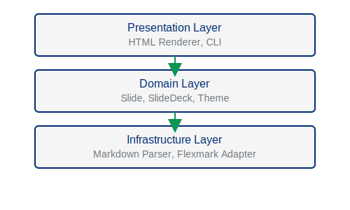

# Image Embedding Demo
## MDSlides v0.2.0

---
template: content
---
## Single Image Example

Images are embedded using markdown syntax:


Images are responsive and scale to fit the slide.

---
template: content
---
## Multiple Images

You can include multiple images on one slide:


**Note**: PDR-008 warns if you use 3+ images on one slide.

---
template: content
---
## Images with Formatting

Images work alongside **bold**, *italic*, and `code` formatting:

Our architecture has **three layers**:



Each layer is independently deployable.

---
template: content
---
## Image Path Guidelines

MDSlides supports:
- **Relative paths**: `./images/diagram.svg` (recommended)
- **Absolute URLs**: `https://example.com/logo.png`
- **Data URLs**: `data:image/svg+xml;base64,...`

**Best Practice**: Use relative paths and keep images in the same directory as your HTML output.

---
template: content
---
## Accessibility Requirements

All images require **alt text** for screen readers (PDR-005):

```markdown

```

Empty alt text `` is rejected during validation.
