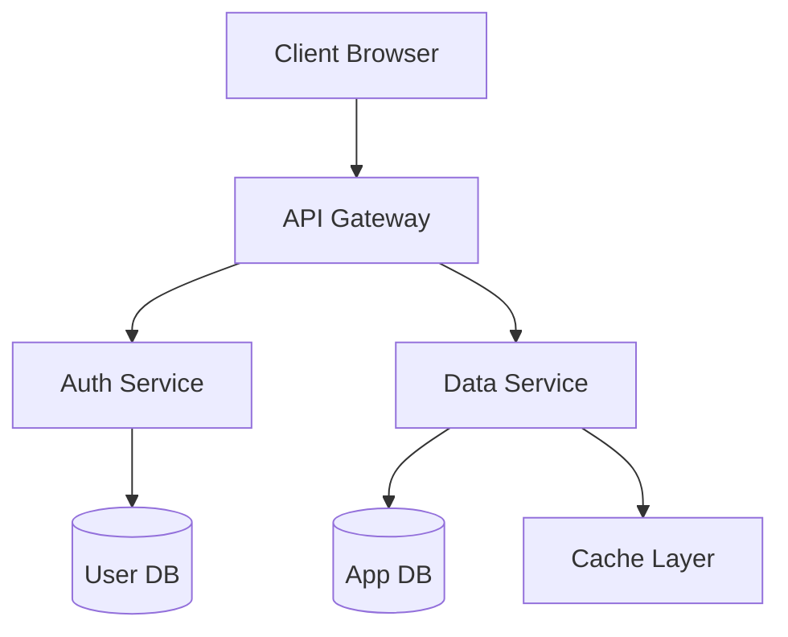
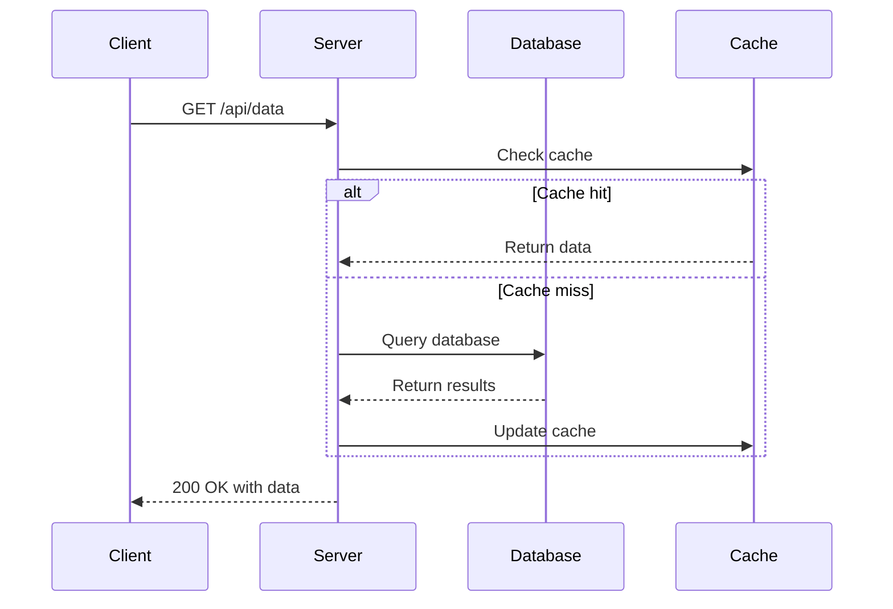
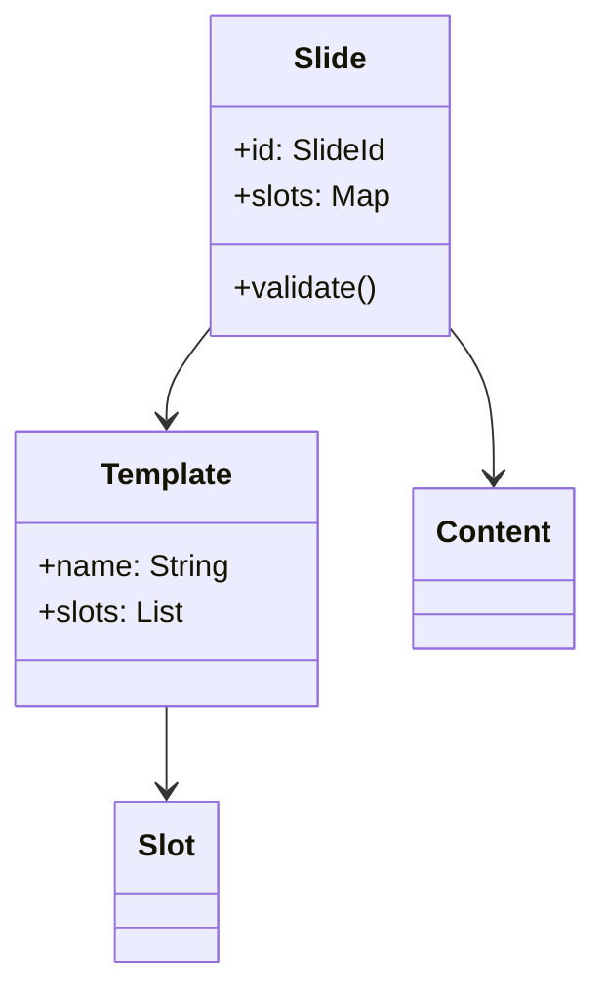
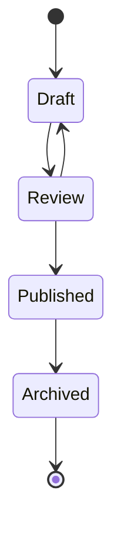
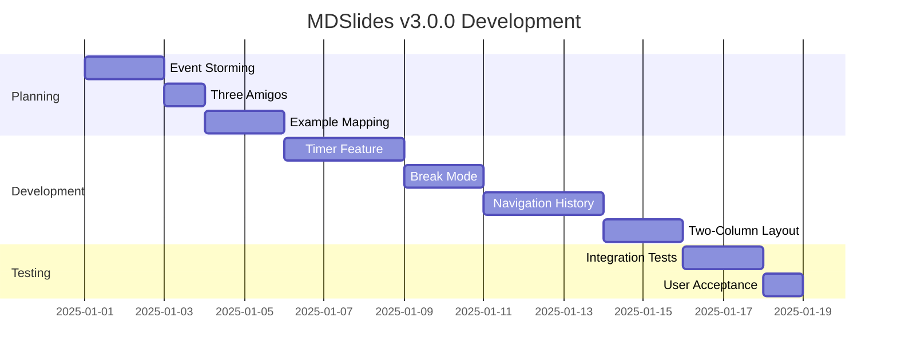
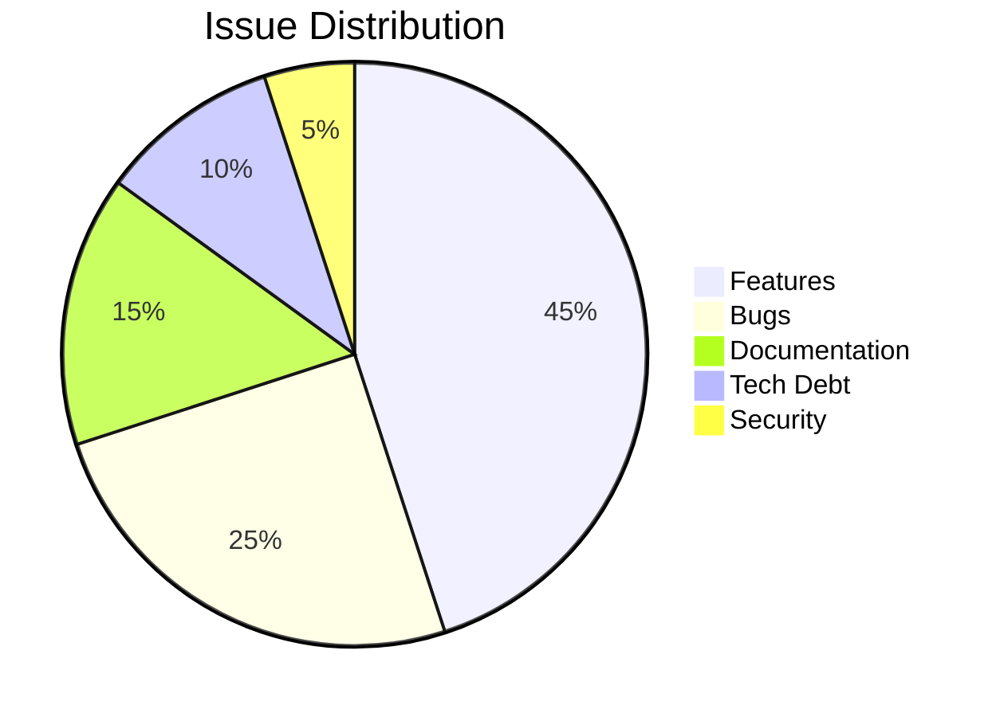
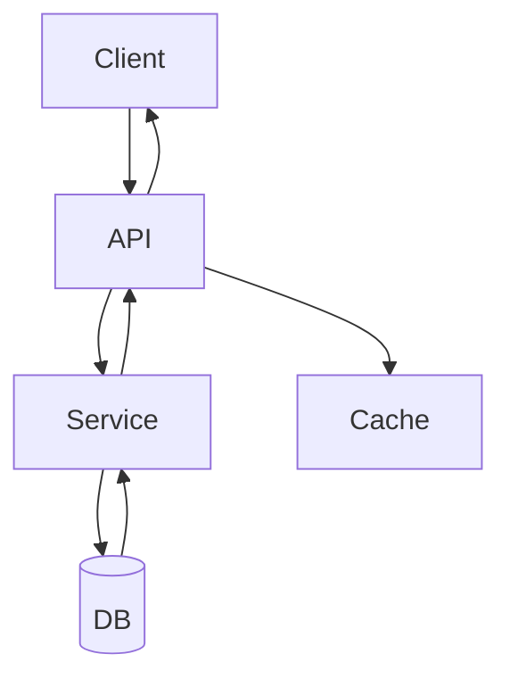
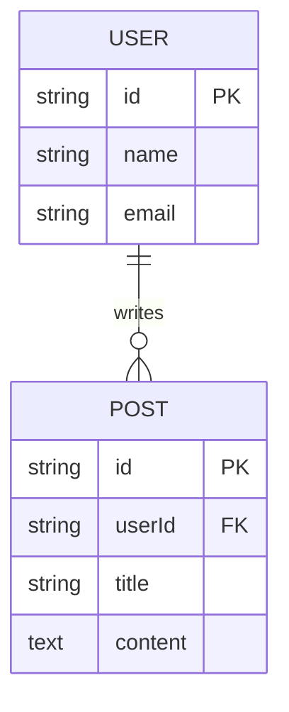
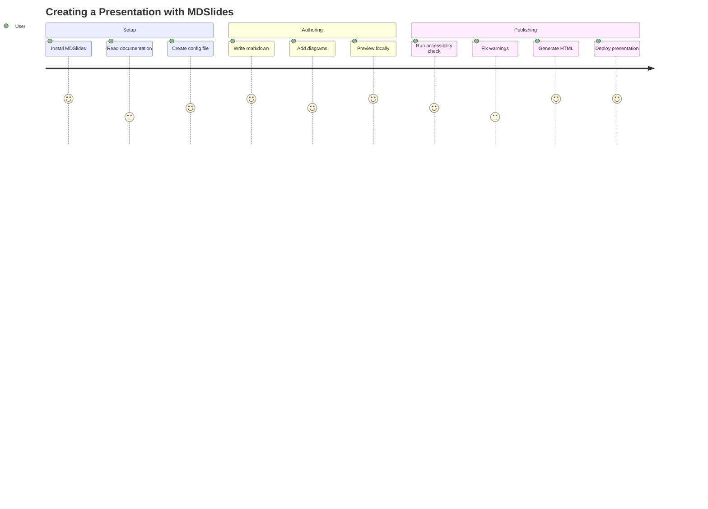

# MDSlides Tutorial
## Complete Feature Reference

Tony Moores

---
template: content
---

## About This Tutorial

This presentation demonstrates **all working features** across MDSlides versions v0.1-v1.3.1:

**Core features**: Templates, markdown, themes, diagrams, code highlighting, images, configuration, speaker notes, accessibility validation

<!-- Speaker notes: Press 'S' to open speaker view. These notes are only visible in speaker mode and help you prepare your presentation. This tutorial is a comprehensive reference for all MDSlides capabilities. -->

---
template: section-title
---

## Part 1: Configuration

Understanding the 4-layer config system (v1.0.0)

---
template: content
---

## Configuration Precedence

**4-layer configuration** (highest to lowest):

1. CLI arguments: `--theme dark`
2. Project config: `.mdslides/config.json`
3. Global config: `~/.mdslides/config.json`
4. Built-in defaults

<!-- Speaker notes: Configuration allows teams to standardize presentation styles across projects. Project config is committed to git, while global config is personal preferences. This layered approach gives maximum flexibility while maintaining team consistency. -->

---
template: content
---

## Project Configuration

Example `.mdslides/config.json`:

```json
{
  "theme": "retisio",
  "copyImages": true,
  "outputDir": "presentations/",
  "header": "{{title}} | Slide {{pageNumber}}/{{totalPages}}",
  "footer": "{{author}} | {{timer}}"
}
```

Committed to version control for team consistency.

<!-- Speaker notes: Header and footer configuration is new in v3.0.0. These templates support placeholders for dynamic content like slide numbers and timer values. -->

---
template: content
---

## Global Configuration

Create `~/.mdslides/config.json` for personal defaults:

```json
{
  "defaults": {
    "theme": "dark",
    "copyImages": true
  }
}
```

Use `mdslides config` to view merged configuration.

---
template: section-title
---

## Part 2: Templates

Five built-in templates for different slide types (v0.1.0-v0.4.0)

---
template: title
---

# Template: Title
## Designed for presentation opening

Large, centered text with your name

---
template: content
---

## Template: Content

**Standard slide** for most content (v0.1.0):

- Unordered and ordered lists
- *Italic* and **bold** text (v0.2.0)
- `inline code` formatting (v0.2.0)
- [Hyperlinks](https://github.com/tjm/mdslides) (v0.2.0)

<!-- Speaker notes: Content template is your workhorse - use it for most slides. Supports all markdown formatting including bold, italic, code, and links. -->

---
template: content
---

## Nested Lists

**Up to 3 levels** of nesting (v1.2.0):

1. Ordered lists
   - Mixed with unordered
   - Circle bullets (level 2)
     - Square bullets (level 3)
2. Different numbering per level
   a. Lower-alpha (level 2)
      i. Lower-roman (level 3)

**List ordering** preserved from source (v1.3.1 fix).

<!-- Speaker notes: v1.2.0 added nested list support with distinct visual hierarchy. v1.3.1 fixed a critical bug where ordered and unordered lists were not rendering in source order. -->

---
template: section-title
---

## Part 3: Advanced Features

v3.0.0 domain layer ready for implementation

---
template: two-column
title: Two-Column Layout: Before & After Comparison
---

## Before

**Traditional Single Column:**

```python
# Calculate fibonacci
def fib(n):
    if n <= 1:
        return n
    return fib(n-1) + fib(n-2)
```

Recursive but inefficient (O(2^n)).

---column---

## After

**Optimized with Memoization:**

```python
# Faster fibonacci
cache = {}
def fib(n):
    if n in cache:
        return cache[n]
    if n <= 1:
        return n
    cache[n] = fib(n-1) + fib(n-2)
    return cache[n]
```

Much faster! O(n) time complexity.

---
template: section-title
---

## Part 4: Mermaid Diagrams

Eight diagram types for visual communication (v0.2.0)

---
template: diagram
caption: Flowchart showing system architecture
---

## Flowchart / Graph



---
template: diagram
caption: Request-response flow between components
---

## Sequence Diagram



<!-- Speaker notes: Sequence diagrams are excellent for showing API interactions and system communication patterns. The alt/else blocks show conditional logic clearly. -->

---
template: two-column
title: Diagram Pairing: Class & State Diagrams
---

## Class Diagram

Domain model hierarchy:



---column---

## State Diagram

Presentation lifecycle:



**Narrow diagrams pair well** in two-column layout!

<!-- Speaker notes: Class and state diagrams are naturally narrow, making them perfect candidates for two-column pairing. This maximizes screen real estate and allows side-by-side comparison of related concepts. -->

---
template: diagram
caption: Project timeline and milestones
---

## Gantt Chart



---
template: diagram
caption: Distribution of issues by category
---

## Pie Chart



---
template: two-column
title: System Architecture: Flow & Data Model
---

## Data Flow

Request processing:



---column---

## Entity Relationships

Database schema:



**Side-by-side comparison** of system architecture!

<!-- Speaker notes: Flow diagrams and ER diagrams complement each other well - flow shows runtime behavior while ER shows data structure. Pairing them helps audience understand both dimensions of the system. -->

---
template: diagram
caption: User journey through the application
---

## User Journey Diagram



---
template: section-title
---

## Part 5: Code Blocks

Syntax highlighting for 190+ languages (v0.2.0, v1.3.0)

---
template: content
---

## Code: Scala

```scala
case class Slide(
  id: SlideId,
  slots: Map[String, SlotContent]
)

object SlideDeck:
  def validated(slides: List[Slide]) =
    Either.cond(
      slides.nonEmpty,
      SlideDeck(slides),
      ValidationError("Empty deck")
    )
```

**Syntax highlighting** powered by highlight.js (v1.3.0).

<!-- Speaker notes: v1.3.0 added automatic syntax highlighting via CDN. Theme-aware: light themes use GitHub style, dark theme uses Monokai Sublime. 190+ languages supported including Scala, Java, Python, JavaScript, TypeScript, SQL, and more. -->

---
template: content
---

## Code: JavaScript

```javascript
const channel = new BroadcastChannel('sync');

Reveal.on('slidechanged', event => {
  channel.postMessage({
    indexh: event.indexh,
    indexv: event.indexv,
    timestamp: Date.now()
  });
});

// History logging (v3.0.0)
logEvent({
  type: 'SlideChanged',
  fromSlide: 0,
  toSlide: 5,
  navigationMethod: 'arrow-key'
});
```

Speaker view synchronization with BroadcastChannel API.

---
template: content
---

## Code: Python

```python
def contrast_ratio(fg, bg):
    """Calculate WCAG contrast ratio."""
    l1, l2 = luminance(fg), luminance(bg)
    lighter, darker = max(l1, l2), min(l1, l2)
    return (lighter + 0.05) / (darker + 0.05)

# WCAG AA requires 4.5:1 for normal text
# WCAG AA requires 3:1 for large text
assert contrast_ratio('#000', '#FFF') >= 4.5
```

WCAG contrast calculation for accessibility validation.

---
template: section-title
---

## Part 6: Images & Assets

Asset management and copying (v0.2.0, v1.0.0)

---
template: content
---

## Image Support

**Features:**
- Automatic discovery and copying (v1.0.0)
- Preserves directory structure
- PNG, JPG, GIF, SVG, WebP support
- Alt text validation (WCAG) (v0.2.0)
- Base64 data URIs supported
- Visual density warnings (3+ images)

Control: `"copyImages": true/false`

<!-- Speaker notes: Local images are copied to maintain portability. Base64 data URIs are embedded inline and don't require copying. Both approaches support alt text for accessibility compliance. -->

---
template: content
---

## Image Examples

**Local image** (automatically copied):

```markdown

```


**Remote Image URI** (referenced, not copied):

```markdown

```


<!-- Speaker notes: Local images are copied to output directory with directory structure preserved. Remote URLs are referenced directly. Alt text is mandatory for WCAG compliance. -->

---
template: section-title
---

## Part 7: Themes

Four built-in themes + custom theme support (v0.2.0, v0.4.0)

---
template: content
---

## Available Themes

**Built-in themes:**

1. **light**: Clean, professional (default)
2. **dark**: Dark mode with high contrast
3. **retisio**: the prior organization corporate branding (v0.4.0)
4. **tjm-solutions**: TJM Solutions corporate style

**Usage:**
```bash
# CLI argument (highest priority)
mdslides render deck.md --theme dark

# Project config
{"theme": "retisio"}

# Global config
{"defaults": {"theme": "dark"}}
```

<!-- Speaker notes: v0.4.0 introduced directory-based theme system with template-specific backgrounds. Each theme can define different backgrounds for different templates. -->

---
template: section-title
---

## Part 8: Tables & Data Display

Markdown tables with alignment and styling (v0.3.0)

---
template: content
---

## Table Support

**Native markdown tables** (v0.3.0):

```markdown
| Header 1 | Header 2 | Header 3 |
|----------|----------|----------|
| Left | Center | Right |
| Data | Data | Data |
```

**Alignment control:**
- Left align (default): `|------|`
- Center align: `|:-----:|`
- Right align: `|------:|`

<!-- Speaker notes: v0.3.0 added full markdown table support with Flexmark parser. Tables are automatically converted to semantic HTML with proper thead/tbody structure and alignment styles. -->

---
template: content
---

## Example: Team Roles

| Role | Responsibility | Focus Area |
|------|---|---|
| **Program Manager** | Coordination, risk management | Delivery timeline |
| **Product Owner** | Requirements, acceptance criteria | Business value |
| **Architect** | Domain modeling, technical strategy | System design |
| **Developer** | Implementation, testing, quality | Code excellence |

**Features:**
- Semantic HTML with `<thead>` and `<tbody>`
- Alignment styles applied correctly
- Bold text in cells supported
- CSS styling with borders and alternating rows

<!-- Speaker notes: Tables render with proper semantic HTML. Bold text, links, and inline code are supported within cells. The CSS includes alternating row colors for readability and hover effects for interactivity. -->

---
template: content
---

## Example: Technology Stack

| Category | Technologies | Status |
|----------|---|---|
| **Core** | Java 21+, Pekko, Kafka | ✅ |
| **Testing** | JUnit 5, Karate, jqwik | ✅ |
| **Parser** | Flexmark 0.64.8 | ✅ |
| **Rendering** | Scalatags DSL | ✅ |
| **Observability** | OpenTelemetry | 🔄 |
| **Rejected** | Spring Boot, JDBC | ❌ |

Tables support emojis, symbols, and complex formatting within cells.

---
template: section-title
---

## Part 9: Accessibility

WCAG compliance and validation (v0.1.0+)

---
template: content
---

## Accessibility Features

MDSlides validates presentations against **WCAG 2.1 Level AA**:

**Automated checks:**
- Contrast ratios (4.5:1 for normal text, 3:1 for large)
- Alt text on all images
- Keyboard navigation handlers
- Semantic HTML structure
- Screen reader compatibility

**Results:**
- ✓ Pass with no issues
- ⚠ Pass with warnings (presentation still generated)
- ✗ Fail with errors (blocks generation)

Use `--skip-accessibility` to bypass validation.

<!-- Speaker notes: Accessibility isn't optional - it's required by law in many jurisdictions. MDSlides helps you meet WCAG standards automatically. -->

---
template: content
---

## Accessibility Report

Example validation output:

```
⚠ Accessibility validation completed with warnings
  ✗ Contrast ratios: 2/4 passed
    WARNING: Low contrast ratio for link: 3.81:1
             (requires 4.5:1 for normal text)
  ✓ Alt text: 5/5 images validated
  ✓ Keyboard navigation: All handlers present
  ✓ Semantic HTML: Role attributes present
```

Report saved to: `.mdslides/accessibility-report.json`

Customize path: `"accessibilityReportPath": "reports/a11y.json"`

---
template: section-title
---

## Part 9: CLI Usage & Mill Commands

Running mdslides via command line and Mill build tool

---
template: content
---

## Mill Usage (Recommended)

**Mill is the standard build tool** for mdslides projects.

**Basic command:**
```bash
# Simple form (recommended)
mill cli.run deck.md

# Specify output file
mill cli.run deck.md output.html

# Specify both input and output
mill cli.run -i input.md -o presentations/
```

**Key advantages:**
- No local installation required
- Manages JVM and dependencies automatically
- Part of your project build system
- Integrated with CI/CD pipelines

<!-- Speaker notes: Mill is the primary execution method. All dependencies are managed by the build system, so you don't need to worry about classpath or Java versions. The `cli.run` target handles compilation and execution automatically. -->

---
template: content
---

## CLI Options with Mill

**All CLI options work identically via Mill:**

```bash
# Theme selection
mill cli.run deck.md --theme dark

# Theme with explicit paths
mill cli.run -i deck.md -o output/ --theme retisio

# Copy images (default: true)
mill cli.run deck.md --no-copy-images

# Skip accessibility validation
mill cli.run deck.md --skip-accessibility

# Generate accessibility report
mill cli.run deck.md --accessibility-report a11y.json

# Custom break screen image (v3.0.0)
mill cli.run deck.md --break-screen images/break.png
```

All CLI flags work identically with Mill's `cli.run` target.

<!-- Speaker notes: Mill passes all arguments directly to the Java CLI application, so the syntax is identical whether you use Mill or direct command line. This consistency makes it easy to switch between methods. -->

---
template: content
---

## File Resolution

**Input file discovery** (tries in order):

1. Exact path as given
2. Add `.md` extension
3. Add `.markdown` extension

**Output directory:** inferred from input
- `deck.md` → `deck/`
- `talks/preso.md` → `talks/preso/`
- `-o build/` → Uses specified directory

**Generated files** (v1.1.0):
- `index.html` - Main presentation
- `speaker.html` - Speaker view
- `sync.js` - Cross-window sync
- `mdslides.log` - Session log (v3.0.0)

<!-- Speaker notes: File resolution intelligently handles both simple and explicit forms. You can omit the `.md` extension and the tool will find it. Output directories are created if they don't exist. -->

---
template: content
---

## CLI vs Mill Comparison

**Mill (recommended):**
```bash
mill cli.run deck.md --theme dark
```

**Key differences:**

| Aspect | Mill | Direct CLI |
|--------|------|-----------|
| Setup | Just run | Java + classpath |
| Compilation | Automatic | Manual |
| CI/CD | Native | Custom setup |

**Recommendation:** Use Mill for all development and CI/CD workflows.

Direct CLI invocation (`java -cp ...`) is possible but requires manual classpath management.

---
template: section-title
---

## Part 10: Speaker Notes

Notes parsing and rendering (v1.0.0, v1.1.0)

---
template: content
---

## Speaker Notes

Speaker notes are invisible in main view, visible in speaker view:

**Syntax** (v1.0.0):
```markdown
Regular slide content here.

<!-- Speaker notes: Press 'S' to open speaker view.
These notes help you prepare and deliver your talk.
They support multiple lines and markdown formatting. -->
```

**Open speaker view** (v1.1.0):
- Press **'S'** key during presentation (fixed in v1.3.1)
- Opens in new window
- Automatically syncs slide navigation
- Shows current slide + next slide preview
- Displays elapsed timer

<!-- Speaker notes: v1.0.0 added notes parsing. v1.1.0 added full speaker view rendering with timer and bidirectional sync. v1.3.1 fixed bug where 'S' key handler was missing. -->

---
template: section-title
---

## Part 11: Timer & Playback (v3.0.0)

Presentation timing and session management

---
template: content
---

## Presentation Timer

**New in v3.0.0:**

- **Auto-start**: Timer begins on first navigation
- **Pause/Resume**: Control timing during presentation
- **Elapsed time**: Displayed in MM:SS or HH:MM:SS format
- **Break-aware**: Pauses during break mode
- **Persistent**: State maintained across page reloads
- **Header/Footer**: Show timer via `{{timer}}` placeholder

**Keyboard shortcuts:**
- **T**: Toggle timer pause/resume
- **R**: Reset timer to 00:00:00

<!-- Speaker notes: The timer is essential for staying on schedule. It automatically pauses during breaks so your break time doesn't count against presentation time. Perfect for timed talks and conference presentations. -->

---
template: content
---

## Break Mode

**New in v3.0.0:**

Take breaks without showing slide content:

**Features:**
- Press **'B'** to activate break mode
- Timer pauses automatically
- Displays custom break screen (optional)
- Break count tracked per session
- Press **'B'** again to resume

**Configuration:**
```json
{
  "breakScreen": "images/break-screen.png"
}
```

<!-- Speaker notes: Break mode is perfect for Q&A sessions, restroom breaks, or technical difficulties. The screen goes to a neutral state instead of showing slide content. The timer pauses so breaks don't count against your presentation time. -->

---
template: content
---

## Navigation History

**New in v3.0.0:** Browser-like navigation

**P key**: Go to previously visited slide
- Two-stack architecture (visit + forward)
- Supports non-linear presentations

**N key**: Go forward in history
- Redo after pressing P
- Linear next if no forward history

**Use cases:** Q&A sessions, reference slides, exploration

<!-- Speaker notes: Navigation history enables a more natural presentation flow. You can jump around slides, then use P to go back through your path. The N key acts as both 'redo' and 'next slide' depending on context. -->

---
template: content
---

## Goto Function

**New in v3.0.0:** Jump directly to any slide

**Usage:**
- Press **'G'** key
- Type slide number (1-indexed)
- Press Enter

**Features:**
- Input validation
- Clears forward history
- Visual feedback

<!-- Speaker notes: Goto function is essential for presentations where audience members ask about specific slides. The 1-indexed numbering matches what users see in the slide counter. Invalid inputs are rejected with clear error messages. -->

---
template: content
---

## Header & Footer

**New in v3.0.0:** Dynamic headers and footers

**Available placeholders:**
- `{{title}}`, `{{author}}`, `{{date}}` - Static
- `{{pageNumber}}`, `{{totalPages}}` - Slide counter
- `{{timer}}` - Timer value (updates live)

Configure in `.mdslides/config.json` (global) or per-slide via frontmatter.

<!-- Speaker notes: Headers and footers update dynamically as you navigate and as time elapses. Perfect for conferences where you need to show slide numbers and timing. Placeholders are resolved at runtime. -->

---
template: content
header: Custom Header: {{pageNumber}}/{{totalPages}}
---

## Per-Slide Header Example

This slide has a **custom header** via frontmatter:

```yaml
header: Custom Header: {{pageNumber}}/{{totalPages}}
```

Check the top of the screen!

---
template: content
footer: <span class="footer-left">{{timer}}</span><span class="footer-right">Slide {{pageNumber}}/{{totalPages}}</span>
---

## Per-Slide Footer: 2 Elements

This slide demonstrates a **2-element footer** (left/right):

```yaml
footer: <span class="footer-left">{{timer}}</span><span class="footer-right">Slide {{pageNumber}}/{{totalPages}}</span>
```

Check the bottom of the screen!

---
template: content
footer: <span class="footer-left">{{timer}}</span><span class="footer-center">Confidential</span><span class="footer-right">{{pageNumber}}/{{totalPages}}</span>
---

## Per-Slide Footer: 3 Elements

This slide demonstrates a **3-element footer** (left/center/right):

```yaml
footer: <span class="footer-left">{{timer}}</span><span class="footer-center">Confidential</span><span class="footer-right">{{pageNumber}}/{{totalPages}}</span>
```

Check the bottom: timer (left), label (center), page number (right)!

---
template: content
---

## Header/Footer: Variable Reference

**Available placeholders** (resolved at runtime):

| Variable | Content |
|----------|---------|
| `{{title}}` | Deck title from first title slide |
| `{{author}}` | Author from title slide |
| `{{date}}` | Date from title slide |
| `{{pageNumber}}` | Current slide number (1-indexed) |
| `{{totalPages}}` | Total slide count |
| `{{timer}}` | Elapsed time hh:mm:ss (updates live) |

Place in `header:` / `footer:` frontmatter or in `.mdslides/config.json` for global defaults.

<!-- Speaker notes: All six placeholders work in both headers and footers. Static values (title, author, date) come from the title slide frontmatter and don't change during the presentation. Dynamic values (pageNumber, totalPages, timer) update as you navigate or as time passes. -->

---
template: content
vertical-align: top
---

## Header/Footer: Layout & Alignment

**Single value** — spans full width:

```yaml
footer: "{{pageNumber}} / {{totalPages}}"
```

**Multi-element** — CSS class positions:

```yaml
footer: "<span class='footer-left'>{{timer}}</span><span class='footer-right'>{{pageNumber}}/{{totalPages}}</span>"
```

Classes: `footer-left`, `footer-center`, `footer-right`

**Vertical content alignment:**

```yaml
vertical-align: top     # flush content to top
vertical-align: center  # default
vertical-align: bottom  # flush content to bottom
```

**Current limitation:** Headers and footers are part of the slide flow — they push content inward. Fixed-position overlays (logo badges, persistent watermarks that float over content) are not currently supported.

<!-- Speaker notes: Multi-element footers use ordinary HTML spans with CSS classes — no special syntax. The footer string is inserted verbatim into the slide HTML, so any valid inline HTML works. The vertical-align frontmatter key controls justify-content on the slide flex container, not individual elements. -->

---
template: section-title
---

## Part 14: Complete Workflow

End-to-end example: Create, build, run, present

---
template: content
---

## Step 1: Create Your Markdown

Create `my-talk.md`:

```markdown
---
template: title
---
# My Amazing Talk
## Subtitled Awesomeness
Jane Smith

---
template: content
---
## Key Points

- Fast rendering
- Beautiful output
- Easy theming

---
template: content
---
## Demo

Check out the code!

```json
{
  "theme": "dark",
  "copyImages": true
}
```
```

---
template: content
---

## Step 2: Configure (Optional)

Create `.mdslides/config.json`:

```json
{
  "theme": "light",
  "copyImages": true,
  "skipAccessibility": false,
  "header": "My Talk | Slide {{pageNumber}}/{{totalPages}}",
  "footer": "{{timer}}"
}
```

**Note:** Configuration is optional. Built-in defaults work fine.

---
template: content
---

## Step 3a: Basic Build & Run

**Core workflow:**

```bash
# Compile all modules
mill __.compile

# Run presentation (simplest form)
mill cli.run my-talk.md
```

**What happens:**
- Source compiled automatically
- Markdown parsed and validated
- HTML generated
- Browser opens automatically
- Presentation ready to present!

**Output generated:**
- `my-talk/index.html` - Main presentation
- `my-talk/speaker.html` - Speaker view
- `my-talk/mdslides.log` - Session log

<!-- Speaker notes: The basic form is all you need for most presentations. Mill handles all the heavy lifting automatically. -->

---
template: content
---

## Step 3b: Advanced Build Options

**With specific theme:**

```bash
mill cli.run my-talk.md --theme dark
```

**Skip image copying (faster for remote URLs):**
```bash
mill cli.run my-talk.md --no-copy-images
```

**Generate accessibility report:**
```bash
mill cli.run my-talk.md --accessibility-report reports/a11y.json
```

**Combine all options:**
```bash
mill cli.run my-talk.md --theme retisio \
  --no-copy-images \
  --accessibility-report reports/a11y.json \
  --skip-accessibility
```

Use these options when you need fine-grained control.

---
template: content
---

## Step 3c: Live Reload (v1.4)

**Watch for changes and auto-reload the browser:**

```bash
mill cli.run my-talk.md --watch
# or short form
mill cli.run my-talk.md -w
```

MDSlides watches `my-talk.md` for changes. On each save the browser
auto-refreshes after 2 seconds using a meta refresh tag injected into the HTML.

**Edit-save-refresh workflow:**
1. Run with `--watch`
2. Open `my-talk/index.html` in your browser
3. Edit markdown and save → browser auto-refreshes in 2 seconds

Combine with other flags:
```bash
mill cli.run my-talk.md --watch --theme dark
```

<!-- Speaker notes: Live reload is invaluable during authoring. Open the presentation in your browser, edit in your editor. Each save triggers a 2-second countdown and auto-refresh — no manual reloads needed. Works with any theme. -->

---
template: content
---

## Step 4a: Open & Setup

**Launch the presentation:**

```bash
# Option 1: Let Mill open it
mill cli.run my-talk.md

# Option 2: Open manually
open my-talk/index.html
```

**Browser opens automatically** with your slides ready to present.

**Position your setup:**
1. Open presentation on projector/main screen
2. Press **S** to open speaker view (opens in new window)
3. Position speaker view on your laptop screen
4. You're ready to present!

<!-- Speaker notes: Speaker view is essential - it shows you current and next slide while the audience sees the full presentation. Position windows before starting. -->

---
template: content
---

## Step 4b: Navigation Shortcuts

**Essential shortcuts during presentation:**

| Action | Shortcut | Use Case |
|--------|----------|----------|
| Next slide | → or Space | Primary navigation |
| Previous | ← | Go back to previous slide |
| First slide | Home | Jump to start |
| Last slide | End | Jump to end |
| Go to slide | G (then type #) | Jump to specific slide |
| Speaker view | S | Open speaker notes |
| Pause timer | T | Pause during breaks |
| Reset timer | R | Start timing over |
| Break mode | B | Hide slides (Q&A break) |
| History back | P | Browser-like back |
| History forward | N | Browser-like forward |

**Pro tip:** Practice shortcuts before presenting!

---
template: content
---

## Step 5: Analytics (Optional)

**After presentation:**

```bash
# Generate report from session log
mill cli.run my-talk.md my-talk-session-2.html

# Check the log file
cat my-talk/mdslides.log | jq .

# Statistics: slides, timing, navigation patterns
```

**Captured metrics:**
- Total time (excluding breaks)
- Per-slide duration
- Navigation method (arrow, P, N, goto)
- Break mode duration
- Audience engagement patterns

<!-- Speaker notes: Review your session logs after presentations to improve your delivery. See which slides took longer, identify pacing issues, and track your progress over time. -->

---
template: content
---

## Best Practices: Before Presenting

**Preparation checklist:**

- ✅ Validate markdown syntax (no errors in output)
- ✅ Check images render correctly (load times acceptable)
- ✅ Test all keyboard shortcuts (arrow keys, S, T, B, G, P, N)
- ✅ Run accessibility validation (no errors blocking)
- ✅ Test speaker view on your setup (second window works)
- ✅ Preview in target browser (Chrome/Firefox/Safari)
- ✅ Time yourself (know your pace)

**Test the workflow once before actual presentation.**

---
template: content
---

## Best Practices: During & After

**While presenting:**

- ✅ Use speaker view (S key) - position on laptop
- ✅ Watch the timer (T pauses during breaks)
- ✅ Use history navigation (P/N) for Q&A jumps
- ✅ Go to specific slides (G key) when asked
- ✅ Take breaks (B key) without showing slides

**After presenting:**

- ✅ Review session logs for improvements
- ✅ Check accessibility report for fixes
- ✅ Archive HTML output (for sharing)
- ✅ Note timing issues (slides too dense?)
- ✅ Iterate for next presentation

<!-- Speaker notes: Review your session logs after presentations to improve your delivery. See which slides took longer, identify pacing issues, and track your progress over time. -->

---
template: section-title
---

## Part 15: Advanced Topics

Customization, scripting, and extensibility

---
template: content
---

## Custom Themes

**Create a custom JSON theme:**

```json
{
  "name": "my-corporate",
  "colors": {
    "primary": "#0066cc",
    "secondary": "#ff6600",
    "background": "#ffffff",
    "text": "#333333",
    "code": "#f5f5f5",
    "codeText": "#000000"
  },
  "fonts": {
    "heading": "Helvetica, sans-serif",
    "body": "Georgia, serif"
  }
}
```

**Save to:** `themes/my-corporate.json`

**Use:** `mill cli.run deck.md --theme my-corporate`

<!-- Speaker notes: Custom themes allow you to match your organization's brand. Colors control slide backgrounds, text, code blocks, and links. Fonts control heading and body text rendering. -->

---
template: content
---

## Custom Themes: Google Fonts (v1.5)

Add a `googleFonts` list to the `fonts` block in your theme JSON:

```json
{
  "name": "my-branded",
  "fonts": {
    "heading": "'Playfair Display', serif",
    "body": "'Lato', sans-serif",
    "code": "'JetBrains Mono', monospace",
    "googleFonts": ["Playfair Display", "Lato", "JetBrains Mono"]
  }
}
```

MDSlides injects preload and stylesheet link tags for each font into the `<head>` automatically. Font family names must match Google Fonts exactly.

<!-- Speaker notes: Google Fonts gives access to 1400+ free web fonts. List each family name once — mdslides generates the correct preload and stylesheet link pairs automatically. No CDN setup, no manual HTML edits needed. -->

---
template: content
---

## Build Integration: Maven

**Add to `pom.xml`:**

```xml
<plugin>
  <groupId>org.codehaus.mojo</groupId>
  <artifactId>exec-maven-plugin</artifactId>
  <configuration>
    <executable>mill</executable>
    <arguments>
      <argument>cli.run</argument>
      <argument>docs/presentation.md</argument>
    </arguments>
  </configuration>
</plugin>
```

Run with: `mvn exec:exec`

MDSlides generates as part of your Maven build lifecycle.

<!-- Speaker notes: Maven's exec plugin can invoke Mill tasks directly. This integrates presentation generation into your existing Maven build pipeline. -->

---
template: content
---

## Build Integration: Gradle

**Add to `build.gradle`:**

```gradle
task generatePresentation {
  exec {
    commandLine 'mill', 'cli.run',
      'docs/presentation.md'
  }
}
```

Run with: `gradle generatePresentation`

MDSlides generates as part of your Gradle build lifecycle.

<!-- Speaker notes: Gradle's exec task invokes Mill directly. Wire it into a lifecycle task (e.g., processResources) for automatic generation on every build. -->

---
template: content
---

## CI/CD Integration: GitHub Actions

**GitHub Actions workflow:**

```yaml
name: Generate Presentation

on: [push, pull_request]

jobs:
  generate:
    runs-on: ubuntu-latest
    steps:
      - uses: actions/checkout@v4
      - name: Set up JDK 21
        uses: actions/setup-java@v4
      - name: Generate presentation
        run: mill cli.run docs/talk.md
      - name: Upload artifact
        uses: actions/upload-artifact@v4
        with:
          name: presentation
          path: docs/talk/
```

**Benefits:** Presentations automatically generated on every push, uploaded as artifacts, ready to share!

<!-- Speaker notes: Automate presentation generation in CI/CD pipelines so presentations are always up-to-date with your documentation. Perfect for living documentation. -->

---
template: content
---

## Automation: Batch Processing

**Generate all presentations at once:**

```bash
#!/bin/bash
for file in docs/*.md; do
  mill cli.run "$file" --theme dark
done
```

**Validate all presentations:**

```bash
#!/bin/bash
for dir in */; do
  echo "Validating $dir..."
  mill cli.run "${dir%/}.md" \
    --skip-accessibility | grep -i "error"
done
```

Perfect for documentation sites with many decks.

<!-- Speaker notes: Shell scripts are the simplest automation path. Loop over markdown files to generate or validate many presentations in one command. -->

---
template: content
---

## Automation: Deploy & Schedule

**Deploy to a server:**

```bash
#!/bin/bash
mill cli.run talk.md
scp -r talk/ user@server:/var/www/html/
```

**Schedule nightly regeneration (cron):**

```bash
# Regenerate and deploy every night at 2am
0 2 * * * cd /path/to/project && mill cli.run docs/talk.md
```

Combine with CI/CD (GitHub Actions, Jenkins, GitLab CI) for fully automated presentation pipelines.

<!-- Speaker notes: scp deploys the output directory to any server. Cron handles recurring tasks like nightly docs regeneration. CI/CD integrations (previous slides) handle on-commit regeneration. -->

---
template: content
---

## Performance Optimization

**For large presentations (50+ slides):**

**Image optimization:**
- Use WebP format (smaller file size)
- Compress PNG/JPG before embedding
- Avoid images larger than 500KB
- Use remote URLs instead of local copies

**Code optimization:**
- Keep code blocks short and focused
- Syntax highlighting is client-side (fast)
- Large code blocks don't slow rendering

**Diagram optimization:**
- Mermaid diagrams are SVG (very fast)
- 10-20 diagrams per presentation is fine
- Performance bottleneck is rarely diagrams

**Overall:** Most presentations (100+ slides) load instantly in modern browsers. Don't over-optimize!

---
template: section-title
---

## Part 16: Troubleshooting

Common issues and solutions

Content positioning options

---
template: content
vertical-align: top
---

## Vertical Align: Top

This slide uses `vertical-align: top` in frontmatter.

Content is aligned to the **top** of the slide.

---
template: content
vertical-align: center
---

## Vertical Align: Center

This slide uses `vertical-align: center` (default).

Content is **vertically centered** on the slide.

---
template: content
vertical-align: bottom
---

## Vertical Align: Bottom

This slide uses `vertical-align: bottom` in frontmatter.

Content is aligned to the **bottom** of the slide.

---
template: content
background: "mdslides-tutorial/images/hotdog.jpeg"
---

## Frontmatter: Per-Slide Background

**This slide itself uses `background:` frontmatter** — the image behind this text overrides the theme default for this slide only.

```yaml
template: content
background: "mdslides-tutorial/images/hotdog.jpeg"
```

Value is a path relative to the presentation source directory.
Copied to the output directory by `--copy-images` (default: on).
All other slides keep the theme background unchanged.

<!-- Speaker notes: Per-slide backgrounds are useful for hero slides or section breaks. The path is relative to the presentation source file's directory. Only that one slide is affected — a self-contained override. -->

---
template: section-title
---

## Part 12: History Logging (v3.0.0)

Session analytics and event tracking

---
template: content
---

## History Logging

**New in v3.0.0:** Session analytics capture

**Events tracked:**
- Session start/end timestamps
- Slide navigation (with method: arrow/P/N/goto)
- Timer events (start/pause/resume)
- Break mode toggles

**Output:** JSON file with timestamped events

Use `mdslides report` to analyze session logs.

<!-- Speaker notes: History logging enables post-presentation analysis. See how much time you spent on each slide, how often you went back, when you took breaks. Great for improving your delivery over time. -->

---
template: content
---

## Analytics Report

**New in v3.0.0:** Post-session analysis

```bash
mdslides report session.log.json
```

**Metrics provided:**
- Total presentation time (excludes breaks)
- Per-slide timing
- Navigation patterns
- Most/least visited slides

**Output:** Formatted tables for improvement insights

<!-- Speaker notes: The report command analyzes your session log and provides actionable insights. See which slides took longest, identify pacing issues, track your presentation habits over time. -->

---
template: section-title
---

## Part 13: Keyboard Shortcuts

Complete reference for all versions

---
template: content
---

## Navigation Shortcuts

**Basic navigation** (v0.1.0):
- **→ / Space**: Next slide
- **←**: Previous slide
- **Home**: First slide
- **End**: Last slide
- **Esc**: Exit fullscreen

**History navigation** (v3.0.0):
- **P**: Previous in history (browser-like back)
- **N**: Next in history (browser-like forward)
- **G**: Goto slide (type number)

<!-- Speaker notes: Arrow keys and space are the most common navigation. P/N keys provide browser-like history navigation - perfect for non-linear presentations. -->

---
template: content
---

## Presentation Shortcuts

**Speaker view** (v1.1.0):
- **S**: Open speaker view (fixed in v1.3.1)

**Timer controls** (v3.0.0):
- **T**: Toggle timer pause/resume
- **R**: Reset timer to 00:00:00

**Break mode** (v3.0.0):
- **B**: Toggle break mode on/off

**All shortcuts work in both main and speaker view.**

<!-- Speaker notes: These shortcuts enable professional presentation delivery. Practice using them before your talk. The speaker view opens in a new window automatically - position it on your laptop screen while projecting the main view. -->

---
template: section-title
---

## Part 16: Troubleshooting

Common issues and solutions

---
template: content
---

## Common Issues

**Issue: Input file not found**
```
Error: ✗ Input file not found: deck.md
```
**Solution:** Check filename and path
- File must exist: `ls deck.md`
- Use correct extension: `.md` or `.markdown`
- Correct working directory: `pwd`

**Issue: Output directory permission denied**
```
Error: ✗ Cannot write to output directory
```
**Solution:**
- Check write permissions: `ls -l directory/`
- Create directory first: `mkdir -p output/`
- Run with proper user permissions

<!-- Speaker notes: Most issues are file-related. Use proper paths, ensure files exist, and check permissions. -->

---
template: content
---

## Common Issues (cont.)

**Issue: Accessibility validation fails**
```
✗ Accessibility validation failed: 2 errors
```
**Solution:**
- Check contrast ratios in theme
- Add alt text to all images
- Fix link color with sufficient contrast
- Use `--skip-accessibility` to bypass (not recommended)

**Issue: Density warnings in output**
```
Density Warning in 'body' slot - Content exceeds recommended line limit
```
**Solution:** Reduce body content to ≤12 lines, split into multiple slides, or use a smaller font via theme customisation.

<!-- Speaker notes: Accessibility failures usually need theme adjustments for contrast ratios. Density warnings are non-blocking but indicate slides that may be hard to read. -->

---
template: content
---

## Error Messages

**Missing required argument:**
```
Usage: mdslides render DECK_NAME [options]
       mdslides render -i INPUT -o OUTPUT [options]
```
**Solution:** Provide either deck name OR both -i and -o

**Image not found:**
```
Warning: Image not found: images/logo.png
```
**Solution:**
- Check image path relative to markdown file
- Verify file exists in expected location
- Use absolute paths or URLs for remote images

<!-- Speaker notes: These common errors and solutions help debug presentation generation. Most issues are content-related rather than tool bugs. For code block syntax highlighting, specify the language name after the opening triple backtick. -->

---
template: content
---

## Debugging Tips

**Enable verbose output:**
```bash
mill cli.run deck.md 2>&1 | tee debug.log
```

**Check generated HTML:**
```bash
# Open in editor
code deck/index.html

# Use browser (F12 for DevTools)
open deck/index.html
```

<!-- Speaker notes: Verbose logging shows every step of the render pipeline. Browser DevTools (F12) reveal JavaScript issues. -->

---
template: content
---

## Debugging Tips (cont.)

**Validate markdown syntax:**
```bash
npm install -g markdownlint
markdownlint deck.md
```

**Test accessibility:**
```bash
cat deck/.mdslides/accessibility-report.json | jq
```
Or use browser Lighthouse: **F12 > Lighthouse**

**Session log analysis:**
```bash
cat deck/mdslides.log | jq '.'
```

<!-- Speaker notes: Accessibility reports and session logs are JSON files — pipe to jq for readable output. Lighthouse in Chrome DevTools runs WCAG checks on the rendered HTML. -->

---
template: closing
---

## Thank You!

**Resources**

GitHub: https://github.com/tjm/mdslides
Docs: README.md, IMPLEMENTATION-STATUS.md
Issues: GitHub Issues for bugs & features

**Common flags:** `--theme dark` | `--no-copy-images` | `--skip-accessibility` | `--accessibility-report FILE` | `--watch`

**Keyboard Shortcuts**
- **→** Next | **←** Previous | **Home/End** Jump
- **S** Speaker view | **T** Timer | **R** Reset timer | **B** Break
- **G** Go to slide | **P/N** Navigation history

---
template: closing
---

## Questions & Feedback

**Contact:** tony@tjmsolutions.com

**Contribute:** MDSlides is open source!
- ⭐ Star on GitHub
- 🐛 Report bugs
- 🔧 Submit PRs
- 💡 Suggest features

**MDSlides v1.6.0**
~350 passing tests, domain-driven architecture, WCAG 2.1 AA compliant

<!-- Speaker notes: Thank you for exploring this comprehensive tutorial. MDSlides is built on solid engineering principles with 322 passing tests. It's designed for professionals who demand quality. Feedback and contributions are always welcome. The community makes this tool better every day. -->
