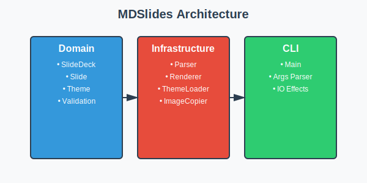

# MDSlides Tutorial

## Master Markdown-to-Presentation Conversion

**Your Name**

---
template: content
---

## What is MDSlides?

MDSlides converts Markdown files into beautiful HTML presentations.

**Key Features:**
- Write slides in plain Markdown
- Multiple built-in themes
- Automatic formatting
- Template-based layouts

---
template: content
---

## Installation

Install MDSlides using your package manager.

```bash
# Download the latest release
wget mdslides.jar

# Run MDSlides
java -jar mdslides.jar slides.md output/
```

**Requirements:** Java 11 or higher

---
template: content
---

## Basic Slide Structure

Slides are separated by `---` (three dashes on a line).

**Required Elements:**
- Heading: `## My Slide Title`
- Body: Regular markdown text

**Optional Frontmatter:**
- `template: content` (default with heading + body)
- `template: title` (centered title page)

**Two templates available:** `title` and `content`

---
template: content
---

## Text Formatting

MDSlides supports standard Markdown formatting:

**Bold text** using `**bold**`

*Italic text* using `*italic*`

`Inline code` using backticks

---
template: content
---

## Code Blocks

Display code with syntax highlighting:

```scala
def renderSlides(input: Path): IO[Unit] =
  for
    deck <- parseMarkdown(input)
    html <- renderHTML(deck, theme)
    _ <- writeOutput(html)
  yield ()
```

**Supports many languages!**

---
template: content
---

## Lists and Bullets

MDSlides supports ordered and unordered lists:

**Ordered Lists:**
1. First step
2. Second step
3. Third step

**Unordered Lists:**
- Main concept
- Supporting detail
- Additional point

---
template: content
notes:
  - "Show examples of each theme"
  - "Emphasize template backgrounds feature"
---

## Using Themes

MDSlides includes multiple themes:

```bash
# Light theme (default)
mdslides render my-preso

# Dark theme
mdslides render my-preso --theme dark

# Retisio theme (template backgrounds!)
mdslides render my-preso --theme retisio
```

Each theme provides unique styling and creates a self-contained directory.

---
template: content
---

## Template-Specific Backgrounds

The Retisio theme demonstrates template backgrounds:

- **Title slides:** Dynamic title background
- **Content slides:** Clean content background

**Each template gets its own visual treatment!**

This is powered by the new directory-based theme system.

---
template: content
---

## Directory-Based Themes

Themes are self-contained directories:

```
themes/
  retisio/
    theme.json
    backgrounds/
      title-page.png
      content-page.png
```

**Benefits:** Portable, assets bundled, easy to share

---
template: content
---

## Creating Custom Themes

Build your own theme in 3 steps:

**1. Create directory:** `mkdir mytheme/backgrounds`

**2. Write theme.json** with colors, fonts, backgrounds

**3. Add to themes directory**

Share your theme as a zip file!

---
template: content
notes: "Explain the new v1.0 CLI with directory output and simpler syntax"
---

## Command Line Interface

MDSlides provides a simple CLI for converting markdown to presentations:

```bash
# Basic usage (light theme by default)
mdslides render my-presentation

# Select a theme
mdslides render my-presentation --theme dark
mdslides render my-presentation --theme retisio

# Disable automatic image copying
mdslides render my-presentation --no-copy-images

# Explicit input/output control
mdslides render -i slides.md -o output-dir --theme light

# Get help and version info
mdslides --version
mdslides --help
```

**Available themes:** light, dark, tjm-solutions, retisio

---
template: content
---

## Image Assets

Images are embedded using standard markdown:



**Automatic Handling:**
- Local images copied to output directory
- Remote URLs (https://) referenced directly
- Relative paths preserved

**Supports:** PNG, JPG, SVG, and more

---
template: content
notes: "Introduce speaker notes feature - parsing only in v1.0"
---

## Speaker Notes

Add presenter notes to any slide using frontmatter:

**Simple string notes:**
- `notes: "Remember to pause after the key point"`

**Multi-line array notes:**
- Join bullet points with newlines
- Example: `notes: ["Point 1", "Point 2", "Point 3"]`

**In frontmatter:** Add between the `---` delimiters before slide content

**Note:** Speaker view rendering coming in v1.1!

---
template: content
notes:
  - "Emphasize keeping slides simple"
  - "Reference image accessibility"
---

## Best Practices

Follow these guidelines for effective presentations:

**Content:**
- One main idea per slide
- Max 12 lines of body text
- Keep headings under 80 characters

**Visuals:**
- Use diagrams to clarify
- Include alt text for images

---
template: content
---

## Thank You!

**Questions?**

Visit: github.com/yourorg/mdslides

Docs: mdslides.dev/docs

**Happy Presenting!**
