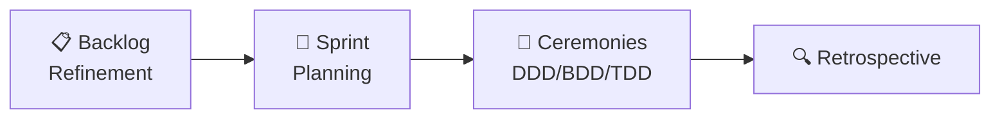
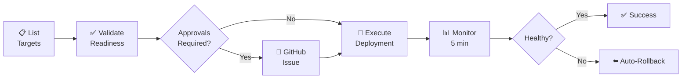
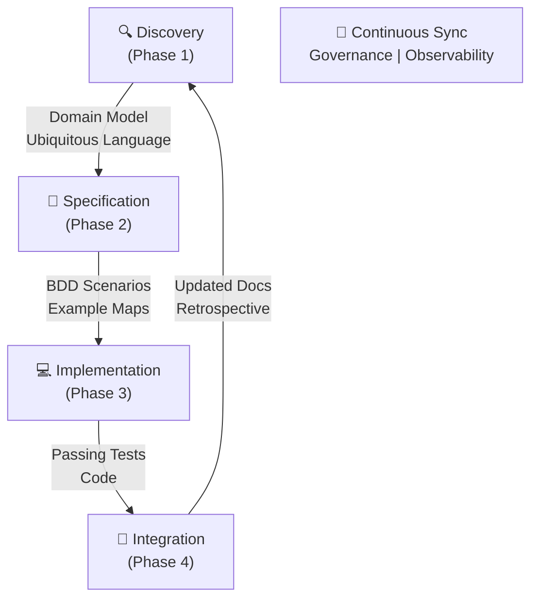

# How We Work
## Team Playbook

Ceremony-Based SDLC for Enterprise Java Microservices

---
template: content
---
## Philosophy

We build systems by blending three disciplines.

Key approach:
- Domain-Driven Design (DDD): Model the business domain accurately
- Behavior-Driven Development (BDD): Specify behavior with examples
- Test-Driven Development (TDD): Implement with test-first discipline

Core principle: Documentation is code. Everything is Git-tracked, version-controlled, and executable.

---
template: content
---
## Team Roles & Responsibilities

Four roles collaborate throughout all ceremonies. Leadership means facilitation, not exclusivity.

| Role | Responsibility |
|------|-----------------|
| **Program Manager** | Coordination, dependencies, risk management |
| **Product Owner** | Business value, requirements, acceptance criteria |
| **Architect** | Domain modeling, bounded contexts, technical strategy |
| **Bench Developer** | Implementation, testing, refactoring, code quality |

---
template: content
---
## Sprint Lifecycle Overview

Each sprint includes four distinct ceremony phases.

- **Pre-Sprint:** Backlog Refinement (PO curates and sequences stories)
- **Sprint Start:** Sprint Planning (PM scopes goals, clarifies DoD)
- **During:** Execute ceremonies per phase (DDD/BDD/TDD)
- **Post-Sprint:** Sprint Retrospective (PM facilitates, max 3 action items)



---
template: title
---
# Phase 0: Bootstrap & Initiation

---
template: content
---
## Phase 0.1: Project Bootstrap

Automated project setup using Mill tasks.

**What happens:**
- New repository created with Mill bootstrap tasks
- ~130+ ceremony framework files copied automatically
- Project stubs generated (CHARTER, ARCHITECTURE, README, build.sc)
- GitHub configured with branch protection rules

**Prerequisites:**
- GitHub Token
- Mill 0.11.6+
- Git configured
- Target organization exists

---
template: content
---
## Bootstrap Modes

Three deployment models supported.

**Training Repository Mode:**
- `mill bootstrap.bootstrapExecute --name my-service`
- Uses shared Mill tasks from parent repo

**Standalone with GitHub:**
- `mill bootstrap.bootstrapExecute --name order-mgmt --create-repo --org RETISIO`
- Copies all Mill tasks for complete autonomy

**Link Existing Repo:**
- `mill bootstrap.bootstrapExecute --name order-mgmt --repo https://github.com/RETISIO/order-mgmt`

---
template: content
---
## Phase 0.0: Program Initiation

Define project scope and strategy.

**Artifacts created:**
- **CHARTER.md:** Complete project definition with problem, solution, scope, goals
- **PROJECT-CANVAS.md:** Quick reference for daily decisions

**Participants:**
- Program Manager, Product Owner, Architect, domain experts

**Outcome:**
- Stakeholder alignment and scope boundaries established

---
template: title
---
# Phase 1: Discovery (DDD-Led)

---
template: content
---
## Phase 1.1: Event Storming Session

Map domain events and command flows.

**Led by:** Architect (with PO domain expertise, Dev feasibility, PM dependencies)

**When:** Once per bounded context, quarterly refinement

**Process:**
1. Identify domain events: TenantProvisioned, OrderPlaced
2. Discover commands: ProvisionTenant, PlaceOrder
3. Group events into temporal flows
4. Identify aggregates handling commands
5. Surface questions and hotspots
6. Identify bounded context boundaries

---
template: content
---
## Phase 1.2: Ubiquitous Language Workshop

Formalize shared vocabulary.

**Led by:** Architect + Product Owner (co-led)

**When:** Bi-weekly during active development, monthly during maintenance

**Process:**
1. Extract terms from event storming session
2. Define each term with examples
3. Resolve cross-team terminology conflicts
4. Ban problematic terms: DTO, Manager, Handler, Service, Helper
5. Commit to glossary—terms MUST appear in code and scenarios

**Outcome:** Shared vocabulary preventing miscommunication

---
template: content
---
## Phase 1.3: Domain Modeling Workshop

Define aggregate boundaries and invariants.

**Led by:** Architect (with Dev testability, PO business rules)

**When:** Once per epic, revisited when TDD reveals friction

**Process:**
1. Start with aggregate candidates from event storming
2. Define aggregate boundaries
3. Identify entities vs value objects
4. Document invariants: business rules that must always hold
5. Model state transitions using Mermaid diagrams
6. Define commands and events per aggregate

---
template: content
---
## Phase 1.3: Domain Model Example Code

Rich domain models enforce business rules.

```java
public class Tenant {
    private final TenantId id;
    private CompanyName companyName;
    private TenantStatus status;
    
    public void activate() {
        if (!canTransitionTo(ACTIVE)) {
            throw new IllegalStateTransitionException(...);
        }
        this.status = ACTIVE;
    }
}

public record TenantId(UUID value) {
    public TenantId {
        if (value == null) 
            throw new IllegalArgumentException("ID required");
    }
}
```

---
template: content
---
## Phase 1.4: Context Mapping

Define integration patterns between bounded contexts.

**Led by:** Architect (with PM dependencies, Dev integration complexity)

**When:** After domain modeling, revisited when boundaries change

**Integration patterns:**
- Published Language: Share domain events
- Anticorruption Layer: Protect from external models
- Conformist: Downstream adapts to upstream
- Shared Kernel: Same team shares code

---
template: content
---
## Phase 1.5: Domain Model Governance Verification

Validate Phase 1 artifacts before Phase 2.

**Led by:** Architect (with PM governance audit)

**Validation:**
- All aggregates, entities, value objects present per DDD
- Value objects use Java Records (POL-033)
- Ubiquitous language covers all domain terms
- Mermaid diagrams present: events, state machines, context maps
- CHARTER.md alignment verified

**Outcome:** Approved domain model ready for specification phase

---
template: title
---
# Phase 2: Specification (BDD-Led)

---
template: content
---
## Phase 2: Critical Prerequisites

Must complete before any Phase 2 ceremony.

Required validations:
- Read CHARTER.md Section 3: Problem, Solution, Scope
- Identify all entities and content types from scope
- Review relevant ADRs from Phase 1 domain decisions
- Validate ubiquitous language includes scope entities

Why critical: Phase 2 creates executable specifications. If specs don't align with scope, all implementation work is wasted.

---
template: content
---
## Phase 2.1: Three Amigos Specification Session

Write BDD scenarios before implementation.

**Led by:** Product Owner (with Architect domain alignment, Dev implementability)

**When:** Per user story, before implementation starts

**Process:**
1. Review CHARTER.md scope and ubiquitous language
2. Review user story together
3. Write Given/When/Then scenarios in plain language
4. Use ubiquitous language from glossary
5. Identify missing rules or unclear acceptance criteria
6. Validate against domain model and CHARTER.md scope

---
template: content
---
## Phase 2.1: Example Gherkin Scenario

Domain-focused scenarios using ubiquitous language.

```gherkin
Feature: Provision New Tenant

  Scenario: Successfully provision valid tenant
    Given no tenant exists with company name "Acme Corp"
    When I provision a tenant for "Acme Corp"
    Then a TenantProvisioned event is raised
    And the tenant is in PROVISIONED status
    And the tenant can be activated
```

Uses ubiquitous language: TenantProvisioned, PROVISIONED

Domain-focused: No UI details

Concrete: Specific example, not vague

---
template: content
---
## Phase 2.2: Example Mapping

Discover business rules before writing scenarios.

**Led by:** Product Owner (with Architect rule consistency, Dev edge cases)

**When:** Per complex story, before Three Amigos session

**Process:**
1. Review CHARTER.md scope for relevant entities
2. Write user story on card
3. Extract business rules: blue cards
4. Provide concrete examples: green cards covering all content types
5. Surface questions: pink cards
6. Resolve questions with Product Owner
7. Validate all entities from CHARTER.md are covered

---
template: content
---
## Phase 2.3: Acceptance Criteria Review

Validate scenarios align with domain model.

**Led by:** Architect (with PO business validation, Dev implementation clarity)

**When:** After Three Amigos, before implementation

**Validation:**
- Draft scenarios use ubiquitous language
- Scenarios align with CHARTER.md scope
- Domain model can support this behavior
- Identify gaps requiring model refinement
- Approve for implementation OR send back for revision

---
template: content
---
## Phase 2.4: Specification Governance Verification

Validate Phase 2 artifacts before Phase 3.

**Led by:** Architect

**Validation:**
- Scenario coverage: All examples from Example Map have BDD scenarios
- Ubiquitous language: All scenarios use glossary terms
- Domain alignment: All aggregates tested in scenarios
- CHARTER.md scope: All in-scope features covered

**Outcome:** Approved specifications ready for implementation

---
template: title
---
# Phase 3: Implementation (TDD-Led)

---
template: content
---
## Phase 3.1: Test-First Pairing Session

Write failing tests before implementation.

**Led by:** Bench Developer (with Architect domain guidance)

**When:** Daily during active development

**Process:**
1. Choose failing BDD scenario to implement
2. Identify aggregate requiring changes
3. Write failing unit test for aggregate behavior
4. Implement minimum code to pass test
5. Refactor while maintaining passing tests
6. Repeat until BDD scenario passes

---
template: content
---
## Phase 3.2: Red-Green-Refactor Cycle

The TDD implementation loop.

**RED:** Write failing test
**GREEN:** Write minimum code to pass
**REFACTOR:** Improve design without breaking tests
**COMMIT:** Small, frequent commits

**Why this works:** Test-first forces good design, enables confident refactoring, documents behavior through tests

---
template: content
---
## Phase 3.3: Property-Based Testing

Discover edge cases through generative testing.

**Led by:** Bench Developer + Architect (co-led)

**When:** Per aggregate after initial TDD tests pass

**Process:**
1. Identify invariants from domain model
2. Write property-based tests: use jqwik
3. Run tests with random inputs
4. Analyze failures: shrinking reveals edge cases
5. Add edge cases to Example Map and BDD scenarios

**Outcome:** More thorough test coverage, fewer production bugs

---
template: content
---
## Phase 3.4: Implementation Governance Verification

Validate Phase 3 artifacts before Phase 4.

**Led by:** Architect + Bench Developer (co-led)

**Validation:**
- Test coverage: ≥80% line coverage, ≥90% for aggregates
- All P0 BDD scenarios passing (GREEN)
- All P1 scenarios passing or with documented deferral
- No production TODOs in code
- Observability instrumented: metrics, logs, traces

**Outcome:** Production-ready code with passing tests

---
template: title
---
# Phase 4: Integration & Feedback

---
template: content
---
## Phase 4.1: Scenario-to-Test Decomposition

Map BDD scenarios to unit tests.

**Led by:** Architect (with Dev test coverage, PO behavioral completeness)

**When:** Per complex scenario, or when acceptance tests fail

**Process:**
1. Pick failing BDD scenario
2. Identify aggregates involved
3. Map unit tests to scenario steps
4. Identify gaps: missing or wrong tests
5. Add missing unit tests

**Outcome:** Full test coverage tracing back to BDD scenarios

---
template: content
---
## Phase 4.2: Domain Model Retrospective

Reflect on code-model alignment.

**Led by:** Architect (with Dev pain points, PO business alignment)

**When:** End of sprint or when TDD reveals friction

**Process:**
1. Review implemented code vs domain model
2. Identify friction: hard-to-test code, unclear names
3. Propose model refinements
4. Update ubiquitous language if needed
5. Create refactoring backlog

**Outcome:** Improved domain model, updated glossary

---
template: content
---
## Phase 4.3: Living Documentation Sync

Keep scenarios, diagrams, glossary synchronized.

**Led by:** Program Manager (with Architect, Dev, PO)

**When:** Bi-weekly, or after major domain changes

**Process:**
1. Review changed BDD scenarios
2. Update domain diagrams if needed
3. Update ubiquitous language glossary
4. Archive deprecated scenarios
5. Cross-reference all artifacts

**Outcome:** Documentation stays in sync with code

---
template: content
---
## Phase 4.4: Cross-Boundary Integration Testing

Validate anti-corruption layers and contracts.

**Led by:** Program Manager + Architect (co-led)

**When:** Per program increment or when contracts change

**Process:**
1. Review context map and integration contracts
2. Write integration tests: not UI tests
3. Validate ACLs work correctly
4. Test failure scenarios
5. Verify contract tests pass on both sides

---
template: content
---
## Phase 4.5: Automated Deployment Ceremony

Deploy validated services with automated checks.

**Led by:** Platform Team (Tech Lead)

**When:** Continuous (dev), scheduled (staging/production)

**Deployment workflow:**



---
template: title
---
# Cross-Phase Validation

---
template: content
---
## Phase 1 to Phase 2 Validation

Ensure domain model completeness before specification.

**Trigger:** Before starting Phase 2 ceremonies

**Validations:**
- Example Map covers ALL aggregates from Phase 1
- Example Map covers ALL entities in CHARTER.md scope
- Example Map references ALL content types
- All terms in Example Map exist in Ubiquitous Language
- CHARTER.md alignment verified

---
template: content
---
## Phase 2 to Phase 3 Validation

Ensure specification completeness before implementation.

**Trigger:** Before starting Phase 3 (TDD Implementation)

**Validations:**
- BDD scenarios cover ALL examples from Example Map
- BDD scenarios test ALL rules from Example Map
- BDD scenarios resolve ALL questions from Example Map
- Acceptance Criteria references ALL BDD scenarios
- Test data covers edge cases from Example Map questions

---
template: content
---
## Phase 3 to Phase 4 Validation

Ensure implementation completeness before integration.

**Trigger:** During Phase 4.1 (Scenario-to-Test Decomposition)

**Validations:**
- Unit tests cover ALL BDD scenarios
- Unit tests cover ALL aggregates
- Unit tests cover ALL invariants and business rules
- Test pyramid: 70-80% unit, 15-20% integration, 5-10% acceptance
- All P0 BDD scenarios GREEN
- All P1 scenarios GREEN or with documented deferral

---
template: title
---
# Tools & Automation

---
template: content
---
## Mill Tasks: SDLC Orchestration

Automate ceremony validation and project scaffolding.

**Philosophy:** Ceremonies are human-first, validation is automation-first.

| Task Namespace | Purpose |
|----------------|---------|
| **bootstrap.*** | Project scaffolding and setup |
| **validate.specification** | BDD scenario validation |
| **validate.domain** | Domain model validation |
| **validate.testing** | TDD enforcement and coverage |
| **validate.quality** | Code quality and security |
| **deployValidate/Execute** | Deployment orchestration |

---
template: content
---
## Mill Tasks: Ceremony Execution vs CI/CD

Two distinct usage contexts with different value.

**Ceremony Execution (Manual-First):**
- **Context:** Live ceremonies (Event Storming, Three Amigos)
- **Validation Role:** OPTIONAL sanity check
- **Primary Quality Gate:** Manual team review and discussion
- **When to Use:** Post-ceremony optional check

**CI/CD Automation (Validation Primary):**
- **Context:** Pre-commit hooks, pull request gates, release checks
- **Validation Role:** PRIMARY quality gate
- **Benefit:** Catches issues before code review
- **When to Use:** Pre-commit, pull requests, releases

---
template: content
---
## Key Mill Task Examples

Common Mill commands for ceremony validation.

Domain model validation:
mill <service>.domain.domainValidate

BDD scenario validation:
mill validate.specification

Test coverage validation:
mill <service>.coverage

Deployment validation:
mill <service>.deployValidate staging

Run all validations in parallel:
mill <service>.validateAll --jobs 8

---
template: title
---
# Technology Stack

---
template: content
---
## Enterprise Java Core Stack

Non-negotiable technologies.

| Category | Technologies |
|----------|--------------|
| **Core** | Java 21+, Pekko, Kafka, PostgreSQL |
| **Testing** | Karate (BDD), JUnit 5 |
| **Observability** | OpenTelemetry |
| **Rejected** | Spring Boot, Redis, Blocking I/O |

**Key principle:** Non-blocking everything. If it blocks, it's wrong.

---
template: content
---
## Architectural Principles

Four non-negotiable patterns.

**Non-blocking Everything:**
- Use CompletionStage, reactive Postgres drivers, Pekko actors
- Ban: Future.get(), Thread.sleep(), JDBC, blocking I/O
- Rule: If it blocks, it's wrong

**Actor-Based Concurrency:**
- Use Pekko actors for business logic
- Typed actors with sealed interfaces

**Event-Driven Architecture:**
- CQRS, Event Sourcing with Pekko Persistence
- Published Language between bounded contexts

**Reactive Persistence:**
- Reactive Postgres drivers, no JDBC
- Non-blocking migrations

---
template: content
---
## Value Objects: Java Records (POL-033)

Use Java Records for all value objects.

Benefits: 68% less code than traditional classes

Example:
```java
public record TenantId(UUID value) {
    public TenantId {
        if (value == null) 
            throw new IllegalArgumentException("ID required");
    }
}

public record CompanyName(String value) {
    public CompanyName {
        if (value == null || value.isBlank()) 
            throw new IllegalArgumentException("Name required");
    }
}
```

Policy: ALL value objects MUST use Java Records

---
template: title
---
# Team Workflow

---
template: content
---
## Typical 3-Week Sprint Flow

**Week 1: Discovery & Specification**

- Monday: Event Storming or Ubiquitous Language Workshop
- Tuesday: Domain Modeling Workshop
- Wednesday: Three Amigos for Sprint stories
- Thursday: Example Mapping for complex stories
- Friday: Acceptance Criteria Review

**Deliverables:** Approved BDD scenarios, domain model updates

---
template: content
---
## Week 2: Implementation

- Daily Test-First Pairing with Red-Green-Refactor cycles
- Mid-week Property-Based Test Design for critical aggregates
- Friday Scenario-to-Test Decomposition if any scenarios fail

**Deliverables:** Working software with passing tests

---
template: content
---
## Week 3: Integration & Feedback

- Monday: Cross-Boundary Integration Testing if multiple contexts
- Tuesday: Domain Model Retrospective
- Wednesday: Living Documentation Sync
- Thursday: Sprint Review and demo to stakeholders
- Friday: Sprint Retrospective with max 3 action items

**Deliverables:** Updated documentation, retrospective action items

---
template: title
---
# Key Governance Policies

---
template: content
---
## Non-Negotiable Rules

Four core rules guide all work.

**Ubiquitous Language Everywhere:**
- Code/docs/scenarios use exact terms from glossary
- Ban: DTO, Manager, Handler, Service, Helper in domain code
- Infrastructure layer (ACL/adapters) can use technical terms

**Non-Blocking Everything:**
- Use: CompletionStage, reactive Postgres, Pekko actors/streams
- Ban: Future.get(), Thread.sleep(), JDBC, blocking I/O
- Rule: If it blocks, it's wrong

**Test-First Always:**
- Order: BDD scenarios → failing unit test → implement
- Coverage: Use jqwik for property-based invariant testing
- Language: Test names use domain language

---
template: content
---
## Key Policies

Three critical policies enforce quality.

| Policy | Rule | Requirement |
|--------|------|------------|
| **POL-033** | Java Records for Value Objects | ALL value objects use Records (68% code reduction) |
| **POL-030** | Mill Deploy Usage | ALL deployments via `mill <service>.deployExecute` |
| **POL-036** | Retrospective Limit | Max 3 action items per sprint retrospective |

---
template: title
---
# Onboarding

---
template: content
---
## New Team Member: Week 1 Foundation

Days 1-3: Read Core Documentation

Read in order:
1. HOW-WE-WORK.md: Complete SDLC playbook
2. CHARTER.md: Master project charter
3. ARCHITECTURE.md: System architecture
4. Ceremony guide: doc/internal/reference/SBPF/Blending-DDD-BDD-TDD.md

Days 4-5: Setup Development Environment

Install: Java 21+, Mill 0.11.6+, VS Code + Metals extension
See: doc/internal/reference/developer-setup.md
Get: GitHub organization access

---
template: content
---
## Week 2: Immersion

Shadow All Ceremonies

Attend all 4 ceremony types as observer
Ask questions and take notes
Review ceremony artifacts
No responsibility, just learning

---
template: content
---
## Week 3: Participation

Active Participation

Participate in ceremonies (not leading yet)
Pair with Bench Developer or shadow Product Owner
Create first artifact using templates
Receive feedback from mentor

---
template: content
---
## Week 4: Leadership

Co-Lead Ceremonies

Co-lead a ceremony with mentor
Full responsibility for one ceremony output
Ready for independent work

---
template: title
---
# Quick Reference: Red Flags

---
template: content
---
## Code Red Flags

Watch for these code patterns.

- **Blocking patterns:** Future.get(), Thread.sleep(), JDBC, blocking I/O
- **Anemic models:** Classes with just getters/setters
- **Technical jargon:** DTO, Manager, Service, Handler in domain code
- **Implementation-first:** Tests written after code
- **Wrong tools:** Traditional classes instead of Java Records for value objects

All are rework signals. Fix immediately.

---
template: content
---
## Documentation Red Flags

Watch for these documentation patterns.

- **No templates:** Docs created without using provided templates
- **No diagrams:** Mermaid diagrams missing from design docs
- **No language:** BDD scenarios without domain vocabulary
- **Untracked:** Ceremony artifacts not in Git version control

Documentation drift causes rework. Keep docs synchronized.

---
template: content
---
## Process Red Flags

Watch for these process violations.

- **Skipped ceremonies:** Pressure shortcuts phase activities
- **Wrong order:** Tests written after implementation
- **Unfinished phases:** Phase 3 starts before Phase 2 complete
- **No approval:** Implementation without accepted specifications
- **Documentation drift:** Code and docs out of sync

Process violations compound into major rework. Maintain discipline.

---
template: title
---
# FAQ

---
template: content
---
## Common Questions

- *Q*: Do we really need all these ceremonies?
- *A*: Yes. Each ceremony addresses specific questions and produces specific artifacts. Skipping ceremonies leads to misalignment and rework.

- *Q*: Can we combine ceremonies?
- *A*: Some can be back-to-back (Three Amigos → Example Mapping), but don't merge distinct ceremonies (Event Storming + Domain Modeling).

- *Q*: What if Product Owner is unavailable?
- *A*: Block specification ceremonies until PO is available. Developers MUST NOT make business decisions.

---
template: content
---
## More FAQ

- *Q*: Can we use external tools like Miro or PowerPoint?
- *A*: No. Everything must be Git-tracked and in Mermaid. Ensures version control and portability.

- *Q*: What if TDD is slowing us down?
- *A*: TDD only slows initially, speeds up over time by reducing bugs. If tests are hard to write, your design is wrong.

- *Q*: Do we need both charter AND canvas?
- *A*: Yes. Charter for deep work, canvas for daily reference. Different audiences, different update frequencies.

- *Q*: How often do we update ubiquitous language?
- *A*: Bi-weekly during active development, monthly during maintenance. Add new terms immediately when discovered.

---
template: title
---
# Summary: The SDLC Loop

---
template: content
---
## The Complete Cycle

Each phase builds on previous phase outputs.



**Outcome:** Each cycle delivers tested, documented features aligned with business goals.

---
template: content
---
## Key Success Metrics

Measure team and technical health.

| Metric | Target |
|--------|--------|
| **Code Coverage** | ≥80% unit tests, ≥90% for aggregates |
| **Deployment Frequency** | Multiple/day (dev), daily (staging), weekly (prod) |
| **Deployment Duration** | <2 min (local), <5 min (dev), <10 min (staging/prod) |
| **Rollback Rate** | <5% (automatic on failure) |
| **MTTR (Mean Time to Recovery)** | <2 min (P95) via automatic rollback |
| **Scenario Pass Rate** | 100% of P0 scenarios GREEN before production |

---
template: content
---
## Remember

Four core principles guide all work.

Documentation is Code:
Everything Git-tracked, version-controlled, and executable.

Ceremonies are Human-First:
Automation validates, humans decide.

Non-Blocking Everything:
If it blocks, it's wrong.

Ubiquitous Language Everywhere:
Code talks the business domain.

---
template: content
---
## Resources

Find detailed information in the repository.

Complete Playbook: HOW-WE-WORK.md
Project Charter: CHARTER.md
System Architecture: ARCHITECTURE.md
Ceremony Instructions: doc/internal/ceremonies/ (27 files)
Document Templates: doc/internal/reference/templates/

Questions? Ask your Architect or Program Manager.

---
